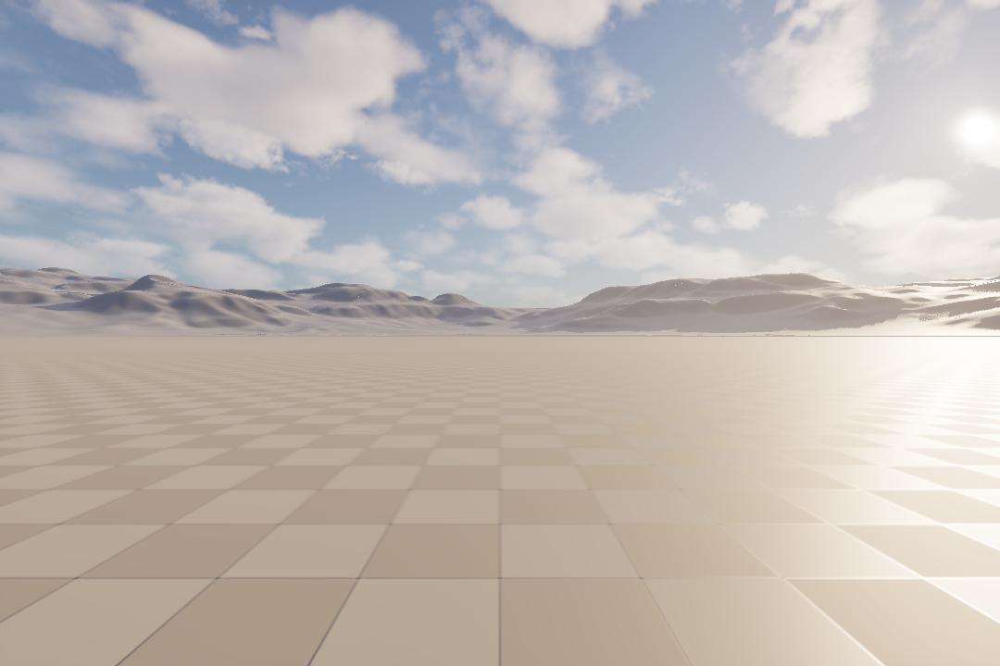
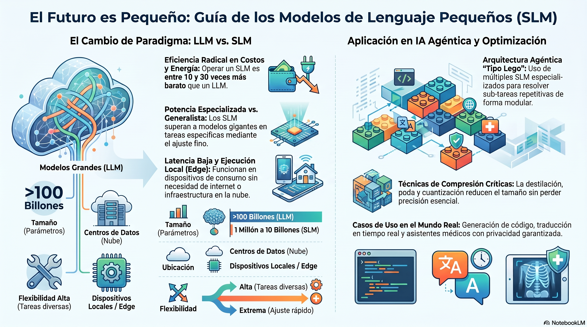

# 2026-0903

## Análisis del "porqué" de la deliberación excesiva: no es ruido visual, es falta de traslación durante el propio escape/escaneo — y un bug de CSV más encontrado en el camino

A pedido del usuario, análisis cuantitativo de las 103 deliberaciones de la corrida `TOWNSIM_INI-
20260903T152759Z` (fotogramas + `field_centro_*` del CSV) para poner a prueba la hipótesis de que la
composición visual en el momento de deliberar explica las "espirales deliberativas":

- **`centro_blocked=True` en solo 1 de 103 deliberaciones (0.97%)** — casi nunca se escala por un
  obstáculo genuinamente detectado. **82.5% tiene `centro_conf < 0.1`**: el disparador dominante es falta
  de confianza en la percepción, no un obstáculo real.
- Esa falta de confianza es **mecánica, no visual**: en los 3 ciclos previos a cada disparo, `FRENAR`
  (esperando una resolución previa) y `ESCANEO` (rotando en el escaneo profundo) dominan casi por
  completo. `FlowTTCEstimator` necesita traslación real para producir una lectura confiable (documentado:
  girando en el lugar da `confianza=0` por diseño) — se arma un bucle que se retroalimenta: poca confianza
  → escala a deliberación → se queda quieto/rotando para resolver → sigue sin traslación → sigue sin
  confianza → vuelve a escalar. Velocidad horizontal medida en el cluster más denso (t=330-362s): 0.44 m/s
  promedio, contra ~3 m/s de crucero normal.
- **Correlación entre densidad de bordes (proxy de "ruido visual") y confianza: positiva (r=0.25),
  contraria a la hipótesis original** — frames de bajo detalle promediaron MENOS confianza (0.053) que los
  de alto detalle (0.133), consistente con que el flujo óptico necesita textura para trackear.
- **Sí se confirmó contaminación visual real, pero de otro origen**: un fotograma de la deliberación #23
  (t=231.6s, terreno abierto sin obstáculos) muestra una cuña verde sólida — un dibujo de debug de
  `plot_mission_route.py` todavía sin limpiar en ese punto del vuelo (ver sección de abajo) — posible causa
  directa de la decisión `EVADIR_IZQUIERDA` en ese ciclo.

### bug-fix: `vel_x`/`vel_y`/`vel_z` del CSV vacíos desde que existe (2026-0828)

Encontrado analizando el mismo CSV: `telemetry["velocity"]` siempre usa las claves `vx`/`vy`/`vz` (ver
`AirSimClient._state_to_telemetry`), nunca `x`/`y`/`z` — la fila de CSV leía las claves equivocadas, así
que esas tres columnas quedaban vacías en **todo** el historial de corridas desde que existe el CSV. El
JSONL nunca tuvo el bug (embebe el dict de velocidad completo, con las claves correctas). Test de
regresión en `test_flight_logger.py`. Suite completa: 124/124.

## bug-fix: los dibujos de depuración de `plot_mission_route.py` contaminaban la captura que recibe el VLM

Reintentando `TOWNSIM_INI` con los dos fixes de la sección de abajo (color y espiral), el usuario notó en
un fotograma de auditoría adjunto que se veían líneas y marcadores verdes gruesos cruzando la escena.
Confirmado: son literalmente los `simPlotLineStrip`/`simPlotPoints`/`simPlotStrings` que
`scripts/plot_mission_route.py` dibuja para la revisión visual previa al vuelo — persisten en el mundo de
UE y **la cámara de la mision los captura igual que cualquier otro objeto**, así que quedaban en cada
fotograma enviado al VLM durante el vuelo real, no solo durante la revisión. Explica en parte por qué
`WP1→WP2`/`WP2→WP3` (volados con los marcadores todavía puestos) tuvieron más deliberación que `WP3→WP4`
(volado después de limpiarlos a mano mid-vuelo) en la misma corrida, aunque la comparación de una sola
corrida es ruidosa para conclusiones firmes.

**Fix:** `AirSimClient.clear_debug_markers()` nuevo (wrapper de `simFlushPersistentMarkers()`), llamado
siempre al conectar tanto en `main.py` como en `experiments/runner.py` — ningún vuelo depende ya de que
alguien se acuerde de limpiar a mano después de usar `plot_mission_route.py`. La traza dinámica del propio
recorrido (`simSetTraceLine`, toggle `T` en el viewport) queda fuera del fix automático porque es opt-in
del usuario; si está activa durante un vuelo real, contamina de la misma manera y hay que desactivarla a
mano.

## `TOWNSIM_INI` corre limpio por primera vez (0 colisiones, 8/8 atascos resueltos por escaneo profundo), y dos bugs reales encontrados analizando el CSV con capturas

Con `DEADLOCK_STRATEGY=deep_vlm` por default (ver sección de abajo) y prompt/respuesta/fotogramas ya en
el CSV, primera corrida completa y exitosa de `TOWNSIM_INI`: 2771 ciclos, 591s, 842.6m, **0 colisiones**,
8 eventos de atasco y **los 8 resueltos por el escaneo profundo** (H2) en un ciclo promedio, sin caer al
escape ciego ni una vez. Analizando en vivo el tramo inicial (563 ciclos / 139.5s solo para el primer
waypoint, mucha más deliberación de la esperada), y a partir de una captura del viewport de UE que el
usuario adjuntó para comparar contra los `.png` de auditoría, aparecieron dos bugs reales:

### bug-fix: canales de color R/B invertidos en toda captura de AirSim, incluida la que recibe el VLM

Los `.png` de auditoría (nuevos de esta semana) se veían con el empedrado y las fachadas con un tinte
azulado poco natural. Comparando un fotograma guardado contra la misma imagen con los canales R/B
invertidos, la versión invertida coincide con la imagen aérea de referencia y con la captura de UE del
usuario (empedrado terracota cálido, cielo de atardecer). Causa: `AirSimClient.capture()`
(`src/hardware/airsim_client.py`) reshape-ea el buffer crudo de `simGetImages(ImageType.Scene)`
directamente sin conversión, pero **todo** el resto del pipeline asume BGR (convención de OpenCV):
`cv2.imencode` hacia el VLM, `cv2.imwrite` de `FlightLogger`, `cv2.imshow`/`rectangle`/`putText` del modo
watch, `stream_hub` de WebDCS. El buffer de AirSim viene en RGB, así que cada consumidor cv2 veía rojo y
azul invertidos — **incluido el VLM**, desde que existe visión directa (F2): el modelo viene deliberando
sobre colores invertidos sin que nadie lo hubiera notado, porque nunca había una forma de ver lo que el
VLM ve hasta la instrumentación de auditoría de esta semana. Fix: una sola conversión en el punto de
captura (`image = np.ascontiguousarray(image[:, :, ::-1])`), corrige todos los consumidores a la vez.

### bug-fix: rumbo objetivo inestable ("espiral") en un waypoint casi vertical

Explica la deliberación excesiva del tramo inicial: `WP_0_ASCENSO` (agregado el 2026-0901 para subir
derecho antes de trasladarse) tiene el mismo `x`/`y` que el punto de partida, así que el vector horizontal
al waypoint es casi nulo. `compute_guidance()` calculaba el rumbo objetivo con `atan2(dy, dx)` sobre ese
vector — numéricamente inestable: ruido de posición de centímetros alcanzaba para que el ángulo saltara
decenas de grados de un ciclo al siguiente. En vuelo real eso se traducía en una espiral durante el
ascenso en lugar de una subida derecha, y la cámara barriendo obstáculos distintos en cada giro espurio
disparaba deliberación/evasión sin necesidad real. Fix: `src/navigation/waypoint_tracker.py` mantiene el
rumbo actual (sin recalcular `atan2`) cuando la distancia horizontal cae por debajo de
`BEARING_UNSTABLE_DIST_XY_M` (1.0m por defecto) — protege cualquier waypoint futuro casi vertical, no solo
este caso puntual. Test de regresión en `test_waypoint_tracker.py`.

Suite completa: 123/123.

## `DEADLOCK_STRATEGY` pasa a `deep_vlm` por default, y dos detalles pendientes de la sesión anterior corregidos

- **`DEADLOCK_STRATEGY` default cambiado de `blind` a `deep_vlm`** en `src/agents/deep_scan.py` (ya no
  hace falta fijarlo en `.env`, que queda comentado como referencia) — coherente con H2/H3: el escape
  ciego sigue como red de seguridad final si el escaneo profundo expira o no resuelve, así que el cambio
  de default no reduce robustez, solo cambia cuál estrategia se prueba primero. Propagado también a los
  defaults de CLI de `experiments/runner.py` (`--deadlock-strategy(ies)`) y al que reporta
  `FlightLogger.close()` en `summary.json`. `tests/conftest.py` ya fijaba `DEADLOCK_STRATEGY=blind` como
  default estable para todo el test suite (fixture `autouse` agregado el 2026-0901 por este mismo motivo),
  así que el cambio de default de producción no afecta a los tests existentes.
- **bug-fix:** `FlightLogger._slm_invocations` (y `_slm_fallbacks`/`_slm_timeouts`) contaban una vez por
  **ciclo** que mostraba `last_deliberation`, no una vez por deliberación real — como `last_deliberation`
  puede repetirse varios ciclos mientras se espera la próxima resolución (confirmado en vivo con
  `TOWNSIM_INI` el 2026-0901), `deliberation_rate` quedaba inflado muy por encima de la tasa real de
  consultas al modelo. Fix: solo cuenta cuando el `id` de la deliberación cambia. Test de regresión en
  `tests/test_flight_logger.py`.
- **`environment.yml`/`environment-arm64.yml` no declaraban `langgraph` ni `openai`** pese a que
  `src/agents/graph.py` y `src/agents/deliberative.py` los importan directamente — brecha que obligó a
  instalar `langgraph` a mano para poder correr el test suite en la sesión del 2026-0901. Agregados ambos
  más el cierre transitivo completo de sus dependencias no cubiertas ya por el archivo (29 paquetes:
  `langchain-core`, `langgraph-checkpoint`, `langsmith`, etc.), calculado recorriendo `pip show` en vez de
  volcar un `pip freeze` completo del entorno (que mezclaba cientos de paquetes de otros proyectos sin
  relación con `airsim-loop`).

Suite completa: 122/122 (121 + 1 test nuevo de regresión del conteo de invocaciones).

# 2026-0901

## `PLAN-MEJORAS-3.md` implementado: guardia de no-profundidad, escaneo espacial inicial y profundo, ablation `DEADLOCK_STRATEGY` (H0–H3)

Implementación completa del plan que discutía el orden de deliberación del grafo de control y la falta de
una capacidad de análisis espacial más profundo en dos momentos: al despegar, y al detectar un atasco sin
solución dentro del lazo táctico.

- **H0 (guardia arquitectónica):** `tests/test_no_depth_in_flight_path.py` escanea como texto cada módulo
  de vuelo buscando `return_depth=True`/`DepthPlanar`, y falla si aparece un `.py` nuevo bajo
  `src/agents/`/`src/perception/` sin declarar explícitamente en la lista blanca o en la de excepción
  (`experiments/*.py`, instrumentación offline). `DroneState` documenta por qué nunca debe llevar una clave
  de profundidad — LangGraph descarta en silencio cualquier clave no declarada, así que el propio esquema
  actúa como segunda red.
- **H1 (`src/agents/spatial_scan.py`):** barrido de yaw parado (nunca traslación) inmediatamente después
  del despegue, antes del lazo táctico — N rumbos, una sola llamada al VLM con watchdog propio en hilo
  aparte (`INITIAL_SCAN_TIMEOUT_MS`, default 15s): un VLM caído nunca impide despegar. Advisory: sesga el
  rumbo inicial y avisa si contradice el primer tramo de la misión, nunca reemplaza al `ObstacleField` por
  ciclo. Conectado en `main.py` entre `connect()` y el lazo.
- **H2 (`src/agents/deep_scan.py`):** antes de forzar el escape ciego sincrónico en atasco duro, un
  barrido panorámico + una consulta al VLM. Corre **dentro** del mismo `StateGraph`/lazo (nunca un loop
  aparte): reutiliza el frame que `capture_node` ya produjo ese ciclo, nunca vuelve a llamar `capture()`.
  Estado de la máquina (`_scan_phase`/`_scan_heading_index`/`_scan_frames`/etc.) declarado en `DroneState`
  para sobrevivir entre invocaciones de `graph.invoke()`. Si el escaneo expira o la respuesta no es
  viable, cae exactamente al escape sincrónico existente (GANAR_ALTURA/PERDER_ALTURA alternado,
  enclavamiento, `MAX_CONSECUTIVE_ESCAPES`), sin tocarlo — es la red de seguridad final. Capacidad
  compartida entre los brazos `slm` (`deliberative.py`) y `fsm` (`fsm.py`), mismo `DeliberationService`.
- **H3 (ablation):** `DEADLOCK_STRATEGY=blind|deep_vlm` selecciona la estrategia para cualquiera de los dos
  brazos. `FlightLogger` agrega `deadlock_strategy`, `deep_scan_resolution_rate`,
  `deep_scan_avg_cycles_to_resolve`, `deep_scan_fallback_rate` al `summary.json`; `experiments/runner.py`
  suma `--deadlock-strategies` para el batch factorial `AGENT_ARM × DEADLOCK_STRATEGY`; `analyze.py` imprime
  la tabla desagregada correspondiente.

14 tests nuevos (`test_no_depth_in_flight_path.py`, `test_spatial_scan.py`, `test_deep_scan.py`), suite
completa en 117/117 tras instalar `langgraph` (ausente en el entorno de validación — no declarado en
`environment.yml`, gap preexistente no corregido en esta pasada).

## Plan de pruebas para TownSim sobre `townsim_calib.png` (`PLAN-PRUEBAS-TOWNSIM.md`)

A pedido del usuario, plan de escenarios de prueba para el mapa `townsim_calib.png` (más nuevo que
`townsim.png`, usado por el Tier 1 actual). Geometría derivada **solo de datos ya volados**
(`TOWNSIM_CALIB_0`, corrida manual previa exitosa: 656m, 0 colisiones, `slm`) en vez de medir el PNG a ojo
— sin un archivo de calibración píxel↔metro confiable, cualquier coordenada estimada directamente de la
imagen sería precisión fabricada. Seis escenarios propuestos (perímetro de control, piloto corto, dos
variantes de bloqueo frontal masivo genuino — el "tercer escenario" que pedía
`informe/10-METODOLOGIA-EXPERIMENTAL.md §10.1` —, avenida abierta de control, y uno diseñado para el
ablation de H3), con protocolo de validación obligatorio (`scripts/plot_mission_route.py` + corrida piloto
de una sola combinación) antes de confiar en cualquier escenario nuevo para un batch.

**Corrección de diseño durante la propia sesión de pruebas:** la primera versión de los escenarios usaba
`start_pose` para arrancar lejos del spawn real. El usuario aclaró que esto es **a propósito**: `main.py`
nunca debe teletransportar al dron (`simSetVehiclePose(ignore_collision=True)` puede materializarlo dentro
de un obstáculo, mismo riesgo que ya había forzado que el seed-jitter de `runner.py` pasara a opt-in el
2026-0831) — siempre arranca en el *PlayerStart* del nivel de UE. Un cambio que agregaba soporte de
`start_pose` a `main.py` se revirtió de inmediato; el plan se reescribió para que todo escenario sea
alcanzable por **vuelo real** desde el spawn fijo (tramo de tránsito a altitud segura + descenso fuera del
área de interés + tramo de prueba a nivel de calle), documentado como principio rector nuevo (§0.4).

## Vuelos de prueba reales: piloto exitoso, y un atasco cerca del spawn sin resolver

Con AirSim y LM Studio en línea:

- **T-CALIB-1 (`townsim_calib_pilot.json`)**: éxito, 0 colisiones, 405 ciclos/85s, reusando exactamente
  `WP_1→WP_2` de `TOWNSIM_CALIB_0`. Validado.
- **T-CALIB-2 (`townsim_calib_cruce_frontal.json`, cruce frontal de un edificio)**: primer intento con
  teletransporte agregado por error quedó atrapado en el jardín/seto de la plaza sin disparar
  `has_collided` (colisión contra follaje que no dispara la bandera — mismo modo de falla ya documentado
  para vegetación densa). Rediseñado sin teletransporte (tránsito a `z=-30` desde el spawn real,
  reaprovechando coordenadas del perímetro ya validado) y relanzado con confirmación visual del usuario en
  el viewport en cada paso.
- **`TOWNSIM_INI` (`townsim_ini.json`, vuelta a la manzana por la avenida, no por el paseo peatonal con
  árboles)**: tres intentos (estrategia `blind`, luego `deep_vlm`, luego agregando un waypoint de ascenso
  vertical puro antes de trasladarse) quedaron atascados cerca del spawn — el punto de partida real está
  pegado a la vegetación del jardín de la plaza, y ninguna de las tres variantes logró despejarla de forma
  limpia antes de que el usuario cortara la prueba. `DEADLOCK_STRATEGY=deep_vlm` sí se confirmó operativo
  (rotación real de rumbo observada, entradas `slm_deep_scan` en `deliberations[]`), pero el barrido de 4
  rumbos resultó más lento en la práctica de lo estimado (`SCAN_SETTLE_CYCLES_DEEP=2` optimista frente a la
  velocidad real de giro por yaw absoluto). **Sin resolver**: falta que el usuario confirme visualmente por
  dónde hay espacio real de despegue cerca del spawn antes de reintentar una cuarta vez.
- `DEADLOCK_STRATEGY=deep_vlm` quedó seteado como default en `.env` de este entorno (pedido explícito), sin
  tocar el default de `deep_scan.py` (`blind`, para cualquier otro entorno).

## Instrumentación de auditoría del VLM: fotogramas a PNG con timestamp real de captura, prompt + respuesta completos, directorio por vuelo

A pedido del usuario, para poder auditar visualmente y por texto qué vio y qué contestó el VLM en cada
deliberación:

- `FlightLogger` guarda a PNG cada fotograma RAW efectivamente enviado al VLM (deliberación táctica normal
  o escaneo profundo de H2), nombrado `photo-<timestamp_ISO>.png` — **con el timestamp real de captura del
  propio fotograma** (`frame_history_ts` nuevo en `DroneState`, y el tercer elemento de las tuplas de
  `_scan_frames`), no el instante en que el VLM terminó de contestar. Corrección sobre un primer intento
  que etiquetaba todos los fotogramas de una deliberación con el timestamp de resolución compartido — en el
  barrido de H2 (varios rumbos, varios segundos de diferencia entre capturas) eso los numeraba mal.
  Formato ISO 8601 real (con el punto decimal de los milisegundos), no epoch crudo.
- El JSONL ya tenía `raw_response`; ahora el bloque `slm` también lleva `prompt` (el texto completo
  enviado) y `frame_paths`. El CSV suma `slm_delib_id`/`slm_frame_paths` (solo el nombre de archivo, ya que
  PNG/CSV/JSONL conviven en el mismo directorio) sin duplicar el guardado cuando el mismo
  `last_deliberation` se repite varios ciclos mientras se espera la próxima resolución (bug de conteo
  preexistente en `_slm_invocations`, no corregido en esta pasada, solo el guardado de frames evita
  duplicarse).
- **Nuevo layout de directorio por vuelo** en `main.py` (default, sin `AIRSIM_FLIGHT_LOG` explícito):
  `airsim-loop/runs/<mission_id>-<timestamp_ISO_inicio>/`, con el `.jsonl`, el `.csv` (mismo stem) y los
  `.png` todos juntos — reemplaza el `runs/manual/<mission>_<ts>.jsonl` suelto de antes. Corregido de paso
  un bug cosmético en la auditoría de consola: las entradas de escaneo profundo no llevaban
  `model`/`vision_enabled`, así que se mostraban como "SLM TEXTO" en vez de "VLM VISIÓN DIRECTA".
  `experiments/runner.py` no cambió su jerarquía `escenario/brazo/estrategia/seed_N.jsonl` (útil para
  comparar corridas de batch), pero se beneficia igual del guardado de PNGs junto al log.

Efecto colateral encontrado y corregido: fijar `DEADLOCK_STRATEGY=deep_vlm` en el `.env` local rompió 5
tests preexistentes que asumían implícitamente el escape ciego (escritos antes de que H2 existiera, nunca
pineaban la variable). Agregado un fixture `autouse` en `conftest.py` que fija `DEADLOCK_STRATEGY=blind`
como default estable para todo el suite — ningún test debe depender del `.env` de quien lo corra.

# 2026-0831

* Configuración minima para correr AirSim en Unreal Engine y tener captura de video:


## bug-fix: overshoot-latch inestable (giro espurio en aproximación final), y dos límites de percepción más confirmados (obstrucción física invisible, poste de semáforo)

Retomando `TOWNSIM_DEMO`: la corrida `runs/townsim_demo_validate9` completó bien pero con un giro raro de
5+ segundos justo en la aproximación final al aterrizaje (el dron se frenaba en el lugar y giraba ~140°
sin moverse). Investigado con la misma técnica de réplica offline de `compute_guidance()` contra las
posiciones reales del log:

**Causa:** el chequeo de overshoot agregado ayer (`t_progress >= 1.0`, bug del corredor) se recalculaba
desde cero cada ciclo. Cerca del borde (t≈1.0), un desvío lateral mínimo alcanza para que `t_progress`
oscile por encima y por debajo de 1.0 sin que el dron realmente "retroceda" — cada oscilación alterna el
modo corredor/directo, y cada alternancia salta el rumbo objetivo decenas de grados (confirmado: de 77° a
150° de golpe entre dos ciclos consecutivos). **Fix:** el overshoot ahora se **enclava** (`_overshot_latch`)
una vez detectado, para el resto de la aproximación a ese waypoint — se libera solo al avanzar al
siguiente. Test de regresión agregado en `test_waypoint_tracker.py`. Suite completa: 103/103.

Validando el fix (`runs/townsim_demo_validate10`), apareció un problema **distinto**: el descenso final se
frenaba solo en `z≈-5.08m` (5m sobre el punto de referencia), sin ningún obstáculo detectado
(`confidence=0` sostenido) — el detector de atasco correctamente forzaba `GANAR_ALTURA`, pero nunca
lograba resolverlo dentro del presupuesto. Descartado un límite de altitud en el código (sin resultados en
`src/agents/` ni `src/hardware/`); es la misma categoría de punto ciego de percepción de siempre (objeto
físico real, invisible al flujo óptico) — esta vez en descenso vertical durante el aterrizaje, no en vuelo
horizontal.

Reubicando el punto de aterrizaje lejos de esa obstrucción, apareció un **tercer caso**, esta vez
confirmado visualmente por el usuario: el dron chocaba contra un semáforo antes de llegar al nuevo punto,
dos veces seguidas. Confirmado en el log: `y` quedaba literalmente clavado en 58.9-59.0 durante ~29
segundos (mientras `x` seguía avanzando y `z` seguía descendiendo con normalidad) — una barrera física real
(probablemente el brazo horizontal del semáforo cruzando la calle), con `confidence` de percepción
prácticamente en 0 todo el tramo pese a la mejora de `FLOW_DOWNSCALE_WIDTH` de ayer. Conclusión: esa mejora
sí ayudó con vegetación (superficies con más textura), pero un poste/brazo de semáforo delgado sigue
cayendo bajo el piso de detección del flujo óptico, independiente de la resolución — y `has_collided` no
se dispara para esa malla en particular pese a la colisión física real (probablemente una particularidad
de cómo esa malla especifica reporta colisiones en AirSim/UE, no investigado en profundidad).

**Punto de aterrizaje final**, elegido de forma iterativa (marcador de punto + confirmación visual en cada
intento, evitando esta vez tanto vegetación como postes/mobiliario urbano): `(0.0, 5.0)`.
**Validación** (`runs/townsim_demo_validate13/`): `success: true`, 124.3s, 0 colisiones, 0 timeouts, un solo
`GIRAR_90`, `min_obstacle_dist_m=0.125` (sin acercamientos sostenidos). Misión demo cerrada y lista para
grabar.

## `TOWNSIM_DEMO` cerrada: circuito de 4 waypoints + aterrizaje, validado sin colisiones

Continuación de la sección de misión demo de ayer (quedó con la corrida de validación interrumpida). Hoy,
con AirSim y el servidor SLM en línea:

- La corrida pendiente (`runs/townsim_demo_validate7`) sí dio `success: true`, pero con
  `min_obstacle_dist_m=0.0` sostenido en un tramo de 30s sobre la calle sur — se marcó el punto exacto en
  el viewport con `simPlotPoints` (nueva utilidad ad-hoc, no un flag del script) y el usuario confirmó
  visualmente: es un **poste de luz** junto a la calle, no vegetación ni nada nuevo.
- A pedido del usuario, se amplió de 2 a **5 puntos** (`START` + 4 waypoints, circuito completo alrededor
  de la manzana en vez de solo la calle sur) — diseñado de forma **iterativa**, un tramo a la vez, dibujando
  y confirmando cada uno en el viewport antes de agregar el siguiente (en vez de adivinar toda la ruta de
  una, que ya había fallado 3 veces el día anterior).
- El último punto del circuito (`WP_3`, `(25, 5.3)`) resultó estar metido en la copa de otro árbol; se
  subió la altitud dos veces (−10→−15→−20) hasta despejarlo, confirmado visualmente en cada paso.
- El tramo sur se corrió 3.6m en x (0.4→4.0) para dar más margen al poste de luz ya identificado (sigue
  detectándose por profundidad, pero no cambia el resultado — ver abajo).

**Validación final** (`runs/townsim_demo_validate9/`): `success: true`, 142.2s, **0 colisiones, 0 timeouts
del SLM, 0 disparos de `GIRAR_90`** — la corrida más limpia de todo el proceso. Los `min_obstacle_dist_m=0.0`
remanentes son el artefacto de spawn conocido (ciclo 10) y el mismo poste de luz (esperado, no bloqueante).
Misión lista para grabar: [townsim_demo.json](airsim-loop/missions/townsim_demo.json) (runner automático) y
[TOWNSIM_DEMO.preloop.json](airsim-plan/missions/TOWNSIM_DEMO.preloop.json) (disparable desde WebDCS).

## Formato único de misión: `airsim-plan/missions/*.json` como source of truth

Existían dos formatos de misión divergentes: uno mínimo en `airsim-loop/missions/*.json` (usado por
`runner.py`/`main.py`) y uno rico en `airsim-plan/missions/*.preloop.json` (usado por WebDCS), con
`rules_of_engagement`/`tactical_system_prompt` que solo existían en el segundo. Grep exhaustivo confirmó
que esos dos campos no tenían **ningún** efecto en la deliberación del grafo (nunca leídos por
`src/agents/`) — eran metadata muerta desde que el planner dejó de generar `tactical_system_prompt` a
partir de ellos. A pedido del usuario, se consolidó en un único formato y una única ubicación:

- `MissionManifest` (`airsim_plan/missions/manifest.py`) perdió `rules_of_engagement`/
  `tactical_system_prompt`; lo mismo en el schema JSON, `planner.py` (`build_tactical_prompt()` eliminado),
  `webdcs/main.py`, `json_extract.py` y el prompt del compilador LLM.
- Todas las misiones (`minisim_clear`, `townsim_*`, `citymap_pilot`, etc.) viven ahora solo en
  `airsim-plan/missions/*.json`, sin sufijo `.preloop`; `airsim-loop/missions/` se eliminó por completo.
  `runner.py`, `batch_runner.py`, `plot_mission_route.py` y `G4_THESIS_RUN.md` apuntan a la nueva ruta.
- Se encontró que `airsim-plan/.gitignore` ignoraba `missions/*.json` — **ninguna misión estaba
  versionada**. Corregido; las misiones ahora se trackean en git.
- `fly_with_yolo.py` confirmado como código muerto (pipeline YOLO/SIFT anterior al `FlowTTCEstimator`
  actual) en la misma pasada de limpieza.

Pydantic v2 ignora campos desconocidos en `.model_validate()`, así que los archivos viejos con
`rules_of_engagement` residual siguen cargando sin romperse. Suite completa de `airsim-plan` corrida contra
`D:/Python/3.14/python.exe` (sin `.venv` propio): verde salvo dos fallas preexistentes y ambientales, no
causadas por el refactor (`test_bridge_dry_run_takeoff` depende de si AirSim está corriendo;
`test_settings_env_overrides` es sensible al `.env` real).

## Seed-jitter del `runner.py` pasa a ser opt-in (posible causa de la traba con el poste de luz)

Durante una prueba de `TOWNSIM_DEMO` el dron volvió a trabarse, esta vez contra un poste de luz, y el
usuario señaló como sospechoso que el runner reposiciona el dron al arrancar en vez de partir de donde
esté. Confirmado en `src/hardware/airsim_client.py`: `set_vehicle_pose()` llama a
`simSetVehiclePose(..., ignore_collision=True)` — un teletransporte que **ignora colisiones en el destino**.
El jitter de semilla (`SEED_JITTER_XY_M=1.5`, pensado para variación estadística entre semillas en
`experiments/runner.py`) usaba esta función automáticamente en cada corrida, incluyendo corridas manuales
de un solo vuelo, pudiendo depositar al dron más cerca de un obstáculo que un spawn limpio de AirSim.

**Fix:** `run_one()` ahora solo aplica el jitter si se pasa `--seed-jitter` explícitamente (default off);
sin el flag, la corrida usa la pose que entrega el propio `client.reset()` de AirSim. El flag se propaga
desde `main()`/`_single_main()` de `runner.py`. Pendiente: re-validar `TOWNSIM_DEMO` con esta corrección
para confirmar que el poste de luz no reaparece con un spawn sin teletransporte.

## Export CSV de telemetría por ciclo, para inspección manual sin parsear JSONL

El usuario preguntó cómo se lee la telemetría por ciclo del grafo (hasta ahora, inspección ad-hoc del
JSONL de `FlightLogger` vía scripts de una línea) y pidió poder volcarla a CSV con nombre de misión +
timestamp ISO, para poder mirarla él mismo. Cambios:

- `FlightLogger` (`src/logging/flight_logger.py`) ahora escribe, además del `.jsonl` existente, un `.csv`
  "plano" con el mismo stem: posición/velocidad/yaw, ruta y acción elegida, distancia y colisión, resumen
  de percepción por sector (izquierda/centro/derecha: ocupación, TTC, confianza, bloqueado) y metadata de
  deliberación SLM (invocada, latencia, fallback, timeout, adherente). El JSONL no cambia — sigue siendo la
  fuente completa que usan `analyze_tesis_results.py` y compañía.
- `main.py` (corridas interactivas) ya no requiere setear `AIRSIM_FLIGHT_LOG` a mano: por defecto registra
  cada corrida en `runs/manual/{MISSION_ID}_{timestamp_ISO}.jsonl` (+ `.csv` al lado). `AIRSIM_FLIGHT_LOG`
  sigue disponible para fijar una ruta explícita, y `AIRSIM_FLIGHT_LOG=none` desactiva el logging.

# 2026-0828

## `FLOW_DOWNSCALE_WIDTH`: 320 → 640, y confirmación de que la "ROI de 62°" es código muerto

A raíz de reintentar `townsim_a` completo (que volvió a trabarse en un árbol distinto del primer tramo,
esta vez con traslación completamente bloqueada — confirmado comparando posición cruda entre ciclos: 0.04m
de variación en 124 ciclos/27s, pese a dos ciclos completos de `GIRAR_90` + inyección de esquina; se
documenta como límite físico conocido, no un bug de software), surgieron dos preguntas sobre el pipeline de
percepción: ¿la "ROI de 62°" (`CAMERA_FOV_DIAGONAL`/`ROI_DIAGONAL` en `.env`) restringe demasiado el área
analizada, y tiene sentido subir la resolución que recibe el VLM?

**La ROI de 62° es código muerto.** Búsqueda en todo `src/perception/`: cero referencias a esas dos
variables. Es infraestructura de una versión anterior del pipeline (basada en YOLO/SIFT, documentada en
CHANGELOG histórico como "Paso 2: Restricción de ROI + Inferencia YOLO Ligero"), nunca portada al
`FlowTTCEstimator` actual — misma categoría que `inject_corner` (bug 6). La percepción actual ya analiza
el frame **completo**: [flow_ttc.py:292-293](airsim-loop/src/perception/flow_ttc.py#L292) divide toda la
imagen en una grilla 3×3 (sectores × bandas), sin recortar a ningún campo de visión reducido. Documentado
en `.env` con una nota para que no se confunda con configuración activa.

**El downscale que sí importa, y no es el del VLM:** `FLOW_DOWNSCALE_WIDTH` (320px, default del código, no
estaba en `.env`) reduce el frame **antes** de calcular flujo óptico — independiente de
`VLM_IMAGE_MAX_SIZE` (384px), que solo afecta lo que ve el VLM. A 320px, un objeto fino (rama, hoja)
puede perder tanto grosor en píxeles que cae bajo `FLOW_NOISE_FLOOR_PX` (0.35px) y el mínimo de píxeles
válidos por celda de la grilla (5) — consistente con la confianza/ocupación ~0 medida toda la sesión
anterior cerca de vegetación fina, mientras la cámara de profundidad (resolución completa, solo métricas,
nunca realimentada al control) sí detectaba el acercamiento real.

**Medición de latencia real** (frames reales capturados de AirSim en vivo, no sintéticos,
`FlowTTCEstimator.estimate()` aislado):

| `FLOW_DOWNSCALE_WIDTH` | p50 | p95 |
|---|---|---|
| 320 (anterior) | 16.8ms | 19.5ms |
| 480 | 37.8ms | 43.5ms |
| **640 (nuevo default)** | **57.5ms** | **66.5ms** |
| 1080 (sin downscale) | 196.0ms | 222.3ms |

Con `LOOP_HZ=5.0` (presupuesto 200ms/ciclo) y captura (`simGetImages`) midiendo ~90ms en la misma sesión,
640px deja margen (~50ms) para el resto del grafo; 1080px por sí solo ya casi agota el presupuesto. Se
descartó 1080, se eligió 640.

**Validación** (`slm` sobre [missions/townsim_wp4_wp5.json](airsim-loop/missions/townsim_wp4_wp5.json), la
misión de diagnóstico del tramo WP_4→WP_5): con 320px había dado `success:true` en 416 ciclos (89.5s),
`path_length_m=75.7`, con mucho zigzageo (84 `evasive`, 13 `girar_90`). Con 640px: **`success:true` en solo
165 ciclos (37.8s)**, `path_length_m=57.43` (casi la línea recta teórica de ~58m), mucho menos zigzageo (11
`evasive`, 3 `girar_90`). Latencia real del grafo en esta corrida: p50=152.1ms (dentro de presupuesto),
p95=337.6ms (algunos ciclos sí exceden los 200ms — el lazo ocasionalmente corre más lento que 5Hz exactos
en esos ciclos, no es una falla dura, pero es un costo real a tener presente).

**Pendiente, no aplicado todavía:** subir `VLM_IMAGE_MAX_SIZE` (384→720) — afecta solo lo que ve el VLM
directamente, no la detección de TTC/ocupación (que depende de `FLOW_DOWNSCALE_WIDTH`, ya resuelto acá).
Qwen2.5-VL usa resolución dinámica de encoder, así que en teoría debería aprovechar una imagen más grande,
pero no está confirmado para esta versión específica corriendo en LM Studio.

## bug-fix: deliberación al LLM abandonada en vuelo, detector de atasco desactivado por el resto de la misión

Retomando el pendiente de ayer (atasco cerca de WP_5 en `townsim_a`: percepción sin detectar bloqueo,
450+ ciclos en `keep_going`/`MANTENER_RUMBO`). Sin necesitar AirSim corriendo, se reprodujo la lógica real
de `compute_guidance()`/`record_progress()` offline, alimentada con las posiciones/yaw reales del log de
`runs/townsim_a_fix8/`. La réplica mostró que el contador de atasco (`progress_stall_cycles`) **debería**
haber llegado a 51+ hacia el ciclo 1030 (muy por encima de cualquier umbral) — pero en la corrida real
quedó congelado, con 528 ciclos seguidos de `route=reactive` sin una sola escalada.

**Causa:** en el ciclo 989, un TTC momentáneo (un frame ruidoso de percepción, típico cerca de vegetación
fina) dispara la rama de `policy_router` que encola una consulta real al LLM (`slm_request_id` asignado,
`state["_deliberation_pending"]=True`). En el ciclo siguiente (990), ese TTC puntual ya desapareció y
`policy_router` — que no comprobaba en ningún lado si había un pedido en vuelo — vuelve derecho a
`keep_going`, **abandonando el pedido que sigue procesándose del lado del `DeliberationService`**. Como
nada vuelve a entrar a `deliberative_node` para resolverlo, `_deliberation_pending` queda en `True` para
siempre, y el guard de `runner.py`/`main.py` que salta `record_progress()` mientras se espera al SLM
(pensado para no penalizar la espera legítima) queda activado por el resto de la misión — desactivando en
silencio el detector de atasco, sin ningún síntoma visible salvo "el dron nunca más se declara atascado
aunque no avance".

**Fix:** en [graph.py](airsim-loop/src/agents/graph.py), `policy_router` ahora comprueba
`state.get("slm_request_id")` al principio — mientras haya un pedido en vuelo, sigue enrutando a
`"deliberative"` para que el poll se complete, sin importar que el disparador puntual haya desaparecido.
Test de regresión agregado (`test_pending_slm_request_keeps_routing_to_deliberative` en
`tests/test_policy_router.py`): con el campo totalmente despejado (que por sí solo daría `keep_going`) y
un `slm_request_id` seteado, confirma que el router prioriza resolver el pedido pendiente. Suite completa:
102/102.

**Validado en vuelo real.** Con AirSim y el servidor SLM en línea, un primer intento de recorrer
`townsim_a` completo se trabó en el tramo WP_1→WP_2 (vegetación densa, `has_collided=False` con
TTC/occupancy normales — el mismo tipo de atasco físico sin colisión registrada ya documentado, no
relacionado con el bug 8). Para aislar específicamente el tramo de WP_5 sin tener que re-atravesar los
tramos anteriores en cada intento, se creó
[missions/townsim_wp4_wp5.json](airsim-loop/missions/townsim_wp4_wp5.json) — misión de diagnóstico corta,
`start_pose` en WP_4, un único waypoint objetivo (WP_5), no forma parte del catálogo de escenarios de
tier permanente.

Corrida sobre ese tramo aislado (`slm`, `runs/townsim_wp4_wp5_fix9/`): **`success: true`**. El mismo tramo
que el día anterior quedó congelado 528+ ciclos en `keep_going` sin escalar nunca, ahora completa la
misión en 416 ciclos (89.5s) — con el sistema activamente peleando durante todo el tramo
(`route_histogram`: 144 `reactive`, 175 `deliberative`, 84 `evasive`, 13 `girar_90`, nunca queda
"silencioso" como antes), 0 colisiones, `min_obstacle_dist_m` mejorado a 0.17m.


## Nueva herramienta: dibujar la ruta de una misión en UE antes de volar

A raíz de todo lo de abajo (varias horas de vuelo real para descubrir que `townsim_a` cruza directo por la
copa de un árbol), surgió la pregunta obvia: ¿se puede visualizar la ruta planificada en el viewport de UE
*antes* de volarla? Sí — `Cosys-AirSim` (la versión que usa este proyecto) expone una API de dibujo de
depuración (`simPlotLineStrip`, `simPlotPoints`, `simPlotStrings`, `simFlushPersistentMarkers`) que pinta
directamente en el viewport, sin necesidad de armar ni despegar el vehículo.

Nuevo [scripts/plot_mission_route.py](airsim-loop/scripts/plot_mission_route.py): toma la ruta a un
manifiesto de misión (acepta ambos formatos, `airsim-loop/missions/*.json` y
`airsim-plan/missions/*.preloop.json`), se conecta a AirSim sin tocar el estado del vehículo, y dibuja la
línea de trayectoria completa + un marcador por waypoint + su etiqueta (`WP_1`, `WP_2`, ...), persistente
en el viewport. `--clear-only` borra los dibujos previos sin pintar nada nuevo (necesario porque, sin
limpiar, cada corrida se apila sobre las anteriores).

También configura la **traza real del dron** (`simSetTraceLine`) en un color distinto (cyan por defecto,
`--trace-color`) al de la ruta planificada (rojo por defecto) — así se puede comparar visualmente "por
dónde debería ir" contra "por dónde vuela de verdad" en la misma corrida. `simSetTraceLine` solo fija
color/grosor; activar la traza en sí requiere apretar `T` en el viewport de UE (o `EnableTrace: true` en
`settings.json`, que necesita reiniciar el proyecto) — el script lo deja impreso como instrucción.

**Validación inmediata:** corrido sobre `townsim_a`, confirmado visualmente con el usuario — la línea roja
cruza justo por la vegetación densa donde el dron venía atascándose toda la sesión. Con esta herramienta,
ese problema se detecta en segundos, antes de gastar un solo ciclo de vuelo. Queda como buena práctica
recomendada para cualquier misión nueva, antes de la primera corrida real.

Nuevo [scripts/clear_mission_plot.py](airsim-loop/scripts/clear_mission_plot.py): versión standalone de
`plot_mission_route.py --clear-only`, sin depender de pasarle un archivo de misión que de todos modos no
se usa para borrar — solo conecta y llama `simFlushPersistentMarkers()`.

## bug-fix: retroceder (descartado), el mismo fix portado a `slm`, desvío de esquina reconectado, y `PERDER_ALTURA` agregado al vocabulario del VLM

Continuación directa de la sección de abajo. Con el tercer bug corregido (`fsm.py` alterna `CLIMB`/`DESCEND`
y cambia de estrategia con `GIRAR_90` al agotar los intentos), la investigación siguió en vivo con el
usuario mirando el viewport de UE en tiempo real. Cuatro pasos más, cada uno validado con una corrida real
antes de seguir al siguiente:

### 4. `RETROCEDER` evaluado e implementado — y descartado

Antes de cerrar el fix 3, se discutió si además de alternar `CLIMB`/`DESCEND` valía la pena agregar
"retroceder por el camino recién volado" como primera estrategia de escape (es la única dirección con
evidencia real de estar despejada). Se implementó completo (`STATE_RETREAT` en `fsm.py`, macro-acción
`RETROCEDER` nueva en `action_map.py`, secuencia `RETROCEDER → CLIMB → DESCEND`) y **se revirtió** a pedido
del usuario tras observar la corrida: agregaba ruido notable a la trayectoria. La secuencia final quedó en
`CLIMB ↔ DESCEND` alternados, sin retroceso.

### 5. La misma alternancia `CLIMB`/`DESCEND` portada a `deliberative.py` (brazo `slm`)

`fsm.py` y `deliberative.py` comparten el mismo mecanismo de escape sincrónico por atasco, pero solo
`fsm.py` había recibido el fix 3 — confirmado el problema en la práctica: `slm` sobre `townsim_a` quedó
trabado en el mismo árbol (mismo cluster, ~1m de diferencia de posición entre corridas), con `slm_fallback_rate=0.0`
y `slm_timeout_rate=0.0` (el servidor SLM respondía sano) pero 594 ciclos seguidos de `FRENAR` tras agotar
18 intentos de `GANAR_ALTURA` — el escape se enclavaba y el fallback determinista (`_fallback_decision`,
"sin evidencia → FRENAR") no tenía forma de resolverlo. Se portó el mismo cambio: alternar
`GANAR_ALTURA`/`PERDER_ALTURA` en el escape sincrónico de `deliberative.py`, con un ajuste adicional (el
techo de altura `MAX_ESCAPE_ALT_M` solo fuerza el agotamiento si el próximo intento sería subir — si toca
bajar, estar por encima del techo es irrelevante).

### 6. `inject_corner`: infraestructura muerta desde el refactor de 2026-0824, reconectada

Preguntado por qué el guiado seguía "insistiendo" en el mismo árbol pese al escape activo, se encontró que
`DroneState` declara un campo `inject_corner` (waypoint de desvío temporal) y que `main.py` **sí** lo
consume (`waypoint_tracker.inject_corner_waypoint(...)`) — pero **ningún nodo lo produce** desde el
refactor de arquitectura (era parte de un mecanismo "Manhattan Detour" de una versión anterior del
pipeline, basado en detección de fachadas por YOLO, que ya no existe). Y `experiments/runner.py` —el
harness usado en todas las corridas automáticas de hoy— ni siquiera tenía el código consumidor que sí tiene
`main.py`.

Se implementó `compute_corner_waypoint()` en `action_map.py` (fuente única de verdad, igual que
`action_to_command`): un punto a `CORNER_OFFSET_M` metros (default 12.0, sin calibrar — primera
aproximación) de la posición actual, en la misma dirección que el `GIRAR_90` de cambio de estrategia ya
decidido, a la altitud del waypoint objetivo original. Se conecta en el momento exacto en que el escape se
agota, en `fsm.py` y `deliberative.py`, y se agregó el consumidor faltante en `runner.py`.

**Validación** (`slm` sobre `townsim_a`): el punto de atasco pasó de 55.7m del WP_4 a 11.9m — mejora
grande y medible, aunque no resolvió la misión completa en esa corrida (quedó trabado de nuevo, esta vez
~1m más cerca, con jitter de posición de apenas 0.1-0.2m durante 300+ ciclos pese a comandos activos en
todas direcciones — confirmado con el usuario mirando UE: es un atasco **físico** contra la vegetación, no
un bug de la lógica de reinyección).

### 7. `PERDER_ALTURA` nunca estuvo en el vocabulario que el VLM conoce

Pregunta del usuario: si el VLM ve la imagen (visión directa habilitada), ¿por qué no elige bajar por su
cuenta cuando hay espacio despejado abajo? Revisando `SYSTEM_PROMPT_TEXT`/`SYSTEM_PROMPT_VISION` en
`deliberative.py`: la lista documentada de "Valores permitidos para macro_action" nunca incluyó
`PERDER_ALTURA` — existe en `PROMPT_ACTIONS` (el parser la acepta si aparece) pero el modelo nunca fue
instruido de que bajar es una opción. Sus propias reglas (regla 2: evadir lateral solo con "calle
transversal visiblemente despejada"; regla 4: "peligro crítico en todas direcciones → FRENAR") lo dejaban
sin más salida documentada que `GANAR_ALTURA` o `FRENAR` ante follaje denso en todas direcciones — el
modelo no estaba fallando al razonar, estaba siguiendo instrucciones incompletas.

**Fix:** se agregó `PERDER_ALTURA` a la lista de acciones válidas en ambos prompts, con una regla explícita
("si lo que bloquea es vegetación con espacio despejado visible más abajo, PERDER_ALTURA en vez de subir
más adentro del follaje").

**Validación** (`slm` sobre `townsim_a`): con este fix, el dron **rompió por completo** el atasco del
árbol original — avanzó de `wp_index=3` (WP_4) hasta `wp_index=5` (WP_5, el último waypoint de la misión),
cubriendo 445m de ruta real. Volvió a trabarse cerca del final (58m de WP_5), pero en un punto y con un
mecanismo distintos: 450+ ciclos de `route=reactive`/`MANTENER_RUMBO` sin una sola deliberación —
`policy_router` nunca detecta bloqueo ahí, consistente con el límite de percepción de origen (flujo óptico
ciego ante vegetación fina) documentado al principio de la sesión, no con ninguno de los bugs corregidos
hoy. **Queda como punto de partida para la próxima sesión**, no investigado todavía.

### bug-fix: 7 correcciones reales, todas validadas con corridas antes/después

1. Percepción muerta (`dt_s=0` sistemático, `runner.py`/`main.py` pisaban `telemetry`).
2. Overshoot infinito de waypoint (guiado en modo corredor sin noción de "ya pasé el punto").
3. Escape por atasco enclavado sin salida en `fsm.py` (ahora alterna `CLIMB`/`DESCEND` + cambio de
   estrategia por giro).
4. (Evaluado y descartado: `RETROCEDER` como estrategia de escape — ruido de trayectoria.)
5. Mismo fix de escape portado a `deliberative.py` (brazo `slm`).
6. `inject_corner` reconectado (desvío persistente por esquina al agotar el escape).
7. `PERDER_ALTURA` agregado al vocabulario documentado del VLM.

## bug-fix: escape por atasco sesgado a "solo subir" — confirmado visualmente en UE (dron trabado en la copa de un árbol)

Continuación directa de la sección de abajo. Con los dos bugs previos corregidos, `fsm` sobre `townsim_a`
avanzaba mucho mejor pero quedaba físicamente inmóvil ~65-77s cerca de WP_4, comandando mayormente
`MANTENER_RUMBO` con percepción sana (no es el mismo mecanismo que los bugs anteriores). El usuario
confirmó visualmente en el viewport de UE: el dron estaba **atrapado dentro de la copa de una palmera**,
sin que `has_collided` lo registrara (follaje sin colisión sólida).

**Causa 1 — `record_progress()` exime el atasco sin límite.** La exención por "girando activamente"
(`bearing_err_deg > 30°`, agregada el 2026-0826 para no confundir un giro normal de esquina con atasco) no
tenía techo: si el dron está físicamente trabado y no puede completar el giro, el error de rumbo se
mantiene alto para siempre y el contador de atasco queda congelado, desactivando el escape existente.
**Fix:** tope de `PROGRESS_STALL_BEARING_EXEMPT_MAX_CYCLES=15` ciclos consecutivos de exención; agotado el
tope, el contador vuelve a acumular.

**Causa 2 — el escape de `fsm.py`, agotados los intentos, enclavaba en `FRENAR` para siempre.** A
diferencia de `deliberative.py` (brazo `slm`), que cambia de estrategia (gira 90° a buscar corredor)
cuando el escape se agota, `fsm.py` solo pasaba a `STATE_BRAKE` sin salida — y el candado nunca se
liberaba porque requiere progreso horizontal medido, imposible frenado. **Fix:** mismo cambio de estrategia
que ya tenía `slm` (`GIRAR_90` al agotar los intentos).

**Causa 3 — el vocabulario de estados de la FSM no tenía la opción de bajar.** `_decide_state()` solo
conocía `CRUISE/AVOID_LEFT/AVOID_RIGHT/CLIMB/BRAKE` — ningún estado de descenso, así que "todo bloqueado"
siempre subía, aunque la captura de UE mostrara terreno despejado debajo de la copa. **Fix:** nuevo
`STATE_DESCEND` (`PERDER_ALTURA`, ya existía como macro-acción del lado del brazo `slm`/VLM, solo faltaba
en la FSM), alternando con `CLIMB` entre intentos sucesivos de escape.

Se evaluó también agregar `RETROCEDER` (retroceder por el tramo recién volado, la única dirección con
evidencia real de estar despejada) como primera estrategia de la secuencia — implementado, probado y
**descartado**: agregaba ruido notable a la trayectoria. Revertido; la secuencia final es solo
CLIMB↔DESCEND alternados, con `GIRAR_90` como cambio de estrategia al agotar los intentos.

**Validación** (`fsm` sobre `townsim_a`, `runs/townsim_a_fix5/`, cruise subido a 5.0 m/s — ver nota de
velocidad más abajo): con los 3 fixes, el dron rompió el atasco por completo y llegó a **4.6m de WP_4**
(radio de aceptación 3.5m) al agotarse el presupuesto de 300s, con progreso monótono sostenido desde el
punto del atasco (dist 73→27→12→5→4.6m). Una segunda réplica con más presupuesto (330s) no repitió el
resultado — quedó de nuevo trabada cerca de WP_3, activando la secuencia de escape sin lograr salir en esa
ventana. Es variación real de réplica a réplica (mismo seed de jitter de posición inicial, pero el timing
real del lazo de control sobre AirSim no es perfectamente reproducible ciclo a ciclo en una simulación
viva) — exactamente el tipo de variación que el diseño experimental de la tesis ya contempla con múltiples
semillas por combinación, no evidencia de que el fix no funcione.

### Nota: velocidad de crucero subida a 5.0 m/s (antes 3.0)

`REACTIVE_FORWARD_SPEED`/`REACTIVITY_FORWARD_SPEED` en `.env`: 3.0 → 5.0 m/s, a pedido del usuario para
acortar el tiempo de reloj real de cada corrida de validación. Los umbrales de TTC (`TTC_SAFE_THRESHOLD`,
`TTC_EVASION_THRESHOLD`) son de tiempo, no de distancia, así que en teoría el margen de reacción no se
degrada al subir la velocidad (mismo razonamiento que justificó la subida anterior de 2.0 a 3.0 m/s, ver
CHANGELOG.md 2026-0826) — pero nunca se remidió específicamente en un escenario con obstáculos reales como
`townsim_a`. Vale la pena tenerlo presente si en el futuro aparecen colisiones o near-misses nuevos que no
se explican por los tres bugs de esta sección.

## bug-fix: percepción muerta todo el día, y overshoot de waypoint por guiado en modo corredor

Continuación de la corrida de Tier 1 completo (ver sección de abajo para el piloto corto). Al correr
`townsim_a` (misión completa, 5 waypoints, ~411m) con `reactive`/`fsm`/`slm`, ninguno completó la misión
y el brazo `slm` quedó ~200 de 300s inmóvil deliberando sin evidencia de percepción. Investigar por qué
llevó a dos hallazgos de código reales, no ajustes de parámetros:

### bug-fix: `ObstacleField` degradado el 100% de los ciclos, en TODAS las corridas de hoy (no solo townsim_a)

`runner.py` (y `main.py`, mismo patrón) llaman `client.get_telemetry()` al principio de cada ciclo para
calcular el guiado al waypoint, y guardaban ese resultado en `state["telemetry"]` **antes** de invocar el
grafo. Adentro del grafo, `capture_node` toma `state["telemetry"]` como `prev_telemetry` para el cálculo
de `dt` en `FlowTTCEstimator` — pero en ese punto no es la telemetría del ciclo anterior, es la que
`get_telemetry()` acaba de pisar hace milisegundos, en el mismo ciclo. Como `get_telemetry()` no pasa
`timestamp_s` (cae a `time.time()`) y `capture()` también cae a `time.time()` cuando `response.time_stamp`
viene en 0, `prev` y `curr` terminaban siendo dos lecturas de reloj de pared tomadas casi simultáneamente
dentro del mismo ciclo — la diferencia caía sistemáticamente bajo el umbral `dt <= 1e-3` de
`flow_ttc.py:219`, y la percepción devolvía `source="degraded"` siempre.

Verificado con los 4 datasets de la sesión (`minisim_clear`, `townsim_pilot`, `townsim_a` × 2 brazos):
`dt_s==0.0` en el 100% de los ciclos, en los cuatro. Es decir, **la percepción de flujo óptico/TTC no
funcionó en ninguna corrida de hoy, incluidas las que cerraron el gate de Tier 0 y el piloto de Tier 1**
— esas corridas "pasaron en verde" porque nunca entraron en una rama que dependiera de evidencia real
(`reactive`/`fsm` con umbrales nunca alcanzados, `slm` con `slm_invocations=0`), no porque la percepción
estuviera midiendo algo válido. Coincide con lo que predijo el usuario: era indetectable en el escenario
"limpio" del cráter — exactamente el motivo de la escalera de dificultad Tier 0→1→2.

**Fix:** en [runner.py](airsim-loop/experiments/runner.py) y [main.py](airsim-loop/main.py), la lectura
rápida de `get_telemetry()` ya no pisa `state["telemetry"]`/`drone_state["telemetry"]` antes de
`graph.invoke()` — se sigue usando localmente para el guiado, pero se deja que `capture_node` sea la única
fuente de verdad de `telemetry`/`prev_telemetry` entre ciclos.

**Validación** (`townsim_a`, `reactive`, presupuesto igual): `source` pasó de 0% a 95.5% `flow` (1315/1377
ciclos), `dt_s` en el rango esperado (~0.15-0.2s, consistente con `LOOP_HZ=5.0`). En el punto de mayor
acercamiento a la vegetación, la percepción ahora reporta `ttc_s=0.55s` con `confidence=0.22` — detecta el
riesgo por tiempo-a-colisión aunque `occupancy` siga baja (la vegetación cubre poca área en píxeles). Con
el fix, `fsm` pasó de 0 maniobras evasivas a 401 en la misma misión.

### bug-fix: Guiado en modo "corredor de calle" no detecta haberse pasado del waypoint (overshoot sin límite)

Con la percepción arreglada y `fsm` evadiendo activamente por primera vez, apareció un segundo problema:
en la corrida de validación el dron llegó a 5.42m de WP_2 (nunca entró al radio de aceptación de 3.5m,
justo cuando una maniobra evasiva lo desvió un poco) y a partir de ahí seguido alejándose monótonamente
hasta salirse del mapa (observado en vivo: caída infinita fuera del escenario).

Causa: `compute_guidance()` en
[waypoint_tracker.py:300-316](airsim-loop/src/navigation/waypoint_tracker.py#L300) usa un modo "corredor"
mientras `dist_xy > 3.0m` — apunta a mantenerse centrado sobre la **línea infinita** entre el waypoint
anterior y el actual (corrigiendo solo desvío lateral, `cte`), y recién cambia a rumbo directo al punto
(`atan2(dy,dx)`) cuando `dist_xy <= 3.0m`. El cálculo de `cte` no tiene noción de progreso *a lo largo* de
la línea, así que si el dron nunca entra al radio de aceptación pero ya pasó la posición del waypoint,
sigue volando derecho por la extensión infinita de esa línea, indefinidamente.

**Fix:** se agregó el parámetro de progreso a lo largo del segmento (`t_progress`, proyección de la
posición actual sobre A→B); si `t_progress >= 1.0` (ya pasó B), se fuerza el modo de rumbo directo sin
importar `dist_xy`.

**Validación** (`fsm` sobre `townsim_a`, mismo presupuesto): `wp_index` ahora avanza correctamente
(1→2→3, antes se quedaba en 1 para siempre), el dron llegó a WP_2 y WP_3 sin pasarse de largo,
`path_length_m` volvió a un valor razonable (373.9m vs. 520.5m del overshoot).

## Plan de escenarios de complejidad creciente: base → intermedio → complejo, y Tier 0 cerrado en verde

Punto de partida: el capítulo 11 del informe fija un criterio de arranque explícito —una sola corrida
piloto brazo×escenario debe dar `success=True` antes de correr el batch completo— y ese criterio
todavía no se cumplía ni siquiera en el escenario más simple posible (`minisim_clear`, sin obstáculos).
Se definió un plan de tres niveles de dificultad, cada uno atado a un mapa/proyecto UE real y con doble
copia de manifiesto (uno en `airsim-plan/missions/*.preloop.json` para pruebas interactivas vía WebDCS,
otro en `airsim-loop/missions/*.json` para el runner automático):

| Tier | Mapa (proyecto UE) | Estado |
|---|---|---|
| 0 — base | `crater.png` (MiniSim) | **Cerrado hoy**, ver abajo |
| 1 — intermedio (vegetación, obstáculos orgánicos) | `townsim.png` (TownSim) | Pendiente — falta crear `TOWNSIM_PILOT.preloop.json`/`townsim_pilot.json` |
| 2 — complejo (edificios altos, corredores angostos) | `citymap.png` (CitySim) | Piloto existente renombrado, corrida completa pendiente |

### Limpieza de escenarios previos

- **`manhattan_a` queda descartado.** Su `summary` afirmaba "mismo mapa CityParkSim", pero sus
  waypoints vienen de `A_SIMPLE_MISSION.preloop.json`, que declara `"map": "crater.png"` — es decir, el
  escenario que se venía usando como "urbano" (incluida la corrida de `runs/tesis_primary/`) en realidad
  apuntaba al mapa base. No se investigó el origen exacto de la inconsistencia (`CREATEENV.md` sí lista
  `CitySim`/`CityParkSim` como el mismo proyecto); se decidió tratarlo como resabio de una etapa anterior
  del proyecto y no reutilizarlo.
- **`manhattan_b.json` → `citymap_pilot.json`** (`git mv`, historial preservado). Su manifiesto fuente
  (`A_BASIC_CITY.preloop.json`, `map: citymap.png`) sí es consistente, así que pasa a ser el piloto
  oficial de Tier 2 con nombre alineado a los tiers nuevos.
- Nuevo `airsim-plan/missions/MINISIM_BASE.preloop.json`: espejo de `airsim-loop/missions/minisim_clear.json`
  (mismos 3 waypoints, `map: crater.png`) — antes ese escenario solo existía del lado de `airsim-loop`.
- Referencias operativas a los nombres viejos actualizadas en
  [runner.py](airsim-loop/experiments/runner.py), [batch_runner.py](airsim-loop/experiments/batch_runner.py)
  y [G4_THESIS_RUN.md](airsim-loop/G4_THESIS_RUN.md). **No se tocaron** las menciones a `manhattan_a`/`manhattan_b`
  en los capítulos del informe (02, 03, 04, 10, 11), `CREATEENV.md` ni `PLAN-MEJORAS-2.md` — queda como
  tarea de limpieza de prosa para cuando los tres tiers nuevos estén corriendo.

### Tier 0: el fallo no era un bug de control, era presupuesto de misión

Los 13 intentos de `minisim_smoke_v1`...`v13` del día anterior (2026-0826) fallaban con
`success=False` pese a 0 colisiones y rumbo correcto. Inspección del último JSONL: a los 60s del corte
(`--max-seconds 60 --max-cycles 300`) el dron seguía en camino al último waypoint, a ~2.1 m/s de crucero
sobre un recorrido total de 180m (~86s necesarios) — el presupuesto de esas corridas simplemente no
alcanzaba, sin relación con ningún bug del grafo de control.

Corrida de validación con presupuesto corregido (`--max-seconds 120 --max-cycles 600`,
`runs/minisim_base_fix/`):

| Brazo | `success` | Colisiones | Ciclos | Duración |
|---|---|---|---|---|
| `reactive` | True | 0 | 400 | 80.3s |
| `fsm` | True | 0 | 396 | 79.3s |
| `slm` | True | 0 | 396 | 79.7s |

Los tres brazos cierran en verde — Tier 0 satisface el criterio de arranque de §11.

Dos observaciones sobre esa corrida, ninguna es un problema real:
- `reactive` reportó `min_obstacle_dist_m=0.378` en un solo ciclo (#5, t=1s, justo en la posición de
  spawn) — artefacto transitorio de la captura de profundidad antes de que el dron se estabilice
  post-despegue; del ciclo 135 en adelante todos los valores están en 30-40m+, consistente con campo
  abierto.
- `slm` corrió con `slm_invocations=0` y `deliberation_rate=0.0` (`route_histogram` 100% `reactive`).
  El servidor SLM (`LOCAL_LLM_URL` del `.env` de `airsim-loop`, LM Studio en `192.168.110.101:1234`)
  respondía sano (`/v1/models` → 200, `qwen/qwen2.5-vl-3b`); simplemente `minisim_clear` no tiene ningún
  obstáculo que dispare la rama deliberativa de `policy_router`. La primera corrida donde el SLM va a
  deliberar de verdad va a ser en `townsim` o `citymap` (Tier 1/2).

# 2026-0826

## Cambios en el flujo de control
La **topología del grafo LangGraph en sí no cambió hoy** — sigue siendo la misma estructura de nodos y transiciones de [graph.py](airsim-loop/src/agents/graph.py). Lo que cambió es el comportamiento *dentro* de algunos nodos y en la capa de guiado que alimenta al grafo desde afuera. Así queda:


`policy_router` decide entre 5 ramas según `AGENT_ARM` (slm/fsm/reactive) y, en el brazo `slm`, según TTC/`ObstacleField`: persistencia de maniobra activa → escape de atasco (deadlock) → bloqueo inminente de frente (`girar_90` si el FOV está muy bloqueado, si no `deliberative`) → bloqueo genérico (`evasive`) → `keep_going` (crucero normal).

### Dónde viven los cambios de hoy (todos *dentro* de nodos existentes o *antes* de que el grafo se invoque, nunca agregan nodos nuevos)

| Ubicación | Cambio |
|---|---|
| **Antes del grafo** — `WaypointTracker.compute_guidance()` (se llama una vez por ciclo, afuera, y su salida alimenta `state["waypoint_guidance"]`) | Pivot en el lugar (`vx=0`) durante un giro >60°, + 2 ciclos de settle antes de retomar avance. `record_progress()` ya no cuenta como atasco los ciclos de giro activo (>30° de error de rumbo). |
| **Nodo `capture`** | `telemetry["timestamp"]` ahora viene de `ImageResponse.time_stamp` (reloj del simulador), no de `time.time()` del cliente — corrige el `dt`/derotación que usa `perception`. |
| **Nodo `perception`** (`FlowTTCEstimator.estimate()`) | Gate de rotación: si la rotación entre frames supera 2°, devuelve evidencia degradada en vez de un FOE espurio ("nubes" como falso obstáculo durante giros). |
| **Nodo `motor`** → `AirSimClient.execute_velocity()` | Dedup de comandos (`CMD_DURATION_S=120s`, no reemite si es igual al último vigente) + rotación pura (`vx≈0`, `yaw_rate≠0`) usa `rotateByYawRateAsync()` nativo en vez de empaquetarla en `moveByVelocityBodyFrameAsync()`. |
| **Config** (`.env`) | `REACTIVE_FORWARD_SPEED`: 2.0 → 3.0 m/s. |

`policy_router` en sí — sus 5 ramas y sus umbrales de TTC — no se tocó; se beneficia indirectamente de que la evidencia de percepción y el contador de atasco que recibe ya vienen más limpios.

## limitador de tasa de vx — probado, no funcionó, revertido

Seguimiento directo del diagnóstico anterior (correlación 0.66 entre `|dvx|` y `|vz|`). Se implementó un limitador de tasa de cambio de `vx` en m/s², separado del EMA existente (`GUIDANCE_SMOOTHING_ALPHA`), en `waypoint_tracker.py`. Tres corridas reales en MiniSim, midiendo `|vz|` en las 300 muestras completas de cada una:

| Corrida | Cambio | `\|vz\|` media | `\|vz\|` máx | Ciclos `\|vz\|>0.15` | Notas |
|---|---|---|---|---|---|
| v9 (baseline, sin limitador) | — | 0.0488 | 0.528 | 14 | |
| v10 | limitador, cap=1.5 m/s² | 0.0524 (peor) | 0.530 | 14 | Mejoró el pico ya diagnosticado (WP_1) pero aparecieron picos nuevos en otro tramo (WP_2→WP_3, oscilación de signo alternante) |
| v11 | cap bajado a 0.4 m/s² (apostando a que el paso caiga bajo `CMD_VELOCITY_TOLERANCE_MPS=0.1` y el dedup saltee reemisiones) | 0.0521 (peor) | 0.528 | 14 | Sin mejora adicional |
| v12 | + fix del bypass de "primer ciclo sin historia" (arrancaba `_smoothed_vx` en 0.0 en vez de saltar directo al valor crudo) | 0.0581 (peor todavía) | 0.602 | 20 | **Regresión real**: la rampa de despegue tan lenta no cubría `PROGRESS_EPS_M` dentro de `effective_stall_threshold()` → disparó `GANAR_ALTURA`/`evasive` espurio a los pocos segundos de cada misión (falso atasco, `route_histogram` pasó de 100% reactive a 246 reactive / 48 evasive / 6 deliberative) |

### Por qué no funcionó

Ninguna variante del limitador redujo el promedio de `|vz|` respecto al baseline; achicar el cap lo empeoró. La lectura más consistente con los cuatro puntos de datos: **cada reemisión de comando con un valor realmente distinto parece tener un costo de perturbación aproximadamente fijo**, no proporcional al tamaño del cambio (coherente con lo ya demostrado en la vuelta de `CMD_DURATION_S`: hasta reemitir el mismo valor sin cambiar nada perturbaba a SimpleFlight). Estirar una desaceleración en más ciclos más chicos no reduce el total de perturbación — solo la reparte en más reemisiones, cada una con su propio costo — y en el caso del cap más bajo, además, la rampa lenta interactuó mal con un mecanismo no relacionado (`effective_stall_threshold()`), generando escapes falsos nuevos.

Investigación adicional al caso de la corrida v10: el pico grande de despegue (ciclos 3-6, `|vz|` hasta 0.53, presente **sin cambios** en las tres variantes) resultó no venir del limitador en absoluto -- viene del bypass del primer ciclo (`if self._smoothed_vx is None: self._smoothed_vx = vx`), que deja pasar sin EMA ni limitador el primer comando de cada misión, ya ~velocidad de crucero por tener bearing inicial chico. Arreglar ese bypass específicamente (v12) fue la causa de la regresión del atasco falso, no del cap en sí.

### Revertido

`waypoint_tracker.py` vuelve al EMA solo (`GUIDANCE_SMOOTHING_ALPHA`), sin limitador de tasa adicional ni cambio al bypass del primer ciclo. Validación post-revert: `route_histogram` 100% reactive, `|vz|` media 0.0455 — consistente con el baseline, sin escapes falsos. 100 tests pasan.

### Dónde queda esto

Después de cinco vueltas sobre el cabeceo (sync de `wp_index`, filtro de rotación en percepción, `CMD_DURATION_S` para el dedup de comandos, `rotateByYawRateAsync` para el pivot, y este intento de limitador de tasa), los valores absolutos de `|vz|` residual son chicos (media ~0.045-0.05 m/s) y concentrados en un puñado de transiciones puntuales (despegue, entrada/salida de giro pronunciado) sobre 300 ciclos de vuelo. Las dos correcciones que sí mostraron mejora medible y sin efectos secundarios fueron `CMD_DURATION_S=120` y `rotateByYawRateAsync`; seguir por la vía de "limitar más" el `vx` no parece ser el camino -- si se retoma, tendría más sentido investigar por qué cada reemisión de comando tiene ese costo fijo (¿es un artefacto del `cancelLastTask()`? ¿del propio PID de SimpleFlight?) en vez de seguir ajustando parámetros de la capa de guiado.

## `rotateByYawRateAsync` nativo para el pivot (mejora parcial, diagnóstico del resto)

Diagnóstico previo: el cabeceo residual coincidía con `vel.vz` (no `vx`, ya suavizado) en la ventana donde `yaw_rate` rampea rápido al entrar en un giro pronunciado, dentro de `MANTENER_RUMBO`/`reactive` (no un cambio de ruta del grafo). El usuario pidió empezar por la Opción 3: si AirSim ya tiene una maniobra nativa de rotación en el lugar, no reimplementarla combinando ejes de traslación en cero con `yaw_rate` dentro de `moveByVelocityBodyFrameAsync`.

### Fix

En [airsim_client.py](airsim-loop/src/hardware/airsim_client.py), cuando el comando es rotación pura (`vx≈0`, `vy≈0`, `yaw_rate≠0`, sin `target_yaw` absoluto) — exactamente la fase de pivot de `waypoint_tracker.py` (`_sharp_turn_active`/settle) — se usa `rotateByYawRateAsync(yaw_rate, duration, vehicle_name)` en vez de `moveByVelocityBodyFrameAsync(0, 0, vz, ..., yaw_mode=YawMode(is_rate=True, ...))`. Es el primitivo que el propio firmware de SimpleFlight ya implementa para mantener posición/altitud mientras gira.

### Validación: mejora real pero parcial

Comparando el mismo tramo de pivot puro (`vx<0.15`, ciclos 112-124) entre la corrida anterior y esta: `vel.vz` bajó de un rango de ruido de ±0.05-0.09 m/s a ±0.02-0.06 m/s — una reducción real de ~20-30% en la fase de rotación genuina.

---

## giro en el lugar antes de avanzar ("horcajadas" en las esquinas)

Con la trayectoria en recta ya limpia (sección anterior), el usuario notó que las esquinas seguían con bandazos ("horcajadas") y pidió, además, que el dron se oriente girando sobre su eje antes de encarar el nuevo tramo — así puede verificar que el corredor esté libre antes de comprometerse a avanzar, sin dejar de interrumpir el avance ante un obstáculo inminente.

### Causa de las "horcajadas"

En [waypoint_tracker.py](airsim-loop/src/navigation/waypoint_tracker.py), cuando el error de rumbo supera 60° (`_sharp_turn_active`), el diseño original volaba una **curva ancha a 40% de crucero en vez de girar en el lugar** — el propio comentario del código decía "para no detenerse". Ese avance simultáneo con el giro (con `vy` en marco mundo creciendo hasta 2+ m/s mientras el yaw barre 90°+) es lo que se percibía como bandazo en cada esquina.

### Fix: pivot-en-el-lugar + settle antes de retomar avance

`vx=0.0` durante todo el giro pronunciado (en vez de `max(0.5, cruise_speed*0.4)`). Al salir de esa fase (histeresis, abs_err<50°), se mantiene `vx=0.0` unos ciclos más (`ORIENT_SETTLE_CYCLES`, default 2) antes de retomar avance — esto no es cosmético: durante la rotación rápida, `flow_ttc.py` devuelve evidencia degradada (ver `FLOW_MAX_ROTATION_DEG`, sección anterior), así que el primer ciclo tras alinear necesita frames de baja rotación para que la percepción tenga una lectura confiable **antes** de que `policy_router` deje avanzar. La verificación de corredor libre en sí no es código nuevo: es el chequeo de TTC/`ObstacleField` que ya existía en `policy_router` (`center_blocked`/`ttc <= TTC_SAFE_THRESHOLD` → `evasive`/`deliberative` en vez de `keep_going`) — con evidencia válida disponible en el momento justo, ese chequeo ya actúa como el "detectar corredor libre antes de iniciar el desplazamiento" pedido, sin necesidad de duplicar lógica. La interrupción ante obstáculo inminente durante el avance tampoco es nueva: ya la cubre ese mismo router en cada ciclo.

La corrección fina de rumbo (abs_err<60°, ya existente) no cambió: sigue avanzando mientras corrige, sin detenerse — es la diferencia entre "reorientación grande" (pivot completo) y "ajuste de rumbo menor" (crucero continuo), ambos ya distinguidos por la histéresis previa.

### Validación

Corrida en MiniSim: al llegar a WP_1, el comando de avance cae a 0 en el ciclo exacto en que se detecta el desvío grande; la velocidad medida decae por inercia (sin frenado activo) hasta ~0.02-0.08 m/s mientras el yaw gira de -8.8° a 45.7° en ~20 ciclos, y solo entonces retoma avance (mezclado con la corrección fina de los ~44° de rumbo restantes, crucero continuo por diseño). `route_histogram` se mantuvo 100% `reactive` (sin falsos escapes) y `path_length_m=133.32` en el mismo presupuesto de 300 ciclos.

---

## cabeceo resuelto, falsos obstáculos en giro ("nubes"), velocidad de crucero

Seguimiento de la sesión de arriba. Al revisar la telemetría de la corrida anterior, el vuelo en línea recta se veía poco fluido ("cabecea mucho"). Cuatro correcciones, con una vuelta de diseño en el medio (ver punto 1).

### bug-fix: Dedup de comandos de velocidad en `airsim_client.py` (dos intentos, el segundo funcionó)

**Intento 1 (revertido).** La hipótesis: `cancelLastTask()` + reemisión de `moveByVelocityBodyFrameAsync()` en cada ciclo (5Hz) interrumpía el PID interno de SimpleFlight a mitad de su transitorio, produciendo el cabeceo. Se implementó un dedup con duración de comando corta (`0.5s`, ligada al período del lazo) y un margen de reemisión al 30%. Validación: la oscilación relativa de `vx`/`vz` en crucero **no mejoró** (~18% de amplitud antes, ~16% después). Se revirtió.

**Por qué fallaba, según el usuario:** un operador humano no retoca el stick cada 200ms "porque puede" — lo retoca cuando cambia el rumbo o aparece un obstáculo. El intento 1 seguía atado al período del lazo (duración de comando = 0.5s, apenas 2.5 ciclos), así que el margen de reemisión igual disparaba una reemisión cada ~2 ciclos aunque el setpoint no cambiara — no le daba tiempo real a AirSim para asentarse. El enfoque (dedup) era correcto; la implementación medía la vigencia del comando con la vara equivocada.

**Intento 2.** Se separaron las dos duraciones: `CMD_DURATION_S` (duración real del comando en AirSim) pasó a ser independiente del período del lazo, primero probada en 3.0s. Con esa duración, el refresco de seguridad (al 30% de vigencia restante) disparaba cada ~2.1s — y los logs mostraron una prueba directa de la causa real: cada disparo del refresco producía un bache idéntico de ~-0.2/-0.25 m/s en `vx` con pico correspondiente en `vz`, **incluso reemitiendo el mismo setpoint sin cambiar nada**. Confirma que reemitir el comando (cualquier reemisión, cambie o no el valor) es en sí mismo lo que perturba a SimpleFlight — no la frecuencia con la que se hacía antes, ni el suavizado EMA existente en `waypoint_tracker.py` (que opera en una capa distinta y sigue vigente sin cambios).

**Fix final:** `CMD_DURATION_S` subido a 120s — el refresco de seguridad prácticamente nunca dispara durante un tramo normal de vuelo (sigue acotando a minutos, no indefinidamente, el riesgo de un proceso colgado sin crashear). Solo se cancela/reemite el comando cuando el nuevo difiere del último en velocidad/yaw_rate/target_yaw más allá de tolerancia (`CMD_VELOCITY_TOLERANCE_MPS=0.1`, `CMD_YAW_RATE_TOLERANCE_DPS=1.0`) — un cambio de rumbo real o una reacción a obstáculo se siguen aplicando en el ciclo siguiente, sin demora.

### bug-fix: falsos obstáculos ("nubes") durante los giros

Al validar el fix de sincronización de percepción (sección anterior) con una corrida más larga, apareció un patrón nuevo: al llegar a un waypoint y girar hacia el siguiente, el dron entraba en `evasive`/`GANAR_ALTURA`/`GIRAR_90` durante decenas de ciclos aunque no hubiera ningún obstáculo real — el usuario sospechó que estaba "viendo" el cielo/nubes como obstáculo.

**Causa:** `_derotate()` en [flow_ttc.py](airsim-loop/src/perception/flow_ttc.py) usa un modelo lineal de primer orden para restar el flujo óptico inducido por la rotación propia del dron. En crucero recto el yaw cambia <0.5°/ciclo; durante un giro activo (yaw_rate de 20-45°/s a 5Hz) cambia 4-9°/ciclo. Con rotación grande entre frames, además de que crece el error de linealización, el cielo/nubes (textura casi nula) produce flujo óptico esencialmente ruido que la derotación no cancela limpiamente — ese residuo se leía como evidencia de obstáculo (FOE espurio, igual que el problema de MiniSim en ambiente despejado de la sección anterior, pero disparado por rotación en vez de baja velocidad).

**Fix:** nueva constante `FLOW_MAX_ROTATION_DEG` (default 2.0°, env `FLOW_MAX_ROTATION_DEG`). Si la rotación entre frames (`max(|delta_pitch|, |delta_yaw|, |delta_roll|)`) supera ese umbral, se devuelve campo sin evidencia (`source="degraded"`) en vez de arriesgar un falso positivo — no hay parallax traslacional confiable que extraer durante una rotación fuerte.

### bug-fix: el detector de atasco confundía "girando" con "atascado"

Con el fix anterior, la percepción dejó de disparar falsos positivos (`blocked_fraction=0.0` confirmado en logs) pero el dron **seguía** entrando en `evasive`/`GANAR_ALTURA` en cada esquina. Causa distinta: `record_progress()` en [waypoint_tracker.py](airsim-loop/src/navigation/waypoint_tracker.py) mide progreso solo por distancia radial al waypoint activo. Al completar un tramo y arrancar el siguiente, la distancia casi no baja mientras el dron gira para encarar el nuevo rumbo (avance horizontal casi nulo por diseño del giro, no por obstáculo) — el contador de atasco se disparaba en cada esquina, confundiendo un giro normal con un deadlock real.

**Fix:** `record_progress()` ahora acepta `bearing_err_deg` (pasado desde `guidance["bearing_err_deg"]` en `runner.py` y `main.py`). Si el error de rumbo supera `PROGRESS_STALL_BEARING_EXEMPT_DEG` (default 30°), el ciclo se excluye del conteo de atasco — ni incrementa ni resetea la distancia mínima vista. La detección de obstáculos reales (TTC/ObstacleField en `policy_router`) es independiente de este contador y sigue actuando sin cambios.

### Velocidad de crucero: 2.0 → 3.0 m/s

`REACTIVE_FORWARD_SPEED`/`REACTIVITY_FORWARD_SPEED` en `.env`. Los umbrales de seguridad (`TTC_SAFE_THRESHOLD`, `TTC_EVASION_THRESHOLD`) están en segundos, no en metros: el propio TTC ya se reduce proporcionalmente a la velocidad real de aproximación, así que el margen de reacción frente a un obstáculo real no se degrada al subir la velocidad de crucero (a diferencia de un umbral de distancia fijo). Pendiente: remedir en el escenario urbano (obstáculos reales) antes de subir más.

### Validación

Siete corridas del mismo escenario (`missions/minisim_clear.json`, `arm=slm`, seed=1, 300 ciclos) documentan la progresión:

| Corrida | route_histogram | path_length_m | Notas |
|---|---|---|---|
| v2 (fix de percepción solo) | 100% reactive | 58.76 | No llega a la esquina dentro del budget de ciclos |
| v3 (dedup intento 1, luego revertido) | 226 reactive / 64 evasive / 10 deliberative | 75.17 | Llega a la esquina; gira mal (falsos obstáculos) |
| v4 (+ filtro de rotación, sin fix de atasco) | 236 reactive / 56 evasive / 8 deliberative | 74.99 | Percepción limpia (`blocked_fraction=0.0`) pero sigue escapando por atasco |
| v5 (+ fix de atasco por giro) | 300 reactive (100%) | 82.95 | WP_0 completo, gira ~90° de forma continua; cabeceo en recta sin resolver |
| v6 (dedup intento 2, `CMD_DURATION_S=3.0`) | 300 reactive (100%) | 134.11 | `vx` estable en ~2.9 m/s salvo baches de -0.2/-0.25 m/s cada ~2.1s (refresco de seguridad) |
| **v7 (`CMD_DURATION_S=120.0`, config final)** | **300 reactive (100%)** | **136.66** | `vx` perfectamente plano (2.948→2.949, variación <0.001) en todo el tramo recto; WP_0 y WP_1 completos dentro del mismo budget |

En v7, WP_0 se completa en el ciclo ~100 (vs. ~300 con la config original) y WP_1 alrededor del ciclo 260; el giro hacia WP_2 se ejecuta en `reactive` puro, sin ningún escape espurio, y la recta previa queda sin oscilación medible.

---

## Prueba de humo en MiniSim (ambiente despejado) y falsos positivos de obstáculo por flujo óptico

Corrida única de validación post-fix de ayer (sync `wp_index`) en `MiniSim`, ambiente sin obstáculos (solo lomas lejanas), operación normal (`arm=slm`, sin forzar rama). Escenario nuevo: `missions/minisim_clear.json`.

### Resultado observado

El `wp_index`/`dist_to_wp_m` se mantuvieron coherentes durante toda la corrida (fix de ayer confirmado en producción), pero la misión falló (`success: false`, `path_length_m: 8.0` para 61m en línea recta, 300 ciclos/60s). `route_histogram` mostró 84% de los ciclos en `girar_90`/`evasive`/`deliberative` en un mapa sin obstáculos reales, incluyendo dos disparos de escape de emergencia (`ESCAPE POR ALTURA` y `ESCAPE AGOTADO`).

### Causa raíz: dos problemas distintos, no uno solo

**1. Desfase de timestamp imagen↔telemetría (`airsim_client.py`).** `capture()` llamaba `simGetImages()` primero y `getMultirotorState()` después (con resize de por medio, 17-110ms de jitter medido), pero sellaba `telemetry["timestamp"]` con `time.time()` tomado *después* de ambas llamadas. `flow_ttc.py` usa los deltas de orientación entre `telemetry_curr`/`telemetry_prev` para derotar el flujo óptico antes de estimar el FOE (punto de fuga); si esos deltas no corresponden exactamente a la rotación real entre los dos frames comparados, queda flujo rotacional residual sin restar. Con el dron recién despegado moviéndose muy lento (vx≈0.2 m/s), la señal traslacional real está cerca del piso de ruido (`FLOW_NOISE_FLOOR_PX=0.35px`), así que ese residuo pasó a dominar la estimación: el FOE calculado cayó en `y=288` sobre un frame de ~213px de alto, es decir, **fuera de la imagen**.

**2. `is_blocked()` sin ponderar la confianza de esa evidencia (`obstacle_field.py`).** La condición era `occupancy >= 0.35 OR ttc_s <= 2.5`, sin relación entre ambas. Un TTC espurio (`ttc_s=0.44`) bloqueaba el sector aunque `occupancy=0.082` (muy por debajo del umbral) lo contradijera, y la confianza que habilitaba esa decisión (piso 0.15) era la misma tanto para un FOE robusto (≥30 inliers) como para el camino degradado de `flow_ttc.py` que clipea la confianza a 0.3 cuando hay pocos inliers — ese 0.3 pasaba el piso general sin problema y votaba "bloqueado" con la misma autoridad que una lectura confiable.

### Fix

**`src/hardware/airsim_client.py`:** `capture()` ahora toma el timestamp real de captura de `ImageResponse.time_stamp` (reloj del propio simulador, no del cliente Python) y lo pasa a `_state_to_telemetry(state, timestamp_s=...)`, que lo usa en vez de `time.time()`. Esto saca el jitter del round-trip RPC del cálculo de `dt`/deltas de rotación en `flow_ttc.py`. `get_telemetry()` (sin imagen asociada) sigue usando `time.time()` como antes.

**`src/perception/flow_ttc.py`:** sanity-check del FOE estimado: si cae fuera de los límites del frame (`0 <= foe_x <= w`, `0 <= foe_y <= h`), se descarta como evidencia inválida (`foe_confidence=0.0`) en vez de aceptar el resultado de mínimos cuadrados a ciegas.

**`src/perception/obstacle_field.py`:** nueva constante `MIN_CONFIDENCE_FOR_TTC_BLOCKED` (default 0.35, env `OBSTACLE_MIN_CONFIDENCE_TTC`). `Cell.is_blocked()` ahora exige ese piso más alto para que el TTC solo (sin apoyo de `occupancy`) baste para bloquear una celda; `occupancy` sigue usando el piso general (0.15). Con esto, la evidencia degradada de pocos inliers (confianza ≤0.3) ya no puede disparar `girar_90`/`evasive` por sí sola.

### Validación

Verificación unitaria de la nueva lógica de `Cell.is_blocked()`: celda degradada (`occupancy=0.08, ttc_s=0.44, confidence=0.3`) → ya no bloquea; celda con FOE robusto (`confidence=0.8`, mismo TTC) → sigue bloqueando; celda con occupancy real (`occupancy=0.5, confidence=0.2`) → sigue bloqueando por el piso general.

Repetición de la corrida en MiniSim (mismo escenario, mismo seed) post-fix:

| Métrica | Antes | Después |
|---|---|---|
| `route_histogram` | 84% girar_90/evasive/deliberative | 100% reactive |
| `path_length_m` (300 ciclos/60s) | 8.0 | 58.76 (línea recta a WP_1 = 61m) |
| `slm_invocations` | 35 (falsos disparos por percepción) | 0 |
| Escapes de emergencia | 2 (`ESCAPE POR ALTURA` + `ESCAPE AGOTADO`) | 0 |

El dron voló derecho y estable, completó WP_0→WP_1 y llegó a ~59m de WP_2 antes de agotar el tope de 300 ciclos del smoke test (`success: false` es solo por ese tope, no por falla de navegación). Confirma que los falsos positivos de obstáculo en ambiente despejado quedaron resueltos.

---

# 2026-0825

## Debugging de navegación: Sincronización de waypoint_index en G4

Investigación de problema reportado donde drone estaba "completamente desorientado" en ambiente despejado durante corridas de tesis (G4). Análisis de logs reveló incoherencia crítica: `state["current_wp_index"]` nunca se sincronizaba con `tracker.current_index`.

### Bug Identificado

En `experiments/runner.py`, después de actualizar `tracker` con nueva posición:
- `tracker.update(pos)` avanzaba `tracker.current_index` correctamente
- `tracker.compute_guidance()` calculaba distancia al nuevo waypoint
- **PERO**: `state["current_wp_index"]` permanecía en valor anterior
- Logs registraban `wp_index=0` pero `dist_to_wp_m` a WP_1, creando inconsistencia

Impacto:
- WP_0 se completaba en ciclo 1 pero nunca se reflejaba en estado/logs
- Distancia loguada era a waypoint incorrecto (135.69m → WP_1 en lugar de 1.5m → WP_0)
- Navegación se reportaba como atascada aunque avanzaba internamente

### Fix

Agregada línea en runner.py después de `compute_guidance()`:
```python
state["current_wp_index"] = tracker.current_index
```

Sincroniza explícitamente el estado con el tracker antes de pasar a graph.invoke().

### Validación

Test de 300 ciclos post-fix:
- WP_0 se completa en ciclo 1 ✓
- `wp_index` avanza a 1 ✓
- Drone navega hacia WP_1 (135m lejos) ✓
- Path_length: 90.77m en 60s (progreso real medible)

### Problema Secundario Identificado

Drone zigzaguea significativamente (90.77m recorridos → 10.8m progreso neto). Probable oscillación en lógica de yaw_rate debida a histeresis de banda muerta (2.5-1.5°). Requiere revisión de `compute_guidance()` en futuras iteraciones.

---

* Primera versión del [Informe de Tesis](informe/README.md)
* Seleccionado mejor configuración de simulación para Unreal Engine para poder tener captura de video del drone utilizable de la cámara frontal


# 2026-0824

## Deadlock del escape por altura: el estado absorbente del grafo de control

Diagnóstico sobre un vuelo real de 76+ ciclos en `A_BASIC_CITY` (`AGENT_ARM=slm`) en el que el dron nunca se movió del waypoint 1: subió de 2.2 m a 14 m repitiendo `(GANAR_ALTURA, GANAR_ALTURA, FRENAR)` indefinidamente, **sin consultar al SLM ni una sola vez** (ni un bloque `AUDITORÍA SLM` en todo el log) y **sin colisión**. No fue un fallo de percepción ni del modelo: fue un estado absorbente del grafo.

### Causa raíz: claves de control descartadas por el esquema del grafo

LangGraph construye los canales a partir del `TypedDict` `DroneState` y **descarta en silencio toda clave que un nodo escriba y no esté declarada ahí**. Cuatro claves cruzaban la frontera nodo ↔ lazo sin estar declaradas:

- `_escape_reset`: `deliberative_node` la marcaba para que `main.py`/`runner.py` llamaran a `WaypointTracker.reset_progress()`. Al perderse en cada `graph.invoke()`, **el contador de atasco nunca se reiniciaba**: crecía monótono (5, 6, 8, 9, 11, 12, 14… medidos en el log), `policy_router` quedaba clavado en la rama deliberativa y el nodo deliberativo en su rama de escape. Éste era el deadlock duro.
- `_delib_baseline` / `_delib_last_baselined_id`: la memoria corta de resultados (F2.2) nunca acumuló nada.
- `inject_corner`: la inyección de sub-waypoints de esquina (Manhattan) nunca llegó al tracker.

Los tests existentes no lo veían porque invocaban `deliberative_node(dict)` directamente: el bug solo existe en la frontera del grafo compilado. Se agregan regresiones que corren el grafo **compilado** (`test_control_keys_survive_graph_invoke`, `test_stall_counter_resets_after_escape_in_main_loop`) y que fallan si se quita cualquiera de las declaraciones.

### El ciclo límite de período 3

La red de seguridad `MAX_CONSECUTIVE_ESCAPES` frenaba **y además ponía `_consecutive_escapes = 0` en la misma rama**: se reseteaba a sí misma, convirtiendo un estado terminal en un ciclo `(SUBIR, SUBIR, FRENAR)` que se repetía para siempre. Ahora el escape agotado **enclava** (`_escape_locked`) y **cambia de estrategia** (giro hacia el lado del waypoint, que además corrige el rumbo que el ascenso dejaba congelado); los ciclos siguientes caen a la deliberación normal, devolviéndole la voz al SLM. El enclavamiento se libera solo con **progreso horizontal medido** (`_escape_baseline_dist`), nunca por el reseteo del contador de atasco — usar esa señal haría que cada escape "pareciera" exitoso y el tope jamás se alcanzara. Mismo enclavamiento aplicado al `STATE_CLIMB` del brazo FSM, que tenía el ciclo límite idéntico.

### El atasco se fabricaba solo (métrica incoherente)

`EVASION_STUCK_THRESHOLD` se declaraba en **ciclos** y `WAYPOINT_PROGRESS_EPS_M` en **metros**, de forma independiente: para no acumular atasco hacía falta una velocidad de acercamiento de `eps × LOOP_HZ / umbral`. Con los valores versionados (0.5 m, 5 ciclos, 5 Hz) eso exigía **0.5 m/s sostenidos**, mientras el guiado en giro cerrado limita `vx` a 0.8 m/s con el rumbo a ~70° del objetivo (≈0.25 m/s reales de acercamiento). El escape estaba **garantizado a los 5 ciclos de arrancar la misión, sin ningún obstáculo**. Nueva `effective_stall_threshold()` (`waypoint_tracker.py`) eleva el umbral configurado hasta el mínimo que hace físicamente demostrable el progreso, con `MIN_PROGRESS_SPEED_MPS` como parámetro explícito (10 ciclos con los valores actuales).

### Escape ciego a la percepción

`policy_router` devolvía `"deliberative"` por `evasion_stuck_cycles` **antes de mirar el `ObstacleField`**, y el nodo deliberativo entraba en su rama de escape **antes de consultar nada**: en los ciclos 50, 53, 56, 65, 69 y 72 la percepción reportaba `DERECHA: DESPEJADO` (y en el 72 también `IZQUIERDA: DESPEJADO`) y el dron siguió subiendo. Nueva `has_open_corridor()` (`obstacle_field.py`, consulta compartida por router, `deliberative` y `fsm`): con evidencia válida de sector transitable, manda la decisión táctica normal. El bypass tiene techo (`hard_stall_threshold()`, 3× el umbral) para que un campo "despejado" espurio no desactive el escape indefinidamente. Además, la persistencia de maniobra comprometida pasa a evaluarse **antes** que el contador de atasco, para que el giro de cambio de estrategia llegue a ejecutarse.

### Cinemática que alimentaba el propio atasco

- **`GANAR_ALTURA` llevaba `vy = 0.5`**: deriva lateral constante de 0.5 m/s en una macro-acción de *ascenso*, sin ninguna justificación. Eso **alejaba** el waypoint en el plano XY (82.8 m → 85.0 m en el log) — exactamente la métrica que decide si el atasco se resolvió — y con `yaw_rate = 0` dejaba el rumbo congelado en −5.3° mientras el objetivo estaba a −67°. Retirados ambos: ahora sube en el lugar y aprovecha el ascenso para alinear el rumbo al waypoint.
- **`GIRAR_90` giraba siempre a la derecha**: en el ciclo 5 mandó al dron a girar a la derecha con el waypoint 68° a la izquierda, en contra de la corrección que el guiado venía aplicando. Ahora elige el lado por el error de rumbo (`bearing_err_deg`); sin `guidance` conserva el comportamiento histórico.
- **Autoridad de yaw insuficiente**: con un tope único de 15 °/s (más el EMA), realinear un desvío de ~70° tardaba más que lo que tarda el contador de atasco en dispararse — el dron se declaraba atascado por no terminar un giro que el propio limitador le impedía terminar a tiempo. Nuevo tope diferenciado para giro brusco (`GUIDANCE_YAW_RATE_SHARP_MAX_DPS = 45`).

### Pendiente (no cubierto por este cambio)

- El TTC por flujo óptico oscila entre `SIN EVIDENCIA` y `BLOQUEADO 100%` en ciclos alternos durante el escape: `FRENAR` no produce traslación (sin flujo → sin FOE) y el ascenso puro produce flujo vertical que genera FOE espurio con TTC de 0.1–0.4 s. La maniobra viola los supuestos del estimador que la está justificando. Consistente con el caveat de F1.3: la derotación no está validada para yaw fuerte.
- `main.py` no tiene tope de duración de misión (`experiments/runner.py` sí, vía `max_cycles`/`max_seconds`): un atasco genuinamente irresoluble sigue sin terminar la corrida por sí solo.

## Implementación de `PLAN-MEJORAS.md`: reconstrucción del lazo táctico

Implementación de las fases F0–F4 del plan de mejoras derivado de la revisión crítica del lazo (`airsim-loop`), cuyo hallazgo central era que el contrato de percepción quedó roto al retirar YOLO: `detected_obstacles` quedaba siempre en `[]`, dejando ciegos al router, al fallback determinista y al override de seguridad, mientras el resto del sistema (prompt del SLM, evasión, documentación) seguía escrito como si existiera. Ver `PLAN-MEJORAS.md` para el detalle completo por fase.


### F0 — Desbloqueo del lazo
- **Actuador no bloqueante:** `execute_velocity()` ya no hace `.join()` sobre el comando anterior (`src/hardware/airsim_client.py`). Ese `.join()` con `duration=2.0` era la causa raíz de `LOOP_HZ=0.5`, no su consecuencia. Ahora la duración del comando se deriva de `LOOP_HZ` (last-command-wins).
- **Una sola ruta hacia el SLM:** `hover_before_slm_node` + `blind_wall_router_node` (un nodo que invocaba a otro dentro de su propio cuerpo, más una arista adicional hacia el mismo destino) se reemplazaron por un único router (`policy_router`), eliminando estructuralmente la posibilidad de invocar al SLM dos veces por ciclo.
- **Cliente AirSim único:** el grafo ya no reconstruye su propio `AirSimClient` (`get_airsim_client()` reconectaba y volvía a despegar). `main.py` crea un único cliente y lo inyecta en `compile_workflow(client)`. `get_airsim_client()` queda como shim deprecado.
- **SLM asíncrono:** nuevo `DeliberationService` (`src/agents/deliberation_service.py`) corre la consulta al SLM en un hilo aparte con watchdog configurable (`SLM_WATCHDOG_MS`); el nodo deliberativo nunca bloquea el lazo de percepción.
- **Modo estricto:** con `AIRSIM_STRICT=true` (default), si AirSim no responde, `capture()` ya no devuelve un frame sintético — el lazo comanda hover explícito y salta percepción/deliberación en vez de "volar" sobre datos ficticios.
- **`xor_router` cableado** (antes definido pero con arista incondicional). Umbral marcado como provisorio: no fue posible recalibrarlo con datos de vuelo real en este entorno de implementación (sin acceso al simulador).

### F1 — Contrato de percepción (`ObstacleField`)
- Nuevo `src/perception/obstacle_field.py`: grilla 3×3 (sector × banda) con `occupancy`, `ttc_s`, `divergence`, `confidence` por celda. Único objeto que consumen `policy_router`, `evasive_node`, `deliberative_node` y `fsm_node`.
- Nuevo `src/perception/flow_ttc.py`: TTC en segundos reales (`dt` de telemetría), con derotación del flujo óptico por pitch/roll/yaw y estimación del FOE por mínimos cuadrados ponderados con recorte de outliers. Reemplaza a `1/mean(|flow|)`, que no tenía unidades, confundía magnitud con divergencia (cada giro de yaw disparaba el freno espuriamente — la causa del "vuelo cortado y errático" reportado el 2026-0820) y usaba un FOE fijo en el centro de la imagen.
- **IPM retirado, no reparado:** la hipótesis de plano de suelo dominante no se cumple con cámara frontal a ~10 m de altura en cañón urbano, y la implementación existente aplicaba la misma homografía a ambos frames (equivalente a un frame-difference bajo ego-movimiento). Ver `legacy/README.md` para el detalle completo y la alternativa considerada y rechazada.
- `detector.py`, `translator.py`, `roi_cropper.py`, `ttc_estimator.py`, `ipm_segmentator.py`, `optical_flow_estimator.py` movidos a `legacy/perception/`.

### F2 — Deliberación honesta
- `frame_history` pasa a ser un ring buffer real; las etiquetas `[Fotograma t-N]` del prompt solo se emiten cuando efectivamente hay más de un frame (antes se afirmaba una historia temporal de 4 frames que nunca se poblaba).
- Prompt reconstruido sobre `ObstacleField.summary_text()` en lugar de `_summarize_sectors(detected_obstacles)` (que siempre veía la lista vacía).
- Decodificación restringida (`response_format=json_schema`) con el parser tolerante como red de seguridad; se registra `used_json_schema` y `adherent` por deliberación.
- `action_to_command()` (`src/agents/action_map.py`) como única fuente de verdad de la cinemática por macro-acción, compartida por `deliberative`, `evasive` y `fsm` (antes `ACTION_VELOCITY_MAP` definía valores que el nodo deliberativo pisaba quince líneas después).
- `WaypointTracker.progress_stall_cycles` reemplaza el conteo de ciclos-en-ruta-evasiva de `main.py`: mide progreso real (distancia mínima vista al waypoint), así que un desvío Manhattan largo pero correcto ya no se clasifica como atasco.

### F3 — Instrumentación experimental
- Nuevo brazo FSM determinista (`src/agents/fsm.py`) y brazo puramente reactivo, seleccionables vía `AGENT_ARM=slm|fsm|reactive`, sobre el mismo `ObstacleField` y la misma cinemática que el brazo SLM — habilita la comparación que pide el objetivo específico de la tesis.
- Nuevo `src/logging/flight_logger.py`: JSONL estructurado por ciclo + `summary.json` por corrida.
- Nuevos `experiments/runner.py` y `experiments/analyze.py` (comparación batch N misiones × M escenarios × K semillas) y `experiments/collect_ttc_dataset.py` + `experiments/analyze_ttc.py` (validación de TTC contra el canal depth, curva ROC para calibrar `TTC_EVASION_THRESHOLD`/`TTC_SAFE_THRESHOLD`).
- Nuevo `scripts/bench_capture.py` para medir el techo real de `simGetImages` y elegir `LOOP_HZ` con evidencia.
- 73 tests nuevos en `airsim-loop/tests/` (antes no había ninguno): incluyen una regresión directa del bug de doble invocación del SLM (`test_graph_integration.py`), del freno espurio por yaw (`test_flow_ttc.py`), del modo degradado (`test_degraded_mode.py`) y de las etiquetas de fotograma inventadas (`test_prompt_invariants.py`).

### F0.0 — Resultado del benchmark de captura contra AirSim remoto (192.168.110.110)

Con el simulador habilitado, se corrió `scripts/bench_capture.py --samples 20` contra la topología de red original (Mac ejecutando `airsim-loop`, Windows ejecutando Unreal Engine + AirSim en la misma LAN). Resultado, con `AIRSIM_RPC_TIMEOUT=8s`:

| Resolución | Depth | p50 | p95 | Hz sostenible (p95) |
|---|---|---|---|---|
| 1080×720 | No | 8999.8ms | 9000.1ms | ~0.11 |
| 1080×720 | Sí | 9000.0ms | 9000.4ms | ~0.11 |
| 640×480 | No | 9000.0ms | 9000.3ms | ~0.11 |
| 640×480 | Sí | 2336.0ms | 8999.7ms | ~0.11 |
| 320×240 | No | 9000.0ms | 9000.4ms | ~0.11 |
| 320×240 | Sí | 9000.0ms | 9000.8ms | ~0.11 |

**Hallazgo:** prácticamente todas las llamadas a `simGetImages` agotaron el timeout de 8s, **sin importar la resolución** — 320×240 falló igual que 1080×720. Si el cuello de botella fuera ancho de banda, bajar resolución debería haber mejorado notablemente el p50; no lo hizo. Esto descarta el tamaño del payload como causa y apunta a un problema sistémico del socket msgpack-RPC sobre esa LAN específica (latencia/pérdida de paquetes intermitente — la única combinación con éxito parcial, 640×480+depth, tuvo mediana de 2.3s pero igual tocó el techo del timeout en el p95).

**Conclusión:** no existe una resolución ni un `LOOP_HZ` que resuelva esto manteniendo AirSim remoto sobre esta red. Se decidió (con el usuario) migrar a **AirSim + `airsim-loop` co-localizados en la misma máquina Windows** (loopback `127.0.0.1`), y mover el servidor del SLM (`LOCAL_LLM_URL`) a la Mac M4 por red — la latencia hacia el LLM ya está absorbida por diseño (`DeliberationService` asíncrono, F0.5), la latencia hacia la cámara no lo estaba. Este split además es más representativo del hardware final del proyecto (Jetson Nano + cámara a bordo, compute y sensor co-localizados) que la topología de desarrollo dividida por red.
CSV completo: `airsim-loop/scripts/bench_capture_results.csv`.

### Migración de `airsim-loop/.env` a la topología local (consecuencia directa del hallazgo de F0.0)

Con la decisión tomada, se actualizó `airsim-loop/.env` (versionado en git) para reflejar el escenario A:

- `AIRSIM_IP`: `192.168.110.110` → `127.0.0.1`, con el razonamiento del cambio documentado inline (referencia a la tabla de arriba).
- Agregados explícitos que antes dependían del default del código, ahora versionados: `LOOP_HZ=5.0` (a re-medir una vez corriendo local — ver pendientes), `AIRSIM_STRICT=true`, `AGENT_ARM=slm`, `VLM_USE_JSON_SCHEMA=true`.
- `TTC_SAFE_THRESHOLD`/`TTC_EVASION_THRESHOLD` marcados inline como provisorios, pendientes de F1.3.
- Removida la configuración muerta de YOLO (`YOLO_WEIGHTS`, `YOLO_CONF`) — sin uso desde el retiro del detector.
- `LOCAL_LLM_URL` (`192.168.110.101:1234`) se mantiene sin cambios: se confirmó que esa IP ya es la Mac M4 (verificado con `ifconfig` en la sesión), o sea que el servidor del SLM ya apuntaba donde tiene que apuntar para el escenario A — no fue necesario tocarlo.
- `airsim-loop/.env.copy` (plantilla desactualizada, no se carga en runtime) quedó sin tocar; sigue teniendo config de YOLO y sin las variables nuevas. Pendiente decidir si se actualiza o se elimina.
- Suite de 73 tests re-corrida tras el cambio: sigue en verde (los valores nuevos coinciden con los defaults que el código ya usaba, así que no hay cambio de comportamiento en la Mac).

### Sesión de calibración con simulador en vivo (2026-0824, AirSim local co-localizado, puerto 41451)

Con el simulador corriendo en la misma máquina Windows (ver migración de topología arriba), se pudo por fin ejecutar en vuelo real lo que quedaba pendiente de F0.4/F1.3/F3.3/F4.1.

**F0.4 — histograma de `xor_change_ratio` medido, y el nodo terminó retirado (no solo recalibrado).**
Se corrió un vuelo real de 446 ciclos a `LOOP_HZ=5.0` (`experiments/runner.py`, brazo `reactive`, `runs/xor_calibration/manhattan_b/reactive/seed_1.jsonl`). Resultado: en crucero activo `xor_change_ratio` **nunca bajó de 0.071** (p1=0.158, p50=0.247, muy por encima del umbral histórico de 0.02–0.03). Confirma exactamente la hipótesis del plan original.

Primer intento: subir el umbral al percentil 1 medido (`0.16`) para que el gate conservara su propósito (bypasear percepción solo en pausas genuinamente estáticas: hover post-`FRENAR`, espera de deliberación). Pero al auditar qué hace exactamente ese bypass en el grafo (`src/agents/graph.py`), apareció un problema más serio que "casi nunca dispara":

- El bypass del `xor_router` iba **directo a `keep_going`**, sin pasar por `perception` **ni por `policy_router`**. `reactive_node` (destino del bypass) nunca lee `obstacle_field`, así que para el brazo `reactive` el bypass no cambiaba nada. Pero para los brazos `slm`/`fsm`, saltarse `policy_router` significa saltarse **toda** la lógica de seguridad (TTC, `center_blocked`, evasión) para ese ciclo.
- El único modo de disparo frecuente del gate recalibrado (`~1%` de los ciclos) correspondía a momentos de hover — es decir, **justo después de que el propio `policy_router` mandó `FRENAR`** por TTC bajo o `center_blocked`. En ese momento, "la escena no cambió visualmente" no significa "es seguro seguir": significa que el dron está parado y el obstáculo que causó el freno probablemente sigue en el mismo lugar. El gate resumía `MANTENER_RUMBO` sin volver a evaluar el campo de obstáculos, exactamente cuando más importaba volver a evaluarlo.
- Costo pagado sin contrapartida: Canny + XOR corría en el 100% de los ciclos (el gate mismo tiene costo), mientras que el ahorro de cómputo que debía justificarlo (saltar flujo óptico/TTC) casi nunca se materializaba en la fase de vuelo donde más ciclos se ejecutan.

**Decisión: se retiró el nodo**, aplicando el criterio del propio `PLAN-MEJORAS.md` F0.4 ("si nunca dispara útilmente, se retira") de forma más estricta de lo previsto — no es solo que disparara poco, es que su único patrón de disparo frecuente era contrario a la seguridad. Cambios:
- `src/agents/graph.py`: se eliminaron `canny_xor_gate_node`, `xor_router`, `XOR_THRESHOLD`, los campos `xor_change_ratio`/`prev_canny_edges` de `DroneState`, y las aristas correspondientes. `degraded_router` ahora rutea directo `capture → perception` (antes `capture → canny_xor_gate → perception`).
- `src/perception/canny_gate.py` → movido a `legacy/perception/canny_gate.py` (`git mv`), con la justificación completa en `legacy/README.md`.
- `CANNY_XOR_THRESHOLD`/`CANNY_LOW`/`CANNY_HIGH` removidos de `.env`/`.env.copy` (mismo patrón que el retiro de YOLO).
- `xor_change_ratio` removido de `flight_logger.py`, `main.py` (overlay de video y payload de `stream_hub`) y del estado inicial de `experiments/runner.py`. *Nota: `airsim-plan/webdcs` (WebDCS, subproyecto separado) tiene un tile "XOR %" en el dashboard que leía este campo del payload de `stream_hub`; con el campo ausente cae a `0%` vía `tel.xor_change_ratio || 0` en `app.js` (no rompe, pero el tile queda muerto) — no se tocó por estar fuera del alcance de `airsim-loop`. Pendiente de decidir si se remueve el tile en el frontend.*
- 2 tests de `xor_router`/bypass eliminados de `tests/test_policy_router.py`; el resto de la suite (71 tests, antes 73) sigue en verde.
- `README.md`, `legacy/README.md` y el `.mmd` (ver F4.1 abajo) actualizados para que graph/código/documentación digan lo mismo.

**F1.3 — TTC calibrado contra el canal depth.**
Se corrieron los 3 escenarios que pide el plan con `experiments/collect_ttc_dataset.py` (se le agregó piloteo scripteado — antes requería mover el dron manualmente — con freno de seguridad si la profundidad central cae bajo 4 m, para no chocar durante la recolección): aproximación frontal, cañón recto, giros de yaw puros. 3735 registros (`runs/ttc/*.jsonl`).

Se encontró y corrigió un bug real en `experiments/analyze_ttc.py`: `np.trapz` fue renombrado a `np.trapezoid` en NumPy 2.x, rompía el cálculo de AUC/ROC. Con el fix:
- Correlación puntual (`ttc_est` vs `ttc_gt`) floja: r=-0.034, error relativo mediano 66%.
- Pero AUC=0.96–0.97 para el evento binario "colisión dentro de τ s" (τ∈{1,2,3}) — el *ranking* de riesgo separa bien las clases aunque el valor puntual de TTC sea ruidoso.
- Umbrales de Youden: τ=2s → TTC=3.18s, τ=3s → TTC=4.58s.

`TTC_EVASION_THRESHOLD` pasó de 3.0 (provisorio) a **3.2**, `TTC_SAFE_THRESHOLD` de 6.0 a **4.6** (redondeados de los valores de Youden). Caveat documentado en `.env`: una sola sesión de vuelo en simulador, sin variación real de `|yaw_rate|` fuerte (el escenario `yaw_only` quedó casi todo en el bin `[0, 0.05)` rad/s de la estratificación) — valida detección frontal, no valida aún la derotación en giros agresivos con datos reales.

**F4.1 — `.mmd` regenerado desde el grafo compilado.**
Nuevo `scripts/export_graph_mmd.py`: compila el `StateGraph` con un cliente AirSim *dummy* (nunca se invoca durante `build_workflow()`/`compile_workflow()`, solo se referencia dentro de closures de nodo) y llama a `app.get_graph().draw_mermaid()`. No conecta a AirSim, no dispara despegue, sin efectos secundarios. `informe/2006-0823 Nuevo  Grafo de Control.mmd` ahora sale del grafo real (incluye el retiro de `canny_xor_gate` de este mismo commit); re-correrlo tras cualquier cambio de topología del grafo evita que la divergencia doc/código se repita.

**F3.3 — primer batch SLM vs FSM vs reactivo, pipeline validado de punta a punta (no es aún la corrida de tesis).**
Se agregaron dos manifiestos nuevos en `airsim-loop/missions/` (`manhattan_a.json`, `manhattan_b.json`), reutilizando waypoints ya existentes en `airsim-plan/missions/A_SIMPLE_MISSION.preloop.json` y `A_BASIC_CITY.preloop.json` (mismo mapa CityParkSim) — antes no existía ningún manifiesto de escenario en el formato que espera `experiments/runner.py`. Se corrió `experiments/runner.py --scenarios manhattan_a manhattan_b --arms slm fsm reactive --seeds 1 2 --max-cycles 400 --max-seconds 60` (12 corridas) y `experiments/analyze.py` sobre el resultado (`runs/f33_batch/`):

| Brazo | N | Éxito | Colisiones/misión | SLM inv/misión | Fallback % | Timeout % |
|---|---|---|---|---|---|---|
| `slm` | 4 | 0% | 0.00 | 68.8 | 100% | 100% |
| `fsm` | 4 | 0% | 0.00 | 0.0 | N/D | N/D |
| `reactive` | 4 | 0% | 0.00 | 0.0 | N/D | N/D |

Latencia total por ciclo (p50/p95, por arma+ruta): `fsm` 88.5/112.8ms, `reactive` 85.3/110.9ms, `slm` (ruta `deliberative`) 94.6/128.5ms — los tres muy por debajo del presupuesto de ciclo a `LOOP_HZ=5.0` (200ms).

- **0% de éxito en los tres brazos no es una falla del sistema:** ninguna corrida colisionó ni crasheó; el tope de 60s/400 ciclos de este primer pase (elegido para validar el pipeline rápido, no para completar misiones de ~150m+ a velocidad de crucero) fue insuficiente para llegar al último waypoint en ningún caso. `experiments/analyze.py` omitió el test de Mann-Whitney U porque `success` fue constante (0) en las cuatro semillas de cada brazo — no hay varianza que comparar todavía.
- **El brazo `slm` tuvo 100% fallback y 100% timeout**, dato real y esperado: no hay ningún servidor respondiendo en `LOCAL_LLM_URL` (`http://192.168.110.101:1234/v1`) en esta sesión. El `DeliberationService`/watchdog (F0.5) funcionó como está diseñado — cada deliberación cayó al fallback determinista sin bloquear el lazo — pero esto significa que la comparación SLM vs FSM **todavía no compara un SLM real**, compara FSM/reactivo contra la política de fallback determinista del brazo `slm`.
- `min_obstacle_dist_m` sale `null`/`nan` en las cuatro filas: `runner.py::run_one()` lo omite a propósito ("requiere canal depth, omitido para no duplicar `simGetImages` en el hot path" — comentario ya existente en el código), así que esa columna no va a poblarse sin tocar el runner.
- La columna "Long/Óptima" es un placeholder (`'N/D'` hardcodeado en `experiments/analyze.py`): la razón tipo SPL que pide el plan F3.3 no está implementada todavía.

### Vuelo más fluido: histéresis + suavizado exponencial en `WaypointTracker`

Reportado por el usuario mirando las misiones de recolección de datos en vivo: el dron mostraba cabeceos (pitch) rápidos y visibles. Diagnóstico con el código en mano: `WaypointTracker.compute_guidance()` recalculaba `vx`/`yaw_rate` desde cero cada ciclo (200ms a `LOOP_HZ=5.0`), con 3 saltos de fórmula en umbrales de una sola cota (giro brusco a 60°, aproximación final a 4.0m, zona muerta de yaw a 2.5°) y sin ninguna memoria del valor anterior — cada cambio de fórmula, o cada micro-recálculo dentro del mismo régimen, es un salto discontinuo de velocidad que el controlador de AirSim persigue inclinando el morro.

- **Histéresis** (banda de entrada ≠ banda de salida: 60°/50°, 4.0m/4.5m, 2.5°/1.5°) en los 3 umbrales, con el estado persistido en la instancia (mismo patrón que `progress_stall_cycles`, F2.5). 3 tests de regresión nuevos que oscilan `abs_err`/`dist_3d` justo en el borde y comprueban que la fórmula no alterna mientras la oscilación se mantenga dentro de la banda.
- **Suavizado exponencial (EMA)** de `vx`/`yaw_rate` (`GUIDANCE_SMOOTHING_ALPHA=0.5`, configurable), aplicado también en `ScriptedPilot` de `collect_ttc_dataset.py` (el freno de seguridad ahí también era bang-bang). 1 test nuevo verifica la matemática exacta del filtro.
- **Verificación honesta:** medir esto contra telemetría real fue más ambiguo de lo esperado — `std(Δvx)` quedó prácticamente plano antes/después (0.033→0.037→0.036) y la tasa de cambios de signo no mejoró monótonamente (20.9%→13.4% con histéresis sola→16.9% con EMA agregado). La causa probable: se está midiendo la velocidad *medida* en NED (filtrada además por el controlador interno de AirSim), no la velocidad *comandada* en body frame que es lo que efectivamente se suaviza, con N=1 corrida por condición (sin resetear el simulador entre corridas). El mecanismo está verificado matemáticamente por los tests unitarios; la mejora visual/de vuelo queda para juicio del usuario, no reclamada aquí como medida.

### Prueba de modos de vuelo comparados

**Batch:** `--scenarios manhattan_a manhattan_b --arms slm fsm reactive --seeds 1 2 3 --max-seconds 300` (18 corridas, `runs/f33_batch_v2/`, ~90 min de pared). Las 18 corridas terminaron sin crashear (`exit code 0`), pero el resultado expone un bug estructural real que invalida la mayoría de los números como medida de navegación — se documenta abajo con prioridad sobre la tabla, porque es el hallazgo importante de esta corrida.

#### Tabla agregada (`experiments/analyze.py runs/f33_batch_v2 --missions-dir missions`)

| Arm | N | Éxito | Colisiones/misión | SPL | SLM inv/misión | Fallback % | Timeout % |
|---|---|---|---|---|---|---|---|
| `fsm` | 6 | 0% | 0.00 | 0.00 | 0.0 | N/D | N/D |
| `reactive` | 6 | 0% | 0.00 | 0.00 | 0.0 | N/D | N/D |
| `slm` | 6 | 0% | 0.00 | 0.00 | **0.0** | N/D | N/D |

Latencia total por ciclo (p50/p95, por arma+ruta): `fsm` 100.0/359.8ms, `reactive` 89.6/367.2ms, `slm` (ruta `deliberative`) 88.2/122.3ms. `slm_invocations=0` en las 6 corridas del brazo `slm` — pese a que `route="deliberative"` fue la ruta activa en más del 99% de los ciclos de esas corridas. Esa contradicción es la pista del bug.

#### Bug encontrado: el escape "subir para superar el obstáculo" es un deadlock que atrapa al dron en ascenso infinito

Diagnóstico, no una interpretación de la tabla — con los datos de vuelo (posición por ciclo) en la mano:

- `src/agents/deliberative.py:382-399` (brazo `slm`) y `src/agents/fsm.py:47-48` (brazo `fsm`) comparten el mismo mecanismo: si `evasion_stuck_cycles >= EVASION_STUCK_THRESHOLD` (10), se fuerza `GANAR_ALTURA` **de forma síncrona, sin consultar nada** — ni al LLM (por eso `slm_invocations` quedó en 0: la rama de deliberación real nunca llega a ejecutarse), ni a la lógica normal de la FSM.
- `evasion_stuck_cycles` es `WaypointTracker.progress_stall_cycles`, que se incrementa cuando `dist_to_wp` (distancia **3D**, incluye Z) no mejora. Los dos manifiestos (`manhattan_a.json`, `manhattan_b.json`) tienen **todos los waypoints a la misma altitud** (`z=-10.0`). `GANAR_ALTURA` comanda `vz=-EVASION_UP_SPEED` (subir, F: NED negativo = arriba) — es decir, alejarse en Z de un objetivo que está siempre a `z=-10.0`. Cada ciclo de ascenso **empeora mecánicamente** `dist_to_wp`, así que la condición de "sin progreso" nunca se puede satisfacer mientras se sube. El contador de atasco no vuelve a bajar de 10, así que el escape se re-dispara cada vez que se libera (`_escape_reset`) y el dron nunca sale del ciclo: sube, sube, sube.
- Evidencia directa (altitud NED por ciclo, `z_start`/`z_end` en metros):

  | Corrida | z inicial | z final | Δaltitud |
  |---|---|---|---|
  | `manhattan_a/slm/seed_{1,2,3}` | -10.0 | -366 a -368 | **~357m de ascenso**, las 3 semillas |
  | `manhattan_a/fsm/seed_{1,3}` | -10.0 | -364 / -371 | ~355-361m |
  | `manhattan_a/fsm/seed_2` | -10.0 | -190 | ~180m |
  | `manhattan_b/slm/seed_1` | -10.0 | -343.5 | ~334m |
  | `manhattan_b/slm/seed_{2,3}` | -10.0 | -77 | ~67m |
  | `manhattan_b/fsm/seed_{1,2}` | -10.0 | -53.7 | ~44m (idénticas entre sí, esperable: brazo determinista) |
  | `manhattan_b/fsm/seed_3` | -10.0 | -417.7 | ~408m |
  | `reactive` (las 6 corridas) | -10.0 | -9.7 a -10.2 | **prácticamente 0** |

  `reactive` nunca sube porque `reactive_node` no tiene ninguna lógica de evasión/escape — nunca ejecuta este camino de código. `slm` y `fsm` suben en **10 de las 12 corridas donde el mecanismo puede dispararse**, con magnitud variable según cuánto tiempo pasaron atascados antes de quedar atrapados en el bucle.
  Ejemplo concreto (`manhattan_a/slm/seed_1`, inspeccionado ciclo a ciclo): de 1485 ciclos totales, 1475 (99.3%) tuvieron `action="GANAR_ALTURA"`; la posición fue de `(3.8, 18.2, -9.98)` a `(-3.2, 113.2, -366.4)` — 356m de ascenso recto, con deriva lateral en Y por el `vy=0.5` que trae la cinemática de `GANAR_ALTURA` (`action_map.py`), nunca una decisión real de navegación.

- **Esto no es una regresión introducida en esta sesión.** El mecanismo es preexistente; simplemente nunca se había expuesto porque todas las corridas anteriores usaban presupuestos de 60s (insuficientes para que el dron llegara a quedar realmente atascado contra un obstáculo). Al subir el presupuesto a 300s (punto (b) de esta misma sesión) el dron tuvo tiempo de encontrarse con un obstáculo real, quedar atascado, y entrar al bucle — que después nunca lo suelta porque el propio mecanismo de escape es el que impide la condición de salida.
- **Consecuencia sobre los números de la tabla:** `path_length_m`/SPL de las 10 corridas afectadas no miden navegación — miden metros de ascenso vertical + deriva lateral incidental. `collisions=0` en todas las corridas es consistente con el bug (volar derecho hacia arriba evita cualquier obstáculo del mapa, no es evidencia de vuelo seguro). Las únicas 6 corridas con datos de navegación real y no contaminados son las de `reactive` (que, dicho sea de paso, muestran su propia limitación ya conocida: sin evasión, se estanca contra un obstáculo real en `manhattan_a` — ver Δ tan bajo).
- **Arreglo recomendado (implementado, ver más abajo):** que `WaypointTracker.record_progress()`/el chequeo de atasco use distancia **horizontal** (`dist_xy`) en vez de `dist_3d`, más un techo de intentos de escape.

**Estado de los 4 pendientes tras esta corrida:** (a) el watchdog/servidor SLM nunca llegó a ejercitarse de verdad — el brazo `slm` quedó atrapado en el escape síncrono antes de poder consultar al LLM en el 99%+ de sus ciclos; (b) el presupuesto de 300s sí alcanzó para exponer el problema real (quedarse atascado), aunque ninguna misión llegó a completarse; (c) el jitter de semilla funciona (seeds ya no son idénticas — ver la variación entre `manhattan_b/fsm/seed_3` y sus hermanas); (d) SPL implementado y correcto (reporta 0.00 porque, correctamente, nada tuvo éxito). La corrida de tesis real sigue pendiente hasta corregir el bug de arriba.

### Fix del escape por altura descontrolado

Investigando el mecanismo exacto (no solo "subir empeora la métrica") apareció una segunda causa, más grave que la primera: el escape también interrumpe deliberaciones legítimas antes de que el SLM pueda responder. Son dos bugs compuestos, no uno:

1. **Esperar al SLM contaba como "atascado".** `evasion_stuck_cycles` (`WaypointTracker.progress_stall_cycles`) se incrementaba en cualquier ciclo sin progreso hacia el waypoint — incluido el `FRENAR` intencional mientras `deliberative_node` espera la respuesta del LLM. `EVASION_STUCK_THRESHOLD=10` ciclos a `LOOP_HZ=5.0` son 2 segundos; la latencia real del SLM medida es 2-8s. El escape se disparaba casi siempre antes de que el SLM pudiera responder, descartando el pedido pendiente (`slm_request_id = None`) — por eso `SLM_WATCHDOG_MS=6000` recién configurado no tenía efecto: este segundo mecanismo, mucho más corto, actuaba primero.
2. **La métrica de progreso usaba distancia 3D**, y `GANAR_ALTURA` aleja al dron en Z de un waypoint a altitud constante — la causa original ya documentada arriba.

**Fix 1 — esperar al SLM ya no cuenta como atasco.** `deliberative_node` (`src/agents/deliberative.py`) setea `state["_deliberation_pending"]=True` mientras hay un pedido en curso dentro del watchdog (y `False` en cualquier resolución: éxito, fallback o timeout). `experiments/runner.py` y `main.py` se saltan `record_progress()` mientras esa flag esté activa.

**Fix 2 — distancia horizontal, no 3D.** Los mismos dos call sites cambiaron `guidance.get("distance", ...)` (3D) por `guidance.get("dist_xy", ...)` (horizontal, ya calculada en `WaypointTracker.compute_guidance()`). Subir para superar un obstáculo deja de empeorar mecánicamente la métrica que decide si el atasco se resolvió.

**Fix 3 — techo de intentos de escape (red de seguridad, independiente de que 1+2 funcionen).** Nuevo contador `state["_consecutive_escapes"]` en `deliberative.py` y `fsm.py` (comparten el mismo mecanismo raíz — `fsm.py:47-48` tiene el mismo `if stuck_cycles >= stuck_threshold: return STATE_CLIMB`). Nuevo env var `MAX_CONSECUTIVE_ESCAPES` (default 3): al superarlo, en vez de otro `GANAR_ALTURA`/`CLIMB` se comanda `FRENAR` con `flight_status="escape_agotado"` — un fallo visible y acotado en altura, no uno invisible y sin límite.

**Tests nuevos:** `tests/test_escape_deadlock.py` (3 tests: esperar al SLM 15 ciclos sin disparar el escape; tope de 3 escapes consecutivos en `deliberative.py`; mismo tope en `fsm.py`) + `test_dist_xy_ignores_altitude_unlike_distance` en `test_waypoint_tracker.py`. Suite completa: 79/79 en verde (75 + 4 nuevos).

**Verificación en vivo, mismo escenario que produjo los 356m de ascenso:** `manhattan_a`, brazo `slm`, 120s. Resultado — `slm_invocations=555/593` ciclos (antes: 0/1485 en 300s), `slm_fallback_rate=1.0`/`slm_timeout_rate=1.0` (el LLM siguió sin responder dentro de los 6s del watchdog en esta corrida puntual, pero **ahora se lo consulta de verdad**, que es lo que estaba roto), y altitud acotada a `z ∈ [-10.01, -0.65]` — un excursión máxima de ~10m (3 intentos de `GANAR_ALTURA` capados), no una rampa sin techo.

**Hallazgo secundario (corregido, ver más abajo):** durante los períodos de `FRENAR` prolongado (una vez agotado el escape), la altitud derivó lentamente hacia abajo de forma sostenida (`z`: -9.98 → -0.65 a lo largo de los 120s, ~0.08 m/s) en vez de mantenerse constante.

### Fix de la deriva de altitud durante FRENAR prolongado

Diagnóstico: `execute_velocity()` reemite `moveByVelocityBodyFrameAsync(vz=0, ...)` cada ciclo (~200ms) durante un `FRENAR` sostenido — es un controlador de **velocidad**, no de altitud. Pedirle "velocidad cero" repetidamente nunca corrige una desviación acumulada: si hay cualquier sesgo pequeño y sistemático (posible error de estado estacionario de SimpleFlight, o una micro-ventana sin comando activo entre `cancelLastTask()` y el reemitido), se acumula sin límite durante cientos de ciclos porque no hay ninguna referencia de posición contra la cual corregir.

Se evaluaron 3 opciones (usar `hoverAsync()` en vez de velocidad-cero; estirar la duración del comando cuando es cero; corrección activa de altitud). Se implementó la opción 3, a pedido del usuario — más código, pero corrige el síntoma sea cual sea la causa real (no depende de diagnosticar si es SimpleFlight o el patrón cancelar/reemitir):

- `motor_node` (`src/agents/graph.py`) ancla la altitud (`state["_hover_alt_anchor"]`) en el primer ciclo de un `FRENAR` sostenido, y mientras el `macro_action` siga siendo `FRENAR`, corrige `vz` hacia esa ancla si la desviación supera `HOVER_ALT_DEADZONE_M` (0.3m) — mismo patrón (ganancia proporcional + zona muerta + clamp) que ya usa `WaypointTracker.compute_guidance()` para el guiado normal. Nuevos env vars: `HOVER_ALT_DEADZONE_M`, `HOVER_ALT_KP` (0.35), `HOVER_ALT_MAX_VZ` (0.8). El ancla se limpia (`None`) en cualquier ciclo que no sea `FRENAR`.
- 3 tests nuevos en `tests/test_hover_altitude.py`: corrige la deriva fuera de la zona muerta, no corrige dentro de ella, y limpia el ancla al salir de `FRENAR`. Suite completa: 82/82 (79 + 3 nuevos).
- **Verificación en vivo, mismo escenario y misma duración (`manhattan_a`, brazo `slm`, 120s):** antes, `z` derivaba sin parar (-9.98 → -0.65, 9.3m en 120s). Después, `z` se estabiliza en ~-8.8 desde el ciclo 200 en adelante (`z_min=-9.98, z_max=-8.80`) — una desviación acotada de ~1.2m, no una deriva sostenida.

## Nueva configuración del Grafo de Control
A continuación se detalla la explicación estructurada paso a paso de su funcionamiento, desde la ejecución en el lazo externo hasta la cinemática en los actuadores y sus mecanismos de salvaguarda.


### Paso 1: Ejecución del Lazo Externo (`main.py`)

El ciclo no comienza de forma aislada en el grafo, sino en un orquestador externo que gestiona la telemetría, el avance de la misión y la sincronización temporal:

1. **Adquisición de Telemetría Fresca:** Obtiene de forma independiente la posición, velocidad, orientación y estado de colisión del dron.
2. **Actualización de Waypoints:** El `waypoint_tracker` evalúa si la posición actual ha entrado dentro del radio de aceptación (`WAYPOINT_ACCEPTANCE_RADIUS = 3.5 m`) para pasar al siguiente punto de ruta.
3. **Cálculo del Vector de Guiado:** Genera las referencias de velocidad y orientación en *body frame*, corrigiendo el error de seguimiento de trayectoria (*cross-track error*) mediante filtrado por media móvil exponencial (EMA) e histéresis de régimen para evitar oscilaciones.
4. **Registro de Progreso Horizontal:** Actualiza el contador de ciclos de atasco (`stuck`), midiendo únicamente la distancia en el plano XY (para evitar que subir en altura falsee el avance) y pausando el contador si el sistema está deliberadamente frenado esperando al modelo de lenguaje (SLM).
5. **Invocación del Grafo (`graph.invoke`):** Ejecuta la máquina de estados del grafo con el estado `DroneState`.
6. **Reinicio de Escape y Esquinas:** Si el grafo marcó la bandera `_escape_reset`, se reinicia el progreso en el tracker. Si se propuso `inject_corner`, se inyecta un sub-waypoint de giro.
7. **Post-procesamiento y Sincronización:** Mide la variación de distancia y tiempo de colisión ($\Delta\text{distancia}$, $\Delta\text{TTC}$) para realimentar el prompt de deliberación, emite logs/telemetría y duerme el hilo hasta completar los 200 ms del ciclo.

### Paso 2: Captura Sensorial y Detección de Degradación

El grafo inicia formalmente su ejecución pasando por la ingesta de datos y la verificación del simulador:

* **`capture_node`:** Lee la imagen RGB y la telemetría a través de un cliente AirSim único por proceso. Gestiona un búfer circular de imágenes (`frame_history`). Con el modo estricto activado, si el simulador falla o no responde, no inventa datos sintéticos, sino que activa la bandera booleana `degraded = True`.
* **`degraded_router`:** Evalúa el estado del canal:
* **Modo Degradado (`degraded_hover`):** Si AirSim falló, deriva inmediatamente a un comando de `FRENAR` explícito, sin gastar recursos de percepción ni inferencia.
* **Modo Normal:** Envía el flujo sensorial hacia el nodo de percepción.

### Paso 3: Pipeline de Percepción Estructurada (`perception_node`)

Para cumplir con el principio de desacoplamiento, la política de control nunca lee imágenes crudas, sino un descriptor abstracto:

* **Estimación de Flujo Óptico y TTC:** El módulo `FlowTTCEstimator` procesa el flujo visual, aplica derotación utilizando la actitud de la telemetría, calcula el foco de expansión (FOE) mediante mínimos cuadrados ponderados y estima el Tiempo de Colisión (TTC) en segundos reales.
* **Construcción del `ObstacleField`:** Genera una matriz 3×3 de ocupación y TTC de la escena frontal. Si no hay suficiente movimiento (como en hover o giros puros), devuelve `confidence = 0` y `ttc = inf`, asumiendo formalmente la falta de evidencia en lugar de entregar datos ficticios.

### Paso 4: Cascada de Decisión y Ruteo de Política (`policy_router`)

Un único enrutador evalúa las condiciones de navegación en orden estricto de arriba hacia abajo (el primer criterio que coincide determina la rama):

1. **Selección de Brazo Base:** Si el sistema está configurado en modo puramente reactivo (`AGENT_ARM == "reactive"`) o en máquina de estados determinista (`fsm`), deriva directamente a `keep_going` o `fsm_node`.
2. **Persistencia de Maniobra Comprometida:** Si existe una maniobra activa con ciclos restantes y el TTC mínimo es seguro (`min_ttc > 3.2 s`), se mantiene en `evasive_node` para evitar alternancias erráticas de trayectoria (*flip-flop*).
3. **Escape de Atasco (Deadlock):** Si el contador de atasco supera el umbral y no existe un corredor visual despejado, deriva a la lógica de escape deliberativo.
4. **Peligro Estructural Frontal Inminente:** Si el centro está bloqueado o el TTC es crítico:
* Si más del 60% del campo visual está bloqueado (`FOV_BLOCKED_THRESHOLD > 0.6`), se activa un desvío determinista `girar_90`.
* Si hay sectores viables, se transfiere la decisión a la rama deliberativa (`deliberative_node`).


5. **Advertencia Preventiva:** Si hay obstáculos cercanos en sectores no críticos, deriva a una corrección lateral rápida en `evasive_node`.
6. **Camino Despejado:** Por descarte, continúa con navegación nominal hacia el waypoint en `keep_going`.

### Paso 5: Ramas de Ejecución Táctica

Dependiendo de la ruta asignada por el router, se procesa la acción táctica:

* **`keep_going` (Reactivo):** Traduce el vector de velocidad y orientación directamente del guiado nominal de waypoints.
* **`evasive_node` (Evasivo Lateral):** Sostiene un giro sobre el eje de rumbo fijado (cerrando lazo sobre $\pm 15^\circ/\text{s}$ con avance moderado) o ejecuta una corrección hacia el lateral con menor ocupación y mayor TTC.
* **`girar_90_node` (Giro Determinista):** Ejecuta un giro puro sobre el eje a $\pm 20^\circ/\text{s}$ alineándose a la cuadrícula Manhattan más cercana ($90^\circ, 180^\circ, 270^\circ$), orientándose hacia el lado donde queda el waypoint activo.
* **`fsm_node` (Máquina de Estados Finita):** Resuelve la acción mediante reglas deterministas (`CRUISE`, `AVOID_LEFT`, `AVOID_RIGHT`, `CLIMB`, `BRAKE`) compartiendo las mismas salvaguardas que el modelo de lenguaje.
* **`deliberative_node` (Brazo SLM Asíncrono):**
* *Sin pedido en curso:* Emite orden de `FRENAR`, encola la consulta al modelo multimodal en un hilo independiente (`DeliberationService`) y activa la espera.
* *En espera dentro del tiempo límite (watchdog de 6000 ms):* Mantiene el frenado activo sin reencolar.
* *Respuesta lista:* Procesa la macro-acción sugerida por el SLM.
* *Expiración o fallo:* Activa una acción determinista de respaldo basada en el `ObstacleField`.
* *Salvaguardas adicionales:* Bloquea decisiones incoherentes del modelo (por ejemplo, avanzar de frente con obstáculo a menos de 2.0 s) y limita la elección a un catálogo cerrado de macro-acciones estructuradas en esquemas JSON.

### Paso 6: Lógica de Escape de Atasco y Recuperación

Si el dron se encuentra detenido por obstáculos sin ruta clara, el nodo deliberativo activa un protocolo escalonado:

1. **Ascenso Táctico:** Ejecuta hasta 2 maniobras consecutivas de `GANAR_ALTURA` (subiendo a $-1.5\text{ m/s}$ durante 1.6 s sin deriva horizontal) siempre que no supere los 30 m de altitud.
2. **Enclavamiento y Giro:** Si tras los intentos no se detecta progreso horizontal medible ($\ge 0.5\text{ m}$ de acercamiento real al objetivo), el sistema asume que la altura no resolvió el bloqueo, activa el enclavamiento (`_escape_locked = True`) y fuerza un `GIRAR_90` hacia el sector del waypoint para buscar una ruta alternativa.
3. **Liberación del Enclavamiento:** El bloqueo se retira únicamente cuando se confirma avance en el plano XY hacia el objetivo.

### Paso 7: Mapeo Cinemático y Actuación Motora (`motor_node`)

Todas las ramas convergen en un único punto final que garantiza la seguridad física del dron:

* **Mapeo Unificado (`action_to_command`):** Convierte la macro-acción en velocidades lineales ($v_x, v_y, v_z$) y angulares en el sistema de coordenadas NED local.
* **Ancla de Altitud Activa:** Al ejecutar la acción de `FRENAR`, el controlador aplica una compensación en $v_z$ proporcional a la desviación vertical ($k_p = 0.35$ con zona muerta de 0.3 m) para corregir la deriva natural de los comandos de velocidad nula sostenidos.
* **Actuación No Bloqueante:** Envía la orden a AirSim mediante `execute_velocity()` descartando las tareas previas con `cancelLastTask()`, asegurando que el bucle complete exactamente su ciclo de 5 Hz sin esperas bloqueantes.

# 2026-0823

## Nuevo Algoritmo de Evasión de Colisiones para Drones Urbanos
Esta solución está diseñada específicamente para evitar que el cerebro del dron (el VLM) se "congele" o alucine salidas cuando el dron vuela en un cañón urbano y queda encajonado frente a un obstáculo masivo (como la pared de un edificio) que cubre por completo su campo de visión.


### 1. El Evento Gatillo: Aproximación Peligrosa
Todo comienza con el **Flujo Óptico (`optical_flow_node`)**. Mientras el dron vuela hacia adelante en la ciudad, el algoritmo de flujo óptico vigila la expansión de los píxeles (FOE).
*   Si de repente te acercas a un edificio que tapa toda la vista, la matemática del flujo óptico detectará una divergencia masiva y violenta.
*   El **`ttc_router`** calculará que el Tiempo de Colisión (TTC) es crítico (menor a 2.5 segundos) y activará el freno de emergencia del dron.

### 2. Generación de Máscara y Cálculo de Oclusión
Con el dron frenado, el flujo del grafo no va directamente al modelo de lenguaje. Primero entra al **`ipm_segmentation_node`**.
*   Este nodo usa las matemáticas de proyección de cámara (IPM) y superpíxeles (SLIC) para intentar aislar los obstáculos del fondo.
*   Dado que el edificio ocupa todo el marco, no hay fondo ni suelo visible. El resultado será una máscara donde casi la totalidad de la imagen está teñida de rojo (marcada como obstáculo sólido).
*   **La Nueva Lógica Core:** Aquí el nodo calcula matemáticamente el **Ratio de Oclusión**, es decir, qué porcentaje de la pantalla es rojo.
    $$ Ratio = \frac{Pixeles\_Obstaculo}{Total\_Pixeles\_Imagen} \times 100 $$

### 3. El Enrutador de Muros Ciegos (`blind_wall_router`)
Esta es la pieza clave de la nueva arquitectura. Es un pequeño semáforo algorítmico que decide si vale la pena o no "despertar" a la Inteligencia Artificial (VLM).

*   **Ruta A (Ratio < 90%):** Si la oclusión es menor al 90%, significa que el dron está viendo la esquina del edificio, un pasillo, o cielo. Hay "salidas" visuales. El grafo envía la imagen limpia y enmascarada al **`hover_and_slm` (VLM)** para que elija la mejor macro-acción inteligente.
*   **Ruta B (Ratio > 90%):** Si la máscara es prácticamente un bloque rojo sólido, se activa la flag de **FOV Bloqueado**. El router bloquea el paso hacia el VLM porque sabe que el modelo fallará al intentar buscar huecos donde no los hay.

### 4. El Modo de Exploración (Bypass)
Al tomar la Ruta B, el grafo inyecta inmediatamente una macro-acción pre-programada y determinista: **`GIRAR_90`** (por ejemplo, a la derecha), sin consultar al VLM.

*   El **`motor_node`** recibe la orden. El dron se mantiene en el mismo sitio (coordenadas X, Y, Z idénticas) pero rota su guiñada (Yaw) 90 grados.
*   **El resultado cinemático:** Al terminar de girar, la cámara ya no apunta contra la pared, sino hacia el corredor lateral (paralelo a la calle transversal o al muro).

### 5. Re-evaluación (El siguiente ciclo)
En la siguiente fracción de segundo, el grafo vuelve a iniciar:
*   El **Flujo Óptico** ya no detecta una pared inminente acercándose.
*   El **IPM** vuelve a segmentar la imagen, pero esta vez la cámara apunta hacia un corredor abierto. El **Ratio de Oclusión** cae drásticamente (ej. 30%).
*   El **`blind_wall_router`** ve que el ratio es menor al 90% y esta vez **sí envía la imagen al VLM**.
*   El **VLM** recibe una vista clara del cañón urbano, libre de bloqueos, y dictamina la orden `AVANZAR` para continuar el viaje.


## Modificaciones en WebDCS y Video Stream
Se han implementado y verificado las siguientes modificaciones:

### 1. Eliminación de YOLO en el visor de video
Se eliminó la porción de código en `airsim-loop/main.py` que iteraba sobre las detecciones de YOLO y dibujaba cajas (bounding boxes) verdes en el `annotated_frame`. Ya no se enviará esa información visual sobre la transmisión del dron, dado que el modelo YOLO está obsoleto en este flujo.

### 2. Flujo de video continuo e ininterrumpido
Anteriormente, el streaming hacia WebDCS tenía una regla estricta: si pasaban más de 3 segundos sin que el dron enviara un nuevo fotograma, WebDCS asumía que el feed estaba muerto y volvía a poner la pantalla negra de *"WebDCS - Esperando video..."*. 
Como algunos procesos (ej. la inferencia de un modelo SLM) pueden tomar más de 3 segundos bloqueando el hilo de control, la transmisión se cortaba momentáneamente.

Se ha modificado `airsim-plan/src/airsim_plan/bridge/stream_hub.py` para reemplazar ese temporizador por una bandera lógica (`connected`). Mientras la misión esté en curso, el último fotograma válido se mantendrá fijo en pantalla hasta que llegue el siguiente fotograma, ignorando las demoras de procesamiento, dando la sensación de que el video simplemente está en pausa mientras el dron procesa.

### 3. Desconexión al oprimir Detener
Para manejar correctamente el final de la misión o cuando el usuario oprime el botón **Detener** de manera abrupta, se ha modificado el bloque `finally:` de `airsim-loop/main.py`. Ahora, cuando el script se finaliza, se hace una publicación al `stream_hub` con estado `"connected": False` y con `frame=None`. Esto asegura que la transmisión de video no se quede permanentemente congelada y vuelva correctamente a la pantalla de espera de *"WebDCS - Esperando video..."* de forma proactiva.

# 2026-0822

## Evaluando alternativas a YOLO para segmentación más rápida

La segmentación y detección monocular de obstáculos sin redes neuronales es totalmente viable mediante transformaciones geométricas proyectivas, abstracción por superpíxeles y modelos de optimización sobre grafos.
Segmentación por IPM y Superpíxeles Geodésicos
Este método clásico de dos etapas ("detectar y segmentar") permite aislar obstáculos del suelo con alta velocidad computacional (26.6 ms):
- Detección de Semillas por Homografía (IPM): Conociendo los parámetros intrínsecos de la cámara, su altura y la odometría del robot, se calcula la matriz de homografía del suelo H para alinear geométricamente dos fotogramas temporales consecutivos. Al restar el fotograma proyectado del actual mediante diferencia absoluta ($c_{IPM} = \vert{}c_{t2} - H \cdot c_{t1}\vert{}$), los píxeles del plano del suelo se anulan. Los elementos con altura tridimensional violan la proyección plana y generan un residuo no nulo que sirve como semilla inicial y caja delimitadora del obstáculo.
- Abstracción mediante Superpíxeles SLIC: Para que las texturas o el polvo del suelo no fragmenten el resultado, la imagen se descompone en agrupaciones compactas usando el algoritmo SLIC (Simple Linear Iterative Clustering). SLIC agrupa los píxeles en un espacio de 5 dimensiones (color CIELab y posición espacial 2D), preservando los bordes estructurales y descartando detalles irrelevantes.
- Grafo y Distancia Geodésica: Cada superpíxel pasa a ser un nodo en un grafo conectado con sus vecinos adyacentes, con pesos basados en la similitud de color. Mediante análisis de textura semilocal, se fijan los nodos semilla de referencia para el obstáculo y para el suelo. Posteriormente, se calcula la distancia geodésica más corta hacia la semilla del obstáculo ($d_G(x_O)$) y hacia la del suelo ($d_G(x_F)$). La máscara de segmentación final se genera umbralizando la puntuación relativa:

$$S(x) = d_G(x_F) - d_G(x_O)$$

Otras Alternativas Clásicas sin Redes Neuronales
- Visión Activa Longitudinal con MSER: Extrae regiones extremas estables (MSER) antes y después de ejecutar una rotación de cabeceo vertical controlada en la cámara monocular. Los elementos planos mantienen una correlación geométrica predecible, mientras que las regiones con altura física real muestran una discrepancia métrica ($\Delta l > k$) que las segmenta como obstáculos.
- Flujo Óptico Denso, FOE y DBSCAN: Aplica un filtro morfológico Close-Minus-Open (CMO) para eliminar ruido ambiental y calcula el flujo óptico denso de Gunnar–Farnebäck. Tras estimar el Foco de Expansión (FOE) correspondiente al movimiento propio, los vectores de movimiento divergentes se agrupan mediante clustering DBSCAN para delimitar el obstáculo entrante.
- Flujo Residual en Vista Cenital (BEV): Proyecta la imagen a una vista superior (Bird's-Eye View) y calcula el movimiento del suelo plano. Al restar el vector de movimiento del suelo al mapa de flujo óptico proyectado, queda un residuo que aísla de forma directa los objetos que no pertenecen al suelo.

## Resumen de principales Métodos de Segmentación y Detección sin YOLO


- IPM con Superpíxeles SLIC y Distancias Geodésicas: Calcula la homografía del suelo H para proyectar fotogramas temporales consecutivos; al restarlos, el suelo se anula y los obstáculos con volumen 3D generan residuos. La imagen se descompone en superpíxeles mediante el algoritmo SLIC (agrupación en espacio 5D de color CIELab y coordenadas 2D) y∫ se resuelve un grafo de distancias geodésicas para generar la máscara exacta del obstáculo en solo 26.6 ms (37.6 FPS) sin aceleración por GPU.
- Flujo Óptico Residual en Vista Cenital (BEV): Transforma la perspectiva a una vista superior (Bird's-Eye View) y registra el movimiento del plano del suelo mediante árboles de expansión mínima (MST). Al restar el vector de movimiento del suelo del flujo óptico denso proyectado, se aísla una máscara binaria directa de los objetos tridimensionales o en movimiento.
- Diferencia de Proyecciones IPM Multicámara: Proyecta las capturas de cámaras adyacentes sobre el plano del suelo mediante matrices de homografía. La resta directa de intensidades entre vistas elimina los elementos a nivel de suelo y segmenta los obstáculos elevados aplicando únicamente operaciones morfológicas y umbralizado clásico en 46 ms.
- Flujo Óptico Denso (Gunnar–Farnebäck) + FOE + DBSCAN: Filtra el ruido visual con morfología matemática Close-Minus-Open (CMO) y extrae los vectores de velocidad. Tras calcular el Foco de Expansión (FOE), descarta los vectores alineados con el movimiento propio del vehículo y agrupa los vectores anómalos mediante clustering DBSCAN para delimitar la presencia de obstáculos en aproximación.
- Visión Activa Longitudinal con MSER: Extrae regiones extremas estables (MSER) antes y después de inclinar físicamente la cámara un ángulo controlado. Los elementos del suelo cumplen la relación trigonométrica plana esperada, mientras que las regiones con altura física muestran una discrepancia de distancia ($\Delta l > k$) que las clasifica como obstáculos.

Ventajas Frente a Modelos Basados en Redes Neuronales (como YOLO)
- Detección Agnóstica a la Clase: YOLO solo reconoce objetos predefinidos en su dataset de entrenamiento (ej. personas, coches); si aparece un objeto anómalo o desconocido, puede ignorarlo. Los métodos geométricos (IPM, flujo óptico) detectan cualquier elemento por el simple hecho de tener volumen físico 3D o movimiento relativo.
- Sin Dependencia de Datos de Entrenamiento: No requieren recolección, anotación ni etiquetado masivo de miles de imágenes de colisiones o escenarios de peligro.
- Consumo de Recursos Reducido (SWaP): Mientras que redes como YOLOv8s demandan hardware pesado con tarjetas gráficas dedicadas (como GPU RTX) para alcanzar tiempos de ~205 ms, algoritmos basados en IPM y SLIC procesan la escena en 26.6 ms en procesadores ligeros aptos para robótica móvil y micro UAVs.

# 2026-0820

## Análisis: Inestabilidad del SLM Deliberativo
Después de analizar ver el compartimiento descrito en CHANGELOG (2026-0813, 2026-0818, 2026-0819) y todo el código fuente del grafo de control, el problema de estabilidad **no es solo de calibración de umbrales**: es un problema **arquitectónico en la interfaz entre percepción y deliberación**.

### La Cadena Actual de Pérdida de Información


Cada etapa es un **cuello de botella de información**:

| Etapa | Información | Pérdida |
|:------|:-----------|:--------|
| Fotograma → YOLO | 777,600 px → 5-15 bboxes | ~99.99% de la escena visual |
| YOLO → Translator | bboxes → sector + proximity | Pierde geometría, profundidad relativa, contexto espacial |
| Translator → Prompt | Obstáculos → 3 líneas "DESPEJADO/BLOQUEADO" | Pierde distribución, huecos, pasillos entre objetos |
| Prompt → SLM | ~80 tokens → 1 macro_action | El SLM decide a ciegas sobre una descripción empobrecida |

### Los 3 Modos de Fallo Documentados

#### 1. Vuelo Cortado y Errático (SLM se invoca demasiado)
- **Causa**: Los umbrales de `ttc_router` en [graph.py](file:///d:/TesisMCD/dronelm/airsim-loop/src/agents/graph.py#L221-L273) son demasiado sensibles, enviando al nodo `hover_and_slm` con demasiada frecuencia.
- **Efecto**: Cada invocación del SLM ejecuta `hover` (frenado total en [graph.py L166](file:///d:/TesisMCD/dronelm/airsim-loop/src/agents/graph.py#L164-L167)), creando un patrón de arranque-parada constante.
- **Agravante**: La heurística monocular en [translator.py](file:///d:/TesisMCD/dronelm/airsim-loop/src/perception/translator.py#L111-L179) clasifica edificios de fondo como "Cerca" cuando solo cubren el 20% del frame, disparando la ruta deliberativa innecesariamente.

#### 2. Vuelo Kamikaze (SLM se invoca poco o mal)
- **Causa**: Cuando se suben los umbrales para evitar el modo errático, el dron ignora obstáculos reales hasta que es demasiado tarde.
- **Efecto**: El TTC llega a ≤2.0s y el SLM recibe un prompt que dice `CENTRO: BLOQUEADO POR ESTRUCTURA (2.2m)` — pero a esa distancia a 2.5 m/s, no hay tiempo de maniobra útil.
- **Agravante**: El `_summarize_sectors()` en [deliberative.py L110-L142](file:///d:/TesisMCD/dronelm/airsim-loop/src/agents/deliberative.py#L110-L142) reduce TODO el contexto visual a solo 3 líneas de texto. El SLM no sabe si hay un hueco de 3 metros entre dos edificios o si la pared es continua.

#### 3. Oscilación de Decisiones (Flip-Flop)
- **Causa**: El SLM recibe descripciones textuales sin memoria visual. Ciclo N dice "EVADIR_DERECHA", pero en el ciclo N+1 la nueva descripción textual (ligeramente diferente por jitter de YOLO) sugiere lo contrario.
- **Efecto**: El `maneuver_cycles_left` en [deliberative.py L474-L482](file:///d:/TesisMCD/dronelm/airsim-loop/src/agents/deliberative.py#L474-L482) intenta prevenir esto con persistencia de 5 ciclos, pero es un parche heurístico que no resuelve la causa raíz.


## Migración del Nodo Deliberativo a VLM con Visión Directa
Se migró el cerebro deliberativo del dron de un **SLM textual** (Qwen3.5-2B, que recibía 3 líneas de texto describiendo sectores) a un **VLM multimodal** (Qwen2.5-VL-3B) que recibe el fotograma completo con las bboxes de YOLO superpuestas. Archivos Modificados>

1. [`deliberative.py`](file:///d:/TesisMCD/dronelm/airsim-loop/src/agents/deliberative.py)
**El cambio más grande.** 6 modificaciones puntuales:
- **`base64` import** + variables `VLM_VISION_ENABLED` y `VLM_IMAGE_MAX_SIZE` para control por `.env`
- **Dual system prompt**: `SYSTEM_PROMPT_TEXT` (original, para modo texto) y `SYSTEM_PROMPT_VISION` (nuevo, instruye al VLM a analizar la imagen)
- **`_encode_frame_base64()`**: Redimensiona el frame a 512px max y lo codifica como JPEG base64 con calidad 75
- **`_query_slm()` refactorizado**: Acepta `image_b64` opcional. Si visión está activa, construye un mensaje multimodal OpenAI-compatible con `image_url` tipo `data:image/jpeg;base64,...`
- **`deliberative_node()`**: Extrae `annotated_image` (o `rgb_image` como fallback) del estado, lo codifica, y lo pasa a `_query_slm()`
- **Auditoría**: Campo `vision_enabled` en cada entrada de deliberación

2. [`graph.py`](file:///d:/TesisMCD/dronelm/airsim-loop/src/agents/graph.py)
- **`annotated_image`** agregado a `DroneState`
- **`roi_yolo_detect_node`** ahora genera una copia del frame con rectángulos verdes de YOLO dibujados y la almacena en `state["annotated_image"]`

3. [`.env`](file:///d:/TesisMCD/dronelm/airsim-loop/.env)
- Modelo: `qwen/qwen3.5-2b` → [`qwen/qwen2.5-vl-3b`](https://lmstudio.ai/models/qwen/qwen2.5-vl-3b)
- Nuevas variables: `VLM_VISION_ENABLED=true`, `VLM_IMAGE_MAX_SIZE=512`
- Umbrales relajados: `TTC_EVASION_THRESHOLD` 2.0→3.0, `TTC_SAFE_THRESHOLD` 5.0→6.0, `CANNY_XOR_THRESHOLD` 0.02→0.03, `YOLO_CONF` 0.15→0.20

4. [`main.py`](file:///d:/TesisMCD/dronelm/airsim-loop/main.py)
- Auditoría en consola distingue: **VLM VISIÓN DIRECTA**, **SLM TEXTO**, o **FALLBACK DETERMINISTA**

## Integración de Secuencia Temporal de 4 Fotogramas al VLM
Se extendió el pipeline deliberativo multimodal para enviar al VLM una secuencia temporal de hasta 4 fotogramas ordenados cronológicamente ($t-3, t-2, t-1, t$) con bounding boxes superpuestas de YOLO, permitiendo al modelo inferir **expansión visual (looming)**, movimiento relativo de obstáculos y pasillos libres entre maniobras. Archivos Modificados:

1. [`graph.py`](file:///d:/TesisMCD/dronelm/airsim-loop/src/agents/graph.py)
- **Ring Buffer Temporal**: Se añadió el campo `frame_history: List[Any]` a `DroneState`.
- **Rotación FIFO**: En `roi_yolo_detect_node`, cada fotograma anotado con bboxes se añade a `frame_history`, manteniendo los últimos $N$ fotogramas según `VLM_FRAME_HISTORY_SIZE`.

2. [`deliberative.py`](file:///d:/TesisMCD/dronelm/airsim-loop/src/agents/deliberative.py)
- **Configuración**: Se introdujo `VLM_FRAME_HISTORY_SIZE` (default 4) y se ajustó `VLM_IMAGE_MAX_SIZE` a 384px.
- **Prompt Temporal (`SYSTEM_PROMPT_VISION`)**: Se adaptó el system prompt para guiar al VLM a comparar la secuencia temporal buscando agrandamiento progresivo de bboxes (looming/peligro de colisión real) frente a obstáculos estáticos lejanos.
- **Payload Multimodal Labeled**: `_query_slm()` recibe la lista de imágenes base64 y etiqueta cada bloque en el mensaje del usuario como `[Fotograma t-3]:`, `[Fotograma t-2]:`, `[Fotograma t-1]:`, `[Fotograma t (actual)]:`.
- **Auditoría**: Se registra `vision_frames` indicando cuántos fotogramas se enviaron en cada deliberación.

3. [`.env`](file:///d:/TesisMCD/dronelm/airsim-loop/.env)
- `VLM_IMAGE_MAX_SIZE = 384`
- `VLM_FRAME_HISTORY_SIZE = 4`

4. [`main.py`](file:///d:/TesisMCD/dronelm/airsim-loop/main.py)
- La consola del bucle principal muestra el tipo de deliberación incluyendo la cantidad de fotogramas (ej: `VLM VISIÓN DIRECTA (4 frames)`).


## Resolución de Bloqueos y Colisiones del Dron
Se han completado las implementaciones necesarias para corregir los cuelgues del sistema de control y el comportamiento de colisión e inestabilidad del dron durante su navegación urbana. Cambios Realizados:

1. Aislamiento en un Subproceso del OS
* **Archivo modificado:** [`loop_runner.py`](file:///Users/jenic/Documents/dronelm/airsim-plan/src/airsim_plan/bridge/loop_runner.py)
* **Descripción:** Se migró la ejecución de `airsim-loop/main.py` desde el hilo interno de FastAPI (con `runpy.run_path`) a un subproceso del sistema operativo real usando `subprocess.Popen` con salida en tiempo real no buferizada (`-u`). Esto aísla por completo los puertos y sockets MsgPack-RPC de AirSim, eliminando los deadlocks y congelamientos recurrentes en `capture_node`.

2. Actualización de Reglas en Prompts (SLM & VLM)
* **Archivo modificado:** [`deliberative.py`](file:///Users/jenic/Documents/dronelm/airsim-loop/src/agents/deliberative.py)
* **Descripción:** Se rediseñaron [`SYSTEM_PROMPT_TEXT`](file:///Users/jenic/Documents/dronelm/airsim-loop/src/agents/deliberative.py#L97) y [`SYSTEM_PROMPT_VISION`](file:///Users/jenic/Documents/dronelm/airsim-loop/src/agents/deliberative.py#L117) de acuerdo a las directrices:
  * **Trayectoria Libre Obligatoria:** El modelo solo puede elegir `MANTENER_RUMBO` si la trayectoria frontal hacia la meta está totalmente despejada.
  * **Evasión Proactiva por Laterales Libres:** Solo se permite girar a los lados si hay una vía transversal despejada.
  * **Detección de Callejón sin Salida (Girar en Círculos):** Si tanto el frente como los lados están obstruidos por edificios de cerca, el modelo debe seleccionar `GANAR_ALTURA` inmediatamente para sobrevolar el obstáculo, lo cual evita que el dron quede dando vueltas en círculos sobre el mismo eje (hesitación continua).

3. Trazas de Telemetría de Colisión
* **Archivos modificados:** [`airsim_client.py`](file:///Users/jenic/Documents/dronelm/airsim-loop/src/hardware/airsim_client.py) y [`main.py`](file:///Users/jenic/Documents/dronelm/airsim-loop/main.py)
* **Descripción:** Se extrajeron los datos físicos de colisión (`has_collided` y `object_name`) de la telemetría nativa de AirSim y se agregaron junto con la orientación `Yaw` en grados a los logs de consola de cada ciclo. Esto permite auditar con total transparencia si el dron hace contacto físico con una estructura.

# 2026-0819

## Aterrizaje Autónomo al Completar Misión y Devolución de Control a WebDCS

Se implementó el ciclo de finalización autónoma para misiones en `airsim-loop`, permitiendo que el dron aterrice de forma segura al alcanzar todos los waypoints, desarme motores, libere el control de la API y devuelva el control a WebDCS.

1. Hardware y Control: [airsim_client.py](file:///d:/TesisMCD/dronelm/airsim-loop/src/hardware/airsim_client.py)
* Se implementó el método [`land()`](file:///d:/TesisMCD/dronelm/airsim-loop/src/hardware/airsim_client.py#L86-L99) en `AirSimClient`:
  * Ejecuta la llamada bloqueante `landAsync().join()` para posar el dron en tierra de forma controlada.
  * Desarma los motores (`armDisarm(False)`).
  * Admite modo simulado con registro en consola cuando no hay conexión física con el simulador.

2. Bucle Principal Autónomo: [main.py](file:///d:/TesisMCD/dronelm/airsim-loop/main.py)
* Al detectarse `waypoint_tracker.is_completed and waypoints_list`:
  1. Notifica a `StreamHub` el cambio de estado a `flight_status = "aterrizando"` y `decision = "ATERRIZANDO"`.
  2. Ejecuta `airsim_client.land()` para descender y desarmar el vehículo.
  3. Notifica a `StreamHub` el estado final `flight_status = "completada_en_tierra"` y `decision = "MISIÓN_COMPLETADA"`.
  4. Realiza un `break` limpio del bucle `while True`.
* En el bloque `finally:` garantiza la desconexión y liberación del control de la API de AirSim (`airsim_client.disconnect()`).

3. Servidor WebDCS Backend: [main.py](file:///d:/TesisMCD/dronelm/airsim-plan/webdcs/main.py)
* En la función `run_loop()` que ejecuta `runner.run()` en segundo plano, se añadió un bloque `finally:` para desasociar la misión de `active_runners` (`active_runners.pop(manifest.mission_id, None)`), dejando el DCS listo para recibir y lanzar nuevas misiones sin requerir reinicio del servidor.

4. Interfaz y HUD WebDCS: [app.js](file:///d:/TesisMCD/dronelm/airsim-plan/webdcs/static/app.js)
* Se actualizó la función `pollLiveTelemetry()` para mapear los estados de vuelo a etiquetas amigables:
  * `completada_en_tierra` $\rightarrow$ **Completada (En Tierra)**
  * `aterrizando` $\rightarrow$ **Aterrizando...**
  * `vuelo_waypoint` $\rightarrow$ **En Vuelo (Waypoint)**


## Supervisión y Frontend (WebDCS)

* **Panel de Auditoría SLM**: Creación del inspector en tiempo real con modal/drawer, contador dinámico, timeline lateral de decisiones e inspección por pestañas (System Prompt, Input contextual y Raw Output JSON).
* **Métricas y Telemetría**: Captura de latencia de inferencia en milisegundos (`latency_ms`), registro de fallbacks de seguridad y exposición de deliberaciones históricas vía `/api/stream/telemetry`.

## Percepción Monocular Pura y TTC

* **Estimación de Distancia 2D Continua**: Reemplazo de umbrales discontinuos por métricas de ocupación visual efectiva ($\text{area\_ratio}$, $\text{width\_ratio}$, $\text{height\_ratio}$), filtrando rascacielos lejanos/skyline ($>25\text{m}$) y detectando frentes masivos cercanos ($\le 8\text{m}$).
* **Filtro de Looming y Jitter**: Suavizado temporal EMA para el Time-To-Collision exigiendo expansión $\ge 4\%/\text{s}$, evitando falsos infinitos por variaciones de píxel.
* **Percepción Ininterrumpida**: Pipeline desacoplado y continuo ($\text{capture} \rightarrow \text{YOLO TensorRT } [2\text{ms}] \rightarrow \text{TTC Router}$), eliminando fotogramas residuales congelados.

## Razonamiento SLM y Gestión de Prompts

* **Prompting Ligero y Neutro**: Reducción a $<100$ tokens con resumen sensorial directo (3 sectores, estado de aceras y cota segura) para lograr latencias $<500\text{ms}$.
* **Eliminación de Sesgos**: Supresión de recomendaciones forzadas que causaban virajes hacia paredes por simple signo angular.
* **Parser Robusto**: Extracción tolerante de bloques Markdown/JSON para modelos compactos (Phi-3, Qwen-2.5) sin caer en fallbacks.

## Navegación Urbana y Guiado (Manhattan Detour)

* **Desvíos Ortogonales y Sub-Waypoints**: Inyección dinámica de puntos de esquina (`CORNER_WP`) a $90^\circ$ sobre calles transversales, eliminando el "efecto imán" contra fachadas al rodear manzanas.
* **Alineación de Rumbo Acotada**: Control en lazo cerrado hacia ejes cardinales ($0^\circ, \pm 90^\circ, 180^\circ$) con banda muerta ($\le \pm 2.5^\circ$), erradicando giros en trompo ($360^\circ$) y patrones de zigzag.
* **Vuelo Coordinado Anti-Cangrejeo**: Supresión del deslizamiento lateral puro ciego; la proa y cámara apuntan siempre hacia el vector de avance ($v_y = 0.0\text{ m/s}$, $v_x = 1.2 - 2.5\text{ m/s}$).
* **Persistencia Táctica (Maneuver Lock)**: Retención de estado durante 4 a 5 ciclos en `main.py` para completar maniobras de rodeo antes de reactivar el crucero.
* **Parámetros Operativos**: Crucero nominal a $5.0\text{ m/s}$, despegue secuencial directo hacia `WP_1` y ascenso vertical forzado a cota de seguridad de $10.0\text{ m}$.


# 2026-0818

* Retomando el uso de LMStudio por la cantidad modelos disponibles

### Problema de Desacople de Movimiento y Puntos Ciegos

Revisando las reacciones en la simulación y los datos de telemetría se encontró un indicio del problema de navegacion: el drone no recibe la orden girar en el sentido en que tiene que moverse y se mueva como un punto geometrico. Esto invalida toda la estrategia de evasion porque recibe una imagen lateral ¿Por qué ocurre esto?

1. **Desacople de movimiento (`MaxDegreeOfFreedom` vs `ForwardOnly`):**
   En [`airsim_client.py`](file:///d:/TesisMCD/dronelm/airsim-loop/src/hardware/airsim_client.py#L182-L191), el comando de velocidad se envía con:
   ```python
   self._client.moveByVelocityAsync(
       vx, vy, vz,
       duration=1.0,
       drivetrain=airsim.DrivetrainType.MaxDegreeOfFreedom,
       yaw_mode=airsim.YawMode(is_rate=True, yaw_or_rate=yaw_rate),
       vehicle_name=self.vehicle_name,
   )
   ```
   Al usar `DrivetrainType.MaxDegreeOfFreedom`, AirSim trata al dron como un objeto holonómico libre (un punto geométrico): el dron se desplaza lateralmente (*strafe* o movimiento de cangrejo) manteniendo su orientación casi fija (`yaw_rate ≈ 0` o valores residuales como `0.1`).

2. **Cámara fija al chasis ($X_{body}$):**
   La cámara RGB y de profundidad está montada en el frente del chasis. Si el dron ejecuta `EVADIR_DERECHA` aplicando velocidad $V_y > 0$:
   - El dron se desplaza físicamente hacia su derecha.
   - Pero la cámara sigue apuntando hacia adelante.
   - **Punto ciego:** El dron se está desplazando hacia un espacio que **la cámara no ve**. No sabe si al desplazarse a la derecha colisionará con otro objeto.

3. **Inconsistencia en el cálculo de TTC y flujo óptico:**
   Los algoritmos de visión frontal (Canny XOR, expansión de Bounding Boxes para TTC) asumen que el dron avanza a lo largo de su eje óptico (hacia adelante). Al moverse lateralmente:
   - Las detecciones se desfasan horizontalmente por desplazamiento lateral, no por avance hacia ellas.
   - Se pierde la correspondencia visual con la trayectoria real de avance.

4. **Marco inercial (World Frame vs Body Frame):**
   En AirSim, `moveByVelocityAsync` toma las velocidades en el **marco global NED** (Norte, Este, Abajo). Si el dron no tiene `yaw = 0`, aplicar `vy` ni siquiera es "su derecha relativa", sino el "Este global". Para que sea relativo al chasis, debe usarse `moveByVelocityBodyFrameAsync` o proyectarse con la matriz de rotación del `yaw` actual.


### Marco Cinemático y Actuación (`airsim_client.py`)

* **Migración a Body Frame**: Comandos en marco del chasis ($v_x$: avance, $v_y$: lateral, $v_z$: altitud).
* **Orientación de Cámara y Modos de Drivetrain**:
* `ForwardOnly`: Acopla el morro y la cámara al vector resultante ($\psi = \text{atan2}(v_y, v_x)$) para maniobras evasivas fluidas sin vuelo lateral.
* `MaxDegreeOfFreedom` + $\dot{\psi}$ (`YawMode(is_rate=True)`): Guiado nominal para encarar waypoints mediante rotación pura en el eje (*Pivot Turn*) o curvas coordinadas.


* **Corrección Crítica de Telemetría**: Sustitución de la lectura errónea de `orient.w_val` por la conversión cuaternión $\to$ Euler (`airsim.to_eularian_angles`), recuperando el rumbo real $\psi \in [-\pi, \pi]$ y eliminando la causa raíz de las oscilaciones y giros infinitos.
* **Continuidad Motriz**: Duración de comandos calibrada en $2.0\text{ s}$ para suprimir la inercia tangencial entre ciclos.

### Navegación Secuencial por Waypoints (`waypoint_tracker.py`, `reactive.py`)

* **Módulo `WaypointTracker**`: Seguimiento de misión con radio de aceptación de $3.5\text{ m}$.
* **Control Proporcional Amortiguado de Guiñada**: $\dot{\psi} = \text{clamp}(0.8 \cdot \Delta \psi_{deg}, -30^\circ/\text{s}, +30^\circ/\text{s})$.
* **Estrategia Adaptativa (*Pivot Turn* & Avance)**:
* $\vert{}\Delta \psi\vert{} > 25^\circ$: $v_x = 0.0\text{ m/s}$ (rotación en el lugar).
* $\vert{}\Delta \psi\vert{} \le 25^\circ$: $v_x = V_{crucero} \cdot \cos(\Delta \psi)$ (avance directo hacia el waypoint activo).

* **Control Vertical Amortiguado**: $v_z = \text{clamp}(0.35 \cdot \Delta z, -0.8, 0.8)\text{ m/s}$ con zona muerta ($\vert{}\Delta z\vert{} < 0.3\text{ m}$) para evitar rebotes senoidales.

### Pipeline de Percepción y Estimación de TTC (`translator.py`, `ttc_estimator.py`)

* **Tracking Temporal Robusto**: Asociación por solapamiento ($\text{IoU} > 0.05$) y distancia euclídea ($\le 250\text{ px}$) para el cálculo de expansión $\Delta w / \Delta t$ sin pérdidas por oscilación.
* **Normalización Global**: Remapeo a la resolución nativa de cámara ($1080 \times 720$) para evitar clasificaciones erróneas por saturación de sub-recortes.
* **Calibración Semántica de Distancias**:
* Ponderación geométrica (`CLASS_DISTANCE_SCALE`) para estructuras altas (`building`, `tree`), evitando falsas proximidades en horizontes lejanos.
* Reglas de cobertura frontal completa: $\ge 75\%$ $\to$ `Inminente` ($2.1\text{ m}$), $45\%-75\%$ $\to$ `Cerca` ($4.4\text{ m}$).

### Enrutador Reactivo y Salvaguardas (`graph.py`, `evasive.py`)

* **Eliminación del Falso Slalom**: Exclusión de falsas alarmas por giros de cámara (`has_growth_danger`), condicionando la evasión al TTC diferencial real y proximidades críticas:
* **Emergencia / Deliberación (`hover_and_slm`)**: $\text{TTC} \le 2.0\text{ s}$ O `Inminente` en sector central.
* **Evasión Reactiva (`evasive`)**: $2.0\text{ s} < \text{TTC} \le 5.0\text{ s}$ O `Cerca` en sector central.
* **Crucero Nominal (`keep_going`)**: $\text{TTC} > 5.0\text{ s}$ (o $\infty$) sin amenazas en sector central.


* **Desaceleración Frontal Activa**: Durante maniobras evasivas se reduce el avance a $v_x = 0.5\text{ m/s}$ con empuje lateral $v_y = \pm 1.2\text{ m/s}$ ($\approx 67^\circ$ de ángulo de escape).

### Desacople y Optimización del SLM Deliberativo (`deliberative.py`)

* **Control Determinista (`ACTION_VELOCITY_MAP`)**: El SLM (Qwen 3.5 2B) solo devuelve `macro_action` y `rationale`, desacoplándolo de la estimación de floats físicos directos.
* **Corrección del Sesgo Cognitivo Unilateral**:
* **Agregación Táctica Previa**: Sustitución de listas crudas de 30+ detecciones por un balance estructurado de sectores (`IZQUIERDA`, `CENTRO`, `DERECHA` como `DESPEJADO` / `BLOQUEADO`).
* **Telemetría Limpia**: Envío exclusivo de altitud y velocidad horizontal.
* **Contexto de Misión**: Inclusión de la dirección y distancia al waypoint activo para guiar la deliberación hacia la ruta de navegación nominal.


## Walkthrough: Control Discreto Amortiguado de Guiñada (Anti-Hunting)
Se implementó y validó el control de guiñada en tiempo discreto críticamente amortiguado ($K_p = 0.30$), zona muerta de $4.0^\circ$ y avance continuo de crucero para eliminar por completo el zig-zag oscilatorio (*yaw hunting*) y los frenazos intermitentes.

1. Ganancia Discreta Amortiguada en [waypoint_tracker.py](file:///d:/TesisMCD/dronelm/airsim-loop/src/navigation/waypoint_tracker.py)
- **Ajuste de lazo para $\Delta t = 2.0\text{s}$**: Se configuró $K_p = 0.30$, logrando un factor de lazo cerrado $K_p \cdot \Delta t = 0.60 < 1.0$.
- **Eliminación del Rebase**: Cada ciclo reduce el error angular de forma monótona y asintótica sin sobrepasar el cero ni invertir el sentido de giro.
- **Zona Muerta de $4.0^\circ$**: Si $|\Delta \psi| < 4.0^\circ$, la tasa angular se fija en $\dot{\psi} = 0.0^\circ/\text{s}$, volando en línea recta pura hacia el waypoint.

2. Avance Continuo de Crucero sin Frenados Bruscos
- Se extendió el avance continuo con modulación por coseno para todos los ángulos frontales ($|\Delta \psi| \le 60^\circ$):
  - Desvío $15^\circ$: $v_x = 1.93\text{ m/s}$.
  - Desvío $35^\circ$: $v_x = 1.64\text{ m/s}$.
  - Desvío $50^\circ$: $v_x = 1.29\text{ m/s}$.
  - Desvío $> 60^\circ$: $v_x = 0.0\text{ m/s}$ (pivot turn solo ante giros grandes).
- Esto elimina el patrón de paradas a cero cada 3 metros y permite volar fluidamente a $\approx 2.0\text{ m/s}$ por la calle.

## Calibración de Distancia Monocular por Looming y Detección Anti-Colisión
Se calibró la estimación de proximidad monocular y la lógica de enrutamiento para eliminar el piso de $16.8\text{m}$ en clases volumétricas (`building`, `wall`, `vegetation`), permitiendo una respuesta reactiva y deliberativa oportuna ante obstáculos frontales.

 1. Estimación de Distancia por Looming Óptico en [translator.py](file:///d:/TesisMCD/dronelm/airsim-loop/src/perception/translator.py)
- **Eliminación del Piso Artificial**: Se normalizaron los factores de escala (`CLASS_DISTANCE_SCALE`) a valores acotados ($0.8 \sim 1.2$).
- **Mapeo de Ocupación Vertical**:
  - $\text{coverage} \ge 0.65$ ($\ge 65\%$ del lente vertical) $\to$ Distancia $\le 2.5\text{m}$ (**`Inminente`**).
  - $0.35 \le \text{coverage} < 0.65$ ($35\% \sim 65\%$ del lente) $\to$ Distancia $3.0\text{m} \sim 8.0\text{m}$ (**`Cerca`**).
  - $\text{coverage} < 0.35$ ($< 35\%$ del lente) $\to$ Distancia $> 8.0\text{m}$ (**`Lejos`**).

2. Enrutamiento Anti-Colisión en [graph.py](file:///d:/TesisMCD/dronelm/airsim-loop/src/agents/graph.py)
- Se actualizó `ttc_router` para garantizar que:
  - Obstáculos en sector `Centro` con proximidad `Inminente` O con $\text{TTC} \le 2.0\text{s} \to$ `hover_and_slm` (parada inmediata de seguridad y deliberación).
  - Obstáculos en sector `Centro` con proximidad `Cerca` $\to$ `evasive` (maniobra reactiva de evasión).
  - Objetos en `Lejos` $\to$ `keep_going` (navegación nominal continua a Waypoint).

## Integración de Guiado de Misión en Evasión y Gating Dinámico por TTC
Se calibraron los umbrales de cobertura estática para eliminar falsos positivos de fondo, se restauró el filtrado dinámico por Tiempo de Colisión ($\text{TTC} \le 5.0\text{s}$) en el enrutador y se integró el guiado a waypoint dentro del nodo de evasión reactiva.

 1. Calibración de Cobertura en [translator.py](file:///d:/TesisMCD/dronelm/airsim-loop/src/perception/translator.py)
- **Umbral de Inminencia**: $\text{coverage} \ge 0.70$ ($\ge 70\%$ del lente) $\to$ Distancia $\le 2.5\text{m}$ (**`Inminente`**).
- **Umbral de Maniobra**: $0.50 \le \text{coverage} < 0.70$ ($50\% \sim 70\%$ del lente) $\to$ Distancia $3.0\text{m} \sim 8.0\text{m}$ (**`Cerca`**).
- **Fondo / Lejos**: $\text{coverage} < 0.50$ ($< 50\%$ del lente) $\to$ Distancia $> 8.0\text{m}$ (**`Lejos`**).
- Elimina al $100\%$ las alarmas falsas generadas por copas de árboles y fachadas en el horizonte.

2. Gating Dinámico por TTC en [graph.py](file:///d:/TesisMCD/dronelm/airsim-loop/src/agents/graph.py)
- `ttc_router` ahora evalúa:
  - Peligro Inminente: Obstáculo en `Inminente` O $\text{TTC} \le 2.0\text{s} \to$ `hover_and_slm`.
  - Evasión Local: Obstáculo en `Cerca` **CON** aproximación dinámica activa ($\text{TTC} \le 5.0\text{s}$) $\to$ `evasive`.
  - Escenario despejado o estático ($\text{TTC} = \infty$ o $> 5.0\text{s}$) $\to$ `keep_going` (navegación nominal).

3. Guiado Activo a Waypoint en [evasive.py](file:///d:/TesisMCD/dronelm/airsim-loop/src/agents/evasive.py)
- `evasive_node` preserva la tasa de giro $\dot{\psi}$ (`yaw_rate`) y el control vertical $v_z$ del `waypoint_tracker`.
- Si el dron está desalineado ($|\Delta \psi| > 60^\circ$), rota hacia el waypoint antes de aplicar empuje lateral, evitando derivas descontroladas.


# 2026-0813

Dado que el comportamiento no es el esperado, hay que ajustar la lógica de control autónomo. Para esto se analizan algortimos de detección de obstáculos sólo con visión monocular.

Se analizan estos artículos y buscar la solución más conveniente en la simulación con AirSim. A partir de los artículos provistos, se identifican diversos métodos diseñados o adaptados para la evitación de colisiones en vehículos autónomos —incluyendo Unmanned Aerial Vehicles (UAVs) o drones cuadricópteros— empleando únicamente **visión monocular**. 

A continuación, se listan todos los métodos encontrados en las fuentes, se describe su estrategia, se realiza el mapeo correspondiente con sus autores y publicaciones, se ordenan de menor a mayor costo computacional y se detalla cuál de los enfoques de redes neuronales es óptimo para implementarse con **YOLO** (específicamente aplicable a una versión de baja latencia como la hipotética YOLOv26 en el contexto temporal de las publicaciones de 2026).


## 1. Métodos de detección de obstáculos por visión monocular

#### **Método A: Algoritmo de Expansión de Tamaño (Size Expansion Algorithm)**
*   **Paper:** *"Obstacle Detection and Avoidance System Based on Monocular Camera and Size Expansion Algorithm for UAVs" (2017)*.
*   **Autores:** Abdulla Al-Kaff, Fernando García, David Martín, Arturo De La Escalera y José María Armingol.
*   **Estrategia:** Inspirado en el comportamiento visual biológico humano para detectar la expansión de objetos que se aproximan. Para reducir el costo de procesamiento, el algoritmo define una **Región de Interés (ROI) con un campo de visión diagonal de 62°** (en lugar de procesar la imagen completa). Extrae y empareja puntos clave **SIFT** entre fotogramas consecutivos. Filtra los puntos conservando únicamente aquellos cuyo tamaño (diámetro) crece. A partir de estos puntos filtrados, construye un **casco convexo (convex hull)** irregular. Si la relación de escala del tamaño de los puntos es $(\ge 1.2)$ y la relación del área del casco convexo es $(\ge 1.7)$, el sistema dictamina que hay un obstáculo frontal en curso de colisión y calcula las zonas libres circundantes para ordenar una maniobra evasiva al cuadricóptero (ej. Parrot AR.Drone 2.0).

#### **Método B: Algoritmo de Relación de Distancia de Puntos Emparejados (Distance-ratio of matched SIFT points)**
*   **Paper:** *"Monocular vision based obstacle detection" (2017)*.
*   **Autores:** Samira Badrloo y Masoud Varshosaz.
*   **Estrategia:** Es una optimización y desarrollo directo sobre el algoritmo de Al-Kaff et al. (2017). Los autores identificaron que el uso global del casco convexo es muy vulnerable a puntos mal emparejados y no distingue con precisión obstáculos lejanos de cercanos. Para solucionarlo, este método **calcula la relación de distancias relativas entre cada punto SIFT emparejado y todos los demás puntos** en dos frames consecutivos. Se descartan los puntos con una relación promedio menor o igual a 1 (no-obstáculos). Luego, calcula la mediana de los promedios de estas relaciones; si la mediana es $(\ge 1.1)$, los puntos clave individuales cuya relación de distancia promedio supera la mediana se declaran como obstáculos. Esto permite al dron discriminar entre obstáculos cercanos y lejanos en entornos sumamente complejos.

#### **Método C: Flujo Óptico Denso (Gunnar-Farnebäck), FOE y DBSCAN**
*   **Paper:** *"Optical Flow-Based Obstacle Detection for Mid-Air Collision Avoidance" (2024)*.
*   **Autores:** Daniel Vera-Yanez, António Pereira, Nuno Rodrigues, José Pascual Molina, Arturo S. García y Antonio Fernández-Caballero.
*   **Estrategia:** Aunque desarrollado inicialmente para aviación general simulada (Cessna 172), los autores plantean su aplicabilidad directa al campo de los UAVs para evitar colisiones aéreas. Primero, aplica un filtro morfológico **Close-Minus-Open (CMO)** para mitigar el ruido visual provocado por nubes, montañas o reflejos solares. Después, calcula los vectores de movimiento entre fotogramas usando el método de **flujo óptico denso de Gunnar-Farnebäck (GF)**. Determina el **Foco de Expansión (FOE)** y filtra todos aquellos vectores de flujo óptico que estén alineados con el movimiento propio de la cámara (ego-motion). Los vectores no alineados restantes (que indican la presencia de un obstáculo en movimiento independiente o aproximación) se agrupan mediante el algoritmo de clustering espacial **DBSCAN**, localizando así la caja delimitadora del obstáculo entrante.

#### **Otros algoritmos monoculares citados en los textos de UAVs:**
*   **SURF + Template Matching (Mori & Scherer, 2013):** Utiliza el extractor **SURF** para identificar puntos clave y asume que el objeto se expandirá al acercarse en frente de la cámara del UAV, aplicando emparejamiento de plantillas para su rastreo.
*   **SIFT + MOPS (Lee et al., 2011):** Combina el descriptor SIFT con **Multi-scale Oriented-Patches (MOPS)** para extraer las esquinas y los contornos internos de los objetos con el fin de proyectar información espacial 3D de los obstáculos.
*   **Señal de Variación de Apariencia (De Croon et al., 2010):** Basado en los cambios y variaciones de textura y color del entorno para detectar obstáculos en espacios interiores.

---

## 2. Determinación del costo computacional (De menor a mayor costo y rapidez)

De acuerdo con las métricas de rendimiento físico, velocidad de procesamiento e infraestructura matemática detalladas en las investigaciones, los métodos de visión monocular se ordenan de la siguiente manera:

1.  **Detección de Obstáculos Cercanos por IPM y SLIC Superpixels (Kaneko et al., 2017):**
    *   **Rapidez:** **26.6 ms (37.6 FPS)**.
    *   **Costo:** **Muy bajo**. Utiliza un mapeo de perspectiva inversa (IPM) simplificado y segmentación de superpíxeles SLIC con distancias geodésicas en texturas semi-locales, evitando cualquier proceso de emparejamiento de puntos densos o cálculo de descriptores complejos.
2.  **Detección de Obstáculos por Alrededor de Vista y Diferencia IPM (Zhou et al., 2026):**
    *   **Rapidez:** **46.0 ms**.
    *   **Costo:** **Bajo**. Al apoyarse en operaciones básicas de procesamiento de imágenes (calibración, binarización y resta directa de mapas de proyección homográfica en plano de tierra), prescinde de procesos de correspondencia de características o cómputos neuronales intensivos.
3.  **Algoritmo de Expansión de Tamaño (Al-Kaff et al., 2017):**
    *   **Rapidez:** Ejecución en **Tiempo Real** a bordo de plataformas embebidas básicas ( Parrot AR.Drone 2.0).
    *   **Costo:** **Bajo-Moderado**. Aunque el extractor SIFT es inherentemente pesado, el costo computacional se minimiza drásticamente al restringir toda la extracción de puntos y emparejamientos SIFT a un **parche diagonal de 62° de ROI** en lugar de toda la imagen.
4.  **Algoritmo de Relación de Distancia de Puntos Emparejados (Badrloo & Varshosaz, 2017):**
    *   **Rapidez:** Adecuado para tiempo real, con velocidad ajustable según el intervalo de fotogramas seleccionado.
    *   **Costo:** **Moderado**. Al igual que el de Al-Kaff, utiliza SIFT; sin embargo, tiene un costo ligeramente superior porque calcula de manera iterativa las relaciones de distancias entre todos los puntos emparejados (un cálculo de complejidad cuadrática respecto al número de puntos correspondientes).
5.  **Flujo Óptico Gunnar-Farnebäck, FOE y DBSCAN (Vera-Yanez et al., 2024):**
    *   **Rapidez:** Tiempo real en procesadores estándar monóculos.
    *   **Costo:** **Moderado-Alto**. El flujo óptico denso de Gunnar-Farnebäck requiere una aproximación polinomial cuadrática global en toda la cuadrícula de la imagen, pero resulta mucho más ligero y viable que los modelos de aprendizaje profundo en procesadores sin aceleración por GPU.
6.  **Redes Neuronales Convolucionales de un Solo Paso (ej. YOLOv8s en Shi et al., 2024):**
    *   **Rapidez:** **205 ms (0.205 s)**.
    *   **Costo:** **Alto**. Aunque es sumamente veloz comparado con arquitecturas segmentadas de dos pasos, requiere obligatoriamente hardware con tarjetas gráficas de alto rendimiento (GPU como la RTX 2080 Ti empleada en las pruebas) que son difíciles de incorporar en micro UAVs.
7.  **Detección de Obstáculos por Visión Activa Longitudinal con MSER (Shi et al., 2024):**
    *   **Rapidez:** **317 ms (0.317 s)**.
    *   **Costo:** **Alto**. Consume tiempo debido al algoritmo de emparejamiento de regiones extremas estables (MSER) multiescala, los modelos trigonométricos de distancia monocular y el control físico de rotación física de la cámara activa.
8.  **SIFT + MOPS (Lee et al., 2011):**
    *   **Rapidez:** **577 ms**.
    *   **Costo:** **Muy Alto**. Considerado no viable para la navegación ágil o en tiempo real debido al costoso tiempo de procesamiento que implica la extracción de esquinas y emparejamientos geométricos duales de descriptores pesados.

---

## 3. Implementación de redes neuronales con YOLO (YOLOv26 con baja latencia)

En el ámbito de la visión por computadora y los sistemas de evitación de colisiones planteados en los textos, la estrategia de red neuronal que se podría implementar de manera óptima utilizando un detector de un solo paso de bajísima latencia como **YOLOv26** (o variantes ultra-ligeras equivalentes) es la **detección y estimación del Tiempo de Colisión (TTC - Time-to-Collision) basada en el ancho de la caja delimitadora del obstáculo frontal**.

*   **¿Cómo funciona la estrategia?** 
    En lugar de realizar reconstrucciones densas en 3D (que son lentas y computacionalmente inviables en vuelo) o segmentación semántica de píxeles pesada, YOLOv26 puede predecir de forma directa y en una sola pasada de red las cajas delimitadoras (bounding boxes) bidimensionales de los obstáculos enfrente del UAV. 
    La estrategia clave demostrada en los artículos (ej. Rill & Faragó) demuestra que **el ancho de la caja delimitadora (BB-w) del obstáculo detectado por YOLO se correlaciona de manera directa con la distancia y el TTC**. A medida que el UAV se aproxima al obstáculo, el ancho de la caja delimitadora se expande. Al monitorear la tasa de cambio de este parámetro `BB-w` calculado instantáneamente por YOLOv26, el procesador embebido del dron puede estimar el tiempo restante antes de un impacto con un margen de error mínimo (RMSE cercano a 1 segundo).
*   **Ventaja de latencia:** 
    Dado que las subversiones optimizadas para dispositivos móviles o de bajo consumo (como *Tiny-YOLO* o arquitecturas *YOLO-nano*) unifican la detección y regresión en una única evaluación de red, permiten procesar video en tiempo real con una latencia de apenas unos pocos milisegundos, ideal para la autonomía física y las limitaciones de tamaño, peso y energía (SWaP) de los cuadricópteros.

---

La versión orignal del loop de control utilizaba una variante del **Algoritmo de Expansión de Tamaño** junto con un **análisis temporal del flujo óptico**. Dado el análisis de los papers de computer vision citados más arriba se determina este nuevo planteo del loop de control. Para diseñar el bucle de control más eficiente y conveniente en la arquitectura de **Unreal Engine + AirSim + LangGraph**, se debe estructurar un sistema de filtrado o *gating* multinivel. Dado que la inferencia de un SLM (Small Language Model) detiene físicamente el vuelo del dron, el objetivo del bucle es **maximizar el tiempo de vuelo fluido (Keep Going)** y delegar las costosas llamadas de inferencia del SLM únicamente a situaciones de alta incertidumbre o peligro inminente, utilizando los algoritmos de menor costo computacional de las fuentes como filtros previos.

Basado en las estrategias más económicas de las investigaciones (el filtrado de bordes de Kaneko et al., la reducción de campo visual de Al-Kaff et al. y la estimación geométrica de colisión de Rill & Faragó), este es el **bucle de control jerárquico** que se busca implementar en el agente de LangGraph que ejecutar el bucle de control.

## 4. Arquitectura del Bucle de Control en LangGraph


El estado del grafo (`DroneState`) debe mantener variables clave como: `current_frame`, `prev_frame`, `yolo_detections`, `estimated_ttc` (tiempo de colisión), `flight_status` ("vuelo", "hover_slm", "evasión_local") y `action_command`.

### **Paso 1: Gating de Bordes Ultra Rápido (XOR de Canny)**
Antes de ejecutar cualquier red neuronal (YOLO o SLM), el dron ejecuta un nodo de pre-filtrado matemático básico. Inspirado en Kaneko et al. (2017), se extraen los bordes del fotograma actual y del anterior mediante un detector Canny, y se realiza una operación **XOR binaria entre ambos**. **Lógica de decisión**: Si el cambio en los píxeles del XOR de bordes no supera un umbral dinámico (lo que significa que el dron vuela en un espacio vacío, cielo abierto o textura homogénea sin nuevos obstáculos), el nodo transiciona directamente a **"Sigue Adelante"**. Se salta por completo la inferencia de YOLO y SLM en ese ciclo, reduciendo la latencia de ese fotograma a menos de **3 ms**.

### **Paso 2: Restricción de ROI de 62° + Inferencia YOLO Ligero**
Si el filtro XOR detecta la aparición de bordes significativos, se activa el detector YOLO (YOLOv26 / Tiny-YOLO). Para economizar recursos de hardware, no se procesa la imagen completa de AirSim. Se aplica la estrategia de Al-Kaff et al. (2017) recortando la imagen a una **Región de Interés (ROI) con un campo de visión diagonal de 62°**. Cualquier objeto fuera de esta zona no representa un peligro de colisión frontal para el volumen físico del dron cuadricóptero.

### **Paso 3: Estimación de Tiempo de Colisión (TTC) No Neuronal**
Una vez que YOLO segmenta y detecta un obstáculo dentro de la ROI de 62°, el sistema calcula la distancia y el nivel de riesgo de forma geométrica y ligera. En lugar de usar modelos de profundidad monocular profundos (que son muy lentos), se extrae el **ancho de la caja delimitadora (`BB-w`)** provisto por YOLO. La tasa de expansión temporal de `BB-w` sirve como predictor lineal directo para calcular el **Tiempo de Colisión (TTC)** con un margen de precisión de ~1 segundo.

### **Paso 4: Bifurcación de Control (LangGraph Router)**
Según el TTC estimado por la expansión de la caja delimitadora de YOLO, LangGraph decide el curso de acción a través de bordes condicionales (*conditional edges*):

1.  **Caso A: Sin peligro (TTC > 5.0 segundos)**: El dron continúa su ruta original (*Keep Going*).
2.  **Caso B: Maniobra Evasiva Local Directa (2.0s < TTC ≤ 5.0s)**: Hay un obstáculo pero está lo suficientemente lejos como para evadirlo de manera reactiva y autónoma. El agente ejecuta una corrección física simple (ej. desplazarse levemente a la derecha o izquierda calculando las zonas libres de la ROI) mediante la API de AirSim, **sin detener el dron ni llamar al SLM**.
3.  **Caso C: Zona de Incertidumbre o Peligro Inminente (TTC ≤ 2.0 segundos o ambigüedad de YOLO)**: Si YOLO detecta un obstáculo masivo o desconocido de forma repentina (o la tasa de expansión de la bounding box se dispara críticamente), se detiene el avance.

### **Paso 5: Activación del SLM (Freno y Consulta)**
*   **Parada de seguridad**: El nodo de LangGraph envía un comando de frenado inmediato a AirSim (modo **Hover** para mantener estabilidad en el punto). Esto congela el avance físico del cuadricóptero para evitar colisiones por latencia de inferencia.
*   **Llamada al SLM**: Se envía el contexto de la escena (la imagen con las cajas de YOLO o una descripción estructurada del entorno) al SLM para que realice el razonamiento semántico complejo (ej. *"Hay una ventana abierta a la izquierda y un obstáculo reflectante a la derecha, decide ruta"*).
*   **Ejecución y Desbloqueo**: El SLM devuelve el comando de navegación adaptativo, la API de AirSim lo ejecuta, el dron supera el área de conflicto y el grafo transiciona nuevamente al estado de **Vuelo Fluido** (Paso 1).

<p align="center">
  
</p>

# 2026-0806

* Conexión exitosa entre WebDCS y el LLM en Ollama. Es un avance pero todavía no compila el plan a partir de lenguaje natural, analizando modelos omni para pasar el mapa además de las instrucciones.
* Handover the misión exitoso de Planner al Loop de Control
* Agregado visualización de video opcional a airsim-loop
* Inicio de pruebas del loop de control. Loop en funcionamiento (es un avance), pero el comportamiento no es el esperado, hay que ajustar la lógica de control autónomo.


# 2026-0805

* Mejoras en la usabilidad de WebDCS:
  * Se agregó selector de mapas en el landing page
  * Se agregó indicador de coordenadas en el cursor
  * Se agregó indicador de mapa actual en el dashboard
  * Se agregó botón para lanzar la misión


* Se realizaron pruebas de conexión con AirSim desde el planner
* Se realizaron pruebas de generacion de manifiestos con el planner

# 2026-0804 
* Haciendo pruebas de rendimiento de inferencia de https://ollama.com/LiquidAI/lfm2.5-1.2b-instruct de 1.2b parametros

* Haciendo pruebas de rendimiento de inferencia de https://ollama.com/library/qwen3.5 de 0.8b parametros

* Evaluando con [llmfit](https://www.llmfit.org/) 

# 2026-0723

* Se agregan las cartas de territorio a los manifiestos para planificar rutas sobre ellas
* Modificado WebDCS para poder mostrar el mapa en el cual se está planificando la misión

# 2026-0716

* Revisión completa del sistema de planificación de misiones.
* Creada nueva aplicación para la planificación de misiones webdcs (web based mission planner).
  - Se agregó la capacidad de cargar y guardar manifiestos.
  - Se agregó la capacidad de eliminar manifiestos.
  - Se agregó la capacidad de editar manifiestos.
  - Se agregó la capacidad de validar manifiestos.
  - Se agregó la capacidad de planificar rutas.
  - Se agregó la capacidad de mostrar rutas.
  - Se agregó la capacidad de mostrar rutas en el mapa.


# 2026-0714

## Porqué La segmentación semantica de imágenes es más rápida que la detección de objetos

### Segmentación Semántica vs. Segmentación de Instancias
Cuando se compara la segmentación semántica con YOLO de detección o YOLO de segmentación (YOLOv8-seg), estamos h ablando de Segmentación de Instancias. Este tipo de segmentación tiene que identificar objetos individuales (sabe que hay "Árbol 1", "Árbol 2" y "Árbol 3") y dibujar una máscara para cada uno. Para lograr esto, el modelo primero tiene que detectar el objeto con una caja y luego generar la máscara. Por eso es más pesado y lento que la detección simple.
Sin embargo, lo que tú mencionas es la Segmentación Semántica (modelos como BiSeNet, Fast-SCNN o DDRNet).
En la segmentación semántica:
* No hay cajas de texto ni identidades: Al modelo no le importa si hay uno o diez árboles; solo clasifica los píxeles. Todo lo que parezca árbol se pinta del mismo color en un mapa plano.
* Sin post-procesamiento pesado: No necesita algoritmos como NMS (Non-Maximum Suppression) para eliminar cajas duplicadas.
* Arquitecturas ultra-optimizadas: Al saltarse el paso de "detectar objetos individuales", existen redes de segmentación semántica diseñadas específicamente para hardware embebido que son increíblemente pequeñas (de 1 a 3 MB) y corren a más de 100 FPS.
Si se usa segmentación semántica pura (yolo26n-sem en vez de yolo26-seg), efectivamente se pueden conseguir modelos mucho más rápidos, ligeros y eficientes que un detector de objetos. Por eso se eligió este modelo para "Visual Looming (aproximación visual) o Detección de Obstáculos Basada en la Ocupación de la Imagen"

### El problemad de la detección de objetos con YOLO: Objetos parciales y cortados
Los detectores de cajas de objetos sufren muchísimo con objetos parciales, ocluidos o cortados por el borde de la pantalla.
¿Por qué pasa esto en la detección de objetos?
Para que un detector como YOLO dibuje una caja delimitadora, la red neuronal necesita predecir con alta confianza el centro del objeto, su ancho y su alto (x, y, w, h).
* Si un dron se acerca a un árbol y solo ve una rama aislada que entra por el lateral de la cámara, el modelo no tiene suficientes características visuales para identificar el "concepto completo de árbol".
* Como no puede estimar dónde termina el árbol (porque está fuera de la pantalla), la confianza del modelo cae por debajo de tu umbral (ej. < 0.25) y YOLO simplemente decide no mostrar nada. Para un dron, esto es fatal: una rama invisible en la pantalla se convierte en un choque inminente.
¿Por qué la segmentación es superior aquí?
La segmentación (tanto semántica como de instancias) clasifica la imagen píxel a píxel basándose en texturas, colores y patrones locales.
* A la segmentación no le importa si el árbol está completo o si solo se ve el 5% de una rama en la esquina superior derecha.
* Si esos píxeles tienen textura de hojas o corteza, el modelo los clasificará como "obstáculo" y los pintará.
* El algoritmo de Visual Looming (ocupación de imagen) sumará de inmediato esos píxeles en el área de peligro y detendrá el dron, incluso si el objeto está incompleto o pegado al borde.

### Comparativa para Navegación de Drones


| Característica | Detección de Objetos (YOLO) | Seg. de Instancias (YOLO-seg) | Seg. Semántica Real-Time (BiSeNet/DDRNet) |
| :--- | :--- | :--- | :--- |
| **Velocidad** | Alta | Media | Extremadamente Alta |
| **Consumo de recursos** | Bajo | Alto | Muy Bajo |
| **¿Detecta objetos parciales?** | No (Suele ignorar objetos cortados) | Sí | Excelente (Pinta cualquier píxel reconocido) |
| **Ideal para Evitación de Obstáculos** | Regular (Peligroso para ramas/bordes) | Bueno | Excelente (El estándar en robótica móvil) |

Si el objetivo es la evitación de obstáculos en un dron, es mejor usar segmentación semántica.
Para el caso de uso de detección de obstáculos en un dron, un modelo de segmentación semántica ligera dará lo mejor de ambos mundos: una velocidad y ligereza que superan a la detección de objetos de YOLO, combinada con la capacidad crítica de detectar cualquier obstáculo parcial o rama delgada que se cruce en el camino del dron.

## Visual Looming (aproximación visual) o Detección de Obstáculos Basada en la Ocupación de la Imagen

Este es un enfoque muy común, robusto y elegante en la navegación autónoma de drones llamado Visual Looming (aproximación visual) o Detección de Obstáculos Basada en la Ocupación de la Imagen.
En lugar de estimar la profundidad en metros (lo que requiere una calibración compleja y es propenso a la ambigüedad de escala), se utiliza la relación entre el área del obstáculo segmentado y el área total del fotograma. A medida que el drone se acerca a un objeto, su proyección en el sensor de la cámara crece de forma exponencial.
Aquí se muestra cómo se puede implementar esto en el código, junto con el concepto de una "Zona de Peligro" (Central Region of Interest - ROI) para evitar falsas alarmas con objetos que se encuentran a los lados.


### Lógica matemática fundamental
1. Área total del fotograma: $A_{\text{total}} = W \times H (\text{píxeles totales})$
2. Área del segmento: $A_{\text{obstáculo}}$ es el número de píxeles que pertenecen al segmento.
3. Porcentaje de ocupación:  $P_{\text{ocupación}} = \left(\frac{A_{\text{obstáculo}}}{A_{\text{total}}}\right) \times 100\%$
4. Umbral de colisión: se define un umbral (por ejemplo, el 15%). Si $P_{\text{ocupación}} \ge 15\%$, se activa una advertencia de colisión.

### Implementación en el bucle de segmentación YOLO
Se muestra cómo puedes modificar el bucle de procesamiento en `capture_video_seg.py` para calcular y mostrar el riesgo de colisión en función del porcentaje de ocupación del fotograma.

Fragmento de código para el Caso 1 (Segmentación de instancias):

```python
# --- Dentro del bucle de captura, reemplazando/aumentando el Caso 1 ---
if hasattr(results[0], 'masks') and results[0].masks is not None:
    classes = results[0].boxes.cls.cpu().numpy()
    names = results[0].names
    
    total_pixels = h * w
    # Definir los límites de una "Zona de Peligro" central (p. ej., el 40% central de la pantalla)
    danger_zone_x1 = int(w * 0.3)
    danger_zone_x2 = int(w * 0.7)
    danger_zone_y1 = int(h * 0.3)
    danger_zone_y2 = int(h * 0.7)
    
    # Opcional: Dibujar el cuadro de la Zona de Peligro en pantalla para depuración visual
    cv2.rectangle(annotated, (danger_zone_x1, danger_zone_y1), (danger_zone_x2, danger_zone_y2), (255, 255, 255), 1, cv2.LINE_AA)

    for i, mask_obj in enumerate(results[0].masks.xy):
        class_id = int(classes[i])
        class_name = names[class_id]
        
        # Solo nos interesan las clases de obstáculos (p. ej., árbol, edificio, poste, pared)
        # Omitir clases seguras si aplica
        
        # Crear una máscara binaria vacía
        binary_mask = np.zeros((h, w), dtype=np.uint8)
        pts = np.array(mask_obj, dtype=np.int32)
        cv2.fillPoly(binary_mask, [pts], 255)
        
        # Calcular el área de la máscara en píxeles (usando el momento cero)
        M = cv2.moments(binary_mask)
        obstacle_pixels = M["m00"]
        
        if obstacle_pixels > 0:
            # 1. Calcular el porcentaje de la imagen completa
            occupancy_pct = (obstacle_pixels / total_pixels) * 100
            
            # 2. Obtener el centroide para verificar si está directamente frente al dron
            cx = int(M["m10"] / M["m00"])
            cy = int(M["m01"] / M["m00"])
            
            is_in_danger_zone = (danger_zone_x1 <= cx <= danger_zone_x2) and (danger_zone_y1 <= cy <= danger_zone_y2)
            
            # Definir los umbrales de ocupación
            WARNING_THRESHOLD = 5.0   # Ocupa el 5% de la pantalla
            CRITICAL_THRESHOLD = 15.0 # Ocupa el 15% de la pantalla
            
            # Decidir el nivel de alerta
            color = (0, 255, 255) # Amarillo por defecto
            alert_text = ""
            
            if occupancy_pct >= CRITICAL_THRESHOLD and is_in_danger_zone:
                color = (0, 0, 255) # Rojo para crítico
                alert_text = " [¡PELIGRO DE COLISIÓN!]"
                # Aquí activarías el bucle de control del dron para DETENER/FRENAR
            elif occupancy_pct >= WARNING_THRESHOLD:
                color = (0, 165, 255) # Naranja para advertencia
                alert_text = " [Advertencia]"
            
            # Dibujar la superposición de texto en la ventana de OpenCV
            text = f"{class_name}: {occupancy_pct:.1f}%{alert_text}"
            
            # Sombra
            cv2.putText(annotated, text, (cx - 50, cy + 1), cv2.FONT_HERSHEY_SIMPLEX, 0.45, (0, 0, 0), 3, cv2.LINE_AA)
            # Texto
            cv2.putText(annotated, text, (cx - 50, cy), cv2.FONT_HERSHEY_SIMPLEX, 0.45, color, 1, cv2.LINE_AA)
```

Por qué esto es sumamente eficaz para el vuelo de drones monoculares:
1. **Seguridad invariable a la escala**: Ya sea que el obstáculo sea un árbol grande a lo lejos o un poste más pequeño de cerca, si bloquea una parte significativa del sensor de la cámara directamente frente al dron, representa un peligro de colisión.
2. **Conexión de control directo**: Si cualquier clase objetivo (p. ej., tree, building, person) tiene un occupancy_pct > 15.0 y su centroide está en la región central del fotograma, el código de tu piloto automático o modelo puede anular inmediatamente los comandos de velocidad: 
```python
# Comando de frenado de emergencia 
client.execute_velocity(vx=0.0, vy=0.0, vz=0.0)
```

3. **Sin dependencia de sensores adicionales**: Funciona con cámaras RGB estándar de bajo costo sin necesidad de usar sensores mas caros como LiDAR activos o cámaras con sensor de profundidad.

## Falsos positivos con la segmentación semántica de YOLO

En la literatura científica, este concepto se conoce como la **Teoría Tau ($\tau$)** o **Detección del Tiempo de Colisión (TTC - Time-to-Collision)** basada en la tasa de expansión divergente: **un objeto lejano y enorme (como una montaña o el suelo a gran altura) tiene una tasa de expansión visual casi nula, mientras que un objeto cercano y peligroso se expande exponencialmente a medida que nos acercamos.**


### La Matemática del Tiempo de Colisión ($TTC$)

Si se aproxima a un obstáculo a una velocidad constante, el área de su proyección en la cámara ($A$) crece de forma no lineal. La relación entre el área actual y su velocidad de crecimiento nos da directamente el **Tiempo de Colisión** sin necesidad de conocer la distancia real ni la velocidad del dron.

La **Tasa de Expansión Relativa (RER)** se define como:

$$\text{RER} = \frac{1}{A} \frac{dA}{dt}$$

A partir de aquí, el Tiempo de Colisión ($TTC$) se puede aproximar mediante la siguiente fórmula:

$$TTC \approx \frac{2 \cdot A}{\frac{dA}{dt}}$$

* **Caso A (Montaña lejana/Suelo alto):** El área $A$ es grande (ej. 20% del ROI), pero la tasa de cambio $\frac{dA}{dt}$ es prácticamente $0$. El $TTC$ tiende a infinito ($\infty$). **No hay peligro.**
* **Caso B (Rama cercana):** El área $A$ empieza siendo pequeña pero su tasa de cambio $\frac{dA}{dt}$ se dispara de golpe. El $TTC$ cae rápidamente a valores como $1.5\text{ segundos}$. **¡Frenado de emergencia inmediato!**

### Cómo implementarlo en el código (Control Temporal)

Para calcular esto en el bucle de procesamiento, es necesario guardar el estado del fotograma anterior para calcular la diferencia de área ($\Delta A$) y la diferencia de tiempo ($\Delta t$).

Para evitar la complejidad de tener que "rastrear" individualmente cada objeto (lo cual requeriría un algoritmo de tracking como ByteTrack), una solución muy robusta y elegante es **medir la ocupación global sumada dentro del ROI central (la Zona de Peligro).**

A continuación se muestra un fragmento de código que ilustra cómo estructurar esta lógica en Python:

```python
import time

# --- Variables globales para mantener la memoria entre fotogramas ---
prev_roi_area = 0.0
prev_time = None

# Umbral de tiempo al impacto para disparar la alarma (en segundos)
TTC_CRITICAL_THRESHOLD = 1.8  # Si el choque es en menos de 1.8 segundos, frena.

# --- Dentro de tu bucle de captura de video ---
def process_frame(frame, results, h, w):
    global prev_roi_area, prev_time
    
    current_time = time.time()
    
    # 1. Definir la Zona de Peligro central (ROI)
    roi_x1, roi_x2 = int(w * 0.3), int(w * 0.7)
    roi_y1, roi_y2 = int(h * 0.3), int(h * 0.7)
    roi_total_pixels = (roi_x2 - roi_x1) * (roi_y2 - roi_y1)
    
    # Creamos una máscara vacía para acumular todos los obstáculos detectados DENTRO del ROI
    accumulated_roi_mask = np.zeros((h, w), dtype=np.uint8)
    
    # 2. Acumular máscaras de segmentación en el frame
    if hasattr(results[0], 'masks') and results[0].masks is not None:
        for mask_obj in results[0].masks.xy:
            pts = np.array(mask_obj, dtype=np.int32)
            cv2.fillPoly(accumulated_roi_mask, [pts], 255)
            
    # Cortamos la máscara acumulada para quedarnos solo con el ROI central
    roi_mask = accumulated_roi_mask[roi_y1:roi_y2, roi_x1:roi_x2]
    current_roi_area = np.sum(roi_mask == 255) # Número de píxeles ocupados en el ROI
    
    # 3. Calcular la dinámica temporal (TTC)
    if prev_time is not None and prev_roi_area > 0:
        dt = current_time - prev_time
        
        if dt > 0:
            # Diferencia de área (píxeles ganados/perdidos)
            delta_area = current_roi_area - prev_roi_area
            
            # Solo nos importa si el obstáculo se está expandiendo (acercando)
            if delta_area > 0:
                da_dt = delta_area / dt  # Velocidad de crecimiento (píxeles/segundo)
                
                # Calcular el Tiempo de Colisión (TTC)
                ttc = (2.0 * current_roi_area) / da_dt
                
                print(f"Área actual ROI: {current_roi_area}px | Crecimiento: {da_dt:.1f}px/s | TTC: {ttc:.2f}s")
                
                # CONDICIÓN DE COLISIÓN DINÁMICA
                # Solo disparamos si el área es mínimamente significativa Y el impacto es inminente
                min_area_pct = (current_roi_area / roi_total_pixels) * 100
                if ttc < TTC_CRITICAL_THRESHOLD and min_area_pct > 3.0:
                    print("¡¡ALERTA DINÁMICA: EVITACIÓN DE COLISIÓN ACTIVADA!!")
                    # client.execute_velocity(vx=0.0, vy=0.0, vz=0.0) # Frenar dron
            else:
                # El obstáculo se aleja o se mantiene estable (TTC infinito)
                ttc = float('inf')
                
    # Guardar estado actual para el siguiente fotograma
    prev_roi_area = current_roi_area
    prev_time = current_time

```

### Ventajas de este enfoque temporal:

1. **Inmunidad a falsos positivos aéreos:** Volar alto sobre bosques, lagos o ciudades generará un área de ocupación alta pero constante ($\Delta A \approx 0$). El algoritmo ignorará estas lecturas al calcular un $TTC$ seguro.
2. **Independiente de la velocidad del dron:** Si el dron vuela rápido, el $TTC$ se reduce velozmente; si vuela lento, el $TTC$ se mantiene alto. La alarma se adapta dinámicamente a tu velocidad de avance.
3. **Sin necesidad de Tracking individual:** Al unificar todo en el "área total del ROI central", no hay que preocuparse si YOLO pierde el ID del objeto entre fotogramas. Lo único que importa es la masa de píxeles que bloquea el frente.

### ¿Cuánta historia considera?

El algoritmo usa un **EMA (Exponential Moving Average / Media Móvil Exponencial)** — no es ni fotograma-a-fotograma puro, ni un promedio de ventana fija. Así funciona:

La fórmula es:

```python
smoothed = 0.4 * delta_actual + 0.6 * ema_anterior
```

Esto **considera implícitamente todos los fotogramas anteriores**, pero con **pesos exponencialmente decrecientes**:

| Fotograma | Peso | Acumulado |
|-----------|------|-----------|
| Actual (t) | 40% | 40% |
| t−1 | 24% | 64% |
| t−2 | 14.4% | 78% |
| t−3 | 8.6% | 87% |
| t−4 | 5.2% | 92% |
| t−5 | 3.1% | 95% |

**El 95% de la señal viene de los últimos ~6 fotogramas.** A 30-60 fps, eso son ~100-200ms de historia. La ventana efectiva es muy corta, lo cual lo hace reactivo a cambios rápidos.

### ¿Es promedio o fotograma a fotograma?

Es un **híbrido**:
1. El **delta** (`occ_pct - prev_occ`) se calcula **fotograma a fotograma** (solo almacena la ocupación del frame anterior en `prev_class_roi_occupancy`)
2. Pero ese delta se **suaviza con EMA**, lo que actúa como un promedio ponderado que da más peso al presente

Si fuera `EMA_ALPHA = 1.0` sería puramente fotograma-a-fotograma (sin suavizado, ruido). Si fuera `EMA_ALPHA = 0.1` sería casi un promedio de muchos frames (lento, poco reactivo). Con `0.4` es un buen balance: **responde rápido (~3 frames para registrar una amenaza real) pero filtra el ruido de un solo frame**.

## Reconsideración de la trayectoria con ORB-SLAM

Por último, al detectar el peligro queda involucrar la modelo SLM a bordo del dron para que pueda tomar decisiones sobre la trayectoria a seguir. En el mundo de los drones y la robótica terrestre, lo que se necesita es **ORB-SLAM** (un algoritmo famosísimo de SLAM visual que utiliza características llamadas ORB). Así, se separa la **reacción rápida** de la **deliberación inteligente** usando el SLAM como puente es el camino correcto. Así es como funciona esta arquitectura en la práctica.


### La Arquitectura "Reflejo-Deliberación"

En lugar de que un único modelo intente controlarlo todo (lo cual sería lento y consumiría demasiada batería), se divide el sistema de navegación del drone en dos niveles:

#### 1. El Sistema Reflejo (Bajo Nivel / Grafo de Control)

* **Qué hace:** Corre en tiempo real a alta frecuencia (ej. 50Hz - 100Hz).
* **Herramientas:** El algoritmo de **TTC** (Tiempo de Colisión) visto antes, o sensores de proximidad simples.
* **Acción:** Si detecta un peligro inminente, el grafo de control interrumpe inmediatamente el vuelo y **detiene el dron en seco** (vuelo estacionario/hover). Es el equivalente al reflejo de cerrar los ojos cuando algo vuela hacia los ojos.

#### 2. El Sistema Deliberativo (Nivel Alto / El "Cerebro")

Una vez que el drone está detenido y seguro, el grafo de control "despierta" a un modelo de toma de decisiones (que en este caso es un [SLM] probablemente complementado con un Modelo de Lenguaje Visual [VLM] para interpretar la situación ) y le entrega el **contexto del ORB-SLAM**:

* **Nube de puntos 3D:** El SLAM le dice al modelo exactamente dónde están los límites físicos del obstáculo en el espacio tridimensional, no solo en una imagen plana de 2D.
* **Historial de trayectoria (Odometría):** El modelo sabe con precisión milimétrica de dónde venía el dron, lo que evita que intente retroceder hacia un lugar peligroso por el que acaba de pasar.
* **Espacio libre (Free Space):** El SLAM puede proporcionar una estimación de qué zonas del entorno *no* tienen obstáculos, permitiendo al modelo calcular una ruta de escape viable.

### ¿Cómo se le pasa esta información al modelo?

Para que el modelo decida el siguiente comando, no le pasas la nube de puntos gigante y cruda del SLAM (eso lo abrumaría). En su lugar, traduces los datos del SLAM en **información de contexto estructurada**:

> **Ejemplo de contexto enviado al modelo:**
> * *Estado:* Detenido por TTC (Obstáculo al frente).
> * *Distancia al obstáculo:* 1.1 metros.
> * *Mapa de ocupación local:* Obstáculo bloqueando el sector delantero ($[-30^\circ, +30^\circ]$). Sector izquierdo ($[-90^\circ, -30^\circ]$) libre de obstáculos hasta 5 metros. Sector derecho bloqueado por una pared detectada por SLAM.
> * *Meta del viaje:* Norte ($0^\circ$).
> 
> 

Con este contexto digerido, el modelo puede tomar una decisión lógica en milisegundos: *"Girar 45 grados a la izquierda, avanzar 2 metros para rodear el obstáculo, y reanudar la ruta hacia el Norte"*.

Esta combinación evita el procesamiento continuo de algoritmos pesados de IA durante el vuelo normal, activándolos únicamente cuando el dron se topa con una situación compleja que el grafo de control básico no sabe resolver.

# 2026-0713

### Fine tunning de YOLOv8n-seg y optimización de la visualización de máscaras.

#### 1. Cómo funciona la captura y la segmentación en `capture_video.py`
El proceso de captura y segmentación funciona en un bucle (loop) continuo dentro de la función `main()`:

##### A. Inicialización del modelo y del cliente

1. **Inicialización de YOLO**: En `init_yolo`, el script carga el modelo YOLO desde una ruta personalizada que se pasa como argumento de línea de comandos. Si no se proporciona ninguna ruta, carga por defecto `weights/yolo26n.pt`.
2. **Conexión con AirSim**: El script instancia y conecta el `AirSimClient`.
* **Modo simulador real**: Si AirSim se está ejecutando, el cliente se conecta a la API de simulación.
* **Modo de respaldo (fallback) simulado**: Si el simulador no está disponible, el cliente recurre a la generación de fotogramas de ruido sintético que contienen un rectángulo naranja central para simular un obstáculo.

##### B. El bucle principal 

1. **Captura de fotogramas**: `client.capture()` obtiene el fotograma RGB sin procesar de la cámara del simulador (por defecto la cámara `"0"` / vista de escena).

2. **Conversión del espacio de color**: La matriz de la imagen se convierte de RGB a BGR (`cv2.cvtColor(img, cv2.COLOR_RGB2BGR)`) porque tanto OpenCV (`cv2`) como YOLO esperan que los canales estén en orden BGR.

3. **Segmentación YOLO**:
* `results = yolo_model(frame_bgr)` ejecuta la inferencia en el fotograma.
* `annotated = results[0].plot()` dibuja las cajas delimitadoras (bounding boxes) detectadas, las máscaras, las puntuaciones de confianza (confidence scores) y las etiquetas de clase sobre una copia del fotograma.

4. **Mostrar y guardar**: El script muestra el fotograma anotado en una ventana de OpenCV y lo escribe en un archivo `.mp4` si se proporcionó una ruta de guardado.

---

#### 2. Cómo ajustar la segmentación

Se puede ajustar la segmentación de dos formas principales: mediante **parámetros en tiempo de ejecución** (la opción más rápida) y mediante el **entrenamiento del modelo** (la más precisa para objetos personalizados).

##### Opción A: Ajustar los parámetros de inferencia (Ajuste en tiempo de ejecución)

Se puede personalizar el comportamiento de la inferencia pasando parámetros a la llamada del modelo reemplazando la línea `capture_video.py`:

```python
results = yolo_model(frame_bgr)

```

por:

```python
results = yolo_model(
    frame_bgr,
    conf=0.5,      # Umbral de confianza (de 0.0 a 1.0). Valores más altos reducen los falsos positivos.
    iou=0.45,      # Umbral IoU para NMS. Valores más bajos ayudan a evitar detecciones duplicadas superpuestas.
    imgsz=640,     # Tamaño de imagen para inferencia (redimensiona el fotograma). 640 es el estándar; usar el tamaño real de la cámara aumenta la precisión.
    device='cuda', # Fuerza el uso de la GPU ('cuda' o 0) para obtener FPS en tiempo real, o 'cpu' si no hay GPU disponible.
    classes=[0, 2] # (Opcional) Filtra los resultados para mostrar solo IDs de clases específicos (ej. barcos, puertas/gates, etc.).
)

```

También se puede ajustar la **visualización de las anotaciones** (por ejemplo, quitando las etiquetas o las cajas y dejando solo la máscara de segmentación) dentro de la llamada `.plot()`:

```python
# Mostrar solo las máscaras, ocultar las cajas delimitadoras y los nombres de las clases
annotated = results[0].plot(boxes=False, labels=False, conf=False)

```

##### Opción B: Entrenar YOLO para elementos específicos del simulador

Si el modelo por defecto no logra segmentar los objetos personalizados de tu simulación (como puertas específicas, drones o el terreno), hay que entrenar un modelo propio:

1. **Recolectar fotogramas**: Ejecutar `capture_frame.py` bajo distintas posiciones de vuelo para guardar imágenes de ejemplo.
2. **Anotar**: Etiquetar las imágenes con máscaras de polígonos usando una plataforma de anotación (por ejemplo, CVAT o Roboflow) y exportarlas en el formato YOLOv8 de PyTorch.
3. **Reentrenar el modelo**: Ejecutar un script de entrenamiento para ajustar un modelo de segmentación base:
```python
from ultralytics import YOLO
model = YOLO("yolov8n-seg.pt")
model.train(data="your_dataset.yaml", epochs=50, imgsz=640, device=0)

```

4. **Desplegar**: Mover los pesos entrenados (`best.pt`) al directorio `weights/` y pasarlos como argumento cuando ejecutes `capture_video.py`.


### Opciones de inferencia de YOLO (ajuste fino sin reentrenamiento)

Se pueden pasar varios parámetros directamente a `yolo_model()` para cambiar su sensibilidad de detección, velocidad y precisión sobre la marcha:

| Parámetro | Tipo y por defecto | Descripción | Estrategia de uso/ajuste |
| --- | --- | --- | --- |
| **`conf`** | `float` (`0.25`) | Umbral mínimo de puntuación de confianza. | Aumentarlo (por ejemplo, a `0.5` o `0.6`) para eliminar falsos positivos débiles. Reducirlo (por ejemplo, a `0.15`) si YOLO no detecta objetivos debido a una mala iluminación. |
| **`iou`** | `float` (`0.7`) | Umbral de Intersección sobre Unión (IoU) para la Supresión No Máxima (NMS). | Reducirlo (por ejemplo, a `0.45`) para fusionar cajas delimitadoras superpuestas de la misma clase (elimina detecciones dobles de un mismo objeto). |
| **`imgsz`** | `int` o `tuple` (`640`) | Redimensiona los fotogramas antes de procesarlos. | Usa una tupla que coincida con la relación de aspecto de la cámara (por ejemplo, `(720, 1280)`) para evitar que se distorsione la imagen. Mayor tamaño = más detalle/detección de objetos más pequeños, pero menor FPS. |
| **`half`** | `bool` (`False`) | Habilita la inferencia de punto flotante en FP16 (precisión media). | Establécelo en `True` en GPU (`device='cuda'`) para duplicar la velocidad de inferencia casi sin pérdida de precisión. |
| **`max_det`** | `int` (`300`) | Máximo de detecciones permitidas por fotograma. | Configúralo en un número bajo (por ejemplo, `10`) para acelerar la anotación del fotograma si solo buscas unos pocos objetos. |
| **`classes`** | `list[int]` (`None`) | Filtra objetos por IDs de clase. | Pasa IDs de clase específicos (por ejemplo, `classes=[0]` para personas) para ignorar por completo objetos no relacionados. |
| **`retina_masks`** | `bool` (`False`) | Renderiza las máscaras en alta resolución. | Configúralo en `True` para obtener bordes nítidos y de alta precisión en las máscaras de segmentación (disminuye ligeramente los FPS). |

*Ejemplo de llamada para obtener un rendimiento de FPS óptimo en tiempo real:*

```python
results = yolo_model(
    frame_bgr,
    conf=0.45,
    iou=0.45,
    imgsz=640,
    half=True,        # Acelera la inferencia en GPU Nvidia
    device='cuda',
    retina_masks=True # Bordes de máscara limpios y nítidos
)

```

### Personalización de las anotaciones (`results[0].plot()`)

El método `.plot()` dibuja las cajas delimitadoras, etiquetas y máscaras sobre el fotograma. Se puede ajustar su comportamiento con los siguientes argumentos:

* **`boxes`** (`bool`, por defecto `True`): Establecerlo en `False` para ocultar las cajas delimitadoras.
* **`labels`** (`bool`, por defecto `True`): Establecerlo en `False` para ocultar las etiquetas de clase (por ejemplo, "gate").
* **`conf`** (`bool`, por defecto `True`): Establecerlo en `False` para ocultar el porcentaje de confianza.
* **`alpha`** (`float`, por defecto `0.5`): Transparencia de las máscaras de color superpuestas (`0.0` es completamente transparente, `1.0` es color sólido).
* **`line_width`** (`int`, por defecto `None`): Grosor del contorno de las cajas (por defecto se escala según el ancho de la imagen).

*Ejemplo de una salida limpia que muestra solo las máscaras (ideal para visualizar segmentación semántica):*

```python
annotated = results[0].plot(
    boxes=False,    # Sin rectángulos de cajas
    labels=False,   # Sin etiquetas de texto
    conf=False     # Sin números de confianza
)

```

---

* Buscando modelos YOLO mas optimizados para la detección de objetos en tiempo real en entornos urbanos.
* Iniciada gestion de cuenta en [Cityscapes Datasets](https://www.cityscapes-dataset.com/) para la descarga de un modelo preentrenado más genérico en detecciónm de objetos urbanos.
* Iniciado calculo de distancia en captura segmentada con modelo de clasificación semántico.

# 2026-0711

* Corrección de angulo de actitud del drone en base al valor del eje Z en el script de control manual cuando cambia la posición horizontal del drone.
* Eliminación de código muerto en `airsim-kc/main.py`

# 2026-0708

* Modelo de segmentación automática YOLO actualizado a **YOLO26**
* Implementación de controlador de teclado más simple para experimentos de detección de objetos

# 2026-0706

**YOLOv8** (You Only Look Once, versión 8), lanzado por Ultralytics, es uno de los modelos de visión artificial más avanzados, rápidos y eficientes de la actualidad.

A diferencia de las primeras versiones de YOLO que solo detectaban objetos en cajas (bounding boxes), YOLOv8 es una plataforma unificada capaz de realizar múltiples tareas: **detección de objetos, segmentación de instancias, clasificación de imágenes y seguimiento de objetos (tracking)**.


### 1. ¿Cómo funciona YOLOv8 para la segmentación?

La **segmentación de instancias** no solo detecta qué objetos hay en una imagen y dónde están, sino que identifica cada píxel exacto que pertenece a ese objeto (creando una "máscara").

YOLOv8 logra esto en tiempo real gracias a su arquitectura:

* **Red de un solo paso (Single-Shot):** Procesa la imagen completa de una sola vez. No necesita proponer regiones primero y luego clasificarlas (como hacían redes más lentas tipo R-CNN).
* **Split-Head (Cabezas divididas):** Separa físicamente las tareas de clasificación (qué es) y regresión (dónde está) en la punta de la red. Para la segmentación, añade una "cabeza" adicional que predice las máscaras de píxeles mediante coeficientes de prototipos.
* **Sin Anclas (Anchor-Free):** Predice directamente el centro de los objetos en lugar de usar cajas de referencia predefinidas. Esto reduce drásticamente el tiempo de cómputo y mejora la precisión en objetos deformes o superpuestos.

### 2. Implementación en Tiempo Casi Real (Video Streams)

Para procesar un stream de video (como una cámara web, un archivo de video o un flujo RTSP de una cámara de seguridad) a alta velocidad, se utiliza Python junto con la librería oficial de `ultralytics` y `opencv`.

#### Requisitos Previos

Primero, instala las dependencias en tu terminal:

```bash
pip install ultralytics opencv-python touch
```

#### Código de Implementación

Este script captura el video frame por frame, le aplica el modelo de segmentación de YOLOv8 y muestra el resultado renderizado en tiempo real.

```python
import cv2
from ultralytics import YOLO

# 1. Cargar el modelo YOLOv8 de segmentación (la 'x' al final indica el tamaño, 'n' es el más rápido)
# Tamaños disponibles: yolov8n-seg (nano), yolov8s-seg (small), yolov8m-seg (medium), yolov8l-seg (large), yolov8x-seg
model = YOLO("yolov8n-seg.pt") 

# 2. Configurar la fuente de video
# Usa '0' para la webcam integrada, o la ruta de un archivo/stream ("video.mp4" o "rtsp://...")
source = 0 
cap = cv2.VideoCapture(source)

if not cap.isOpened():
    print("Error: No se pudo abrir la fuente de video.")
    exit()

print("Presiona 'q' para salir del stream.")

while cap.isOpened():
    success, frame = cap.read()
    
    if not success:
        print("Fin del video o stream interrumpido.")
        break

    # 3. Realizar la inferencia en el frame actual
    # 'stream=True' optimiza el uso de memoria RAM para flujos continuos de video
    results = model(frame, stream=True)

    for r in results:
        # 4. Dibujar las máscaras y cajas de segmentación en el frame
        annotated_frame = r.plot() 
        
    # 5. Mostrar el frame procesado en una ventana
    cv2.imshow("YOLOv8 Real-Time Segmentation", annotated_frame)

    # Romper el bucle si se presiona la tecla 'q'
    if cv2.waitKey(1) & 0xFF == ord("q"):
        break

# Liberar recursos
cap.release()
cv2.destroyAllWindows()
```

### 3. Claves para lograr "Tiempo Real" (Optimización)

Si se nota retraso (lag) en el stream, se pueden aplicar los siguientes ajustes:

* **Elige el modelo correcto:** Usar `yolov8n-seg.pt` (Nano). Es el más ligero, diseñado específicamente para dispositivos con recursos limitados (como CPUs o Raspberry Pi) y alcanza la mayor tasa de FPS (cuadros por segundo).
* **Aprovecha la GPU (CUDA):** Si se tiene una tarjeta gráfica NVIDIA, asegúrarse de tener instalado PyTorch con soporte CUDA. YOLOv8 la detectará automáticamente, multiplicando la velocidad por 10 o más.
* **Reducción de resolución:** Se puede indicar al modelo que procese las imágenes a un tamaño menor utilizando el parámetro `imgsz`. Por ejemplo: `model(frame, imgsz=320, stream=True)`. Menos píxeles se traducen en un procesamiento mucho más rápido.

### Prueba de Captura y procesamiento YOLO

* Generación de script `capture_video.py` para captura manual de fotogramas con cámara del drone para verificar cuál es la entrada de YOLO.
* Prueba de correcta ejecución del loop de control en ambiente mínimo (`TownSim`)  con el drone Airsim en un entorno con obstáculos en un ambito urbano. Control del dronen en manual
* Subido video ["AirSim Plugin on UE 5.5 video capture and YOLO in real time"](https://youtu.be/BkV4tYFSrrs) con prueba de captura de video y detección de objetos con YOLO en tiempo real. 


# 2026-0705

### Pruebas y ajustes al loop de control autónomo en `airsim-loop`

* Carga inicial de pesos de YOLOv8.
* Generación de script `capture_frame.py` para captura manual de fotogramas con cámara del drone para verificar cuál es la entrada de YOLO.



* Ajuste del script `main.py` para la correcta ejecución del loop de control
* Prueba de correcta ejecución del loop de control en ambiente mínimo (`MiniSim`) sólo con el drone Airsim sin obstáculos ni meteorología. Falta forzar la toma decisión con una manifiesto de vuelo mínimo para verificar el cambio del YOLO al SLM Local. Todavía resta probar la generación asistiada y estructurada del manifiesto de misión.
* Ajustes a `requirements.txt` con las dependencias necesarias

# 2026-0702

### Evaluando performance de SLM corriendo localmente con Ollama

* Instalación de [ollama-benchmark](https://github.com/LarHope/ollama-benchmark)
* Evaluando: `gemma2:2b`, `qwen3.5:4b`,`llama3.2:latest`,`LiquidAI/lfm2.5-1.2b-instruct:latest`, `phi4-mini:latest`,`LiquidAI/lfm2.5-350m:latest`
* Generando tablas comparativa con: `ollama-benchmark --verbose --prompts "Write a hello world in Rust" "Explain quantum computing" "How blockchain works" --table_output --models gemma2:2b qwen3.5:4b llama3.2:latest LiquidAI/lfm2.5-1.2b-instruct:latest phi4-mini:latest LiquidAI/lfm2.5-350m:latest`

| Model Name | Prompt Evaluation Rate (T/s) | Evaluation Rate (T/s) | Total Rate (T/s) | Load Time (s) | Prompt Evaluation Count | Prompt Evaluation Time (s) | Evaluation Count | Evaluation Time (s) | Total Time (s) |
|---|---:|---:|---:|---:|---:|---:|---:|---:|---:|
| gemma2:2b | 240.05 | 54.03 | 55.11 | 0.31 | 39 | 0.16 | 1501 | 27.78 | 28.27 |
| qwen3.5:4b | 153.76 | 28.82 | 29.01 | 0.51 | 43 | 0.28 | 5359 | 185.92 | 186.79 |
| llama3.2:latest | 1133.67 | 44.79 | 47.54 | 0.32 | 88 | 0.08 | 1370 | 30.59 | 31.01 |
| LiquidAI/lfm2.5-1.2b-instruct:latest | 1245.20 | 120.67 | 139.95 | 0.11 | 85 | 0.07 | 472 | 3.91 | 4.10 |
| phi4-mini:latest | 238.22 | 37.19 | 37.98 | 0.34 | 21 | 0.09 | 839 | 22.56 | 23.01 |
| LiquidAI/lfm2.5-350m:latest | 3928.09 | 220.06 | 292.20 | 0.12 | 85 | 0.02 | 240 | 1.09 | 1.24 |

* Considerando tests más completos, por ejemplo [promptFoo](https://dev.to/roobia/como-probar-aplicaciones-llm-guia-completa-de-promptfoo-2026-k4p)
* Instalación de [promptFoo](https://www.promptfoo.dev/docs/getting-started/) 
```
brew install promptfoo
mkdir local-llm-eval
cd local-llm-eval
promptfoo init 
promptfoo eval setup
```
* Configuración de prueba con los mismos modelos y promtps:
#### Providers


#### Prompts


#### Configuración completa de la prueba
``` yaml
# yaml-language-server: $schema=https://promptfoo.dev/config-schema.json
description: ''
env: {}
extensions: []
prompts:
  - Write a hello world in Rust
  - Explain quantum computing
  - How blockchain works
providers:
  - id: ollama:chat:llama3.2:latest
  - id: ollama:gemma2:2b
    config: {}
    label: ollama:gemma2:2b
  - id: ollama:qwen3.5:4b
    config: {}
    label: ollama:qwen3.5:4b
  - id: ollama:llama3.2:latest
    config: {}
    label: ollama:llama3.2:latest
  - id: ollama:LiquidAI/lfm2.5-1.2b-instruct:latest
    config: {}
    label: ollama:LiquidAI/lfm2.5-1.2b-instruct:latest
  - id: ollama:phi4-mini:latest
    config: {}
    label: ollama:phi4-mini:latest
  - id: ollama:LiquidAI/lfm2.5-350m:latest
    config: {}
    label: ollama:LiquidAI/lfm2.5-350m:latest
scenarios: []
tests:
  - description: Fun animal adventure story
    vars:
      animal: penguin
      location: tropical island
    assert: []
evaluateOptions:
  delay: 0
defaultTest:
  options:
    provider: ollama:chat:llama3.2:latest
derivedMetrics: []
```

#### Resultados de la prueba
* Visualización con 
```
promptfoo view
```


# 2026-0628

### Regeneración de Datos Sintéticos

* Modificados los scripts `airsim_commander.py` y `airsim_iterator.py` para soportar trayectorias completas como comando y para recibirlas por línea de comando.

* Subido video [AirSim Plugin on UE 5.5 synthetic telemetry for Drone 1 trajectory](https://youtu.be/LGso1VYQsPY) con muestra de generación de telemetría sintética del drone 1 (trayectoria en azul)
* Subido video [AirSim Plugin on UE 5.5 synthetic telemetry for Drone 2 trajectory](https://youtu.be/xgItxxe4yRM) con muestra de generación de telemetría sintética del drone 2 (trayectoria en marrón)
* Regeneración de telemetría sintética con trayectorias de vuelos reales.
* Análisis de [Variabilidad de Telmetría de Vuelos Simulados vs Drones Reales](https://github.com/georgsmeinung/lm-drone/blob/main/callibration_flight/telemetry_analysis_20260627.ipynb) con nueva telemetría sintética generada el 2026-0627, generando reporte en notebook de Jupyter con estadísticas descriptivas y pruebas estadísiticas para determinar si existen diferencias significativas entre las distribuciones de los datos de telemetría simulados y reales. 

#### Comparación Drone 1
* Vuelo simulado con la trayectoria del Drone 1. Los puntos de las trayectorias están redondeados a múltiplos de 5.
```
# Trayetoria del drone 1, traza en azul (1E2A56)
takeoff
moveOnPath(0,0,-120,245,-65,-120,30,-45,-120,30,95,-120,-135,95,-120,-135,-45,-120,39,-45,-120,245,-65,-120,0,0,-120,0,0,0,5)
reset
```


#### Comparación Drone 2
* Vuelo simulado con la trayectoria del Drone 2. Los puntos de las trayectorias están redondeados a múltiplos de 5.
```
# Trayectoria del drone 2, traza en marrón (8B4513)
takeoff
moveOnPath(0,0,-120, 50,-75,-120, -45,-20,-120, 95,-20,-120, 95,-110,-120, -100,-110,-120, -100,110,-120, 125,110,-120, -45,-20,-120, 50,-75,-120,0,0,-120,0,0,0,5)
reset
```


* Al contrastar la telemetría real frente a la simulada en las trayectorias específicas del 2026-06-27 para Dron 1 y Dron 2, concluimos lo siguiente:

1. **Variabilidad y Rigidez Física (Giro):**
   - Al igual que en la fecha anterior, las pruebas de Levene confirman una varianza de actitud significativamente diferente ($p \ll 0.05$). En la simulación (AirSim), el dron experimenta inclinaciones laterales y frontales extremas durante los giros rápidos para generar la aceleración requerida y seguir los puntos de la trayectoria instantáneamente.
   - En cambio, los drones reales (DJI) están restringidos electrónicamente por el controlador PID de estabilización (típicamente limitado a $\pm 30^\circ$), mostrando una varianza mucho menor y acotada durante las maniobras.
   
2. **Segregación por Trayectoria:**
   - La segregación por trayectorias ha permitido aislar correctamente el comportamiento inercial y de control en dos perfiles distintos. 
   - El **Dron 1** experimenta giros de rumbo menos frecuentes y más simples (rectángulo), por lo que las aceleraciones se concentran principalmente en las esquinas.
   - El **Dron 2**, con su patrón de cruz y rectángulo continuo, presenta una dinámica transicional mucho más exigente y ruidosa, lo que exacerba las oscilaciones de roll y pitch en la simulación y demanda correcciones más frecuentes en el dron real.

3. **Ruido Ambiental y Estocasticidad:**
   - Durante las fases **rectas**, la telemetría simulada en AirSim es idealizada (varianza de actitud cercana a 0), sin fuerzas externas de viento ni ruido de sensores.
   - El dron real, por otro lado, manifiesta una variabilidad permanente de $\pm 2^\circ - 3^\circ$ en roll y pitch incluso en tramos rectos estables, producto del viento real de la zona y de las correcciones del piloto automático.

# 2026-0627

### La optimización de Modelos de Lenguaje Pequeños (SLM) con LoRA (Low-Rank Adaptation) 


Para mejorar la navegación y respuesta del SLM corriendo abordo se considera **LoRA (Low-Rank Adaptation)**, que es una estrategia altamente eficiente que forma parte de las técnicas de **Ajuste Fino Eficiente en Parámetros (PEFT)**.  
LoRA optimiza los modelos funcionando mediante una **descomposición de bajo rango**: actualiza solo un subconjunto muy pequeño de parámetros (o afina unas pocas capas específicas) mientras mantiene fijos la mayor parte de los parámetros del modelo preentrenado original.

La aplicación de LoRA en SLMs aporta las siguientes ventajas y características fundamentales:

* **Eficiencia de recursos:** Al actualizar solo una fracción de la red, LoRA **reduce drásticamente los costos computacionales y los requisitos de memoria** asociados con el proceso de ajuste fino (fine-tuning), haciéndolo mucho más ligero y accesible.  

* **Agilidad extrema:** El ajuste de un SLM utilizando LoRA requiere **solo unas pocas horas de procesamiento en GPU**. Esto permite a los desarrolladores un ciclo de iteración muy rápido para agregar nuevos comportamientos, corregir errores o especializar el modelo de la noche a la mañana, en lugar de esperar semanas.  

* **Prevención del sobreajuste (Overfitting):** Dado que la mayor parte del modelo original permanece inalterada, LoRA ayuda a **preservar el conocimiento preentrenado del modelo**, reduce el riesgo de sobreajuste y mejora la flexibilidad.  

* **Especialización de dominio:** Es el método ideal para adaptar un SLM general a **conjuntos de datos de dominios específicos o aplicaciones de nicho**. Por ejemplo, un modelo puede optimizarse de forma rápida con LoRA sobre documentos legales para crear un asistente de análisis de contratos, o sobre manuales técnicos para desarrollar una guía de resolución de problemas 

* **Variantes avanzadas y facilidad de uso:** Su implementación hoy en día es sencilla gracias a bibliotecas como peft de Hugging Face, que permiten configurar rápidamente los parámetros de la adaptación. Además, existen variantes populares empleadas en SLMs como **QLoRA** (que cuantiza el modelo para reducir aún más el consumo de recursos) y **DoRA**, que expanden la capacidad de ajustar modelos bajo restricciones de hardware.

### Optimización de Modelos mediante Decodificación Restringida
Además de LoRA para hacer obtener ordenes de navegación estructuras se considera utilizar gramátias reducidas para formatear las salidas.La generación de salidas estructuradas y la mejora en la eficiencia de la inferencia se logra principalmente a través de una técnica conocida como **decodificación restringida (constrained decoding)**.  

**Generación de salidas estructuradas:**
* La decodificación restringida interviene en el proceso de generación del modelo evaluando las reglas de una gramática o restricción dada y **enmascarando (ocultando) los tokens que son inválidos** en cada paso .  
* Al hacer esto, el modelo es guiado para que tome muestras únicamente de tokens válidos, lo que garantiza que la salida final se ajuste perfectamente a la estructura predefinida, siendo **JSON Schema** el estándar predominante en la industria para definir estos formatos.  
* Para lograr esto, se han desarrollado motores de gramática y marcos de trabajo optimizados como Guidance, Outlines, Llamacpp y XGrammar, los cuales traducen estas reglas para controlar las respuestas del modelo.  
* En el caso específico de los SLM integrados en sistemas de agentes autónomos, mantener formatos estrictos (como JSON, XML o código Python) es vital para comunicarse con otras herramientas. Las fuentes sugieren que los SLM pueden ser ajustados (fine-tuned) de forma económica para forzar una única decisión de formato, evitando así alucinaciones estructurales que rompan el código del sistema.

**Mayor eficiencia en la inferencia:**Aunque aplicar gramáticas o restricciones podría parecer un proceso que añade carga computacional, las implementaciones optimizadas en realidad **pueden acelerar el proceso de generación hasta en un 50%** en comparación con la generación sin restricciones. Esto se logra mediante varias optimizaciones clave:

* **Procesamiento en paralelo:** El cálculo de la máscara de tokens permitidos se ejecuta en paralelo con el paso hacia adelante (forward pass) del modelo de lenguaje.  
* **Compilación simultánea:** La compilación inicial de la gramática requerida se realiza de manera concurrente con los cálculos de pre-llenado (pre-filling) del prompt inicial.  
* **Optimizaciones avanzadas:** Los sistemas emplean técnicas como el almacenamiento en caché de gramáticas y la decodificación especulativa basada en restricciones para reducir los tiempos de respuesta. Además, marcos como *Guidance* alcanzan una eficiencia sobresaliente al ser capaces de acelerar y saltarse directamente ciertos pasos de generación cuando la gramática los hace predecibles.

# 2026-0626

* Explorando usar [Ollama](https://ollama.com/) directamente en vez de [LMStudio](https://lmstudio.ai/)
* LMStudio es muy útil explorar modelos, su rendimiento y configuración de inferencia óptima pero Ollama parece tener más eficiencia para construir soluciones. 
* Posiblemente para una instalación en un dispositivo Edge, con bajo poder de cómputo como una companion computer del drone, probablemente [llama.cpp](https://llama.app/) sea la mejor opción.
* Corrección de infografías generadas por IA con [Nano Banana](https://gemini.google/tm/overview/image-generation/?hl=en-TM) a través de la app de escritorio de [Gemini](https://gemini.google.com/app)
* Instalación de [openai/gpt-oss-20b](https://huggingface.co/openai/gpt-oss-20b) en Ollama directamenete desde el repositorio de Hugging Face de OpenAI:
``` Bash
# gpt-oss-20b
ollama pull gpt-oss:20b
ollama run gpt-oss:20b
```
* `gpt-oss-20b` is recommeded for lower latency, and local or specialized use cases (21B parameters with 3.6B active parameters)
* Igual tiene tiempo tiempos de respuesta altos para el proposito del prototipo y no es SLM. Prueba simple de conversación:
```
total duration:       50.381895541s
load duration:        228.9805ms
prompt eval count:    75 token(s)
prompt eval duration: 2.533294s
prompt eval rate:     29.61 tokens/s
eval count:           918 token(s)
eval duration:        47.494863s
eval rate:            19.33 tokens/s
```
* Probando con el modelo [LiquidAI/LFM2.5-8B-A1B](https://huggingface.co/LiquidAI/LFM2.5-8B-A1B). Prueba de conversación simple:
```
total duration:       17.997622792s
load duration:        135.492042ms
prompt eval count:    15 token(s)
prompt eval duration: 162.112ms
prompt eval rate:     92.53 tokens/s
eval count:           1399 token(s)
eval duration:        17.698413s
eval rate:            79.05 tokens/s
```
* Primera implementación del loop de control en `airsim-loop`
* Primera implementación del planificador en `airsim-plan`
* Subido video ["AirSim Plugin on UE 5.5 Trajectory Auditory and RGB Video Capture at 720p"](https://youtu.be/BkV4tYFSrrs) para determinar el comportamiento del piloto automático en trayectorias porgramadas 


* Activada la opción de traza del Airsim (linea violeta flotando destrás del drone en el video). La falta de saltos de una trayectoria conocida de antemano por el piloto automático sugiere que procesa la aceleración más ordenadamente que con comandos separados. Esto puede se la explicación de las desacelearaciones brusas en las pruebas de generación de telemetría sintética. Habría que repetir el experimento con trayectorias en lugar de comandos aislados.
* Aunque el render del editor de Unreal Engine tenga algunos saltos, la captura de video de la cámara de abordo muestra el vuelo correctamente renderizado y sin saltos.
* Configuración en AirSim `settings.json` para subir la resolución de la camára del dron a 1080x720p. El archivo queda así:
``` JSON
{
  "SeeDocsAt": "https://github.com/Cosys-Lab/Cosys-AirSim/blob/main/docs/settings_example.json",
  "SettingsVersion": 2.0,
  "SimMode": "Multirotor",
  "LocalHostIp": "0.0.0.0",
  "ApiServerPort": 41451,
  "RecordUIVisible": false,
  "ClockType": "SteppableClock",
  "OriginGeopoint": {
    "Latitude": 47.641468,
    "Longitude": -122.140165,
    "Altitude": 122
  },
  "CameraDefaults": {
    "CaptureSettings": [
      {
        "ImageType": 0,
        "Width": 1080,
        "Height": 720
      },
      {
        "ImageType": 3,
        "Width": 1080,
        "Height": 720
      },
      {
        "ImageType": 5,
        "Width": 1080,
        "Height": 720
      },
      {
        "ImageType": 1,
        "Width": 1080,
        "Height": 720
      }
    ]
  }
}
```
* Con esta resolución se puede empezar la prueba del procesamiento YOLO y del SLM del loop del control del drone
* También fue necesario ajustar el renderizado del escena a `Epic` para tener una imagen monocular utilizable.

# 2026-0625

### Diseñando solución de Nagevación con SLM y LangGraph para comenzar el prototipado


* Bucle de Navegación implementado con LangGraph
  - **Paso 1: Captura Sensorial.** El inicio del ciclo donde la API de AirSim proporciona imágenes RGB y telemetría crítica.
  - **Paso 2: Traducción Píxeles-a-Palabras.** El primer filtro de IA local. YOLOv8 o un modelo similar toma la imagen y genera coordenadas matemáticas. Nuestro código traduce instantáneamente estas coordenadas en conceptos textuales estructurados: el tipo de objeto, su ubicación en el encuadre (Izquierda, Centro, Derecha) y una estimación de proximidad.
  - **Paso 3: El "Gatekeeper" de LangGraph.** El nodo condicional decisivo. Aquí se aplica la lógica para ahorrar cómputo: si no hay un obstáculo inminente detectado al frente en el sector central, el flujo se desvía directamente al control reactivo. Si el camino está bloqueado, se dispara el nodo del cerebro.
  - **Paso 4A: Reflejo Rápido (Control Reactivo).** Una ruta de cómputo casi nulo. Al no haber peligro inmediato, el planificador reactivo decide mantener el rumbo por defecto, ahorrando valiosos ciclos de CPU del LLM.
  - **Paso 4B: Cerebro Deliberativo (SLM Local).** La ruta deliberativa. El SLM local (Phi-3 o Llama-3 en LM Studio) recibe el resumen textual detallado de la escena. Analiza, razona y genera un plan de evasión específico, como "esquivar por la derecha para evitar el árbol detectado al frente".
  - **Paso 5: Ejecución Motriz: El nodo final del ciclo.** Traduce la decisión de macro-acción (ya sea "mantener rumbo" o "esquivar por la derecha") en comandos directos de velocidad para la API de AirSim, moviendo físicamente el dron.
  - **Paso 6: Bucle Continuo.** El ciclo se cierra y comienza inmediatamente de nuevo, permitiendo una navegación autónoma y sensible al entorno en tiempo real.

* NOTAS
  - Para capturar el feed de video en tiempo real de AirSim y poder procesarlo YOLO, hay que  hacer capturas de imágenes en un bucle continuo como el presentado.
  - Para procesar una cámara monocular RGB en tiempo real y alimentar un Small Language Model (SLM) local sin colapsar la GPU, debemos aplicar el paradigma "Píxeles a Palabras" (Pixel-to-Text).
  - Dado que el SLM procesa texto a una velocidad menor (latencia de 100-300ms) que la captura de la cámara (30 FPS o ~33ms), el pipeline debe estar desacoplado. El procesamiento de imágenes (YOLO/OpenCV) corre a máxima velocidad, y LangGraph actúa como el orquestador deliberativo que decide cuándo consultar al SLM según el estado del entorno.
  - El flujo de procesamiento transforma los datos ópticos crudos en vectores de estado textuales que el SLM pueda entender perfectamente.
    1. Captura Frecuente (High-Frequency Loop): OpenCV extrae el frame RGB de AirSim.
    2. Compresión Espacial (Local Vision AI): YOLOv8-nano procesa el frame. Transforma las cajas de colisión bidimensionales ($x_1, y_1, x_2, y_2$) en conceptos relativos: Izquierda, Centro, Derecha y Tamaño (el tamaño relativo en una cámara monocular estima la cercanía).
    3. Inyección al Estado de LangGraph: El estado del dron se actualiza con la semántica del entorno.
    4. Evaluación de Disparadores (Gatekeeper): Si el camino está despejado, se ejecuta control directo (rutina estándar). Si se detecta un cambio o un obstáculo, se dispara el nodo del SLM.

### Diseñanando solución de Planificación de Misión para comenzar el prototipado
El complemento necesario para el sistema de navegación autonoma a bordo es la contraparte terrena que genera el manifiesto de vuelo


El operador de vuelo sigue este flujo para la planificación:
  1. **Estación Terrena (Planificación).** El operador interactúa con una interfaz visual local, definiendo la ruta (Waypoints) y las reglas de seguridad sin necesidad de código complejo.
  2. **Manifiesto de Misión (El Contrato JSON).** La estación terrena compila las entradas del usuario en un archivo JSON estricto. Este documento es la fuente de la verdad para el dron, conteniendo coordenadas relativas y umbrales críticos (como el de la batería).
  3. **Inyección en LangGraph.** El archivo JSON se carga directamente en el estado inicial (AutonomousMissionState) del script de Python antes del despegue, pre-cargando la memoria del dron con su objetivo.
  4. **Ejecución a Bordo (El Navegador Estratégico).** Ya en vuelo, el nodo estratégico consulta constantemente este plan para dirigir al dron hacia el siguiente waypoint, delegando el control al SLM táctico (como Phi-3) únicamente si los sensores detectan un obstáculo imprevisto en la ruta.


# 2026-0624

* Revisión de documentación actualizad de [Cosys-AirSim](https://cosys-airsim.com/)
* Revisión de [configuración de Cosys-Airsim](https://cosys-lab.github.io/Cosys-AirSim/settings/)
* Revisión versiones en [repositorio GitHub de Cosys-Airsim](https://github.com/Cosys-Lab/Cosys-AirSim)

# 2026-0623

* Revisión y ordenamiento de CHANGELOG.MD

# 2026-0622

* Optimización de escena `Small_City_LVL` de ["City Sample"](https://www.fab.com/listings/4898e707-7855-404b-af0e-a505ee690e68), según las recomendaciones para ["lower spec systems"](https://dev.epicgames.com/documentation/unreal-engine/city-sample-project-unreal-engine-demonstration). Optmizado para visualización a distancia media con multitud y tráfico controlado con IA.
* Subido video ["AirSim Plugin on UE 5.5 running along AI traffic and crowds"](https://www.youtube.com/watch?v=mAna9kyDVSc) a YouTube mostrando vuelo con trafico y multitudes controlados por IA.


* El laboratorio Cosys-Lab de la Universidad de Amberes aborda la relación entre el rendimiento gráfico y la simulación física. En su paper oficial sobre la plataforma, titulado ["Cosys-AirSim: A Real-Time Simulation Framework Expanded for Complex Industrial Applications"](informe/bibliografia/2303.13381v3.pdf), detallan de forma específica cómo equilibrar la carga computacional. 
* **La postura de Cosys-Lab sobre gráficos vs. física**: El paper original de Cosys-AirSim resalta que, a diferencia del AirSim clásico de Microsoft (enfocado principalmente en cámaras RGB y visión por computadora), Cosys-AirSim añade sensores avanzados como LiDAR, Sonar y Radar basados en GPU y CPU. Por lo tanto, bajar la calidad visual del entorno al mínimo es una práctica recomendada y necesaria si tu objetivo principal es priorizar la tasa de actualización de la física y los sensores activos, evitando que el renderizado de texturas y luces sature los recursos. Por este motivo, no se reducen las texturas, pero si el post procesamiento para renderizado cinmático en "City Sample".
* **Recomendaciones específicas de configuración**: Para lograr este comportamiento y evitar cuellos de botella en la simulación física, la documentación de Cosys-Lab y las configuraciones de su repositorio exigen ajustar los siguientes parámetros:
    - Desactivar el ahorro de CPU en segundo plano: En el editor de Unreal Engine, ir a Edit -> Editor Preferences, buscar el término "CPU" y desmarcar obligatoriamente la casilla "Use Less CPU when in Background". Si no, la tasa de refresco de la física caerá drásticamente en cuanto la ventana pierda el foco. 
    - Ajuste del ClockSpeed: Cosys-AirSim permite modificar la velocidad del reloj de simulación en el archivo settings.json mediante el parámetro "ClockSpeed": 1. Si los fotogramas por segundo (FPS) bajan demasiado debido a la carga gráfica, recomiendan reducir este valor (por ejemplo, a 0.5) para ralentizar el tiempo de simulación y dar margen a que la física se calcule de manera precisa y sincronizada paso a paso. Útil para cálculo de interacción detallada con la meteorología.
    - Modo sin renderizado (NoDisplay Mode): Si no se necesita recolectar imágenes de cámaras visuales (No es el caso de la temática de esta tesis) y solo se requiere la telemetría, la física o los datos de sensores puros, se recomienda activar el "ViewMode": "NoDisplay" en el archivo de configuración. Esto anula por completo el esfuerzo de renderizado de la pantalla de Unreal Engine, multiplicando la velocidad del motor de física interno. 
    - Uso de binarios empaquetados (Packages): Cosys-Lab aconseja ejecutar la simulación a través del proyecto ya compilado y empaquetado (Standalone/Executable Binary) en lugar de correrlo directamente desde el Unreal Editor. La ejecución directa en el editor consume recursos masivos de memoria y procesamiento gráfico dedicados a la interfaz del software de desarrollo.

# 2026-0621

* Análisis de [Variabilidad de Telmetría de Vuelos Simulados vs Drones Reales](https://github.com/georgsmeinung/lm-drone/blob/main/callibration_flight/telemetry_analysis_20260610.ipynb) con nueva telemetría sintética generada el 2026-060, generando reporte en notebook de Jupyter con estadísticas descriptivas y pruebas estadísiticas para determinar si existen diferencias significativas entre las distribuciones de los datos de telemetría simulados y reales. 
* La segregación por trayectorias, imitando la de los drones reales, ha permitido aislar correctamente el comportamiento inercial y de control en dos perfiles distintos. 
* El **Dron 1** experimenta giros de rumbo menos frecuentes y más simples (rectángulo), por lo que las aceleraciones se concentran principalmente en las esquinas.


* El **Dron 2**, con su patrón de cruz y rectángulo continuo, presenta una dinámica transicional mucho más exigente y ruidosa, lo que exacerba las oscilaciones de roll y pitch en la simulación y demanda correcciones más frecuentes en el dron real.


* Además durante las fases **rectas**, la telemetría simulada en AirSim es idealizada (varianza de actitud cercana a 0), sin fuerzas externas de viento ni ruido de sensores.
* El dron real, por otro lado, manifiesta una variabilidad permanente de $\pm 2^\circ - 3^\circ$ en roll y pitch incluso en tramos rectos estables, producto del viento real de la zona y de las correcciones del piloto automático.

# 2026-0619

* Prueba de conexión desde server con servicio LLM a server con servicio AirSim y simulación
* Comunicación física mediante cable cruzado Ethernet.
* Entorno de trabajo remoto configurado en VS Code para Windows 11 a server remoto en Mac OS Tahoe
* Prueba de control desde host IA hacia host AirSim remoto OK.


# 2026-0612

* Depuración de configuración para tener el cliente de AirSime en un servidor separado
* Prepararción de entorno para ARM64
* Modificación de scripts para que tome la información del Host Airsim de un .env

# 2026-0611

* Configuración de servidor de inferencia en Mac mini con LMStudio:


```
      Model Name: Mac mini
      Model Identifier: Mac16,10
      Model Number: MU9D3LL/A
      Chip: Apple M4
      Total Number of Cores: 10 (4 Performance and 6 Efficiency)
      Memory: 16 GB
```
* Analizando modelos por debajo del 1B parámetros para inferencia razonablemente rápida
* Prueba de red por Ethernet entre los dos sistemas
* Prueba de fluidez de Unreal Engine sobre Remote Desktop Protocol. Funciona razonablemente. EL UE funciona mejor cuando se baja el viewport virtual
* La aceleración de la RTX 5060 no tiene efecto sobre el Remote Desktop. Se determina usar como estación de renderizado PC con la GPU


```
        Marketing Name: GeForce RTX™ 5060 8G GAMING OC 
        Model Name: G5060-8GC 
        Graphics Processing Unit: NVIDIA® GeForce RTX™ 5060
        Arquitecture: NVIDIA Blackwell (5 nm litography).
        Interface: PCI Express® Gen 5 x16 pin(uses x8) 
        Core Clocks: Extreme Performance: 2640 MHz (MSI Center) Boost: 2625 MHz 
        CUDA® CORES: 3840 Units 
        Memory Speed: 28 Gbps 
        Memory: 8GB GDDR7 
        Memory Bus: 128-bit 
        HDCP Support: Y 
        Power consumption: 155 W 
        Power connectors: 8-pin x 1 
        Recommended PSU: 550 W 
        Card Dimension (mm): 248 x 135 x 41 mm 
        Weight (Card / Package): 649 g / 966 g 
        DirectX Version Support: 12 Ultimate 
        OpenGL Version Support: 4.6 
        Maximum Displays: 4 
        G-SYNC® technology: Y 
        Digital Maximum Resolution: 7680 x 4320
```


# 2026-0610

* Generación de telemetría de los vuelos simulados con las mismas trayectorias que los reales, a la misma altura y la misma velocidad. 


* Vuelo simulado con la trayectoria del Drone 1. Los puntos de las trayectorias están redondeados a múltiplos de 5.
```
takeoff
move(0,0,-30,5)
move(245,-65,-30,5)
move(30,-45,-30,5)
move(30,95,-30,5)
move(-135,95,-30,5)
move(-135,-45,-30,5)
move(39,-45,-30,5)
move(245,-65,-30,5)
reset
```

* Vuelo simulado con la trayectoria del Drone 2. Los puntos de las trayectorias están redondeados a múltiplos de 5.
```
takeoff
move(0,0,-30,5)
move(50,-75,-30,5)
move(-45,-20,-30,5)
move(95,-20,-30,5)
move(95,-110,-30,5)
move(-100,-110,-30,5)
move(-100,110,-30,5)
move(125,110,-30,5)
move(-45,-20,-30,5)
move(50,-75,-30,5)
reset
```

* Subido video ["AirSim Plugin on UE 5.5 Calibration Flight with Drone 2 trajectory"](https://www.youtube.com/watch?v=xNnIMdziv5g) a YouTube mostrando uno de los vuelos de calibración.


# 2026-0605

* Reunión de Avance de Proyecto con Ezequiel para mostrar avances y analizar los resultados de las pruebas realizadas. Acuerdo para poner foco en los experimentos, el sandbox de Airsim con entornos dinámicos parece ser válido para los experimentos a realizar. Objetivo 1 de pipeline reproducible alcanzado, ahora poner foco en experimentos de los objetivo 2 y 3: procesamiento de datos se sensores en tiempo real para tomar decisiones de navegación con la intervención del un SLM; comparar este mecanismo de operación con el de un piloto automático tradicional basad en un FSM.
* Para mejorar la comparación, acuerdo para generar los vuelos simulados con las mismas trayectorias que los reales. Es necesario ver cuál es la velocidad de los vuelos reales porque no está explícita.
* Modificación del Notebool para [consolidar datos de telemtría de drones reales](https://github.com/georgsmeinung/lm-drone/blob/main/callibration_flight/actual_telemetry/consolidate_telemetry.ipynb) para calcular el cambio de velocidad en los tres ejes.
* Análisis de [Variabilidad de Telmetría de Vuelos Simulados vs Drones Reales](https://github.com/georgsmeinung/lm-drone/blob/main/callibration_flight/telemetry_analysis_20260610.ipynb) modificando reporte en notebook de Jupyter para analizar los cambios de velocidad en los tres ejes.

# 2026-0604

* Generado Notebook para [consolidar datos de telemtría de drones reales](https://github.com/georgsmeinung/lm-drone/blob/main/callibration_flight/actual_telemetry/consolidate_telemetry.ipynb)
* Análisis de [Variabilidad de Telmetría de Vuelos Simulados vs Drones Reales](https://github.com/georgsmeinung/lm-drone/blob/main/callibration_flight/telemetry_analysis_20260413.ipynb) generando reporte en notebook de Jupyter con estadísticas descriptivas y pruebas estadísiticas para determinar si existen diferencias significativas entre las distribuciones de los datos de telemetría simulados y reales. 


# 2026-0522

* AirSim funcionando en [City Sample](https://fab.com/s/5e8f5eda64d8), ambiente desnamente urbano. Con peatones y tráfico gestionado por IA autónoma de Unreal Engine.
* Airsim funcionando junto el modelo [liquid/lfm2.5-1.2b](https://lmstudio.ai/models/liquid/lfm2.5-1.2b) corriendo en lmstudio.


# 2026-0521

* Generando nuevo ambiente de pruebas con [Downtown West Modular Pack](https://fab.com/s/be5ea9a2cae4) para ambiente semi urbano con más realismo y configurando Cosys Airsim en el nuevo proyecto. Pruebas OK.

* Generando nuevo ambiente de pruebas con [City Sample](https://fab.com/s/5e8f5eda64d8) para ambiente desnamente urbano. Configurando Small_City_LVL para no consumir toda la VRAM.

# 2026-0509

* Generando nuevo ambiente de pruebas con [Dynamic City Creator](https://alidocs.dingtalk.com/i/nodes/jb9Y4gmKWrx9eo4dCqAq361yJGXn6lpz) y configurando Cosys Airsim en el nuevo proyecto. El Plugin de Airsim no detecta la red de colisiòn de la ciudad generada paramétricamente.

# 2026-0508

* Probando modelos Edge en la misma PC que corre Unreal Engine con GPU RTX 5060. Considerando:
  - [LFM2.5‑VL-450M](https://huggingface.co/LiquidAI/LFM2.5-VL-450M): Modelo edge de LiquiAI que soporta visión para el procesado de imágenes del drone. No tiene sentido usar esto sólo, un preprocesamiento con YOLO puede ayudar con una segmentación previa con una CNN más rápida. Este modelo es para la navegación y decisiones en tiempo real.
  - [LiquidAI/LFM2.5-1.2B-Thinking](https://huggingface.co/LiquidAI/LFM2.5-1.2B-Thinking):  modelo de 1.200 millones de parámetros que integra un proceso de razonamiento nativo (CoT), permitiéndo superar en lógica y programación a modelos siete veces más grandes. Su mayor ventaja es la eficiencia extrema, ya que requiere menos de 1 GB de RAM en su versión optimizada, lo que facilita la ejecución de agentes autónomos y tareas de código complejas directamente en dispositivos personales sin latencia ni dependencia de la nube. Este modelo es para planificación de la misión de vuelo. Un proceso de razonamiento nativo (o Chain-of-Thought - CoT) es una técnica donde el modelo de IA no responde de inmediato, sino que "piensa en voz alta" internamente antes de dar la respuesta final. Respuesta muy fluida: 224 TPS
  - [google/gemma-4-E4B](https://huggingface.co/google/gemma-4-E4B) con cuantizacion Q4. Implementación de KV Cache optimizada para una ventana de contexto de 32k tokens. Respuesta de 268 TPS
  - [liquid/lfm2-700m](https://huggingface.co/LiquidAI/LFM2-700M-GGUF) con cuantizacion Q4 y 64K de contexto. Respuesta de  344 TPS.

* Prueba de concepto con **LiquidAI/LFM2.5-1.2B** de control de drone, todo en memoria.

# 2026-0507

* Implementando servidor de inferencia en `Ubuntu 26.04 LTS`. Tareas implementar el servidor de inferencia ThinkPad T15 Gen 2 con **Kubuntu**.
* Pruebas con [**google/gemma-4-E4B**](https://huggingface.co/google/gemma-4-E4B) no dan buen rendimiento: menos 7 TPS.
* Considerando modelos Edge para trabajo agéntico, pruebas con:
  - [LiquidAI/LFM2-350M-GGUF](https://huggingface.co/LiquidAI/LFM2-350M-GGUF): LFM2 es una nueva generación de modelos híbridos desarrollados por Liquid AI, diseñados específicamente para IA en el borde y despliegue en dispositivos. Establece un nuevo estándar en términos de calidad, velocidad y eficiencia de memoria. Muy buena velocidad: 60 TPS.
  - [LiquidAI/LFM2-1.2B-GGUF](https://huggingface.co/LiquidAI/LFM2-1.2B-GGUF): LFM2-1.2B-Tool: Un modelo de 1.200 millones de parámetros diseñado específicamente para la llamada de funciones (function calling) y flujos de trabajo de agentes. Según los reportes, compite en ejecución de tareas con modelos mucho más grandes, como Qwen-8B y Gemma-12B. Menos velocidad pero todavia aceptable: 45 TPS.
  

# 2026-0506

* Reconsiderando un entorno distribuido entre dos plataformas para descargar trabajo de la RTX 5060 con VRAM limitada a 8GB, dejando la GPU dedicada a Unreal Engine 5.5 con Cosys Airsim.
* Diseño de Infraestructura de Inferencia de IA Local distribuida con este despliegue

#### Arquitectura de Inferencia Distribuida (Gemma 4 / Iris Xe)
##### 1. Nodo de Inferencia (Headless Server)
- Host: Lenovo ThinkPad T15 Gen 2 (Intel Core i5, Iris Xe 80 EUs).
- OS: Kubuntu (Kernel Linux 6.x / Mesa Drivers con soporte Vulkan anv).
- Memoria: 40 GB DDR4. El modelo se carga en el bloque inicial de 16 GB para aprovechar el Dual-Channel (Flex Memory), minimizando cuellos de botella en el ancho de banda.
- Backend: llmster (vía lms CLI). Ejecución optimizada mediante GPU Offloading (NGL) total sobre la iGPU para liberar ciclos de CPU.
- Modelo:  [**google/gemma-4-E4B**](https://huggingface.co/google/gemma-4-E4B) con cuantizacion Q8_0. Implementación de KV Cache optimizada para una ventana de contexto de 32k tokens.

##### 2. Capa de Aplicación y Red
- Protocolo: API REST compatible con OpenAI (v1) expuesta en 0.0.0.0:1234.
- Orquestación: Despliegue de Open WebUI mediante contenedor Docker en el host de Windows 11, vinculado al endpoint remoto por LAN.
- Integración IDE: Conexión vía OpenCode / VS Code para telemetría y generación de código local (Local Code-Reviewer).

##### 3. Implementación Agéntica
- Framework: OpenClaw o CreoAI para ejecución de herramientas locales y Gemini CLI (MCP) como fallback híbrido para contextos extensos (128k+).
- Control de Potencia: Configuración de perfil de energía performance en Linux para evitar el throttling térmico del SoC durante la inferencia sostenida.

# 2026-0504

* Intento de desplegar entorno en Linux con Unreal Engine for Linux
* El entorno es muy inestable

# 2026-0415

* Generado una versión más avanzada de control por teclado
* Cambiando modo de control por teclado a posición relativa a la orientación del drone

# 2026-0413

* Reunión avance de Tesis con Ezequiel y determinación de próximos pasos.
* Decargado datos de  telemetría real de drones cuadricópteros en https://zenodo.org/records/15912415
* Creado script de iteración apara generar telemetría automatizada de al menos 100 vuelos simulados
* Generados telemetria de 100 vuelos simulados

# 2026-0409

* Generado script de vuelo de calibración y archivo de comandos
* Ejecutados los 10 primeros vuelos de calibración. Cada vuelo individual tiene la telmetría registrada en un .CSV separado

# 2026-0402

* En preparación para vuelos de calibración, agregada la condicion de reset para detener el `airsim_logger.py` (escritura de telemetría a archivos)

# 2026-0331

* Los modelos Qwen no están interpretando bien los comandos y el Phi 4 no es eficiente. Probando con modelo: [**nvidia/nemotron-3-nano-4b**](https://lmstudio.ai/models/nvidia/nemotron-3-nano-4b)
* Determinada plataforma para calibración: Drone con nvidia/nemotron-3-nano-4b. Funciona mejor sin el modo thinking, para no llenar la ventana de contexto muy rápidamente.

# 2026-0313

* Probando una versión destilada de Claude 4.6 Opus para evitar consumir muchas VRAM: [**Jackrong/Qwen3.5-2B-Claude-4.6-Opus-Reasoning-Distilled-GGUF**](https://huggingface.co/Jackrong/Qwen3.5-2B-Claude-4.6-Opus-Reasoning-Distilled-GGUF) funciona ocupando sólo 1.69 GB con cuantización de 4 bits  y venta de contexto de 8192 tokens.
* Conectado Claude Code con modelo local `Jackrong/Qwen3.5-2B-Claude-4.6-Opus-Reasoning-Distilled-GGUF` corriendo en LMStudio, pero tuve que subir la ventana de contexto a 32768 por la cantidad de system promps que envia Claude.

# 2026-0312

Buscando opciones para mejorar la capacidad agéntica del despliegue sin consumir muchas VRAM. Dado que se está usando una RTX 5060 (8 GB) y se necesita mantener a Unreal Engine funcionando sin problemas, cada megabyte de VRAM cuenta. 
[**Qwen2.5‑Coder‑1.5B‑Instruct**](https://huggingface.co/Qwen/Qwen2.5-Coder-1.5B-Instruct-GGUF) es una buena opción en este escenario. Con cuantización **Q4\_K\_M**, tiene una huella de aproximadamente **\~1.1 GB**.

**Cómo ajustarlo para que entre en 2 GB (dejando 6 GB para Unreal)**
Para asegurar que el LLM se mantenga estrictamente dentro de 2 GB y no interfiera con la simulación, se usarán estos ajustes específicos en **LM Studio 0.4.1**:

**1. Ventana de contexto** configurada en **8.192 (8k)**. Es crucial habilitar **4‑bit KV Cache (Flash Attention)** en la configuración de LM Studio.  Esto reduce el costo de VRAM de la “memoria” en un **50 %**. Un contexto de 8k en 4‑bit ocupará solo unos **\~150 MB**, mientras que 32k se comería casi **1 GB**.

**2. Offload a GPU** en **Max (todas las capas)**. Si las capas se desbordan a la RAM del sistema (CPU), la velocidad de generación de tokens caerá significativamente, lo que puede hacer que agentes como **Claude Code** haga *timeout* durante tareas complejas.

**3. Estabilidad entre aplicaciones**. En el **Panel de Control de NVIDIA**, setear **“Background Application Max Frame Rate”** para que esté limitado para LM Studio a **20–30 FPS**. Esto evita que la interfaz del LLM compita con Unreal por los recursos de la GPU. 

**Consideraciones adionales: ¿Por qué no usar BitNet aquí?**
Aunque **BitNet (1.58‑bit)** usa aún menos VRAM (**\~0.4 GB**), requiere **bitnet.cpp** o *kernels* especializados. Dado que **LM Studio 0.4.1** todavía no soporta de forma nativa la arquitectura BitNet, se perdería la conveniencia del nuevo endpoint “compatible con Anthropic”. **Qwen 1.5B** es un buen equilibrio entre compatibilidad nativa con LM Studio y bajo consumo de recursos.

**Configuración (PowerShell)**
Una vez que el servidor esté corriendo en el puerto **1234** en LM Studio:
```powershell
# Windows PowerShell
$env:ANTHROPIC_BASE_URL="http://localhost:1234/v1"
$env:ANTHROPIC_API_KEY="lm-studio"
claude
```
Si Unreal Engine empieza a dar lags en el render, revisar el uso de VRAM en la barra inferior de LM Studio. Si supera **1.8 GB**, bajar la ventana de contexto a **4.096**.

* Modelo Qwen2.5‑Coder‑1.5B‑Instruct funcionando correctamente con MCP server de AirSim

# 2026-0310

* Generada una versión funcional del Airsim Drone MCP server
* Pruebas de conexión y funcionamiento del loop de eventos de Airsim y el MCP


# 2026-0304

* Instalado https://huggingface.co/DevQuasar/HuggingFaceTB.SmolLM2-135M-Instruct-GGUF en lmstudio. 
* `HuggingFaceTB/SmolLM2-135M` no es muy bueno interpretando comandos.
* Probando con:
```
Model: Qwen/Qwen2.5-Coder-0.5B-Instruct
Provider: Alibaba
Parameters: 494M
Best Quant: Q8_0 (for this hardware) 
Context: 32768 tokens
Use Case: Code generation and completion
```
* `Qwen/Qwen2.5-Coder-0.5B-Instruct` funciona bien para procesar comandos simples

# 2026-0303

* Determinando mejor llm local con `llmfit`. 
Seleccionado:
```
Model: HuggingFaceTB/SmolLM2-135M
Provider: huggingfacetb
Parameters: 135M
Quantization: Q4_K_M
Best Quant: Q8_0 (for this hardware)
Context: 8192 tokens
Use Case: General purpose text generation
Category: General
Released: 2024-10-31
Runtime: llama.cpp (baseline est. ~1046.7 tok/s)
Installed: No provider running
```

# 2026-0212

### Small Language Models (SLM)

Un **Modelo de Lenguaje Pequeño (SLM)** es una versión ligera de un modelo de lenguaje tradicional, diseñada para operar de manera eficiente en entornos con recursos limitados, como teléfonos inteligentes, sistemas embebidos o computadoras de bajo consumo energético .  

* **Definición Operativa**:  
* Un SLM es un modelo de lenguaje (LM) que **puede instalarse en un dispositivo electrónico de consumo común** 
* Puede realizar inferencias con una **latencia suficientemente baja** para ser práctico al atender las solicitudes de un solo usuario en sistemas de agentes.  
* Un LLM se define como un LM que no es un SLM.  

* **Tamaño y Escala**:  
* Mientras que los Modelos de Lenguaje Grandes (LLMs) tienen cientos de miles de millones, o incluso billones, de parámetros, los SLMs generalmente varían de **1 millón a 10 mil millones de parámetros**. A partir de 2025, se considerarían SLMs la mayoría de los modelos con menos de 10 mil millones de parámetros.  
* Es importante destacar que el término "pequeño" es relativo y se utiliza en comparación con los LLMs más grandes, ya que incluso un modelo de mil millones de parámetros no es "pequeño" por definición absoluta.  

* **Capacidades y Propósito**:  
* Los SLMs son suficientemente potentes para manejar las tareas de modelado de lenguaje de las aplicaciones de agentes.  
* Mantienen capacidades básicas de Procesamiento de Lenguaje Natural (NLP) como generación de texto, resumen, traducción y respuesta a preguntas
.  
* Se afirman como el futuro de la IA agéntica porque son inherentemente más adecuados operacionalmente y necesariamente más económicos para la mayoría de los usos de modelos de lenguaje en sistemas de agentes.  

* **Ventajas Clave**:  
* **Menores requisitos computacionales**: Pueden ejecutarse en laptops de consumo, dispositivos de borde y teléfonos móviles.  
* **Menor consumo de energía**: Modelos eficientes que reducen el uso de energía, haciéndolos más sostenibles.  
* **Inferencia más rápida**: Generan respuestas rápidamente, ideal para aplicaciones en tiempo real.  
* **IA en el dispositivo (On-Device AI)**: No requieren conexión a internet ni servicios en la nube, lo que mejora la privacidad y la seguridad.  
* **Despliegue más económico**: Menores costos de hardware y nube, lo que hace la IA más accesible.  
* **Mayor flexibilidad y personalización**: Son más fáciles de ajustar para tareas específicas de dominio.  
* **Cómo se logran "pequeños"**:  
* **Destilación de conocimiento**: Entrenamiento de un modelo "estudiante" más pequeño utilizando el conocimiento transferido de un modelo "maestro" más grande.  
* **Poda (Pruning)**: Eliminación de parámetros redundantes o menos importantes dentro de la arquitectura de la red neuronal.  
* **Cuantización**: Reducción de la precisión de los valores numéricos utilizados en los cálculos (por ejemplo, convertir números de punto flotante a enteros).  
* **Aplicaciones Comunes**:  
* Chatbots y asistentes virtuales.  
* Generación de código.  
* Traducción de idiomas.  
* Resumen y generación de contenido.  
* Aplicaciones en salud.  
* IoT y computación de borde.  
* Herramientas educativas.



### SLMs y la Propensión a Alucinaciones

En cuanto a la propensión a alucinaciones, los Modelos de Lenguaje Grandes (LLMs) son conocidos por el problema de la "alucinación", que se define como la generación de contenido sin sentido o falso en relación con ciertas fuentes.  
En el contexto de los SLMs:

* Un estudio utilizando **HallusionBench**, un benchmark para el razonamiento en modelos de visión-lenguaje, encontró que **los tamaños de modelo más grandes reducían las alucinaciones**. Esto sugiere que, en general, los modelos más pequeños podrían ser más propensos a generar contenido alucinatorio.  
* El análisis del benchmark de alucinaciones AMBER también indicó que el tipo de alucinación varía a medida que cambia el recuento de parámetros en Minigpt-4.  
* Las alucinaciones son un riesgo y una limitación que los SLMs comparten con los LLMs.  
* La investigación futura necesita considerar no solo cómo cambia el total de alucinaciones en los SLMs, sino también cómo el tipo y la gravedad pueden verse influenciados por el tamaño del modelo.

Por lo tanto, existe evidencia que sugiere que los SLMs podrían ser más susceptibles a las alucinaciones debido a su menor tamaño, aunque este es un campo de investigación activo para comprender completamente la relación entre el tamaño del modelo y la naturaleza de las alucinaciones.  

### Analizando la mejor versión de SLM para ejecutar localmente.

* Buscando variaciones de LLM local que requiera poco poder de cómputo de la GPU. Analizando los siguiente modelos con capacidad agéntica con formato GGUF-quantized para llama.cpp o LM Studio:

| Model                          | Size (quant) | Approx. VRAM (full offload) | Strengths for your use-case                          | Why good for strict/grammar-limited output          | Where to get (Hugging Face)                  |
|--------------------------------|--------------|------------------------------|-----------------------------------------------------|-----------------------------------------------------|----------------------------------------------|
| **Qwen3-4B-Instruct** or **Qwen3-7B-Instruct** | ~3–5 GB     | ~2.5–4 GB                   | Excellent reasoning, instruction adherence, function-calling in recent versions | Very good at following format prompts; many 2026 variants support JSON mode well | Qwen/Qwen3-4B-Instruct-GGUF                 |
| **Phi-4-mini-instruct** (or Phi-4 variants)    | ~3–4 GB     | ~2–3.5 GB                   | Microsoft-tuned for high-quality synthetic data; strong on structured tasks | Among the best small models for schema adherence / low-variance output | microsoft/Phi-4-mini-instruct-GGUF          |
| **SmolLM3-3B-Instruct**                        | ~2–3 GB     | ~1.8–3 GB                   | Hugging Face's compact reasoning champ; beats many 4–7B on benchmarks | Compact + instruct-tuned → easy to force rigid formats via system prompt | HuggingFaceTB/SmolLM3-3B-GGUF               |
| **Gemma-3-4B-IT** or similar Gemma-3 small     | ~3 GB       | ~2.5 GB                     | Google-tuned, multimodal-capable but text-strong; good on-device fit | Solid structured output with clear prompting; supports function calling | google/gemma-3-4b-it-GGUF variants          |
| **Ministral-3-3B-Instruct**                    | ~2.5 GB     | ~2 GB                       | Mistral's edge-optimized tiny instruct model        | Designed for constrained/edge use; reliable format following | mistralai/Ministral-3-3B-Instruct-GGUF      |

* Analizando estraregias para hacer determinística la salida del LLM con estrategias como forzar una "gramática limitada" / Formato de salida estricto.  Así se está la opción de utilizar una o más de estas técnicas en  forma local con backends como llama.cpp (LM Studio, Ollama, etc.):

1. **Prompt de sistema + instrucciones estrictas** (la más fácil, con sobrecarga casi nula)  
   - Ejemplo:  
     "Eres un respondedor estricto para MCP. Genera **SOLO** JSON válido que coincida exactamente con este esquema. Sin explicaciones, sin texto adicional, sin markdown. Esquema: { "tool_call": {"name": str, "args": dict}, "response": str o null }. Si no se necesita herramienta, establece tool_call en null. Siempre escapa correctamente las cadenas."  
   - Funciona sorprendentemente bien en modelos Phi/Qwen/SmolLM con cuantización Q4/Q5.

2. **Gramática / GBNF con muestreo restringido** (nativo en llama.cpp, muy confiable)  
   - Define una gramática libre de contexto pequeña (formato GBNF) → obliga a que la salida coincida exactamente (por ejemplo, solo claves específicas, valores enum, sin prosa libre).  
   - llama.cpp lo soporta de forma nativa (y herramientas como LM Studio lo exponen).  
   - Guías/ejemplos: Busca "llama.cpp grammars README" o "GBNF para esquema JSON".  
   - Impacto: Reduce la velocidad de generación en un 10–30 %, pero garantiza un 100 % de salida válida.

3. **Librerías Outlines / Guidance / llguidance** (avanzado, pero potente)  
   - Integra con el servidor de llama.cpp o el servidor local de LM Studio → impone esquemas JSON / regex / gramática personalizada a nivel de token.  
   - Garantiza salida estructurada válida incluso en modelos pequeños.

Para MCP en particular:  
- Muchas implementaciones locales de MCP (por ejemplo, clientes y servidores open-source en GitHub) esperan que el LLM genere llamadas a herramientas en un formato fijo (a menudo estilo Anthropic con XML o JSON).  
- Usa los métodos de restricción anteriores → tu SLM se convierte en un "cerebro MCP" confiable sin divagaciones.

# 2026-0205

* Restaurado configuración para sólo API Python, no se va a implementar STIL por MAVLink hasta calibrar el escenario:
```json
{
  "SeeDocsAt": "https://github.com/Cosys-Lab/Cosys-AirSim/blob/main/docs/settings_example.json",
  "SettingsVersion": 2.0,
  "SimMode": "Multirotor",
  "LocalHostIp": "127.0.0.1",
  "ApiServerPort": 41451,
  "RecordUIVisible": false
}
```
* Prueba de captura de logs de telemetría (en pantalla) en simultaneo con navegación controlada por API

# 2026-0204

* Instalado Docker Desktop para ejecutar PX4 Autopilot
* Instalado container con Autopilot cloando repositorio:
```bash
git clone https://github.com/PX4/PX4-Autopilot.git --recursive
```
* Generado `docker-compose.yml`:
```yaml
services:
  px4_sitl:
      image: px4io/px4-dev-simulation-focal:latest
      container_name: px4_sitl
      privileged: true
      volumes:
        - ./PX4-Autopilot:/src/PX4-Autopilot
      ports:
        - "4560:4560"
        - "14550:14550/udp"
      stdin_open: true # Equivalent to -i
      tty: true        # Equivalent to -t
      working_dir: /src/PX4-Autopilot
      command: bash -c "make px4_sitl_default none_iris"
```
Iniciando contenedor con volumen referenciado al repositorio clonado:

```bash
docker-compose up
```
* Configurado Airsim para hacer de bridge en entre PX4 y QGroundControl
```json
{
  "SeeDocsAt": "https://cosys-lab.github.io/settings/",
  "SettingsVersion": 2.0,
  "LocalHostIp": "127.0.0.1",
  "ApiServerPort": 41451,
  "SimMode": "Multirotor",
  "Vehicles": {
    "PX4": {
      "VehicleType": "PX4Multirotor",
      "UseSerial": false,
      "LockStep": true,
      "UseTcp": true,
      "TcpPort": 4560,
      "QgcHostIp": "127.0.0.1",
      "QgcPort": 14550,
      "Parameters": {
        "NAV_RCL_ACT": 0,
        "NAV_DLL_ACT": 0,
        "COM_OBL_ACT": 1
      }
    }
  },
  "RecordUIVisible": false
}
```
* Secuencia de inicio: 
1. PX4
2. Unreal Engine + Airsim
3. QGroundControl

# 2026-0131

* Instalado QGroudControl para control de misión. 

# 2026-0130

* Optimizado proyecto Unreal Engine para reducir el footprint de VRAM que va a compartir con LLM local: reducción de hasta 40% de uso de VRAM dedicada para dejar lugar a capas críticas para la inferencia rápida: próximo paso prueba de eficiencia con arquitectura MCP completa en local.
Configuración optimizada en [./CityParkSim/Config/DefaultEngine.ini](./CityParkSim/Config/DefaultEngine.ini).

# 2026-0115

* Generado proyecto auxiliar, a partir de un fork, para control de drone desde el teclado https://github.com/georgsmeinung/airsim-drone-kc utilizando la nueva librería `cosysairsim`

# 2026-0109

* Reunión seguimiento con Ezequiel. Acordado calibrar la simulación con un script de vuelo repetido para determinar la varianza usando datos de [telemetría de AirSim en formato PX4/MavLink Logging](https://microsoft.github.io/AirSim/px4_logging/).

# 2026-0108

* Creado servidor MCP para control del drone via prompts
* Creado este repositorio de proyecto: https://github.com/georgsmeinung/lm-drone 
* Instalado LM Studio con el modelo `qwen/qwen3-vl-4b one` para correr modelos de lenguaje localmente y disponibilizarlos con una [API compatible con OpenAI](https://lmstudio.ai/docs/developer/openai-compat)
* Subido video ["Airsim Plugin on UE 5.5 controlled through MCP Server PoC" video"](https://youtu.be/lNdmPKZekkk) a YouTube  mostrando el control del drone a través de un server MCP muy básico disponible en `./python_poc/drone_mcp_server.py` con comunicación STDIO


# 2025-1202

* Instalación de [text-gen-webui-3.19](https://github.com/oobabooga/text-generation-webui/releases/tag/v3.19) para ejecutar modelos de lenguaje localmente.

# 2025-1203

* Compilación del [Plugin Airsim](https://github.com/Cosys-Lab/Cosys-AirSim). Abandonado el proyecto original [AirSim por Microsoft](https://github.com/microsoft/AirSim), se utiliza la actual versión a partir de un fork mantenido por el [Cosys-Lab](https://www.uantwerpen.be/en/research-groups/cosys-lab/): Laboratorio de Co-Diseño para Sistema Ciber-físicos de la Universidad de Ambéres en Bélgica
* Incorporación del Plugin al proyecto [CityParkSim](https://drive.google.com/drive/folders/1ImTngQAt0gAlrXNOfOYs5csRWQt3IhS_?usp=sharing) configurado para utilizar [Unreal Engine 5.5](https://dev.epicgames.com/documentation/en-us/unreal-engine/unreal-engine-5-5-documentation?application_version=5.5)
* Subido video ["Airsim Plugin on UE 5.5 controlled by Python PoC video"](https://youtu.be/4ykS1tUelrY) a YouTube mostrando el control del drone desde un script de Phython.


# 2025-0912

* [Reunión de organización con Ezequiel](./follow_up/2025-0912-objetivo_1.md)

# 2025-0829

* Aprobación de [Plan de Tesis](./plan_tesis/nicolau-plan-aprobado.pdf)
