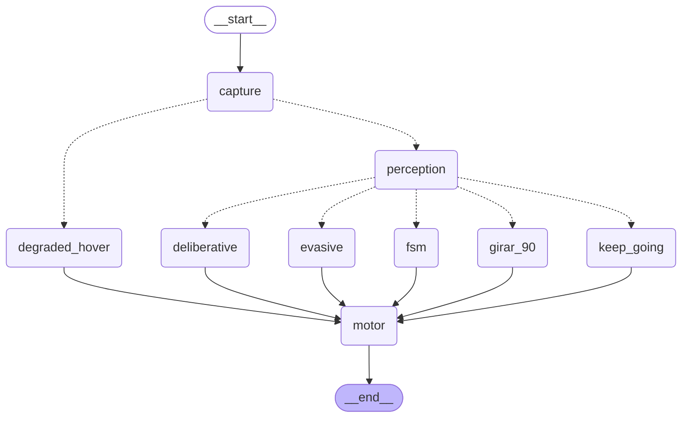

# 4. Arquitectura del lazo táctico

## 4.1 Visión general del lazo

El lazo descrito en este capítulo se ejecuta sobre el entorno de simulación construido y validado en el capítulo 3 (Unreal Engine 5.5 con Cosys-AirSim). El sistema implementado es un grafo de decisión por ciclo (`StateGraph` de LangGraph) que se ejecuta
a una frecuencia objetivo de `LOOP_HZ` (5–10 Hz según la resolución de captura elegida). Cada ciclo
recorre el mismo grafo desde `capture` hasta `motor` y llega a un estado terminal (`__end__`); la
naturaleza cíclica de la navegación la aporta el bucle externo de `main.py`, no el grafo en sí, que
por diseño no tiene aristas de retorno. Conviene describir esta arquitectura como un **grafo de
decisión por tick** y no como un "grafo cíclico de navegación": es una distinción defendible y no una
mera cuestión de vocabulario, porque el grafo se recompila y evalúa desde cero en cada ciclo.

La estructura actual del grafo, exportada directamente desde el código compilado
(`scripts/export_graph_mmd.py`, sin conexión a AirSim ni efectos secundarios), es la siguiente:

Cada ciclo captura un fotograma y telemetría (`capture`); si la fuente de datos no es AirSim (modo
degradado, ver más abajo), el ciclo va directo a `degraded_hover` sin pasar por percepción. En caso
contrario, `perception` produce el `ObstacleField` del ciclo (cap. 5) y un enrutador de política
(`policy_router`) decide, sobre esa evidencia, a cuál de cinco nodos de acción dirigir el ciclo:
`keep_going` (crucero sin novedad), `evasive` (evasión reactiva de corto plazo), `girar_90` (bypass
determinista ante bloqueo severo), `fsm` (política de máquina de estados, cuando ese es el brazo
activo) o `deliberative` (consulta al modelo de lenguaje). Todos los nodos de acción convergen en
`motor`, que traduce la macro-acción elegida a un comando cinemático concreto y lo emite a AirSim.

## 4.2 Deliberación por excepción

El principio de diseño central de la arquitectura es que la consulta al modelo de lenguaje es la
**excepción**, no la regla: la mayoría de los ciclos deben resolverse por rutas deterministas y
baratas (`keep_going`, `evasive`, `girar_90`), y solo una fracción acotada de los ciclos debería
requerir la latencia y el costo de una inferencia de lenguaje. Ese principio se sostiene con varias
salvaguardas explícitas:

- **Freno previo.** Antes de invocar al modelo de lenguaje, el nodo deliberativo emite un comando de
  frenado (`FRENAR`) y solo entonces encola el pedido de deliberación. El dron nunca sigue avanzando
  a ciegas mientras espera una respuesta.
- **Deliberación asíncrona con watchdog.** La consulta al modelo corre en un hilo aparte
  (`DeliberationService`, con una cola de tamaño 1) para no bloquear el lazo de percepción mientras
  se espera la respuesta. Si el pedido excede `SLM_WATCHDOG_MS`, se marca `timeout` y decide la
  política de respaldo determinista — el ciclo de control nunca queda a merced de la latencia del
  modelo.
- **Parser tolerante como red de seguridad.** La respuesta del modelo se solicita con
  `response_format=json_schema` (decodificación restringida) pero se conserva un parser tolerante a
  texto conversacional, JSON truncado o markdown como camino de respaldo — nunca se descarta un ciclo
  completo solo porque la salida no fue perfectamente estructurada (cap. 7).
- **Fallback determinista.** Ante timeout, respuesta no parseable o acción fuera de la lista blanca,
  el sistema recurre a una política de respaldo determinista, nunca a un valor por defecto arbitrario.
- **Persistencia de maniobra y enclavamiento anti-flip-flop.** Una vez iniciada una maniobra de
  evasión o escape, el sistema evita revertirla ciclo a ciclo por pequeñas variaciones de la
  evidencia; y un mecanismo de escape que agota sus reintentos permitidos queda enclavado y cambia de
  estrategia en lugar de repetir indefinidamente la misma acción fallida.

## 4.3 Salvaguardas y contratos congelados

Tres estructuras de datos funcionan como contratos estables de la arquitectura, en el sentido de que
su superficie de API no cambia aunque cambie su implementación interna:

- **`deliberations[]`** es el registro de evidencia primaria de cada decisión del modelo de lenguaje
  (prompt enviado, respuesta cruda, modelo, latencia, si hubo fallback). Es un contrato de solo
  agregado: se le suman campos (por ejemplo `timeout`, `adherent`) pero nunca se le quitan, porque es
  la evidencia auditable de la que depende buena parte del capítulo de resultados.
- **`ObstacleField`** (cap. 5) es el único objeto que consumen el enrutador de política, el nodo de
  evasión, el nodo deliberativo, la FSM y el registro de vuelo. Ningún consumidor accede a campos
  crudos de flujo óptico: toda lectura pasa por su API pública (`is_blocked`, `blocked_fraction`,
  `sector_ttc`, `summary_text`, `to_dict`).
- **`WaypointTracker`**, con corrección de rumbo por *cross-track error*, zona muerta angular,
  saturación de tasa de guiñada e histéresis con suavizado exponencial (EMA) sobre los umbrales de
  giro brusco, aproximación final y zona muerta de guiñada, agregados para reducir cabeceos visibles
  en el vuelo.

## 4.4 Modo degradado

Cuando la fuente de datos no es AirSim (`source != "airsim"`), el sistema no sustituye el fotograma
o la telemetría faltante por datos sintéticos plausibles: el ciclo se dirige directo a
`degraded_hover`, se comanda hover explícito y se omiten percepción y deliberación por completo. La
razón de este diseño es la misma que motiva el capítulo 8: un dato sintético "razonable" en lugar de
un dato ausente es indistinguible, para el resto del sistema, de un dato real, y esconde exactamente
el tipo de fallo silencioso que este trabajo documenta en otros componentes.
