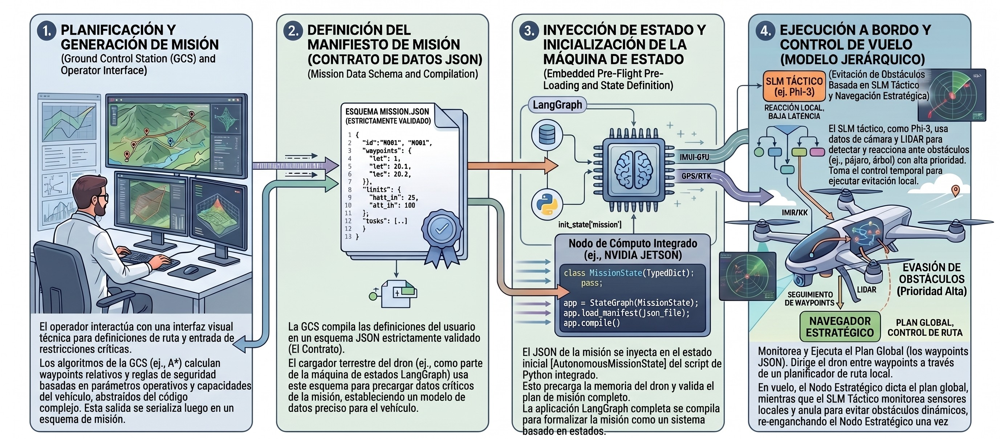
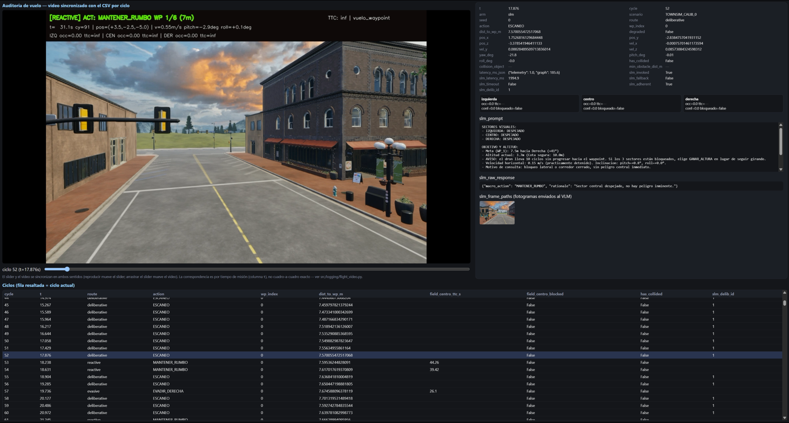

# 4. Planificación de misiones y estación de control en tierra (WebDCS)

## 4.1 Arquitectura desacoplada: dos cerebros (tierra vs. vuelo)

La arquitectura general del sistema responde a un principio de diseño fundamental: la separación estricta entre la **planificación deliberativa global previa al vuelo** (ejecutada en tierra) y la **navegación táctica reactiva** (ejecutada a bordo durante el vuelo). Esta división, conceptualizada como una arquitectura de *dos cerebros*, resuelve la asimetría intrínseca de recursos computacionales y tolerancias de latencia entre ambas fases operativas:

1. **El planificador de estación terrena (`airsim-plan` / WebDCS):** opera de manera previa al despegue del vehículo. En esta etapa, el sistema puede tolerar presupuestos de tiempo del orden de 5 a 10 segundos para interpretar instrucciones en lenguaje natural, consultar información contextual del entorno, aplicar reglas de seguridad operacional y generar un plan de vuelo global validado.
2. **El lazo táctico a bordo (`airsim-loop`):** opera en tiempo real estricto una vez que el vehículo está en el aire (capítulo 5). Bajo una frecuencia objetivo de 5 a 10 Hz, su función no es diseñar la ruta global sino mantener la estabilidad cinemática, seguir los objetivos asignados y ejecutar maniobras reactivas inmediatas de evasión de obstáculos a partir de visión monocular ligera.



El desacoplamiento permite que la misión sea validada, persistida y versionada de forma determinista antes de iniciar los motores. Asimismo, garantiza que el lazo táctico a bordo no dependa de una conexión de red permanente con la estación terrena: una vez transmitido el manifiesto de vuelo, el dron opera de forma enteramente autónoma, protegiendo la seguridad del vuelo ante eventuales pérdidas de enlace de radio o telemetría.

## 4.2 Compilación de misiones desde lenguaje natural
El módulo de planificación en tierra integra un modelo de lenguaje (LLM) que actúa como compilador semántico. Su objetivo es transformar directivas operativas de alto nivel expresadas en lenguaje natural por un operador humano (por ejemplo, *"recorrer el perímetro norte a 10 metros de altura evitando zonas de alta densidad vehicular"*) en un artefacto estructurado y ejecutable por el piloto automático.

Para garantizar la fiabilidad del proceso de compilación sin incurrir en alucinaciones o errores de sintaxis:

- Se utiliza un cliente local compatible con la API de OpenAI (conectado a instancias locales de LM Studio u Ollama), ejecutando modelos orientados a seguimiento de instrucciones (tales como Llama-3-8B, Qwen-7B o Phi-4).
- Se define un *System Prompt* formalizado (`compiler_system.md`) que instruye al modelo sobre las dimensiones del entorno de simulación, las restricciones del espacio aéreo urbano y el formato de salida requerido.
- Se implementa una capa de coerción y extracción de JSON (`json_extract.py`) respaldada por esquemas de validación estricta en **Pydantic** (`manifest.py`). Si la salida generada por el LLM no cumple con los tipos de datos o las restricciones cinemáticas impuestas, el compilador rechaza el plan y solicita una reevaluación antes de comprometer el vuelo.

Cabe una aclaración sobre el alcance actual de la interfaz: si bien el compilador semántico descripto en esta sección está completamente implementado y expuesto como endpoint del backend, la interfaz de WebDCS en su estado presente no ofrece ningún control para invocarlo. La superficie de interacción del operador quedó acotada, por decisión de alcance del proyecto, a la edición manual de waypoints sobre la carta de navegación (§4.4.1) — priorizando el desarrollo del control de vuelo por sobre la interfaz de planificación asistida. La compilación desde lenguaje natural queda documentada aquí como una capacidad ya construida y validada, disponible para reincorporarse a la interfaz sin cambios en el backend.

## 4.3 El contrato del Manifiesto de Misión (`MissionManifest`)

El producto final del planificador terrestre es un archivo JSON denominado **`MissionManifest`**. Este documento actúa como un contrato formal e inmutable entre la estación terrena y el lazo táctico de vuelo. Su schema canónico está definido en Pydantic (`manifest.py`) y validado contra un JSON Schema (`manifest_schema.json`).

```json
{
  "mission_id": "CITYMAP_PILOT",
  "summary": "Tier 2: circuito tipo grilla urbana sobre citysim_ortho.png ...",
  "start_pose": { "x": 0.0, "y": 0.0, "z": -10.0, "yaw_deg": 90.0 },
  "waypoints": [
    {"x": 3.0,   "y": -51.0,  "z": -10.0, "label": "WP_0_SUR"},
    {"x": 26.1,  "y": -78.2,  "z": -10.0, "label": "WP_1"},
    {"x": 68.9,  "y": -78.6,  "z": -10.0, "label": "WP_2"},
    {"x": 67.7,  "y": -156.5, "z": -10.0, "label": "WP_3"},
    {"x": 26.5,  "y": -145.0, "z": -10.0, "label": "WP_4"},
    {"x": -16.3, "y": -145.0, "z": -10.0, "label": "WP_5"},
    {"x": -17.9, "y": -78.6,  "z": -10.0, "label": "WP_6"},
    {"x": 12.5,  "y": -78.6,  "z": -10.0, "label": "WP_7"}
  ],
  "map": "citysim_ortho.png"
}
```

*Manifiesto vigente `citysim_pilot.json` (cap. 10 §10.3.3 explica `WP_0_SUR`; el mapa se describe en §4.3.2).*

### Componentes del contrato:
- **`mission_id`:** identificador único en formato `^[A-Z0-9_]{3,32}$`, validado por el schema. Identifica el escenario experimental y aparece en los nombres de carpeta de telemetría.
- **`summary`:** descripción textual de la intención operativa (campo opcional, no consumido por el lazo táctico).
- **`waypoints`:** lista ordenada de puntos de paso tridimensionales en el marco **NED** (*North-East-Down*): $z < 0$ representa altitud sobre el punto de despegue. Cada waypoint lleva una etiqueta opcional (`label`) para identificación en la traza.
- **`map`:** nombre de la imagen cenital del escenario. WebDCS la usa para ubicar y mostrar los waypoints, y el planificador de ruta (§4.3.1) para decidir por dónde va cada tramo. La escala (px/m) y el origen de cada imagen se declaran en `airsim-plan/missions/maps/map_scales.json`, con la convención: centro de la imagen = `ned_offset`, arriba = norte (+x), derecha = este (+y). Como el plan de ruta se deriva del mapa, un mapa mal registrado sí afecta al vuelo (§4.3.2).
- **`start_pose`** (opcional): pose de partida; solo se usa con `--seed-jitter`, porque el runner devuelve el dron al *spawn* de `settings.json` (cap. 10 §10.4.3). Debe coincidir con ese *spawn*.

**Separación entre manifiesto y prompts del VLM.** El manifiesto entrega únicamente metas geométricas; los prompts del VLM no forman parte de él porque no pueden ser textos estáticos: se construyen en vuelo a partir del fotograma, la pose y el waypoint activo de ese instante. Hay dos (cap. 5 §5.10, §5.12; cap. 8 §8.5):

1. **Prompt estratégico** (`vlm_strategic.py`): el fotograma frontal con una grilla de 3×3 dibujada (tercios de la imagen) y la marca «META» en la dirección del destino, más la distancia al destino y la altura del dron. El modelo responde, para cada uno de los nueve sectores, si se puede volar al menos 15 m en esa dirección.
2. **Prompt del barrido** (`deep_scan.py`, solo en un deadlock): cuatro imágenes numeradas tomadas girando en el lugar, con el ángulo de cada una respecto de la dirección de vuelo y cuál es la más cercana al destino. El modelo describe cada imagen.

Ambas respuestas se fuerzan con decodificación restringida (`json_schema`) a esquemas sin campo de acción; el código convierte la descripción en una sub-meta en coordenadas del mundo, que el `WaypointTracker` inserta delante del waypoint del manifiesto como un waypoint temporal.

Este nivel de dinamismo hace inviable delegar el prompt al manifiesto: el contenido útil depende de percepciones que solo existen en vuelo.

### 4.3.1 Plan de ruta con el VLM sobre el mapa cenital

El manifiesto une los waypoints en línea recta, y en una ciudad la recta suele cruzar una manzana. En vuelo, el VLM ve solo lo que tiene delante a 10 m de altura y debe inferir por dónde rodear un edificio cuyo final no ve; desde arriba, la misma pregunta se vuelve de reconocimiento: si una línea dibujada sobre el mapa va por la calle o por encima de los edificios. Es el tipo de juicio que un VLM pequeño resuelve mejor, porque no exige estimar distancias en primera persona. Por eso la estación terrena agrega un paso de planificación con el VLM **antes del despegue** (`src/planning/route_planner.py`): corre una sola vez por misión, la misión espera su resultado y nada de esto ocurre dentro del lazo táctico.

1. **Candidatas geométricas.** Para cada tramo A → B (incluido el tramo desde el *spawn* al primer waypoint) se generan rutas sin mirar el mapa: la recta, las dos rutas en L (primero norte-sur o primero este-oeste) y desvíos paralelos a ±25 y ±50 m a cada lado.
2. **Juicio del VLM.** Cada candidata se dibuja sobre el recorte del mapa que contiene a todas las del tramo, a la misma escala (línea roja; inicio en verde, destino en azul; 672 × 672 px), y se le pregunta al modelo si la línea va en todo su recorrido por calles o espacios abiertos sin pasar por encima de edificios. La respuesta se fuerza con decodificación restringida a `si`/`no` (temperatura 0), y la probabilidad de `si` se lee de los *logprobs* del token de la respuesta.
3. **Elección.** Entre las candidatas que el modelo aprobó se toma la de mayor probabilidad; a menos de 0.05 de la mejor, la más corta. Si no aprobó ninguna, queda la recta y el tramo se resuelve en vuelo como siempre. Los vértices intermedios de la elegida se insertan en el manifiesto como waypoints `VIA_<WP>_<k>` (con `planned_via: true` y la altura del waypoint de destino), delante del waypoint del tramo.

El modelo evalúa; el código solo genera las opciones y toma la mejor según el propio modelo. El plan completo —cada candidata con su imagen, respuesta y probabilidad, la elegida y el motivo— queda en `<out-dir>/<escenario>/route_plan/` junto al manifiesto planificado, y se cachea por contenido (waypoints, mapa, modelo y prompt): `runner.py` y `batch_runner.py` planifican una vez por escenario antes de la primera corrida (`--route-plan vlm`, valor por defecto de `ROUTE_PLAN_MODE`), de modo que todas las semillas y brazos de un lote vuelan el mismo plan, y cada `summary.json` registra el plan con el que voló (`route_plan`). `--route-plan off` vuela el manifiesto tal cual. La validez del juicio del modelo sobre el mapa se mide antes de usarlo, contra la geometría del simulador (cap. 11 §11.0).

### 4.3.2 Mapa cenital registrado

El plan de ruta solo tiene sentido si el mapa coincide con el mundo de vuelo. El mapa de CitySim se construye con el propio simulador (`airsim-plan/scripts/capture_ortho_map.py`): el dron se reubica sobre una grilla de puntos a 1000 m de altura con la cámara frontal apuntando 90° hacia abajo y un campo visual de 15°, de modo que la vista es casi ortográfica. De cada toma se usa la mitad central y se la pega en el lienzo a 2 px/m, con el origen NED en el centro de la imagen, el norte arriba y el este a la derecha. La orientación y la escala se verifican en el arranque desplazando el dron 20 m al norte y 20 m al este y midiendo el corrimiento de la imagen por correlación de fase.

Unreal Engine carga el escenario por zonas alrededor del punto de vista, y desde 1000 m no carga la zona de abajo: la imagen muestra solo calles y bases vacías. Por eso, antes de cada toma el dron baja a 40 m sobre el punto (la carga se completa en unos 3 s), vuelve a subir y captura enseguida. La toma se acepta cuando la fracción de píxeles de edificio, medida con la profundidad, deja de crecer entre dos capturas; un criterio por color no sirve, porque el agua animada nunca se estabiliza y una zona sin cargar está quieta. El resultado, `citysim_ortho.png`, cubre la ciudad completa (1920 m norte-sur por 1640 m este-oeste) y es el mapa de todas las misiones de CitySim.

En el marco de la metodología experimental de esta tesis (capítulo 10), el uso de manifiestos estructurados garantiza la **reproducibilidad experimental**: los escenarios de benchmark por Tiers (`minisim_clear`, `townsim_ini`, `citysim_clear`) se definen a través de manifiestos fijos e inmutables, asegurando que las comparaciones de rendimiento entre brazos de control (SLM, FSM y reactivo) se inicien exactamente con las mismas metas cinemáticas y espaciales.

## 4.4 Estación Terrena WebDCS: planificación y auditoría post-vuelo

**WebDCS** (*Web-based Drone Control Station*) es la interfaz de control en tierra, construida sobre **FastAPI** con frontend en HTML5, CSS y JavaScript. Expone su API REST en `http://localhost:8000` y sirve el panel de operación como aplicación web estática.


### Funcionalidades de WebDCS:

1. **Gestión interactiva de cartas y waypoints:**
   El panel incorpora un visor Canvas 2D que superpone la trayectoria del manifiesto sobre la carta del entorno urbano (`CitySim`). El operador puede cargar manifiestos existentes desde `airsim-plan/missions/flightplans/`, visualizar la ruta proyectada y editar waypoints interactivamente sobre la carta — agregar, reordenar, eliminar y ajustar altitud — antes de guardar o lanzar.

2. **Lanzamiento y detención de misión:**
   El botón *Lanzar* invoca `POST /api/launch`, que persiste el manifiesto y arranca `airsim-loop` en un hilo de fondo sin bloquear la interfaz. `POST /api/stop` detiene todos los runners activos. `POST /api/reset` reinicia el simulador AirSim y libera el control de la API.

### Dataset de corridas: estructura de `airsim-runs/`

Cada ejecución de una misión escribe una carpeta autocontenida en `airsim-runs/`. El nombre de la carpeta — y el prefijo común (`<stem>`) de todos los archivos dentro de ella — se construye concatenando el `mission_id` del manifiesto con la marca de tiempo de inicio de la ejecución en UTC, en formato ISO 8601 compacto sin separadores: `<MISSION_ID>-<YYYYMMDDTHHMMSSZ>`. Por ejemplo, lanzar la misión `CITYSIM_CLEAR` el 7 de septiembre de 2026 a las 19:12:26 UTC produce la carpeta y el stem `CITYSIM_CLEAR-20260907T191226Z`. Si la misma misión se lanza dos veces, cada ejecución queda en su propia carpeta gracias al timestamp — nunca se sobreescriben corridas anteriores. El ejecutor de experimentos (`experiments/runner.py`) usa la misma convención dentro de una jerarquía por celda experimental, `<escenario>/<brazo>/<estrategia>/seed_<N>_<timestamp>/`, de modo que cada corrida de una celda queda en su propio directorio con todos sus artefactos. La tabla siguiente describe los archivos que produce cada ejecución:

| Archivo | Descripción |
|---|---|
| `<stem>.jsonl` | Traza completa: un objeto JSON por ciclo de control |
| `<stem>.csv` | Traza plana, sin campos JSON: columnas fijas más una columna `state.<ruta>` por cada campo escalar del `DroneState`, para inspección directa en Excel / pandas (§5.18) |
| `<stem>.summary.json` | Métricas agregadas de la corrida (éxito, colisiones, latencias, tasas del VLM) |
| `<stem>.summary_by_wp.csv` | Stats por waypoint: ciclos, deliberaciones y eventos de atasco por tramo |
| `<stem>.viewer.html` | Visor de auditoría HTML autocontenido, sincronizado con el video |
| `<stem>.webm` | Video anotado del vuelo (un fotograma por ciclo, con overlay de acción y estado) |
| `photo-<ISO_UTC>.png` | Fotogramas enviados al VLM, uno por deliberación, nombrados por timestamp UTC |

**Traza por ciclo (`.jsonl` / `.csv`):** cada entrada registra el instante, el ciclo, el brazo de control (`arm`: slm/fsm/reactive), el escenario, la ruta, la macro-acción, el waypoint activo y la distancia al mismo, la posición y velocidad 3D, la actitud, el estado de colisión y la distancia mínima al obstáculo. En los ciclos deliberativos se agregan el prompt enviado (`slm_prompt`), la respuesta cruda del modelo (`slm_raw_response`), la latencia de inferencia, indicadores de fallback y timeout, y las rutas a los fotogramas enviados (`slm_frame_paths`). El estado del `ObstacleField` se registra por sector (ocupación, TTC, confianza, bloqueado).

**Resumen de corrida (`.summary.json`):** es el archivo que consume `analyze.py` para el análisis comparativo entre brazos. Incluye éxito de misión, colisiones, distancia mínima al obstáculo, longitud de trayectoria, tasa de deliberación, y tasas de fallback y timeout del VLM.

**Resumen por waypoint (`.summary_by_wp.csv`):** permite identificar en qué tramo de la misión se concentra la dificultad sin necesidad de analizar el CSV completo — muestra ciclos consumidos, proporción de ciclos deliberativos y eventos de escalación de atasco por waypoint.

**Fotogramas del VLM (`photo-<ISO>.png`):** cada imagen enviada al modelo se guarda con su timestamp real de captura en UTC (precisión de milisegundos), que sirve como clave para cruzar con la columna `slm_frame_paths` de la traza. La carpeta es autocontenida: toda la evidencia de una corrida reside en un único directorio.

### Visor de auditoría (`.viewer.html`)



El archivo `<stem>.viewer.html` es un documento HTML autocontenido generado al cierre de cada corrida. Sincroniza en ambos sentidos la reproducción del video con la traza:

- Avanzar el video actualiza automáticamente el panel de detalle del ciclo correspondiente, mostrando el prompt enviado, la respuesta del modelo, la macro-acción resultante y el fotograma capturado en ese instante.
- Seleccionar una fila de la tabla salta el video al instante correspondiente.

Para consultarlo: abrir el archivo directamente en Chrome desde `airsim-runs/<carpeta>/<stem>.viewer.html` — no requiere servidor.

#### Anotaciones del video

El video (`.webm`) registra un fotograma por ciclo del lazo, a la misma cadencia de `LOOP_HZ`. Cada fotograma lleva un overlay de cuatro líneas superpuesto **sobre una copia del fotograma**; el original enviado al VLM y guardado como `.png` de auditoría queda sin modificar para no contaminar la evidencia perceptual.

**Línea 1 — ruta activa y macro-acción** (texto grande, color codificado):

```
[KEEP_GOING] ACT: MANTENER_RUMBO  WP 3/7 (42m)
```

- El tag entre corchetes es la **ruta** (`route`) del comportamiento que resolvió el ciclo (§5.3): `REACTIVE` (crucero sin novedad), `EVASIVE` (evasión reactiva o continuación de una maniobra comprometida), `TACTICAL` (resolución de atasco: escape, retroceso o decisión del VLM), `GIRAR_90` (bypass de bloqueo severo), `FSM` (máquina de estados, brazo FSM) o `DEGRADED` (modo degradado, §5.5).
- `ACT:` es la **macro-acción** traducida a comando cinemático por el nodo `motor`.
- `WP X/N (Ym)` indica el waypoint activo y la distancia restante según `WaypointTracker` (§5.15).
- **Color:** verde para `MANTENER_RUMBO` (avance sin novedad), naranja para maniobras de evasión o giro, rosa/magenta para decisiones del VLM, `PARADA` o `FRENAR`.

**Línea 2 — TTC frontal y estado de vuelo** (derecha del fotograma):

```
TTC: 3.2s | vuelo
```

- `TTC` es el tiempo estimado a colisión del sector frontal según el `ObstacleField` del ciclo (cap. 6); `inf` significa sector despejado.
- El campo de texto refleja el estado general de la misión (`vuelo`, `completada`, `colisión`).

**Línea 3 — telemetría del ciclo:**

```
t= 18.4s cy=92 | pos=(+26.1,-78.2,-10.0) | v=2.31m/s pitch=-3.2deg roll=+0.8deg
```

- `t` y `cy` permiten cruzar el fotograma con la fila exacta del CSV por número de ciclo (la sincronización por tiempo es aproximada, la de ciclo es exacta; ver `flight_video.py`).
- `pos` es la posición 3D en el marco NED del simulador; si el guiado detectó un techo (§5.15.3), se agrega `ceil=<cota>` a continuación.
- `v`, `pitch`, `roll` son la velocidad horizontal y la actitud del vehículo en ese instante.

**Línea 4 — estado del ObstacleField por sector** (cap. 6):

```
C occ=0.62 ttc=3.2s! | I occ=0.11 ttc=inf | D occ=0.08 ttc=inf
```

- Los tres sectores son `C` (centro / frente), `I` (izquierda) y `D` (derecha).
- `occ` es la fracción de ocupación estimada por flujo óptico monocular; `ttc` es el tiempo a colisión estimado del sector; `!` marca el sector como bloqueado según el umbral de `is_blocked()`.
- Estos valores son los mismos que usa el lazo rápido de `navigate` (cap. 5 §5.3): el overlay permite ver, ciclo a ciclo, qué evidencia perceptual motivó la decisión visible en la línea 1. El VLM no los recibe: mira el fotograma directamente (cap. 5 §5.10).

La combinación de estas cuatro líneas permite reconstruir, para cualquier instante del vuelo, exactamente qué percibió el sistema, por qué se activó el comportamiento que aparece en el tag, y qué orden cinemática emitió — sin necesidad de cruzar a mano el video con el CSV.
