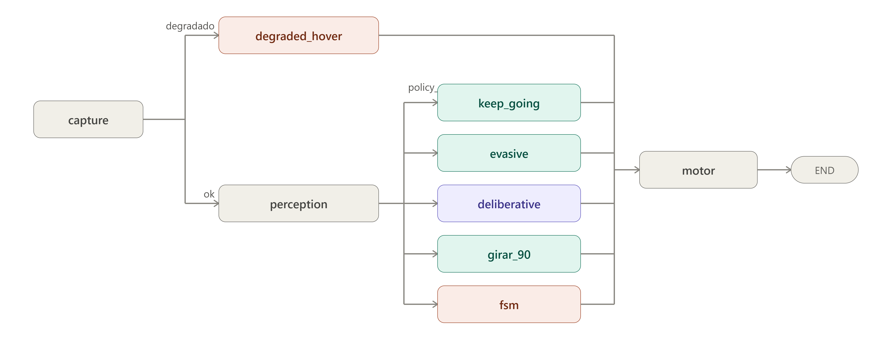

# 5. Arquitectura del lazo táctico

## 5.1 Visión general del lazo

El lazo descrito en este capítulo se ejecuta sobre el entorno de simulación construido y validado en el capítulo 3 (Unreal Engine 5.5 con Cosys-AirSim), ejecutando los manifiestos compilados previamente por la estación terrena (capítulo 4). El sistema implementado es un grafo de decisión por ciclo (`StateGraph` de LangGraph) que se ejecuta a una frecuencia objetivo de `LOOP_HZ` (5–10 Hz según la resolución de captura elegida). Cada ciclo recorre el mismo grafo desde `capture` hasta `motor` y llega a un estado terminal (`__end__`); la naturaleza cíclica de la navegación la aporta el bucle externo de `main.py`, no el grafo en sí, que por diseño no tiene aristas de retorno. Conviene describir esta arquitectura como un **grafo de decisión por tick** y no como un "grafo cíclico de navegación": es una distinción defendible y no una mera cuestión de vocabulario, porque el grafo se recompila y evalúa desde cero en cada ciclo.

La estructura actual del grafo, exportada directamente desde el código compilado (`scripts/export_graph_mmd.py`, sin conexión a AirSim ni efectos secundarios), es la siguiente:

Cada ciclo captura un fotograma y telemetría (`capture`); si la fuente de datos no es AirSim (modo degradado, ver más abajo), el ciclo va directo a `degraded_hover` sin pasar por percepción. En caso contrario, `perception` produce el `ObstacleField` del ciclo (cap. 6) y un enrutador de política (`policy_router`) decide, sobre esa evidencia, a cuál de cinco nodos de acción dirigir el ciclo: `keep_going` (crucero sin novedad), `evasive` (evasión reactiva de corto plazo), `girar_90` (bypass determinista ante bloqueo severo), `fsm` (política de máquina de estados, cuando ese es el brazo activo) o `deliberative` (consulta al modelo de lenguaje). Todos los nodos de acción convergen en `motor`, que traduce la macro-acción elegida a un comando cinemático concreto y lo emite a AirSim.

## 5.2 Deliberación por excepción

El principio de diseño central de la arquitectura es que la consulta al modelo de lenguaje es la **excepción**, no la regla: la mayoría de los ciclos deben resolverse por rutas deterministas y baratas (`keep_going`, `evasive`, `girar_90`), y solo una fracción acotada de los ciclos debería requerir la latencia y el costo de una inferencia de lenguaje. Ese principio se sostiene con varias salvaguardas explícitas:

- **Avance cauteloso y frenado condicional por seguridad.** Durante la espera asíncrona de la resolución del modelo, el sistema comanda un avance a velocidad mínima de arrastre (`DELIB_WAIT_CREEP_SPEED_MPS = 0.5 m/s`) en lugar de frenar a cero incondicionalmente. Esta distinción cinemática es fundamental: detener por completo la traslación anula la señal del flujo óptico y destruye la confianza del estimador de TTC, desencadenando espirales deliberativas artificiales. Sin embargo, si el sector frontal registra un bloqueo estructural inminente (`close_structural = True`), el sistema comanda detención total inmediata (`FRENAR`), anteponiendo la seguridad física a la preservación del flujo.
- **Deliberación asíncrona con watchdog.** La consulta al modelo corre en un hilo aparte (`DeliberationService`, con una cola de tamaño 1) para no bloquear el lazo de percepción mientras se espera la respuesta. Si el pedido excede `SLM_WATCHDOG_MS`, se marca `timeout` y decide la política de respaldo determinista — el ciclo de control nunca queda a merced de la latencia del modelo.
- **Parser tolerante como red de seguridad.** La respuesta del modelo se solicita con `response_format=json_schema` (decodificación restringida) pero se conserva un parser tolerante a texto conversacional, JSON truncado o markdown como camino de respaldo — nunca se descarta un ciclo completo solo porque la salida no fue perfectamente estructurada (cap. 8).
- **Fallback determinista.** Ante timeout, respuesta no parseable o acción fuera de la lista blanca, el sistema recurre a una política de respaldo determinista, nunca a un valor por defecto arbitrario.
- **Persistencia de maniobra y enclavamiento anti-flip-flop.** Una vez iniciada una maniobra de evasión o escape, el sistema evita revertirla ciclo a ciclo por pequeñas variaciones de la evidencia; y un mecanismo de escape que agota sus reintentos permitidos queda enclavado y cambia de estrategia en lugar de repetir indefinidamente la misma acción fallida.

## 5.3 Salvaguardas y contratos congelados

Tres estructuras de datos funcionan como contratos estables de la arquitectura, en el sentido de que su superficie de API no cambia aunque cambie su implementación interna:

- **`deliberations[]`** es el registro de evidencia primaria de cada decisión del modelo de lenguaje (prompt enviado, respuesta cruda, modelo, latencia, si hubo fallback). Es un contrato de solo agregado: se le suman campos (por ejemplo `timeout`, `adherent`) pero nunca se le quitan, porque es la evidencia auditable de la que depende buena parte del capítulo de resultados.
- **`ObstacleField`** (cap. 6) es el único objeto que consumen el enrutador de política, el nodo de evasión, el nodo deliberativo, la FSM y el registro de vuelo. Ningún consumidor accede a campos crudos de flujo óptico: toda lectura pasa por su API pública (`is_blocked`, `blocked_fraction`, `sector_ttc`, `summary_text`, `to_dict`).
- **`WaypointTracker`**, con corrección de rumbo por *cross-track error*, zona muerta angular, saturación de tasa de guiñada e histéresis con suavizado exponencial (EMA) sobre los umbrales de giro brusco, aproximación final y zona muerta de guiñada, agregados para reducir cabeceos visibles en el vuelo.

## 5.4 Modo degradado

Cuando la fuente de datos no es AirSim (`source != "airsim"`), el sistema no sustituye el fotograma o la telemetría faltante por datos sintéticos plausibles: el ciclo se dirige directo a `degraded_hover`, se comanda hover explícito y se omiten percepción y deliberación por completo. La razón de este diseño es la misma que motiva el capítulo 9: un dato sintético "razonable" en lugar de un dato ausente es indistinguible, para el resto del sistema, de un dato real, y esconde exactamente el tipo de fallo silencioso que este trabajo documenta en otros componentes.

## 5.5 Escalación ante atasco persistente: barrido panorámico y consulta puntual al modelo de visión

Cuando el mecanismo de evasión de corto plazo (`evasive`) no logra restablecer el progreso hacia el waypoint objetivo durante un número sostenido de ciclos — un atasco duro, en el sentido de que ninguna dirección inmediata frente al dron ofrece un corredor despejado según el `ObstacleField` (cap. 6) — el sistema no recurre de inmediato al escape ciego (alternancia determinista entre ganar y perder altitud). En su lugar, ejecuta primero un barrido panorámico: una secuencia de giros puros en el lugar (sin traslación) hacia un conjunto fijo de rumbos equiespaciados alrededor del rumbo actual, capturando un fotograma en cada uno tras un breve período de asentamiento.

Con el panorama completo capturado, se realiza una única consulta al modelo de visión, presentando las imágenes de todos los rumbos explorados — etiquetadas explícitamente como direcciones distintas desde el mismo punto, no como fotogramas consecutivos en el tiempo — junto con el estado del atasco (ciclos sin progreso, escapes verticales ya intentados, distancia y rumbo al objetivo). El modelo elige una única macro-acción de la misma lista blanca que usa el nodo deliberativo ordinario (cap. 8): el barrido no introduce vocabulario de decisión nuevo, solo una vista panorámica de la evidencia. Si la respuesta no llega dentro del plazo del watchdog o no resulta en una acción viable, el sistema cae al escape ciego determinista como red de seguridad final, garantizando que el mecanismo de escalación nunca deje al vehículo sin una decisión.

Todo el barrido se ejecuta dentro del mismo ciclo del grafo de decisión, nunca en un bucle separado: reutiliza el fotograma que el nodo `capture` ya produjo ese ciclo y reemite su propio comando de velocidad a través de `motor` como cualquier otro nodo de política, sin desactivar la vigilancia del enrutador de política mientras dura. Al igual que el resto de la percepción del sistema (cap. 6), el barrido nunca consulta el canal de profundidad del simulador: opera exclusivamente sobre los mismos fotogramas RGB monoculares que alimentan el resto del lazo.

Este mecanismo de escalación es controlable como variable experimental (`DEADLOCK_STRATEGY=blind|deep_vlm`, adoptando `deep_vlm` como valor por defecto en producción): el sistema puede configurarse para omitirlo y recurrir directamente al escape ciego (`blind`), lo que permite comparar de forma factorial ambas estrategias de resolución de atasco bajo idénticas condiciones de vuelo (cap. 10). En corridas de validación sobre el escenario urbano de referencia, la variante con consulta al modelo de visión (`deep_vlm`) resolvió la totalidad de los eventos de atasco duro observados (12/12) sin recurrir al escape ciego de respaldo.

## 5.6 Registro de vuelo y auditoría post-vuelo

Cada ejecución del lazo táctico — interactiva o lanzada desde la estación terrena (cap. 4) — genera, salvo que se desactive explícitamente, una carpeta autocontenida identificada por el nombre de la misión y una marca de tiempo ISO de inicio. Dentro de ella conviven: una traza en formato JSONL con el estado completo de cada ciclo, la misma traza en CSV para inspección tabular directa, los fotogramas enviados al modelo de lenguaje en cada consulta deliberativa (nombrados por su marca de tiempo real de captura), un resumen agregado por waypoint (ciclos consumidos, proporción de ciclos deliberativos y eventos de escalación por atasco de cada tramo de la misión) y, opcionalmente, un video del vuelo completo con overlay de la acción tomada en cada ciclo.

La traza CSV/JSONL es el contrato de evidencia primaria del sistema: cada fila conserva el prompt exacto y la respuesta cruda de toda consulta al modelo de lenguaje, la telemetría completa del vehículo, el estado del campo de obstáculos por sector y la ruta del grafo de decisión que resolvió ese ciclo — es la fuente de la que se derivan las métricas del capítulo 10 y el análisis de modos de falla del capítulo 9.

Para la inspección cualitativa del comportamiento del sistema en un vuelo particular, cada corrida incluye además un visor HTML autocontenido que sincroniza en ambos sentidos la reproducción del video con la fila correspondiente de la traza: avanzar el video actualiza automáticamente el panel de detalle del ciclo correspondiente (incluyendo el prompt, la respuesta y los fotogramas enviados al modelo en ese instante), y seleccionar una fila de la tabla salta el video al momento correspondiente. Esta herramienta permite reconstruir, para cualquier instante del vuelo, exactamente qué percibió el sistema y por qué tomó la decisión que tomó.
