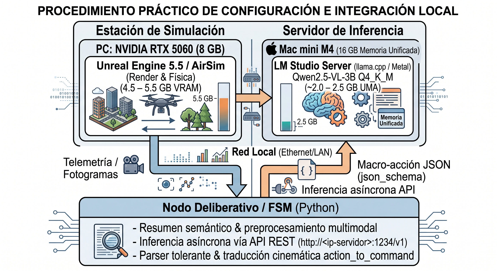

# Anexo 1: Exploración técnica de Small Language Models (SLM), cuantización GGUF y análisis de innovación arquitectónica

La integración de modelos de lenguaje en plataformas robóticas autónomas exige resolver un compromiso riguroso entre capacidad representacional, latencia de inferencia y consumo de recursos computacionales. En el contexto de esta investigación, el objetivo es dotar a un vehículo aéreo no tripulado (UAV) de capacidad deliberativa de alto nivel mientras opera en simulación fotorrealista bajo hardware de consumo. 

Un **Modelo de Lenguaje Pequeño** (*Small Language Model*, SLM) —y su extensión multimodal, *Small Vision-Language Model* (sVLM)— se define operativamente por tres criterios: **(1)** un conteo de parámetros en el rango de 1B a 10B ([Abdin et al., 2024](../13-REFERENCIAS.md#ref-abdin-2024); [Zhang et al., 2024](../13-REFERENCIAS.md#ref-zhang-tinyllama-2024)), que conserva competencia notable para razonamiento simbólico, comprensión sintáctica y extracción de relaciones complejas a pesar de su escala relativa ([Nguyen et al., 2024](../13-REFERENCIAS.md#ref-nguyen-2024)); **(2)** la factibilidad de despliegue local (*on-device*) en hardware de consumo común (tarjetas gráficas de gama media como la NVIDIA RTX 5060 de 8 GB) o procesadores embebidos (NVIDIA Jetson; [NVIDIA, 2025](../13-REFERENCIAS.md#ref-nvidia-2025)); y **(3)** una latencia de inferencia determinista de subsegundos a pocos segundos, compatible con los márgenes de los lazos de control en robótica móvil ([Tian et al., 2025](../13-REFERENCIAS.md#ref-tian-2025); [Vemprala et al., 2023](../13-REFERENCIAS.md#ref-vemprala-2023)). Frente a los LLMs de frontera (GPT-4o, Claude 3.5, Gemini 1.5 — decenas a cientos de miles de millones de parámetros, 24–80 GB de VRAM), los SLMs ofrecen ventajas determinantes para sistemas embarcados: autonomía operativa sin conexión a la nube, supresión de la variabilidad de red, eficiencia energética en plataformas alimentadas por batería ([Goel et al., 2021](../13-REFERENCIAS.md#ref-goel-2021)) y compatibilidad con decodificación restringida por gramáticas en motores locales como `llama.cpp` ([Willard & Louf, 2023](../13-REFERENCIAS.md#ref-willard-2023)).

Este anexo documenta el estudio exploratorio previo a las decisiones finales de implementación: delimita las restricciones físicas de memoria de video (VRAM), evalúa de forma comparativa los modelos compactos candidatos en formato GGUF, analiza los mecanismos para garantizar salidas estructuradas deterministas, y examina críticamente el nivel de novedad de la arquitectura frente al estado del arte reciente (2024–2026), identificando los ejes de ingeniería que aportan valor genuino al control autónomo.

---


## A1.1 Restricciones de hardware y presupuesto de VRAM en cohabitación con Unreal Engine

La plataforma de experimentación adoptada consta de una estación de trabajo equipada con una GPU NVIDIA GeForce RTX 5060 provista de **8 GB de VRAM**. A diferencia de los entornos de investigación que disponen de aceleradores dedicados (e.g., NVIDIA A100/H100 de 40–80 GB) o que delegan el cómputo a servicios en la nube, este proyecto impone una restricción de cohabitación local estricta: la GPU debe ejecutar simultáneamente el entorno de simulación física y visual, y el motor de inferencia del modelo deliberativo.

Una instancia activa del simulador AirSim sobre Unreal Engine 5.5 demanda, en condiciones estándar de renderizado (geometría Nanite, iluminación Lumen y captura de múltiples cámaras virtuales), entre **4.5 y 6.0 GB de VRAM** ([Shah et al., 2017](../13-REFERENCIAS.md#ref-shah-2017); [Turco et al., 2024](../13-REFERENCIAS.md#ref-turco-2024)). En consecuencia:

* **Presupuesto remanente disponible**: el espacio de memoria de video reservable para el modelo de lenguaje se restringe a una ventana de **2.0 a 3.5 GB de VRAM**.
* **Sobrecarga de contexto (KV Cache)**: la inferencia no solo consume la memoria estática de los pesos de la red, sino también la memoria dinámica requerida por el caché de claves y valores (*Key-Value Cache*), la cual escala linealmente con la longitud de la ventana de contexto y el tamaño del lote.
* **Exclusión de arquitecturas de frontera**: modelos superiores a 13B parámetros o modelos fundacionales no cuantizados (FP16/BF16) son inviables en esta configuración sin incurrir en transferencias masivas hacia la memoria RAM del sistema (*paging / offloading* excesivo a CPU), lo cual degrada la latencia de inferencia en órdenes de magnitud incompatibles con el control de vuelo.

Bajo este marco, la única alternativa viable radica en el uso de *Small Language Models* (SLMs) y *Small Vision-Language Models* (sVLMs) de escala **3B a 8B parámetros**, sometidos a técnicas de cuantización post-entrenamiento (*Post-Training Quantization*, PTQ) y optimizados para ejecución local ([Abdin et al., 2024](../13-REFERENCIAS.md#ref-abdin-2024); [Frantar et al., 2022](../13-REFERENCIAS.md#ref-frantar-gptq-2022); [Nguyen et al., 2024](../13-REFERENCIAS.md#ref-nguyen-2024); [Zhang et al., 2024](../13-REFERENCIAS.md#ref-zhang-tinyllama-2024)).

---

## A1.2 Evaluación comparativa de modelos candidatos en formato GGUF (3B–8B)

El formato binario **GGUF** (*GPT-Generated Unified Format*), desarrollado por la comunidad de `llama.cpp` ([Gerganov, 2023](../13-REFERENCIAS.md#ref-gerganov-2023)), se consolidó como el estándar de facto para la serialización y ejecución eficiente de modelos cuantizados en CPU y GPU. GGUF resuelve limitaciones de extensibilidad de formatos predecesores (como GGML) al incorporar metadatos estructurados en el encabezado del archivo y soportar esquemas de cuantización no uniforme (*k-quants*).

Las variantes *Q4_K_M* (cuantización a 4 bits con ponderación mixta en bloques de atención) y *Q5_K_M* (5 bits) permiten comprimir modelos de 3B–7B parámetros a tamaños de archivo de entre 1.8 y 4.5 GB, preservando la perplejidad y capacidad de razonamiento de los modelos originales con pérdidas marginales ([Frantar et al., 2022](../13-REFERENCIAS.md#ref-frantar-gptq-2022)).

Durante la fase exploratoria de diseño se evaluaron los siguientes modelos instruccionales (*instruct-tuned*) en formato GGUF para su ejecución bajo motores locales como `llama.cpp` y LM Studio:

| Modelo | Parámetros | Tamaño GGUF (quant) | VRAM estimada (full offload) | Fortalezas operativas | Comportamiento con salida estructurada | Disponibilidad de referencia |
|---|---|---|---|---|---|---|
| **Phi-4-mini-Instruct** | 3.8B | ~2.5–3.2 GB (Q4_K_M) | ~2.2–3.0 GB | Ajuste fino sobre datos sintéticos de alta fidelidad; sólida capacidad de razonamiento lógico y matemático ([Abdin et al., 2024](../13-REFERENCIAS.md#ref-abdin-2024)). | Muy alta adherencia a esquemas rígidos; mínima variación sintáctica. | `microsoft/Phi-4-mini-instruct-GGUF` |
| **Qwen3-4B-Instruct** | ~4B | ~2.8–3.5 GB (Q4_K_M) | ~2.5–3.5 GB | Excelente seguimiento de instrucciones complejas; capacidad nativa de *tool-calling*. | Soporte consistente de esquemas JSON mediante prompting y gramáticas. | `Qwen/Qwen3-4B-Instruct-GGUF` |
| **SmolLM3-3B-Instruct** | 3B | ~2.0–2.6 GB (Q4_K_M) | ~1.8–2.5 GB | Huella de memoria mínima; preentrenado específicamente para entornos embebidos y de bajo consumo. | Fácil de orientar a formatos fijos, aunque con menor tolerancia a contextos extensos. | `HuggingFaceTB/SmolLM3-3B-GGUF` |
| **Gemma-3-4B-IT** | 4B | ~2.8–3.4 GB (Q4_K_M) | ~2.5–3.2 GB | Arquitectura optimizada por Google; notable coherencia lingüística y comprensión contextual. | Buen desempeño estructurado, pero mayor demanda de KV cache en secuencias largas. | `google/gemma-3-4b-it-GGUF` |
| **Ministral-3-3B-Instruct** | 3B | ~2.2–2.7 GB (Q4_K_M) | ~2.0–2.6 GB | Diseñado específicamente por Mistral AI para despliegues de borde (*edge inference*); atención deslizante. | Rápido y estable en la emisión de respuestas compactas delimitadas. | `mistralai/Ministral-3-3B-Instruct-GGUF` |

### Transición hacia el modelo multimodal definitivo (§8.1.1 y §8.1.2)

Aunque los modelos textuales analizados exhibieron un rendimiento adecuado para el procesamiento de telemetría pura, el análisis teórico y empírico de la percepción monocular demostró la existencia de **puntos ciegos estructurales en la estimación de flujo óptico** (maniobras de sustentación estática *hover*, giros puros sobre el eje de guiñada y áreas de baja textura visual; véanse §6.1 y §6.12). 

Bajo dichas condiciones, el resumen perceptivo numérico queda desprovisto de información confiable. Esto motivó la sustitución de un SLM exclusivamente textual por un modelo con **capacidad de visión nativa** (*Small Vision-Language Model*, sVLM), permitiendo al agente inspeccionar directamente el fotograma capturado por la cámara frontal del UAV.

Tal como se formaliza en el capítulo 8 (§8.1.2), la elección convergió en **Qwen2.5-VL-3B-Instruct** ([Qwen Team, 2025](../13-REFERENCIAS.md#ref-qwen-team-2025)) bajo cuantización *Q4_K_M*:
* **Huella de memoria**: consume ~2.0 GB de VRAM, situándose holgadamente dentro del presupuesto operativo restante de la GPU.
* **Inspección visual directa**: procesa secuencias de dos fotogramas temporales ($t$ y $t-1$) para inferir dinámica de aproximación y discernir la semántica de la escena (e.g., vegetación vs. obstáculo estructural rígido).
* **Compatibilidad de decodificación**: ofrece soporte completo para esquemas de decodificación restringida (`json_schema`).

---

## A1.3 Métodos para la imposición de salida estructurada y gramática restringida

En una arquitectura de control robótico en lazo cerrado, la generación de lenguaje en formato libre (*free-form text*) resulta inaceptable: respuestas prolijas, explicaciones accesorias o desviaciones sintácticas invalidan el analizador (*parser*), provocando la interrupción temporal o el congelamiento del lazo de control.

Para garantizar la interoperabilidad con los actuadores cinemáticos del vehículo, se evaluaron tres mecanismos para restringir la salida del modelo a estructuras estrictas (e.g., esquemas JSON conformes):

### 1. Instrucciones estrictas en el prompt del sistema (*Prompt Engineering*)
Consiste en delimitar el formato esperado en el mensaje de sistema y penalizar explícitamente cualquier emisión de texto explicativo o etiquetas markdown:
```text
Eres un controlador de vuelo determinista. Responde ÚNICAMENTE un objeto JSON válido
conforme a este esquema: {"action": "keep_going" | "evasive" | "girar_90" | "fsm" | "degraded", "reason": str}.
No incluyas introducciones, markdown (```), ni texto posterior.
```
* **Ventajas**: implementación trivial; no impone sobrecarga computacional en el motor de inferencia.
* **Limitaciones**: fiabilidad imperfecta. En modelos compactos (<7B parámetros), la tasa de adherencia sintáctica ronda el 70–85%, presentándose ocasionalmente truncamientos, alucinaciones de sintaxis o texto preliminar que corrompen el flujo de control.

### 2. Gramáticas libres de contexto (GBNF en `llama.cpp`)
El motor `llama.cpp` proporciona un subsistema de decodificación guiada por gramáticas formales (*GGML BNF* o GBNF; Gerganov, 2023). En cada paso de generación autorregresiva, el motor filtra y enmascara los *logits* del vocabulario, asignando probabilidad cero ($-\infty$) a cualquier token que no cumpla con la regla de transición definida en la gramática.
* **Ventajas**: garantiza matemáticamente que el 100% de los tokens emitidos respeten la estructura gramatical (e.g., sintaxis JSON perfecta).
* **Limitaciones**: genera una penalización de rendimiento temporal del 10% al 30% en la velocidad de decodificación, debido a la evaluación continua de las reglas gramaticales sobre el conjunto de tokens candidatos.

### 3. Decodificación guiada basada en autómatas finitos (*Outlines*, *Guidance*, *llguidance*)
La formalización teórica introducida por [Willard y Louf (2023)](../13-REFERENCIAS.md#ref-willard-2023) reformula el esquema JSON o expresión regular requerida como un autómata finito determinista (DFA). Mediante el preprocesamiento del vocabulario del tokenizador, el motor indexa de manera eficiente qué tokens son admisibles para cada estado del autómata, aplicando la máscara de *logits* con una sobrecarga computacional sensiblemente menor a la evaluación de gramáticas complejas.

Estudios empíricos recientes ([Geng et al., 2025](../13-REFERENCIAS.md#ref-geng-2025); [Raspanti et al., 2025](../13-REFERENCIAS.md#ref-raspanti-2025)) demuestran que la decodificación restringida token a token no solo erradica errores de parseo (elevando la adherencia estructural del ~73% a >98%), sino que preserva e incluso optimiza la coherencia semántica en modelos pequeños, al suprimir caminos de generación dispersos o redundantes. Este enfoque constituye el núcleo del soporte de `response_format: {"type": "json_schema", ...}` implementado en el sistema (§8.2.1).

### 4. Estandarización de llamadas a herramientas: Model Context Protocol (MCP)
En arquitecturas modulares, la interacción entre el modelo deliberativo y las herramientas externas (sensores, registros de vuelo, interfaces con Unreal Engine) puede articularse mediante el **Model Context Protocol** (MCP; [Anthropic, 2024](../13-REFERENCIAS.md#ref-anthropic-2024)). MCP define un protocolo de cliente-servidor en JSON-RPC que desacopla la lógica del modelo de los servicios del sistema anfitrión, permitiendo exponer primitivas de consulta y actuación de forma segura, determinista y local sin conexión a Internet.

---

## A1.4 Procedimiento práctico de configuración e integración local

La puesta en marcha del lazo deliberativo bajo las restricciones de cómputo descritas sigue un flujo de tres fases:



1. **Gestión de capas y memoria en Apple Silicon (*Metal Offloading* en Mac mini M4)**:
   * En el servidor dedicado de inferencia (Apple Mac mini M4 con 16 GB de memoria unificada), LM Studio ejecuta el núcleo de `llama.cpp` compilado con aceleración por hardware sobre Apple Metal (MPS). El modelo multimodal Qwen2.5-VL-3B en cuantización Q4_K_M se aloja configurando el traspaso completo (*full offload*) de sus 36 bloques de capas Transformer y su codificador visual ViT directamente en la memoria unificada accesible por la GPU integrada de 10 núcleos, con una huella de ~2.0 a 2.5 GB.
   * La arquitectura desacoplada en dos nodos físicos (la estación de simulación con GPU NVIDIA RTX 5060 de 8 GB dedicada exclusivamente a Unreal Engine 5.5 / AirSim, y el Mac mini M4 dedicado a la inferencia) elimina por completo la contienda de recursos de VRAM entre el renderizado 3D y el modelo de lenguaje. En el Mac mini, la memoria se administra mediante la arquitectura de memoria unificada (*Unified Memory Architecture*, UMA) de macOS, manteniendo un margen libre (*headroom*) superior a 10 GB y suprimiendo de raíz contingencias de falta de memoria (*Out of Memory*, OOM) provocadas por picos de carga poligonal en el simulador.

2. **Inferencia desacoplada mediante API HTTP en red local**:
   * El motor de inferencia expone un punto de conexión compatible con OpenAI en el puerto 1234 (`http://<ip-servidor>:1234/v1/chat/completions`, configurado en la variable `LOCAL_LLM_URL`, e.g., `http://192.168.110.101:1234/v1` a través de un enlace Ethernet directo).
   * El cliente de navegación serializa el estado perceptual y el fotograma codificado en base64, solicitando la respuesta con el parámetro `response_format` en modo `json_schema`.

3. **Puente bidireccional con AirSim**:
   * Las lecturas de posición, velocidad y odometría generadas por el modelo de dinámica de AirSim se transforman en representaciones simbólicas y vectores de ocupación.
   * La respuesta estructurada del modelo se valida mediante el analizador tolerante (`_parse_decision()`; §8.2.2) y se convierte en comandos cinemáticos continuos a través de `action_to_command()` (§8.4).

---

## A1.5 Análisis crítico de innovación y posicionamiento en el estado del arte (2024–2026)

Al plantear una arquitectura agéntica basada en el esquema:

$$\text{Telemetría sensorial} \longrightarrow \text{SLM / sVLM} \longrightarrow \text{Comando estructurado} \longrightarrow \text{Ejecución en AirSim} \longrightarrow \text{Recálculo}$$

surge la interrogante fundamental sobre su **novedad científica y tecnológica**. 

Una revisión exhaustiva de la literatura especializada publicada entre 2024 y 2026 revela que **el lazo de control cerrado simple impulsado por modelos de lenguaje en simuladores como AirSim ya no constituye una innovación de frontera**, sino un patrón de diseño ampliamente estandarizado:

* **Generalización del lazo cerrado (*Closed-Loop Embodied Control*)**: desde los primeros experimentos de control robótico con modelos generativos ([Huang et al., 2022](../13-REFERENCIAS.md#ref-huang-2022); [Vemprala et al., 2023](../13-REFERENCIAS.md#ref-vemprala-2023)), la comunidad ha convergido de forma unánime hacia ciclos de retroalimentación donde el modelo de lenguaje actúa como planificador táctico o generador de código en bucle continuo.
* **Adopción de AirSim y simuladores fotorrealistas**: el ecosistema AirSim / UE5 es la plataforma canónica para evaluar conducción autónoma y navegación de UAVs asistida por modelos fundacionales ([Hwang et al., 2024](../13-REFERENCIAS.md#ref-hwang-2024); [Jansen et al., 2023](../13-REFERENCIAS.md#ref-jansen-2023); [Turco et al., 2024](../13-REFERENCIAS.md#ref-turco-2024)).
* **Navegación guiada por visión y lenguaje (VLN)**: propuestas como *UAV-VLN* ([Saxena et al., 2025](../13-REFERENCIAS.md#ref-saxena-2025)) y *AutoFly* ([Sun et al., 2026](../13-REFERENCIAS.md#ref-sun-2026)) implementan modelos de acción visual (*Vision-Language-Action*, VLA) donde la interacción directa entre imagen y control reactivo está extensamente documentada.
* **Generación de código y observación semántica**: trabajos contemporáneos como el de [Wang et al. (2025)](../13-REFERENCIAS.md#ref-wang-2025) (*Large Language Model-Driven Closed-Loop UAV Operation with Semantic Observations*) abordan de forma explícita la conversión de telemetría numérica en descripciones semánticas para enriquecer la toma de decisiones en lazo cerrado dentro de entornos de simulación, utilizando módulos duales de generación y evaluación.

### Evaluación crítica

En términos de originalidad puramente teórica o arquitectónica, la arquitectura en lazo cerrado simple se sitúa en un nivel de madurez consolidado (patrón canónico de ingeniería). Intentar justificar la novedad de una tesis únicamente en el hecho de conectar un modelo de lenguaje a un simulador de vuelo representaría un posicionamiento metodológicamente vulnerable.

Por el contrario, **el verdadero aporte de ingeniería de esta tesis radica en la resolución de los cuellos de botella prácticos que la literatura suele ignorar o delegar a servidores masivos en la nube**:
1. La integración sinérgica entre **percepción monocular por flujo óptico pasivo** (capítulo 6) y un modelo visual compacto local (capítulo 8), delimitando cuándo se activa el razonamiento deliberativo y cuándo se recurre al control reactivo.
2. La caracterización sistemática de los **modos de fallo en tiempo real** bajo presupuestos severos de cómputo y memoria (capítulo 9).
3. La garantía de determinismo y fiabilidad operativa mediante **decodificación restringida por esquemas gramaticales** y arquitecturas jerárquicas de seguridad.

---

## A1.6 Vías de diferenciación e innovación de ingeniería en entornos severamente restringidos

Para que un sistema de navegación para cuadricópteros basado en SLMs aporte valor genuino y diferenciado en hardware de recursos limitados, es imperativo trascender el bucle elemental de control. A continuación se sintetizan las estrategias de software y procesamiento identificadas en esta exploración, contrastando su viabilidad y beneficio:

| Estrategia arquitectónica | Nivel de diferenciación técnica | Impacto en VRAM y latencia (8 GB compartidos) | Fundamento y justificación operativa | Estado de integración en la tesis |
|---|---|---|---|---|
| **Compresión semántica de observaciones** | Alto | Bajo (+0.1–0.3 GB en KV cache) | La telemetría numérica cruda resulta opaca para modelos compactos; la transformación en resúmenes semánticos estructurados maximiza el razonamiento del SLM ([Wang et al., 2025](../13-REFERENCIAS.md#ref-wang-2025)). | **Integrado** (módulo `ObstacleField` y prompts estructurados; §6.12, §8.5). |
| **Control híbrido deliberativo-reactivo con FSM** | Alto | Muy bajo (despreciable en GPU) | El SLM no gestiona la cinemática de alta frecuencia; emite macro-acciones discretas cada 0.5–2 s, mientras una FSM determinista y controladores de bajo nivel aseguran estabilidad dinámica y *fail-safe* ([Gat, 1998](../13-REFERENCIAS.md#ref-gat-1998)). | **Integrado como pilar central** (capítulos 5 y 8; desacoplamiento FSM / Deliberativo). |
| **Decodificación restringida formal (`json_schema`)** | Alto | Nulo en VRAM; sobrecarga mínima de latencia | Sustituye el parseo heurístico por restricciones a nivel de logits; convierte el espacio discreto de macro-acciones en una gramática ejecutable ([Geng et al., 2025](../13-REFERENCIAS.md#ref-geng-2025); [Raspanti et al., 2025](../13-REFERENCIAS.md#ref-raspanti-2025); [Willard & Louf, 2023](../13-REFERENCIAS.md#ref-willard-2023)). | **Integrado** (adherencia elevada del 73% al 98%; §8.2.1). |
| **Autocorrección reflexiva en una sola pasada (*Single-Pass Self-Refinement*)** | Muy alto | Medio (demanda secuencias de salida más largas) | El modelo emite la acción propuesta, un índice de confianza y una alternativa de contingencia en un único flujo de inferencia, sin requerir un segundo llamado a la GPU. | **Conceptualizado** en el espacio de acción ampliado; factible como extensión futura. |
| **Decodificación especulativa (*Speculative Decoding*)** | Alto | Bajo–Medio (requiere modelo borrador o cabeza auxiliar) | Acelera la generación autorregresiva 1.5× a 2.5× mediante verificación paralela de tokens ([Leviathan et al., 2023](../13-REFERENCIAS.md#ref-leviathan-2023)), mitigando la latencia en maniobras evasivas críticas. | **Línea de trabajo futuro** condicionada por el soporte de cabezas draft en backends de borde. |

### Conclusión sintética

La exploración realizada confirma que la combinación de **compresión perceptiva estructurada**, **decodificación restringida por gramáticas** y **arquitectura híbrida deliberativa-reactiva** permite ejecutar un agente de navegación visual robusto, completamente desconectado de la nube y contenido en 8 GB de VRAM compartidos con Unreal Engine 5.5. Esta solución traslada el foco desde la especulación de modelos masivos hacia la ingeniería rigurosa de sistemas autónomos embebidos.
