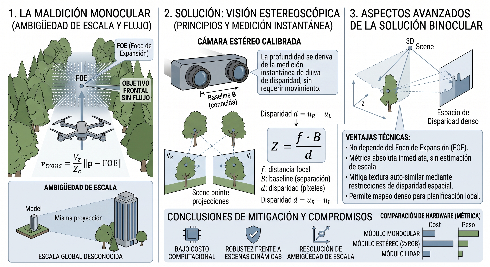

# Anexo 7: La "maldición monocular" en pasajes densamente obstruidos y mitigación con visión estereoscópica

Este anexo desarrolla, con mayor rigor que el que admite el cuerpo del capítulo de resultados
(§11.4.2b), el mecanismo físico por el cual la percepción monocular pura falla de forma
estructural — no incidental — en corredores densamente arbolados como `townsim_ini`, y evalúa la
visión estereoscópica como la mitigación de menor costo y mayor factibilidad de despliegue antes
de recurrir a sensores activos más caros (LiDAR, radar).

El razonamiento aquí presentado complementa, sin sustituir, los fundamentos matemáticos del
Anexo 5 (flujo óptico, FOE, TTC): mientras el Anexo 5 formaliza *cómo* el sistema estima
profundidad relativa a partir de una sola cámara, este anexo formaliza *por qué* esa estimación
colapsa estructuralmente en ciertas geometrías de escena, y qué alternativa de bajo costo resuelve
el colapso sin abandonar el principio de percepción pasiva declarado en §1.2.

## A7.1 La maldición monocular: dos componentes distintos

El término coloquial "maldición monocular" (*monocular curse*) agrupa dos limitaciones físicas
independientes de la reconstrucción de profundidad a partir de una única cámara. Es importante
separarlas porque tienen causas y mitigaciones distintas.

### A7.1.1 Ambigüedad de escala

Un sistema de estructura a partir del movimiento (*Structure from Motion*, SfM) o SLAM monocular
reconstruye la geometría de la escena **hasta un factor de escala desconocido**: a partir de una
secuencia de imágenes de una sola cámara no es posible distinguir, por ejemplo, un edificio grande
visto de lejos de una maqueta pequeña vista de cerca — ambas producen exactamente la misma
secuencia de proyecciones 2D salvo un factor de escala global. Para fijar esa escala se requiere
información externa: una unidad de medición inercial (IMU) integrada, el tamaño conocido de un
objeto en la escena, o un segundo punto de vista simultáneo.

### A7.1.2 Dependencia estructural del movimiento y flujo nulo en el eje de avance

El segundo componente es geométrico y no se resuelve con más cómputo ni mejor calibración: **sin
traslación no hay paralaje**, y el paralaje es la única fuente de información de profundidad de
una cámara monocular en movimiento (Anexo 5, §A5.2–§A5.4). Peor aún, el paralaje no es uniforme en
el campo visual: según la relación deducida en el Anexo 5,

$$\|v_{\text{trans}}(x,y)\| = \frac{V_z}{Z_c}\,\|p - \text{FOE}\|$$

la magnitud del flujo traslacional es **proporcional a la distancia del píxel al Foco de
Expansión (FOE)**. Los puntos que están sobre o cerca del FOE —es decir, los que están
*directamente adelante del vehículo, en la dirección exacta en que se necesita evidencia para
evitar una colisión frontal*— son estructuralmente los que producen menos señal, sin importar cuán
cerca estén. Esto no es un defecto del estimador de `flow_ttc.py`: es una propiedad de la
proyección perspectiva, presente en cualquier algoritmo de flujo óptico o SfM monocular.

> [!IMPORTANTE]
> La maldición monocular no es "el sensor da poca información en general" sino, más precisamente,
> "el sensor da información nula justo donde más se la necesita". Un obstáculo lateral que el dron
> bordea genera flujo grande y confiable; el mismo obstáculo, si está centrado en la trayectoria de
> aproximación, tiende asintóticamente a flujo cero a medida que el dron se acerca en línea recta.

---

## A7.2 Por qué un corredor arbolado es el caso adversarial por diseño

El escenario `townsim_ini` (cap. 11, §11.4.2b) — corredor peatonal recto, volado a z=−10 m, bajo la
copa de los árboles — combina ambos componentes de la maldición monocular con un tercer factor
agravante propio de la vegetación:

1. **Geometría del corredor → FOE sobre el obstáculo.** Un corredor recto y angosto flanqueado y
   techado por follaje fuerza a que el FOE nominal (centro de la imagen, para vuelo recto) caiga
   exactamente sobre la masa de vegetación que bloquea el paso. No es un obstáculo lateral que
   pueda esquivarse leyendo flujo periférico: es el obstáculo *en el eje de avance*, en la región de
   mínima señal por construcción geométrica (§A7.1.2).
2. **Textura auto-similar → problema de apertura agravado.** Ramas y hojas son, para un estimador
   de correspondencia por ventanas (Farnebäck o DIS; Anexo 5, §A5.7), prácticamente indistinguibles
   de sus vecinos inmediatos. El *aperture problem* clásico de flujo óptico —la imposibilidad de
   determinar la componente de movimiento paralela a un borde sin textura transversal— se agrava
   severamente en follaje denso, generando vectores de flujo ruidosos o directamente espurios
   incluso en regiones alejadas del FOE, degradando la confianza (`confidence`) de las celdas del
   `ObstacleField` (Anexo 5, §A5.6.1) en todo el campo, no solo en el centro.
3. **Follaje dinámico → violación de la hipótesis de escena estática.** El viento mueve ramas y
   hojas de forma incoherente con el movimiento propio del dron, introduciendo flujo espurio que
   ninguna derotación por IMU (Anexo 5, §A5.3) puede compensar, porque esa derotación asume
   explícitamente una escena rígida y estacionaria.

El resultado observado en §11.4.2b —0/5 en los tres brazos, deadlock crónico (`slm`: 20.2/corrida,
`fsm`: 24.0/corrida), sin una sola colisión— es consistente con este mecanismo: el sistema no
avanza porque no puede confiar en su propia percepción frontal, y no colisiona precisamente porque
esa falta de confianza lo mantiene en modo cauteloso. El `deep_vlm` resuelve el 100% de los
deadlocks individuales (repone evidencia puntual vía descripción semántica de la escena), pero la
tasa de generación de nuevos deadlocks excede la capacidad de avance neto — un régimen de
"deadlock crónico" que ningún ajuste del nodo deliberativo (Anexos 3 y 4) puede resolver, porque el
cuello de botella está en la capa de percepción, no en la de decisión.

### A7.2.1 ¿Ayudaría SLAM monocular disperso o semi-denso?

Es razonable preguntarse si integrar evidencia geométrica a lo largo de múltiples vistas —en vez de
depender de un par de frames instantáneo, como hace el flujo óptico— mitigaría el problema. Un
sistema de SLAM monocular disperso ([ORB-SLAM, Mur-Artal et al., 2015](../13-REFERENCIAS.md#ref-mur-artal-2015))
construye una estructura 3D persistente mediante *bundle adjustment*, lo que en principio permite
razonar sobre espacio libre acumulado en lugar de sobre la ambigüedad de un instante puntual, y
habilitaría detección de brechas (*gap detection*) sobre un mapa en vez de evasión puramente
reactiva.

Sin embargo, esta mitigación no es gratuita en el caso específico de follaje denso, por tres
razones que conviene declarar explícitamente para no sobrevender la propuesta como línea de trabajo
futuro:

- **Escena no estática.** El SLAM basado en *features* asume implícitamente un mundo rígido; ramas
  moviéndose con el viento violan esa hipótesis e inducen asociaciones de datos erróneas (*false
  loop closures*, matches entre ramas distintas con apariencia similar).
- **Geometría subpíxel.** Las ramas finas están por debajo de la resolución efectiva de un mapa de
  *landmarks* disperso: un SLAM disperso simplemente no las registra como *features* estables, y un
  SLAM denso las "promedia" con el fondo, perdiendo precisión justo en el tipo de obstáculo donde
  más importa (el caso típico, además, donde hasta un LiDAR de retorno único falla por escasez de
  puntos de impacto).
- **Costo computacional.** Un SLAM denso monocular con la robustez suficiente para compensar estos
  dos problemas (p. ej., de la familia de DROID-SLAM) es sustancialmente más pesado en cómputo que
  el flujo óptico clásico usado en este trabajo, lo cual entra en tensión directa con el objetivo
  de mantener el presupuesto de CPU compartido con el SLM (cap. 6, §6.1, punto 1).

La conclusión razonable no es descartar SLAM monocular como línea futura, sino ubicarlo como
mitigación de la ambigüedad de correspondencia frame-a-frame, no como solución al problema de fondo
del follaje dinámico y las estructuras subpíxel — que siguen siendo un caso límite conocido en la
literatura de SLAM visual, y no un problema exclusivo del enfoque de flujo óptico adoptado en este
trabajo.

---

## A7.3 Estéreo como mitigación directa de ambos componentes

Un par estéreo calibrado —dos cámaras RGB con *baseline* (separación) fija y conocida— resuelve los
dos componentes de la maldición monocular (§A7.1) simultáneamente, y lo hace a partir de un **único
instante**, sin depender de que el vehículo se mueva:

$$Z = \frac{f \cdot B}{d}$$

donde $f$ es la distancia focal, $B$ la línea de base entre cámaras y $d$ la disparidad (el
desplazamiento horizontal en píxeles del mismo punto físico entre ambas imágenes). Dado que $B$ es
conocida por construcción (a diferencia de la traslación del vehículo entre dos frames, que hay que
estimar o asumir), la profundidad $Z$ recuperada es **métrica**, sin el factor de escala
indeterminado de SfM/SLAM monocular (§A7.1.1) — resolviendo el primer componente de la maldición.

Sobre el segundo componente (§A7.1.2): la correspondencia estéreo es **espacial y simultánea**
(misma toma, dos cámaras) en lugar de **temporal** (dos instantes de la misma cámara). Esto tiene
una consecuencia directa y favorable para el caso de `townsim_ini`:

- La disparidad de un obstáculo centrado en la trayectoria de vuelo **no depende de su posición
  respecto de ningún FOE** — la disparidad es función de la distancia $Z$ y la geometría fija del
  par estéreo, no de hacia dónde se mueve el vehículo. El obstáculo *directamente adelante*, que es
  el caso de flujo nulo en monocular (§A7.1.2), es exactamente igual de medible en estéreo que un
  obstáculo lateral.
- Al no requerir correspondencia entre instantes distintos, el estéreo es menos frágil frente a
  escena dinámica: ramas moviéndose con el viento entre el momento de captura de la cámara
  izquierda y la derecha (disparo sincronizado) no introducen el mismo tipo de error que el
  flujo óptico acumulado entre dos frames separados por $\Delta t$ (Anexo 5, §A5.3.3).

La textura repetitiva del follaje (§A7.2, punto 2) **no desaparece** en estéreo —la ambigüedad de
correspondencia lateral entre las dos vistas sigue siendo un desafío—, pero es en general un
problema menos frágil que en flujo óptico, porque no depende de que exista movimiento suficiente
del vehículo para generar paralaje utilizable: la línea de base está siempre presente, sea que el
dron esté en hover, girando o avanzando lentamente. Esto es relevante porque el régimen de "cautela
extrema → movimiento mínimo → menos evidencia" descrito en §11.4.2b (el ciclo de retroalimentación
negativa que agrava el deadlock crónico) deja de aplicar: el par estéreo entrega profundidad
métrica incluso cuando el vehículo está casi detenido.

---

## A7.4 Costo/beneficio frente a LiDAR emulado (PlanarDepth) y factibilidad en AirSim

La arquitectura de este trabajo excluye deliberadamente sensores activos pesados o costosos por
principio de diseño (§1.2; Anexo 5, introducción). Frente a esa restricción, un LiDAR simulado
(p. ej. el sensor `DepthPlanar` de Cosys-AirSim) sería el "sensor ideal" pero representa un salto
de hardware que la mayoría de los UAVs urbanos pequeños de la clase objetivo de este trabajo no
llevan, y cuyo costo, peso y consumo energético son órdenes de magnitud mayores que los de una
segunda cámara RGB.

Un par estéreo es la opción intermedia razonable: mucho más barato y liviano que un LiDAR real, y
trivialmente emulable en AirSim agregando una segunda cámara RGB en `settings.json` con un offset
fijo conocido en el eje $X$ o $Y$ del cuerpo del dron (baseline conocida por construcción, sin
necesidad de calibración extrínseca adicional en simulación). El procesamiento estándar sería:

1. Rectificación estéreo (alinear ambas imágenes a un plano epipolar común).
2. Matching de disparidad — como línea de base clásica, `cv2.StereoSGBM` (OpenCV), con la opción de
   escalar a un método basado en aprendizaje (p. ej. de la familia RAFT-Stereo) si se requiere mayor
   precisión y el presupuesto de cómputo lo permite.
3. Conversión de disparidad a profundidad métrica vía $Z = f B / d$, alimentando el mismo contrato
   `ObstacleField` (Anexo 5, §A5.6) ya consumido por el router de política (cap. 8) y el SLM, sin
   necesidad de rediseñar la interfaz entre percepción y decisión.

**Nota metodológica para una futura implementación:** si se incorpora este canal, la profundidad
debe derivarse del *matching* estéreo real (con su ruido de correspondencia y sus errores en zonas
de textura ambigua) y no leerse directamente del `DepthPlanar` de ground truth que AirSim provee
para otros propósitos de depuración. Usar el ground truth directamente compararía el sistema contra
un LiDAR ideal en lugar de contra el estéreo real que se busca evaluar, invalidando la comparación
de costo/beneficio que motiva la propuesta.

---

## A7.5 Ningún sensor es inmune al follaje denso: límites del estéreo y también del LiDAR

Es importante no presentar el estéreo como una "bala de plata" que resuelve el caso `townsim_ini`
sin costo residual. El follaje denso es un escenario adversarial *per se*, no solo para la cámara
monocular: degrada, por razones físicas distintas en cada caso, tanto al estéreo propuesto en este
anexo como al LiDAR que la arquitectura de este trabajo excluye por principio de diseño (§1.2). Vale
la pena declarar ambos límites explícitamente, porque cambian la expectativa razonable de lo que
"agregar un sensor mejor" resolvería en un corredor arbolado.

### A7.5.1 Por qué el estéreo también puede fallar en `townsim_ini`

- **El rango útil depende linealmente de la línea de base.** En un UAV pequeño, la baseline física
  disponible entre dos cámaras es corta (típicamente centímetros), y el error de profundidad
  estimada **crece con el cuadrado de la distancia** ($\sigma_Z \propto Z^2 / (f B)$, derivable por
  propagación de error de la ecuación de disparidad de §A7.3). A las velocidades de crucero típicas
  de este trabajo, el horizonte de detección confiable puede resultar corto en comparación con un
  LiDAR de rango largo — precisamente en un corredor donde la evasión temprana importa.
- **Ambigüedad de correspondencia lateral persiste en follaje.** El matching estéreo no depende del
  FOE (§A7.3), pero sigue dependiendo de encontrar correspondencias únicas entre las dos vistas.
  Sobre textura repetitiva y auto-similar como ramas y hojas, múltiples parches de la imagen
  izquierda son plausiblemente compatibles con múltiples parches de la derecha: el problema de
  apertura de flujo óptico (§A7.2, punto 2) reaparece en estéreo como ambigüedad de disparidad,
  produciendo mapas de profundidad ruidosos o con "picos" espurios en zonas de vegetación densa,
  incluso con un algoritmo de matching robusto.
- **Oclusiones diferenciales.** Ramas muy finas pueden ser visibles desde una cámara del par y
  quedar ocultas desde la otra (por paralaje entre los dos puntos de vista), generando huecos o
  errores locales de matching en exactamente el tipo de obstáculo delgado que ya es difícil para
  cualquier sensor de este trabajo (Anexo 5, §A5.6.2). Cuanto más denso el follaje, más frecuentes
  estas oclusiones — el mismo factor que ayuda al estéreo (baseline fija, sin depender de FOE) es
  el que introduce este modo de falla propio, ausente en monocular.

### A7.5.2 Por qué un LiDAR tampoco resolvería `townsim_ini` sin matices

Aunque fuera de alcance por diseño (§1.2), vale la pena precisar por qué un LiDAR real —el "sensor
ideal" de referencia en §A7.4— no es una solución automática al mismo escenario, para no dejar la
impresión de que cualquier sensor activo lo resolvería trivialmente:

- **Geometría subpíxel y retornos escasos.** Las ramas finas tienen una sección transversal menor
  que la divergencia del haz láser a distancias de varios metros; el pulso puede no intersectar
  ninguna rama, o intersectar el borde de una, generando retornos débiles o ausentes. Este es el
  mismo problema mencionado en §A7.2 para SLAM denso: la estructura fina de la vegetación está, en
  buena medida, *por debajo de la resolución efectiva* de cualquier sensor de barrido disperso, no
  solo del monocular.
- **Retornos múltiples y "mixed pixels".** Un solo pulso de LiDAR puede atravesar parcialmente el
  follaje y golpear más de una superficie (una hoja cercana y una rama más lejana en la misma
  línea de vista), produciendo un retorno mezclado cuya distancia reportada no corresponde
  limpiamente a ningún obstáculo real — un problema bien documentado en escaneo LiDAR forestal y
  de vegetación urbana.
- **Reflectividad baja y variable.** Las hojas tienen reflectividad óptica baja y anisótropa (varía
  con el ángulo de incidencia y la humedad de la superficie), lo que reduce la relación
  señal-ruido de los retornos y puede dejar zonas del follaje sin cobertura efectiva de puntos,
  incluso dentro del rango nominal del sensor.
- **El costo real no es solo económico.** Incluso si el LiDAR "viera" más geometría que el estéreo
  en este escenario, la nube de puntos resultante en vegetación densa suele ser rala y ruidosa
  precisamente donde más importa (el eje de avance), por lo que la mejora práctica sobre el modo
  de falla de `townsim_ini` es menor de lo que su costo, peso y consumo energético (§A7.4)
  sugerirían a priori.

> [!IMPORTANTE]
> La conclusión no es que ningún sensor ayude, sino que el follaje denso es un caso límite que
> degrada a *toda* la familia de sensores de rango (monocular, estéreo, LiDAR), cada uno por un
> mecanismo físico distinto. El estéreo sigue siendo la mejora de menor costo y mayor impacto
> marginal para el modo de falla específico identificado en §A7.2 (flujo nulo cerca del FOE), no
> porque sea inmune al follaje, sino porque elimina selectivamente la causa dominante del fracaso
> monocular sin heredar todas las limitaciones de un LiDAR en el mismo entorno.

---

## A7.6 Síntesis y ubicación en el trabajo futuro

La visión estereoscópica resuelve de forma directa y con bajo costo computacional los dos
componentes formales de la maldición monocular (§A7.1): fija la escala métrica sin depender de IMU
ni de referencias externas, y elimina la dependencia del flujo respecto de la posición del FOE, que
es precisamente el mecanismo identificado en §A7.2 como causa estructural del fracaso en
`townsim_ini` (cap. 11, §11.4.2b). Es, además, más fácil de justificar como próximo paso concreto
que un LiDAR emulado, porque emula una limitación de hardware real y económicamente accesible (un
segundo sensor RGB de bajo costo) en lugar de saltar directamente a una clase de sensor que la
mayoría de los UAVs urbanos pequeños de este dominio de aplicación no incorpora.

En la jerarquía de mejoras de percepción de este trabajo (cap. 12, §12.4), el estéreo se propone
como el **paso intermedio natural**: menor costo de implementación y de hardware que un SLAM
monocular semi-denso o un LiDAR real, y con un impacto directo sobre el modo de falla documentado
en corredores arbolados. El SLAM monocular (§A7.2.1) queda como una línea posterior, complementaria
y no sustitutiva, útil si además del canal de profundidad instantánea que aporta el estéreo se
requiere robustez de localización y mapeo ante escena dinámica extendida en el tiempo.
