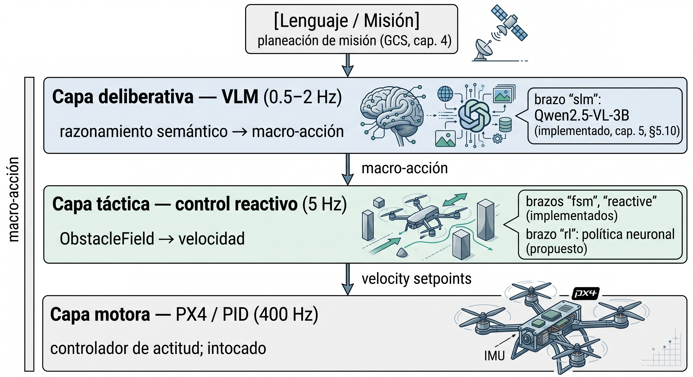
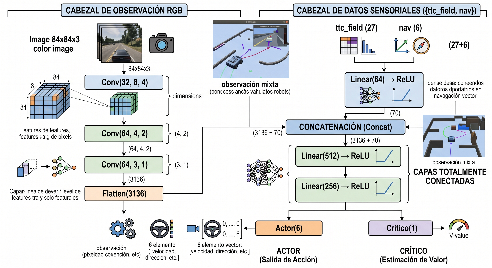

# Anexo 8: Política de Navegación Visual por Aprendizaje por Refuerzo — Diseño Propuesto como Cuarto Brazo

Este anexo desarrolla el diseño técnico de un cuarto brazo de comparación experimental
(`rl`) basado en **aprendizaje por refuerzo visual (*Reinforcement Learning*, RL)**,
propuesto como trabajo futuro en §12.4. El brazo `rl` no está implementado en el sistema
evaluado en el capítulo 11; este anexo especifica su arquitectura, espacio de
observaciones y acciones, función de recompensa, protocolo de entrenamiento y posición en
el conjunto de hipótesis experimentales de la tesis, de forma que sirva como base técnica
para la etapa de implementación.

El planteamiento es complementario — no alternativo — a los avances del Anexo 3 (LoRA) y
del Anexo 4 (gramáticas restringidas): mientras esos dos anexos proponen especializar la
capa deliberativa existente (VLM), el brazo `rl` propone reemplazar la capa táctica
completa por una política neuronal entrenada por interacción directa con el entorno, en el
mismo nivel de abstracción que ocupa actualmente `evasive_node` + `reactive_node`.

---

## A8.1 Posición en la arquitectura jerárquica

El sistema implementado en esta tesis opera en tres capas de abstracción temporal
diferenciada:



El brazo `rl` ocupa la **capa táctica**: recibe el frame RGB actual, el `ObstacleField`
producido por `FlowTTCEstimator` y la telemetría de guiado (`waypoint_guidance`), y
produce directamente una macro-acción del mismo vocabulario que usan `fsm_node` y
`evasive_node`. La capa deliberativa (VLM) sigue activa en modo jerárquico: puede inyectar
waypoints de desvío (`inject_corner`) o llamar a `slam_assess` ante atascos duros, igual
que con los brazos existentes.

Esta posición garantiza que la comparación de los cuatro brazos (`reactive`, `fsm`, `slm`,
`rl`) mida exclusivamente **quién elige mejor la táctica**, no quién tiene mejor lógica de
seguridad ni mejor infraestructura de actuación, ya que los cuatro comparten:

- El mismo `ObstacleField` como entrada perceptual.
- El mismo `action_to_command()` como traductor a cinemática.
- Las mismas salvaguardas de `motor_node` (corrección de altitud, target_yaw).
- El mismo `WaypointTracker` para el guiado a waypoints.

---

## A8.2 Espacio de observaciones

Se propone un espacio de observación de tres componentes, idénticos a los que ya produce el
lazo en cada ciclo (sin nuevos sensores):

```python
obs = {
    "rgb":      np.ndarray,   # shape (H, W, 3) — frame RGB del ciclo actual
    "ttc_field": np.ndarray,  # shape (3, 3, 3) — ObstacleField: [ttc, occ, conf] × 9 celdas
    "nav":      np.ndarray,   # shape (6,) — [dist_wp, bearing_err, vx, vy, vz, alt]
}
```

**`rgb` (entrada visual).** El mismo frame que `capture_node` ya produce. Para el
entrenamiento se escala a 84 × 84 px, suficiente para que una CNN pequeña extraiga
patrones de textura y borde sin el costo de resolución completa. Se puede extender a
`frame_history` (dos frames consecutivos, igual que el VLM) para que la política infiera
dirección de movimiento.

**`ttc_field` (campo de obstáculos serializado).** El `ObstacleField` se serializa como un
tensor 3×3×3: para cada celda de la grilla, los tres valores son TTC, ocupación y
confianza. Esta representación preserva la estructura espacial del campo sin exponer al
modelo los internos del estimador de flujo óptico. La política aprende implícitamente el
significado de cada componente durante el entrenamiento, igual que el VLM lo aprende del
texto de `summary_text()`.

**`nav` (estado de guiado).** Distancia al waypoint activo, error de rumbo (`bearing_err_deg`),
velocidades actuales y altitud. Estos seis escalares proporcionan el contexto cinemático
necesario para que la política distinga "atascado contra obstáculo frontal" de "girando
hacia el waypoint".

**Opción B — end-to-end puro.** Una alternativa más ajustada al objetivo de bajo costo de
sensor es usar solo `rgb` como observación. Es más difícil de entrenar (la política debe
aprender implícitamente el TTC y la geometría de obstáculos), pero produce un sistema sin
dependencia del estimador de flujo óptico — relevante si se quiere transferir a un drone
real donde la calibración del flujo es incierta.

---

## A8.3 Espacio de acciones

Se propone un espacio discreto de seis acciones, alineado con `PROMPT_ACTIONS` del nodo
deliberativo (§8.3, §5.14):

| Índice | Macro-acción | Semántica |
|---|---|---|
| 0 | `MANTENER_RUMBO` | Avanzar hacia el waypoint activo |
| 1 | `EVADIR_IZQUIERDA` | Evasión lateral izquierda |
| 2 | `EVADIR_DERECHA` | Evasión lateral derecha |
| 3 | `GANAR_ALTURA` | Ascender para sobrevolar obstáculo |
| 4 | `PERDER_ALTURA` | Descender con avance lento |
| 5 | `FRENAR` | Detener el drone (hover) |

La traducción a comandos cinemáticos es idéntica a la de los brazos existentes
(`action_to_command()`, §5.14): la política neuronal nunca genera velocidades directamente,
lo que garantiza que las maniobras elegidas sean físicamente seguras y respeten las mismas
saturaciones y convenciones de Body Frame que los brazos `fsm` y `slm`.

**Espacio continuo (extensión futura).** Una vez que el brazo discreto haya convergido, se
puede reemplazar el cabezal de política por un `Box(low=-1, high=1, shape=(4,))`
correspondiente a $[v_x, v_y, v_z, \dot\psi]$ normalizados. El espacio continuo permite
maniobras más suaves y eficientes, pero requiere guardar los límites cinemáticos como
restricciones en la función de recompensa o como proyección post-acción.

---

## A8.4 Función de recompensa

La función de recompensa combina cuatro términos con signos y pesos diferenciados:

$$r_t = w_{\text{prog}} \cdot \Delta d_t + w_{\text{col}} \cdot c_t + w_{\text{near}} \cdot n_t + w_{\text{arr}} \cdot a_t - w_{\text{time}} \cdot \Delta t$$

donde:

- $\Delta d_t = d_{t-1} - d_t$ es la reducción de distancia al waypoint activo en el ciclo
  $t$ (positivo = progreso, negativo = retroceso).

- $c_t \in \{0, -1\}$: penalidad dura de colisión. Se activa cuando `telemetry["collision"]
  = True` (flag de AirSim). Domina sobre todos los demás términos para que la primera
  prioridad aprendida sea la evitación de obstáculos.

- $n_t = -\text{clip}(1/\text{TTC}_{\min} - 1/T_{\text{safe}},\, 0,\, 1)$: penalidad suave
  de proximidad, proporcional al exceso de peligro por encima del umbral `TTC_SAFE_THRESHOLD
  = 4.6 s`. Permite al agente aprender gradaciones de riesgo sin esperar la colisión.

- $a_t \in \{0, +1\}$: bonificación esparsa de llegada al waypoint activo
  (`waypoint_guidance["is_completed"] = True`).

- $\Delta t$: penalidad de tiempo (eficiencia). Evita que el agente aprenda a hovear
  indefinidamente cerca de los waypoints para acumular señal de proximidad sin avanzar.

**Currículo de entrenamiento.** Se recomienda iniciar con $w_{\text{col}} \gg w_{\text{prog}}
\gg w_{\text{near}}$ para que la política aprenda primero a no colisionar (comportamiento
de seguridad mínimo); una vez que la tasa de colisión caiga por debajo del 20 % en el
escenario de entrenamiento, se aumenta gradualmente $w_{\text{prog}}$ para impulsar el
comportamiento de avance. La secuencia de escenarios sigue el orden de dificultad de la
tesis: Tier 0 → Tier 1 → Tier 2.

---

## A8.5 Algoritmo de entrenamiento

Se propone **PPO** (*Proximal Policy Optimization*, [Schulman et al., 2017]) como algoritmo
primario, implementado vía **Stable-Baselines3** ([Raffin et al., 2021]).

### Justificación de la elección

| Algoritmo | Tipo | Ventaja | Limitación |
|---|---|---|---|
| **PPO** (recomendado) | On-policy | Estable en entornos con dinámica compleja; buen comportamiento en AirSim según Swift ([Kaufmann et al., 2023](#ref-kaufmann-2023)) | Mayor costo de muestras que off-policy |
| SAC | Off-policy | Mayor eficiencia de muestras; apropiado para espacio continuo | Requiere ajuste fino de temperatura de entropía |
| DQN | Off-policy (discreto) | Línea base rápida; bajo costo de implementación | Sin soporte nativo para observaciones imagen + vector |

PPO es el algoritmo que usa el sistema **Swift** de la Universidad de Zúrich
([Kaufmann et al., 2023](#ref-kaufmann-2023)) para control de drones de carreras; en ese
trabajo, una política PPO entrenada en AirSim superó en tiempo de vuelta a pilotos humanos
campeones del mundo. Es el antecedente más directo en nivel de maniobra y en uso del mismo
simulador. La convergencia on-policy es más predecible, lo que simplifica la interpretación
de los resultados en un contexto de tesis.

**Advertencia sobre generalización.** El resultado de Swift ilustra tanto el potencial como
el límite central del enfoque RL en robótica aérea: la política fue entrenada y evaluada en
el circuito de carreras de Zúrich —geometría fija, velocidades máximas constantes, ausencia
de obstáculos imprevistos— y no puede transferirse directamente a un entorno diferente sin
reentrenamiento completo. Cambiar el trazado del circuito o la dinámica del dron degrada la
tasa de éxito hasta el nivel de aleatoriedad. Este fenómeno de *overfitting* a la
distribución de entrenamiento es estructural en RL, no un artefacto del método.

Para el brazo `rl` de esta tesis, el riesgo de especialización excesiva se mitiga
parcialmente por tres decisiones de diseño:

1. **Espacio de acciones discretas sobre macro-acciones**: en lugar de generar velocidades
   directamente (como hace Swift), la política elige entre las seis macro-acciones ya
   validadas en los brazos `fsm` y `reactive`. Esto reduce el espacio de comportamientos
   "incorrectos" aprendibles a aquellos que el sistema ya sabe ejecutar con seguridad.

2. **Currículo de escenarios por Tier**: el agente se expone a tres niveles de dificultad
   (Tier 0 → 1 → 2) y cinco mapas diferentes durante el entrenamiento, forzando
   generalización a geometrías urbanas variadas en lugar de memorizar un circuito.

3. **Capa deliberativa activa**: cuando la política RL entra en un estado no representado
   en el entrenamiento (alta entropía de acción, múltiples ciclos de `FRENAR`), el nodo
   deliberativo puede invocar `slam_assess` para recuperar el control, igual que con los
   brazos `fsm` y `reactive`. Esto limita la región de fallo catastrófico de la política
   neuronal.

La validación en escenarios no vistos durante el entrenamiento —especialmente
`citymap_pilot`— es la prueba empírica más directa de generalización, y su resultado es
una de las incógnitas clave del protocolo de evaluación de §A8.6.

### Arquitectura de la política

Para la observación mixta `{rgb, ttc_field, nav}` se propone una política de dos cabezales paralelos:



La rama CNN extrae características visuales del frame RGB. La rama FC procesa el campo de obstáculos serializado y el estado de guiado. La concatenación en el cuello de botella fuerza la política a integrar información visual y geométrica antes de tomar la decisión. Esta arquitectura es directamente compatible con `CnnPolicy` de Stable-Baselines3 cuando se define el espacio de observación como `gym.spaces.Dict`.

---

## A8.6 Protocolo de evaluación comparativa

El brazo `rl`, una vez entrenado, debe evaluarse bajo exactamente el mismo protocolo que
los brazos `slm`, `fsm` y `reactive` (cap. 10, §10.2), para que la comparación sea válida:

```
K=5 semillas × 3 escenarios × 4 brazos = 60 corridas
```

Los escenarios propuestos para la evaluación del brazo `rl` son los mismos cinco de la
tesis (§10.1):

| Escenario | Tier | Tipo |
|---|---|---|
| `minisim_clear` | 0 | Tránsito libre |
| `townsim_clear` | 1 | Tránsito libre |
| `citysim_clear` | 2 | Tránsito libre |
| `townsim_ini` | 1 | Obstrucción densa (corredor arbolado) |
| `citymap_pilot` | 2 | Obstrucción estructural (autopista elevada) |

Las métricas son las mismas que §10.3 (`success_rate`, `mission_time_s`, `collision_rate`,
`waypoints_reached`, `deliberative_rate`) más dos métricas específicas del brazo `rl`:

- `policy_latency_ms`: tiempo de inferencia de la política neuronal (objetivo < 5 ms en
  CPU, < 1 ms en GPU dedicada).
- `training_steps_to_convergence`: número de pasos PPO hasta superar el criterio de éxito
  mínimo de R1 (tasa de llegada > 50 % en `minisim_clear`).

La tabla de comparación propuesta para el capítulo 11 sería:

| Métrica | `reactive` | `fsm` | `slm` | `rl` |
|---|---|---|---|---|
| Tasa de éxito — tránsito libre | ref | ref | ref | ? |
| Tasa de éxito — obstrucción densa | ref | ref | ref | ? |
| Ratio tiempo vs. `reactive` | 1.0× | ? | 1.06–2.20× | ? |
| Latencia de decisión | ~0.1 ms | ~0.2 ms | 850–1400 ms | < 5 ms (estimado) |
| Consumo adicional de VRAM | — | — | ~2 GB | < 50 MB (CNN pequeña) |

La hipótesis de trabajo es que el brazo `rl` superará al brazo `reactive` en escenarios de
obstrucción densa (`townsim_ini`) donde el flujo óptico colapsa — porque la política
neuronal puede aprender a actuar con observación visual directa, sin depender de la
divergencia del flujo — y competirá con `fsm` en tránsito libre, donde la política debería
aprender a elegir `MANTENER_RUMBO` de forma casi perfecta. Su comparación más relevante
para la tesis es contra el brazo `slm`: ambos usan visión directa, pero `slm` es una
inferencia de VLM pre-entrenado de propósito general mientras que `rl` es una política
especializada en el espacio de maniobras de este sistema.

---

## A8.7 Dependencias y prerrequisitos

La implementación del brazo `rl` tiene las siguientes dependencias sobre el trabajo ya
realizado:

- **S6 completado** (PLAN-SLAM): la corrida comparativa `slm` vs. `fsm` vs. `reactive`
  debe tener resultados estables antes de agregar un cuarto brazo, para que la comparación
  tenga una línea base válida.
- **Brazo `slm` validado** con `DEADLOCK_STRATEGY=slam_assess`: la política RL se entrenará
  en el mismo entorno de simulación en el que se midió el `slm`; si ese entorno cambia
  durante el entrenamiento, los resultados no son comparables.

Las dependencias de software son mínimas (sobre el entorno conda `airsimenv` existente):

```bash
pip install stable-baselines3[extra]   # PPO, SAC, DQN + tensorboard
pip install gymnasium                  # gym API moderna (reemplaza gym)
pip install sb3-contrib                # TQC, RecurrentPPO si se necesitan
```

El entrenamiento puede ejecutarse en la misma máquina de desarrollo (RTX 5060, 8 GB VRAM),
ya que el brazo `rl` no requiere inferencia de VLM durante el entrenamiento. El presupuesto
estimado de VRAM para PPO con la arquitectura CNN propuesta (§A8.5) es < 2 GB, compatible
con AirSim corriendo en paralelo.

---

*Las referencias citadas en este anexo corresponden a las entradas del §13 del presente
informe. La evaluación cuantitativa del brazo `rl` y su comparación con los tres brazos
implementados forma parte del trabajo futuro descrito en §12.4.*
