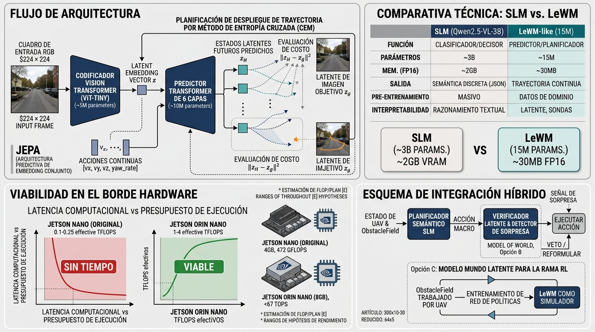

# Anexo 9: Modelos de Mundo Latentes (LeWorldModel) como Alternativa al SLM — Trade-offs y Viabilidad en Hardware Edge

Este anexo analiza, como línea de trabajo futuro (§12.4), la sustitución —total o parcial— del modelo de lenguaje visivo (Qwen2.5-VL-3B-Instruct, cap. 8) por un **modelo de mundo latente** del tipo *Joint-Embedding Predictive Architecture* (JEPA), tomando como caso de estudio **LeWorldModel** (LeWM; [Maes et al., 2026](../13-REFERENCIAS.md#ref-maes-2026)). El objetivo es doble: (i) determinar qué aportaría y qué perdería el sistema frente al brazo deliberativo `slm`, y (ii) estimar la viabilidad de ejecutar inferencia y planificación en una *companion computer* como la contemplada en el plan de tesis (NVIDIA Jetson Nano / Orin).

**Alcance y convención de rigor.** Nada de lo aquí descrito está implementado ni medido en el sistema evaluado en el capítulo 11. Las cifras se rotulan según su origen:

- **[P]** — reportada por el paper de LeWM u otra fuente citada.
- **[E]** — estimación analítica del autor (orden de magnitud, con supuestos explícitos); **no es una medición** y debe reemplazarse por el protocolo de §A9.7.
- **[T]** — medida en esta tesis (capítulos 8–11).

---

## A9.1 Qué es LeWorldModel

Los modelos de mundo aprenden cómo cambia el entorno en función de las acciones del agente y permiten planificar "en imaginación" ([Ha & Schmidhuber, 2018](../13-REFERENCIAS.md#ref-ha-2018); [Hafner et al., 2020](../13-REFERENCIAS.md#ref-hafner-2020)). La familia JEPA ([LeCun, 2022](../13-REFERENCIAS.md#ref-lecun-2022); [Assran et al., 2023](../13-REFERENCIAS.md#ref-assran-2023); [Assran et al., 2025](../13-REFERENCIAS.md#ref-assran-2025)) evita predecir píxeles: predice la **representación** (embedding) del siguiente estado, lo que descarta detalle irrelevante y abarata la predicción. Su dificultad histórica es el *colapso de representación*; los trabajos previos lo resolvían con encoders congelados preentrenados ([DINO-WM, Zhou et al., 2025](../13-REFERENCIAS.md#ref-zhou-g-2025)) o con objetivos de muchos términos ([PLDM, Sobal et al., 2025](../13-REFERENCIAS.md#ref-sobal-2025)).

LeWM ([Maes et al., 2026](../13-REFERENCIAS.md#ref-maes-2026), publicado en marzo de 2026 con Y. LeCun entre sus autores) es, según sus autores, el primer JEPA que entrena de forma estable de extremo a extremo desde píxeles con solo dos términos de pérdida: predicción del siguiente embedding más el regularizador SIGReg, que empuja los embeddings hacia una gaussiana isotrópica ([Balestriero & LeCun, 2025](../13-REFERENCIAS.md#ref-balestriero-2025)).

| Aspecto | Valor reportado [P] |
|---|---|
| Parámetros totales | ~15 M (encoder ~5 M + predictor ~10 M) |
| Encoder | ViT-Tiny, patch 14, 12 capas, dimensión oculta 192; embedding = token `[CLS]` proyectado (192 dim) |
| Predictor | Transformer de 6 capas, 16 cabezas; acciones inyectadas por AdaLN; historial de N embeddings con máscara causal |
| Entrada visual | Frames RGB de 224 × 224 |
| Planificación | Minimización del costo terminal `‖z_H − z_g‖²` por CEM con MPC; 300 secuencias candidatas, 10–30 iteraciones, horizonte H = 5 (frameskip 5) |
| Tiempo de planificación | 0,98 s por plan vs. 47 s de DINO-WM (hasta 48× más rápido), promedio sobre 50 corridas |
| Entrenamiento | Una GPU, pocas horas |
| Entornos evaluados | Push-T, Reacher, OGBench-Cube, Two-Room (2D y manipulación 3D simple) |

El paper también reporta que el espacio latente codifica cantidades físicas recuperables por *probing* lineal y que un test de violación de expectativa detecta trayectorias físicamente implausibles. Entre las **limitaciones declaradas** por los autores: horizontes de planificación cortos, dependencia de datasets *offline* con cobertura suficiente (con baja diversidad SIGReg se debilita) y dependencia de etiquetas de acción.

**Trabajos de contexto aéreo.** El antecedente más cercano al dominio de esta tesis es SkyJEPA ([Rao et al., 2026](../13-REFERENCIAS.md#ref-rao-2026)), que aplica un modelo de dinámica latente de estilo JEPA al control de cuadrirrotores con transferencia *sim-to-real* y optimización por muestreo en hardware embebido; según su resumen opera sobre **estado**, no sobre imágenes, por lo que no valida el caso visual monocular. En navegación con imagen objetivo, [Chahe et al. (2026)](../13-REFERENCIAS.md#ref-chahe-2026) muestran que el costo de planificación en el espacio latente requiere diseño explícito (monotonía respecto del progreso). No se realizó un relevamiento exhaustivo de esta literatura, muy activa en 2026.

---

## A9.2 Qué cambiaría en el sistema: SLM vs. modelo de mundo latente

El VLM del sistema es un **perceptor semántico de escala de segundos**: recibe un fotograma (con una grilla de 3×3 dibujada o, en un deadlock, cuatro imágenes de un barrido) y describe qué direcciones son volables; el código traduce esa descripción a una sub-meta en coordenadas del mundo (cap. 5, §5.10), con una latencia de 1,5 a 5,6 s de mediana según la configuración sobre la RTX 5060 [T] (cap. 8, §8.6). Un modelo de mundo latente es un **predictor de consecuencias**: no decide por sí mismo; permite evaluar secuencias de acciones candidatas y elegir la de menor costo. No son sustitutos directos, sino componentes de naturaleza distinta.

| Dimensión | SLM/VLM (Qwen2.5-VL-3B, §8) | LeWM-like (15 M) |
|---|---|---|
| Función | Clasifica la situación y elige macro-acción | Predice el embedding futuro dada una secuencia de acciones; el plan surge de optimizar |
| Salida | JSON discreto (5 macro-acciones) | Secuencia continua de acciones (p. ej., `vx, vy, vz, yaw_rate`) |
| Conocimiento previo | Preentrenamiento masivo (sentido común, semántica urbana) | Ninguno: aprende solo de los datos de dominio |
| Especificación del objetivo | Lenguaje natural / waypoints en el prompt | Imagen objetivo (o función de costo sobre el latente) |
| Datos requeridos | Ninguno (*zero-shot*) o dataset de maniobras para LoRA (Anexo 3) | Trayectorias (imagen, acción) offline con buena cobertura |
| Parámetros | ~3 B | ~15 M (≈200× menos) |
| Huella de memoria | ~2,0 GB (Q4_K_M) [T] | ~30 MB en FP16 [E] |
| Interpretabilidad | Texto (`reason`) auditable; la auditoría de contratos del cap. 9 se apoya en ello | Latente opaco; requiere *probes* para inspeccionarlo |
| Modo de falla característico | Alucinación, JSON inválido, *timeout* del watchdog (cap. 9) | Deriva de rollouts a horizonte largo, fuera de distribución, costo latente mal condicionado |
| Latencia por decisión | 1,2–4,6 s (mediana 1,46 s) en RTX 5060; ~10–11 s con imagen en depuración [T] | ~1 s en el paper con 300 × 10–30 iteraciones [P]; reducible (§A9.5) |

El SLM aporta exactamente aquello que el modelo de mundo no tiene (semántica y razonamiento global entre corredores ambiguos: régimen 2 del cap. 12, `citymap_pilot`), mientras que el modelo de mundo aporta lo que el SLM no tiene: **predicción explícita de consecuencias de acciones continuas a bajo costo**, útil justamente en el régimen 3 (obstrucción frontal con escape lateral accesible), donde el SLM perdía por latencia.

---

## A9.3 Brechas de aplicabilidad al problema del dron

1. **Objetivo por imagen.** El costo de LeWM es `‖z_H − z_g‖²` con `z_g = enc(o_g)`. La misión del dron se especifica por waypoints, no por imágenes. En simulación es posible renderizar una vista objetivo por waypoint, pero en un vuelo real no existe esa imagen. Alternativa propuesta: entrenar *probes* livianos sobre el latente para obtener cantidades ya usadas por el sistema (ocupación/TTC del `ObstacleField`, distancia a obstáculo, rumbo relativo al waypoint) y definir el costo sobre ellas; el paper reporta que el latente admite *probing* de cantidades físicas en sus entornos [P], pero no en escenas urbanas aéreas.
2. **Horizonte corto.** H = 5 pasos de predictor [P]. Con el lazo táctico a `LOOP_HZ = 5` [T], si cada paso del predictor equivale a un ciclo (200 ms), el horizonte es ~1 s: escaso para evasión a velocidad de crucero. Si cada paso agrupa varios ciclos (como el frameskip del paper), el horizonte se alarga pero se pierde resolución de control. Es un parámetro de diseño, no una constante.
3. **Dominio y datos.** Los resultados de LeWM son en tareas 2D/3D simples con datasets cuidadosamente recolectados [P]. Escenas urbanas 3D con vegetación, tráfico y multitud (Tiers 1–2, cap. 3) son de complejidad visual muy superior, y los propios autores señalan que la baja diversidad de datos degrada SIGReg [P]. El sistema podría generar datos en AirSim de forma barata, pero **la cobertura de casos de colisión** (raros por construcción) es el cuello de botella real.
4. **Etiquetas de acción y dinámica.** El predictor condiciona en acciones; para el dron habría que fijar qué representa la acción (velocidad comandada vs. macro-acción) y cómo se trata el retardo de actuación/autopiloto, que el paper no aborda.
5. **Sin semántica ni razonamiento global.** Un modelo de 15 M entrenado solo con datos de vuelo no distingue "corredor de servicio" de "autopista elevada" salvo que esa distinción esté visualmente y estadísticamente presente en los datos. Es el régimen donde el VLM mostró valor (H1, `citymap_pilot`).
6. **Seguridad y verificabilidad.** La optimización por CEM es estocástica y sin garantías de optimalidad global [P]. Cualquier integración debe conservar las salvaguardas determinísticas del sistema (`motor_node`, guardas de altitud, `DEPTH_EMERGENCY`).
7. **Costo de reentrenamiento.** Un cambio de cámara, altura de vuelo o escena exige reentrenar o ajustar el modelo; el SLM *zero-shot* es más robusto a ese cambio, aunque más lento.

---

## A9.4 Tres formas de incorporarlo

**Opción A — Reemplazo del SLM (no recomendada).** Sustituir la capa deliberativa por un planificador LeWM-like. Elimina la semántica (§A9.3, punto 5), exige resolver el objetivo por imagen y pierde la auditabilidad textual del cap. 9. Solo se justificaría si el objetivo fuera exclusivamente evasión local reactiva, que es el terreno del brazo `reactive`/`rl`, no de la capa deliberativa.

**Opción B — Verificador de consecuencias y detector de sorpresa (recomendada como primer paso).** Mantener el SLM como decisor semántico y usar el modelo de mundo como **capa de verificación**: dada la macro-acción propuesta por el SLM (convertida a secuencia de comandos por `action_to_command()`), predecir en el latente si conduce a un estado con mayor riesgo (vía *probe* de ocupación/TTC) y vetarla o pedir reformulación antes de ejecutarla; además, usar el error de predicción como señal de *sorpresa* (fuera de distribución) para disparar la ruta deliberativa o el aterrizaje seguro. Esto reutiliza las dos propiedades que el paper sí demuestra (probing y detección de eventos implausibles [P]) sin exigirle planificar de extremo a extremo.

**Opción C — Modelo de mundo para el brazo `rl` (complementaria con el Anexo 8).** Usar el modelo de mundo como simulador latente barato para entrenar la política del cuarto brazo (imaginación, al estilo de [Hafner et al., 2020](../13-REFERENCIAS.md#ref-hafner-2020)), reduciendo la cantidad de interacciones con AirSim/UE5.5, que es el costo dominante del entrenamiento. La política final seguiría siendo una red pequeña (< 5 ms) ejecutable en el borde.

---

## A9.5 Viabilidad en hardware edge

### A9.5.1 Plataformas de referencia

| Plataforma | Cómputo declarado por el fabricante | Memoria | Potencia | Fuente |
|---|---|---|---|---|
| Jetson Nano (original) | 472 GFLOPS | 4 GB | 5–10 W | [NVIDIA, 2025](../13-REFERENCIAS.md#ref-nvidia-2025) |
| Jetson Orin Nano (4/8 GB) | hasta 67 TOPS (cifra de "AI performance" del fabricante) | 4 o 8 GB | 7–25 W | [NVIDIA, s. f.](../13-REFERENCIAS.md#ref-nvidia-orin-sf) |
| Jetson Orin NX (8/16 GB) | hasta 157 TOPS | 8 o 16 GB | — | [NVIDIA, s. f.](../13-REFERENCIAS.md#ref-nvidia-orin-sf) |
| Estación de desarrollo de la tesis | RTX 5060, 8 GB VRAM compartidos con UE5.5 | 8 GB | — | [T] (cap. 8) |

Las cifras en TOPS son de marketing (típicamente INT8 y con esparcidad estructurada); para inferencia FP16 densa de *matmuls* pequeños el rendimiento sostenible es una fracción de ese valor. Por eso la tabla siguiente parte de supuestos conservadores.

### A9.5.2 Memoria

Con ~15 M de parámetros, LeWM ocupa ≈ 30 MB en FP16 y ≈ 15 MB en INT8 [E], frente a ~2,0 GB del VLM cuantizado [T]: unas 65× menos en el formato desplegado. Incluso la Jetson Nano de 4 GB podría alojar el modelo de mundo con holgura; la restricción de memoria, que condicionó la elección del VLM (cap. 8), **deja de ser el factor limitante**. Lo que sí pesa es el lote de candidatos del CEM (300 secuencias × historial de 3 tokens × 192 dimensiones), del orden de unos pocos MB de activaciones [E].

### A9.5.3 Cómputo por plan

Estimación analítica del costo por plan, con las dimensiones del paper [P] y contando solo multiplicaciones matriciales dominantes (2 FLOP por parámetro y token):

- **Encoder** (ViT-Tiny, 224 × 224, patch 14 → 256 + 1 tokens): ≈ 3,4 GFLOP por frame [E]. Se evalúa una vez por ciclo (observación actual); el embedding objetivo se cachea.
- **Predictor** (10 M parámetros, historial de 3 tokens): ≈ 60 MFLOP por paso de rollout y por candidato [E].
- **Rollout CEM:** `N × iteraciones × H × 60 MFLOP`.

| Configuración CEM (H = 5) | Rollouts/plan | FLOP/plan [E] | Latencia Orin Nano (1–4 TFLOP/s efectivos, supuesto) [E] | Latencia Nano original (0,1–0,25 TFLOP/s efectivos, supuesto) [E] |
|---|---|---|---|---|
| Paper, Push-T: 300 × 30 | 9 000 | ≈ 2,7 T | ≈ 0,7–2,7 s | ≈ 11–27 s |
| Paper, otros: 300 × 10 | 3 000 | ≈ 0,9 T | ≈ 0,2–0,9 s | ≈ 4–9 s |
| Reducida: 64 × 5 | 320 | ≈ 0,1 T | ≈ 25–100 ms | ≈ 0,4–1 s |

Los rangos de throughput efectivo son **hipótesis** a validar en §A9.7: los *matmuls* pequeños y batcheados rara vez saturan las unidades tensoriales. Dos consecuencias:

1. **Con la configuración del paper, el modelo de mundo no es claramente más rápido que el SLM en el borde**: su ventaja (48× sobre DINO-WM) es relativa a otros modelos de mundo, no al SLM del sistema. En una Orin Nano el plan completo caería en el mismo orden de magnitud que la latencia del VLM en la estación de desarrollo (mediana 1,46 s [T]; en la Orin Nano, con menos ancho de banda que una GPU de escritorio, sería mayor [E]) y del watchdog original (`SLM_WATCHDOG_MS = 1500 ms`; el valor vigente es 13 000 ms, ampliado precisamente para no descartar respuestas del VLM, cap. 8, §8.6).
2. **Reduciendo el presupuesto de muestreo** (menos candidatos e iteraciones, *warm start* de la distribución CEM con el plan previo, horizonte corto) el plan baja a decenas de milisegundos en Orin Nano, compatible con el lazo de 5 Hz (200 ms por ciclo, con el ciclo también ocupado por percepción y flujo óptico). El costo es calidad de plan, cuyo impacto no está caracterizado y debe medirse (el paper fija sus hiperparámetros por tarea [P]).

En la Jetson Nano original (Maxwell, sin unidades tensoriales), solo la configuración reducida es plausible, y la pila de software heredada (JetPack 4.x, versiones antiguas de PyTorch/TensorRT) añade fricción de portabilidad [E]. La Orin Nano es la plataforma realista para esta línea.

### A9.5.4 Ejecutar el SLM y el modelo de mundo a la vez

En el escenario de las Opciones B/C ambos modelos coexisten. Como el modelo de mundo pesa decenas de MB, la contención principal sería de **ancho de banda de memoria y de tiempo de GPU**, no de capacidad. El decodificado autorregresivo del VLM está limitado por ancho de banda: con ~2 GB de pesos por token y ~102 GB/s de la Orin Nano 8 GB, la cota superior teórica es ≈ 50 tokens/s [E] (dato de ancho de banda según el fabricante del kit de desarrollo; no verificado en el datasheet del módulo). Con el prompt actual (~500 tokens, cap. 12) y la imagen, es probable que el SLM del sistema, que ya tarda 1,2–4,6 s en la RTX 5060, se alargue en esa plataforma y deba apoyarse en un watchdog holgado a costa de la frescura de la escena, lo que refuerza el argumento del Anexo 3 (LoRA para reducir el prompt) **independientemente** de esta línea.

### A9.5.5 Optimizaciones de despliegue aplicables

- Exportar encoder y predictor a ONNX/TensorRT en FP16 o INT8 (cuantización posterior con calibración sobre frames de AirSim).
- Reducir la resolución de entrada (p. ej., 112 × 112 con patch 14 → 64 tokens, ≈ 4× menos costo de encoder) reentrenando; sujeto a pérdida de detalle para obstáculos finos (cables, ramas).
- *Warm start* de CEM y ejecución solo bajo disparo del router táctico (no en cada ciclo).
- Sustituir CEM por un optimizador basado en gradiente sobre el predictor diferenciable, o destilar el plan en una política amortizada (vinculado a la Opción C).

---

## A9.6 Trade-offs: síntesis

| Criterio | SLM (actual) | Modelo de mundo latente | Veredicto |
|---|---|---|---|
| Semántica y razonamiento global | Fuerte | Ausente | Favorece SLM |
| Predicción de consecuencias de acciones continuas | Nula (decide macro-acciones) | Núcleo del método | Favorece modelo de mundo |
| Memoria | ~2 GB | ~30 MB | Favorece modelo de mundo |
| Latencia en el borde | 1,2–4,6 s en RTX 5060 [T]; mayor en Orin Nano [E] | 0,2–2,7 s con la config. del paper; 25–100 ms con presupuesto reducido (Orin Nano) [E] | Favorece al modelo de mundo, condicionado a medirlo (§A9.7) |
| Datos y costo de entrenamiento | Cero (zero-shot) | Dataset propio + horas de GPU | Favorece SLM |
| Robustez a cambio de dominio | Alta relativa | Baja (reentrenar) | Favorece SLM |
| Auditabilidad | Texto explícito | Latente opaco | Favorece SLM |
| Madurez y evidencia en el dominio | Evaluado en esta tesis (75 corridas) | Sin evidencia en dron visual urbano | Favorece SLM |

**Conclusión del análisis.** La viabilidad **técnica** de ejecutar un modelo de mundo latente de ~15 M de parámetros en hardware edge es alta en memoria y condicional en latencia (requiere Orin Nano y presupuesto de muestreo reducido). La viabilidad **de reemplazar** al SLM es baja con la evidencia actual; la viabilidad de **complementarlo** (Opciones B y C) es la línea con mejor relación beneficio/riesgo.

---

## A9.7 Protocolo de evaluación propuesto

1. **Recolección de datos.** Generar trayectorias (frame RGB, acción, telemetría) en AirSim para los tres tiers, incluyendo trayectorias de casi-colisión y maniobras de escape; las corridas ya registradas del lote de la tesis pueden reutilizarse como semilla, evaluando su cobertura antes de entrenar.
2. **Entrenamiento y diagnóstico del latente.** Entrenar LeWM (código oficial del paper, [Maes et al., 2026](../13-REFERENCIAS.md#ref-maes-2026)); entrenar *probes* lineales para TTC/ocupación usando las etiquetas de referencia de profundidad ya disponibles (cap. 7) y medir su error; medir error de rollout vs. horizonte.
3. **Medición en el borde.** Medir latencia real de `encoder`, `predictor` y plan CEM en la estación de desarrollo y en Jetson Orin Nano (FP16 y INT8/TensorRT), variando `N`, iteraciones y `H`; reportar p50/p95/p99 y potencia. Esto reemplaza las estimaciones [E] de §A9.5.3.
4. **Evaluación en lazo cerrado.** Comparar, sobre los mismos escenarios y semillas del cap. 10, `slm` contra `slm + verificador latente` (Opción B), con las mismas métricas (éxito, colisiones, tiempo, distancia). Con K = 5 los resultados serían indicativos (cap. 12, §12.3); se recomienda K ≥ 10–15.
5. **Criterio go/no-go.** Continuar solo si (a) el *probe* de riesgo alcanza una capacidad discriminativa medida (AUC/Youden, como en el Anexo 5) sobre escenas fuera del conjunto de entrenamiento, y (b) el plan completo cabe en el presupuesto del lazo táctico en Jetson Orin Nano sin degradar el ciclo de percepción.

---

## A9.8 Consideraciones finales

LeWorldModel es relevante para esta tesis no porque reemplace al SLM sino porque **desplaza la pregunta**: de "qué maniobra elegir" (decisión semántica discreta) a "qué ocurrirá si ejecuto esta secuencia de acciones" (predicción de consecuencias), con una huella de memoria compatible con un nodo edge. La evidencia disponible es de dominios simples y de otros grupos; su validez en visión monocular urbana aérea es una hipótesis abierta y el presente anexo la formula, junto con los criterios para refutarla, en lugar de asumirla.

---

*Las referencias citadas en este anexo corresponden a las entradas del §13 del presente informe. Las cifras marcadas [E] son estimaciones analíticas no medidas; su reemplazo por mediciones forma parte del trabajo futuro descrito en §12.4.*
