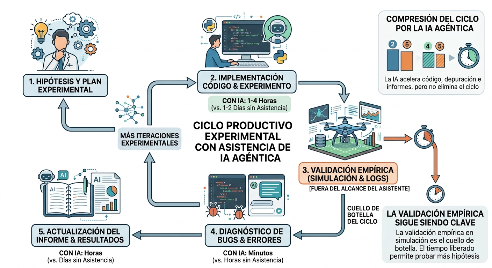

# Anexo 9: Uso de Inteligencia Artificial Generativa en el Desarrollo de esta Tesis

Este anexo documenta el rol que la inteligencia artificial generativa —en particular los asistentes de código agénticos— desempeñó en el desarrollo de este trabajo, tanto en la prueba del sistema técnico como en la redacción del informe. Su propósito es triple: cumplir con el deber de transparencia académica sobre las herramientas utilizadas; registrar las prácticas que resultaron efectivas en este contexto específico; y ofrecer recomendaciones concretas para investigadores que enfrenten proyectos de complejidad similar en los que la IA agéntica ya no es un lujo opcional sino, como se argumenta aquí, una condición necesaria para que el trabajo sea realizable dentro del horizonte temporal de una tesis de maestría.

La reflexión que sigue no es una apología tecnológica. El uso de IA en investigación académica introduce riesgos reales —de atribución intelectual, de verificación, de dependencia— que se discuten sin eufemismos. El objetivo es describir honestamente qué funcionó, qué no, y por qué.

---

## A9.1 Contexto: una tesis cuya materia prima es la IA

Existe una particularidad metodológica en este trabajo que vale la pena enunciar explícitamente: la tesis *estudia* sistemas basados en modelos de lenguaje de visión (VLM), y fue *desarrollada con* un asistente basado en modelos de lenguaje. Esto no es una contradicción; es una confluencia que ilumina ambos lados de la práctica.

El sistema implementado (cap. 5) usa un VLM de 3B parámetros para razonar sobre escenas de vuelo y elegir maniobras. El asistente utilizado en su desarrollo (Claude Code / Claude Opus 4.5, Anthropic, 2024–2026) es una IA agéntica con acceso al sistema de archivos, al historial de git y a las herramientas del entorno de desarrollo. La semejanza no es superficial: en ambos casos un modelo de lenguaje recibe contexto, razona sobre él y propone una acción; en ambos casos la validez de la acción propuesta debe ser verificada por un agente externo (el drone con el resultado físico del vuelo; el investigador con el
resultado técnico del código o del texto).

Esta simetría genera una forma inusual de reflexividad metodológica: el investigador que desarrolla este sistema entiende, desde adentro, qué significa confiar en la salida de un LLM y qué significa verificarla.

---

## A9.2 Descripción del uso

### A9.2.1 Asistente y modalidad

Se utilizó **Claude Code** (Anthropic, 2024–2026) en modalidad agéntica con acceso al repositorio local. A lo largo del proyecto, la interacción adoptó tres modalidades diferenciadas:

**Modo exploración:** el investigador plantea una pregunta abierta sobre el código o el diseño del sistema ("¿por qué el TRAJ_STALL nunca se dispara?") y el asistente lee los archivos relevantes, propone hipótesis y verifica cada una contra el código real. Esta modalidad fue la más valiosa para el diagnóstico de errores sutiles.

**Modo implementación guiada:** el investigador especifica qué se quiere hacer y revisa cada cambio propuesto antes de aplicarlo. El asistente explica el razonamiento, y el investigador aprueba o rechaza cada decisión de diseño.

**Modo redacción técnica:** el investigador describe en lenguaje coloquial lo que hace una sección del sistema (por ejemplo, "el nodo de percepción ahora calcula tres señales nuevas para detectar cuando el drone está atascado contra una pared invisible") y el asistente transforma esa descripción en prosa académica con terminología precisa, ecuaciones y referencias al código fuente.

También se utilizó **Gemini 3 Pro** (Google, 2026) para generar figuras e ilustraciones del informe, incluyendo los diagramas de arquitectura y los esquemas conceptuales. La interacción siguió un patrón similar al modo redacción técnica: el investigador describe la imagen que necesita y revisa cada propuesta del asistente antes de aplicarla.

### A9.2.2 Contribución cuantitativa aproximada

Cuantificar con precisión la contribución del asistente es difícil porque la frontera entre "código generado por IA" y "código validado/modificado por el investigador" es siempre borrosa. Una estimación honesta:

| Categoría | Proporción estimada de asistencia IA | Nota |
|---|---|---|
| Código de infraestructura (`batch_runner`, loggers, tests) | Alta (~70%) | Patrones repetitivos con especificación precisa |
| Código de lógica de control (`graph.py`, `spatial_history.py`) | Media (~40%) | Diseño del investigador, implementación parcialmente asistida con una buena cantidad de vueltas de reingeniería posibles gracias a la iteración rápida con Claude Code |
| Diagnóstico de bugs | Alta (~60%) | Especialmente bugs de contrato de datos (DroneState, LangGraph) |
| Redacción del informe (estructura, prosa técnica, referencias cruzadas) | Alta (~75%) | A partir de descripciones del investigador + lectura del código |
| Decisiones arquitectónicas (qué construir, cómo comparar) | Baja (~5%) | Siempre del investigador; el asistente señala implicaciones |

La columna "proporción estimada" mide cuánto del trabajo *de ejecución* fue asistido, no cuánto del trabajo *intelectual*. Las decisiones de qué hipótesis plantear, qué comparar, qué considerar un resultado relevante y qué descartar como artefacto de simulación fueron siempre del investigador.

### A9.2.3 Casos concretos de alto impacto

**Bug-1: descarte silencioso en DroneState (2026-09-11).**
El disparador `TRAJ_STALL` en `policy_router` estaba roto por 584 ciclos de vuelo —dos meses de desarrollo— sin que ningún test lo detectara. La causa: `_traj_frente_stall_rate` y `_traj_frente_attempts` no estaban declarados en el TypedDict `DroneState`, y LangGraph descarta silenciosamente los campos no declarados al cruzar `graph.invoke()`. El asistente identificó la causa raíz en menos de un turno de conversación, tras leer `graph.py` y `spatial_history.py` en paralelo y notar la discrepancia entre los campos que `capture_node` publicaba y los que `DroneState` declaraba. El investigador no había vinculado el síntoma (TRAJ_STALL nunca activo) con ese mecanismo de LangGraph porque el comportamiento silencioso nunca produce un error visible.

Este caso ilustra una ventaja específica de la IA agéntica frente a un peer humano: el asistente no tiene "coste cognitivo" de leer 500 líneas de código en paralelo y no "asume" que un campo debe estar declarado porque el código lo usa. Lee lo que está escrito, no lo que debería estar escrito.

**Corrección del orden de prioridades de `policy_router`.**
El informe documentaba un orden erróneo de las 11 prioridades del router principal (active_maneuver antes del guard de continuidad de VLM, sin la prioridad imu_contact/blind_wall, sin stuck_invisible). El asistente corrigió la sección completa del informe leyendo el código real de `policy_router` y comparándolo línea a línea con la documentación anterior. El proceso tomó un turno de conversación; hacerlo manualmente habría requerido leer el código, transcribir el orden correcto, reescribir la tabla y verificar cada nombre de condición.

**Actualización masiva del informe.**
Después de tres meses de desarrollo, el informe había quedado desactualizado en cinco capítulos. El investigador describió cada cambio relevante y el asistente leyó el código actual, confrontó con el texto existente e identificó las discrepancias capítulo por capítulo, redactando las secciones nuevas (§5.3, §5.6, §6.10b, §8.3, etc.) a partir de la lectura directa del código. El trabajo de actualización que habría llevado varios días se completó en una sesión.

---

## A9.3 Mejores prácticas observadas

Las siguientes prácticas emergieron de la experiencia acumulada en este proyecto, no de una evaluación sistemática. Se presentan como observaciones de campo, no como prescripciones universales.

### A9.3.1 El investigador como verificador final, siempre

La regla más importante y más frecuentemente violada en el uso productivo de IA agéntica es: **nunca aceptar una edición de código o de texto sin leerla**. El asistente puede generar código correcto que resuelve el problema planteado pero que introduce una suposición implícita que viola una invariante del sistema que el investigador conoce pero no expresó. En este proyecto, la práctica fue revisar cada `diff` antes de aprobarlo, con especial atención a:

- Cambios en firmas de funciones o en TypedDicts (contrato de datos).
- Nuevas importaciones (dependencias que quizás no están en el entorno).
- Cambios en constantes globales con nombres similares (e.g., `SLAM_HISTORY_SIZE` aparece en dos archivos con semánticas distintas).

Esta vigilancia no reduce el valor del asistente; lo maximiza. Un revisor que entiende lo que lee puede aprobar en segundos lo que tardaría minutos en escribir.

### A9.3.2 Especificidad del contexto como palanca principal

La calidad de la asistencia escala directamente con la especificidad del contexto proporcionado. Una pregunta como "¿por qué no funciona la evasión?" produce una exploración costosa. Una pregunta como "el trigger TRAJ_STALL en `policy_router.py:83` nunca se activa según los logs `_traj_frente_stall_rate=0.0` en cada ciclo; la función `zone_stats()` en `spatial_history.py` sí devuelve valores no nulos" localiza el problema de inmediato.

El investigador que sabe leer logs y conoce la arquitectura del sistema puede formular preguntas altamente contextualizadas. La inversión en entender el propio código —en lugar de delegarlo completamente al asistente— multiplica exponencialmente el retorno de la asistencia.

### A9.3.3 Separar las fases de diseño y de implementación

El asistente es más valioso en la fase de implementación que en la de diseño arquitectónico. Las decisiones sobre *qué construir* (¿cuatro brazos o tres? ¿flujo óptico + VLM o solo VLM? ¿`slam_assess` o `deep_vlm` como default?) requieren juicio sobre las restricciones del proyecto, el horizonte temporal, y los objetivos académicos que el investigador posee y el asistente no puede inferir completamente de los archivos.

La práctica recomendada es: *decidir primero, implementar con asistencia después*. Intentar que el asistente decida la arquitectura produce propuestas genéricas que no tienen en cuenta las restricciones reales del proyecto (presupuesto temporal, hardware disponible, qué comparaciones son académicamente interesantes).

### A9.3.4 Ciclos cortos de verificación empírica

La IA agéntica acelera el ciclo de código → informe → validación, pero no lo elimina. En este proyecto, el ciclo productivo fue:

El paso que permanece completamente fuera del alcance del asistente —la validación empírica en simulación— sigue siendo el cuello de botella del ciclo. La IA comprime los demás pasos, lo que libera tiempo para más iteraciones experimentales.

### A9.3.5 Gestión del contexto de conversación

Los asistentes agénticos tienen una ventana de contexto finita. En proyectos de varias semanas, el contexto acumulado supera esa ventana y el asistente pierde memoria de decisiones previas. La práctica que resultó más efectiva fue mantener un archivo `CHANGELOG.md` actualizado después de cada sesión significativa: el asistente puede releer ese archivo al inicio de cada sesión y recuperar el estado del proyecto en minutos, en lugar de reexplorar el código completo.

### A9.3.6 Transparencia sobre la contribución

El uso de IA en la redacción de tesis no es equivalente al plagio, pero sí requiere un nivel análogo de declaración. El estándar propuesto, y adoptado en este trabajo, es:

- **El investigador es responsable** de toda afirmación técnica, toda interpretación de resultados y toda decisión arquitectónica. Si una sección fue redactada con asistencia pero contiene una afirmación incorrecta, la responsabilidad es del investigador.
- **La IA es una herramienta de producción**, no un coautor. Así como un estadístico que usa R para calcular p-valores no cita a R como coautor, el uso de IA para transformar notas técnicas en prosa académica no convierte al asistente en autor.
- **Declarar el uso es parte de la metodología**, no una confesión. Este anexo es esa declaración.

---

## A9.4 Limitaciones y riesgos observados

### A9.4.1 Alucinación en contexto técnico

El riesgo más relevante en el uso de IA para redacción técnica no es la alucinación flagrante (nombres de paper inventados, APIs inexistentes) sino la **alucinación de coherencia**: el texto suena técnicamente preciso pero afirma algo sutilmente erróneo que solo el experto en el dominio puede detectar.

En este proyecto se identificaron varios casos de este tipo durante la revisión: secciones del informe que describían un comportamiento del sistema que había sido verdadero en una versión anterior pero que ya había cambiado, o que usaban terminología ligeramente incorrecta para un mecanismo específico. La mitigación fue sistemática: nunca aceptar una descripción del sistema sin verificarla contra el código real. El asistente que *lee elcódigo* y describe lo que ve es más confiable que el que *recuerda* descripciones previas.

### A9.4.2 Dependencia que reduce la comprensión profunda

Existe un riesgo real de que la fluidez con la que el asistente genera código reduzca el tiempo que el investigador dedica a entender ese código en profundidad. Para un proyecto de tesis, donde la comprensión del sistema es un objetivo académico en sí mismo, esto es un riesgo serio.

La práctica adoptada fue usar el asistente para generar la primera versión de un módulo y luego leerla completa antes de seguir —tratando la lectura del código generado como cualquier otra lectura de código ajeno. En módulos críticos (`graph.py`,`deliberative.py`), el investigador reescribió partes del código generado no porque estuviera incorrecto sino para forzarse a entender cada decisión de implementación.

### A9.4.3 Sesgo hacia soluciones conocidas

Los modelos de lenguaje tienden a proponer soluciones que aparecen frecuentemente en sus datos de entrenamiento. En este proyecto, esto produjo ocasionalmente propuestas de infraestructura sobredimensionada (abstracciones innecesarias, patrones de diseño para sistemas más grandes) o soluciones estándar que no se ajustaban bien a las restricciones específicas del entorno AirSim/Windows/PowerShell.

La mitigación fue mantener instrucciones explícitas de estilo en el contexto del asistente ("no agregar abstracciones más allá de lo que el task requiere", "preferir editar archivos existentes a crear nuevos"), que el asistente respetó consistentemente una vez establecidas.

---

## A9.5 Recomendaciones para investigadores en situación análoga

Las siguientes recomendaciones están dirigidas a investigadores de maestría o doctorado que trabajan solos o en grupos pequeños en proyectos de ingeniería de sistemas con componentes de IA, y que consideran usar asistentes agénticos como herramienta de desarrollo.

**1. Defina primero la arquitectura sin el asistente.** Use la IA para implementar una arquitectura que usted ya entiende, no para que la IA diseñe una que usted luego intenta entender. El tiempo invertido en diseño propio se recupera multiplicado en la fase de verificación.

**2. Mantenga un CHANGELOG sesión a sesión.** Un registro de qué se cambió y por qué, actualizado al final de cada sesión de trabajo, es la forma más eficiente de inicializar el contexto del asistente en sesiones posteriores. Es también la bitácora metodológica que permitirá escribir la sección de métodos del informe con precisión.

**3. Trate los tests como contrato, no como cobertura.** El asistente puede generar tests para verificar comportamientos. El investigador debe asegurarse de que esos tests verifican el comportamiento correcto, no simplemente que el código no lanza excepciones. En este proyecto, la Suite de 181 tests no detectó el Bug-1 porque ningún test verificaba que `_traj_frente_stall_rate` cruzara la llamada `graph.invoke()` — nadie (humano ni IA) había pensado en ese vector de fallo.

**4. Use la IA para comprimir los ciclos, no para saltarlos.** El valor del asistente es reducir el tiempo entre hipótesis y evidencia empírica: implementación más rápida, diagnóstico más rápido, documentación más rápida. El paso de validación empírica —correr el sistema, observar el comportamiento, interpretar los resultados— no se comprime y no debe saltarse.

**5. Verifique las referencias citadas por el asistente.** En redacción técnica, el asistente puede citar papers que existen y son relevantes, papers que existen pero dicen algo diferente de lo que se afirma, o papers que no existen en absoluto. La práctica segura es tratar toda referencia generada por IA como una hipótesis a verificar antes de incluirla en el informe.

**6. Declare el uso con precisión.** La pregunta relevante para la integridad académica no es "¿usé IA?" sino "¿puedo defender intelectualmente cada afirmación de este trabajo?" Si la respuesta es sí —porque verificó el código, interpretó los resultados y tomó las decisiones arquitectónicas— el uso de IA como herramienta de producción es metodológica y éticamente análogo al uso de cualquier otro entorno de desarrollo.

---

## A9.6 Reflexión final: la IA agéntica como condición de posibilidad

Este proyecto involucra un sistema de control distribuido en múltiples módulos Python (~4 000 líneas de código activo), una suite de pruebas de 181 tests, cinco capítulos técnicos del informe con referencias cruzadas precisas al código, y ocho anexos que documentan desde fundamentos matemáticos hasta propuestas de trabajo futuro.

Completar todo esto en el horizonte temporal de una tesis de maestría, como investigador individual, sin el asistente agéntico, habría requerido o bien un recorte sustancial del alcance técnico o bien un tiempo de desarrollo que excedería el plazo académico disponible.

Esto no significa que cualquier investigador con acceso a Claude pueda producir este sistema. Significa que el asistente multiplicó la capacidad de ejecución del investigador, que aportó la comprensión del dominio, las decisiones arquitectónicas, la interpretación de los resultados y la responsabilidad intelectual sobre el trabajo. La analogía más precisa no es la del ghostwriter sino la del taller bien equipado: las herramientas no construyen el objeto, pero sin ellas el artesano no puede construirlo en el tiempo disponible.

La incorporación de herramientas de IA agéntica en el flujo de trabajo de investigación científica y de ingeniería no es una tendencia futura: es una práctica presente que la comunidad académica está comenzando a normalizar. La transparencia sobre cómo se usan estas herramientas —sus contribuciones, sus límites y sus riesgos— es el primer paso hacia estándares metodológicos que permitan evaluarlas con rigor.

---

*Este anexo fue redactado en colaboración con Claude Code (Anthropic, 2024–2026),
usando como fuente primaria la bitácora de desarrollo (`CHANGELOG.md`), los registros
de sesión del proyecto y la reflexión del investigador sobre el proceso. Las afirmaciones
sobre comportamiento del sistema están verificadas contra el código fuente del repositorio.*
